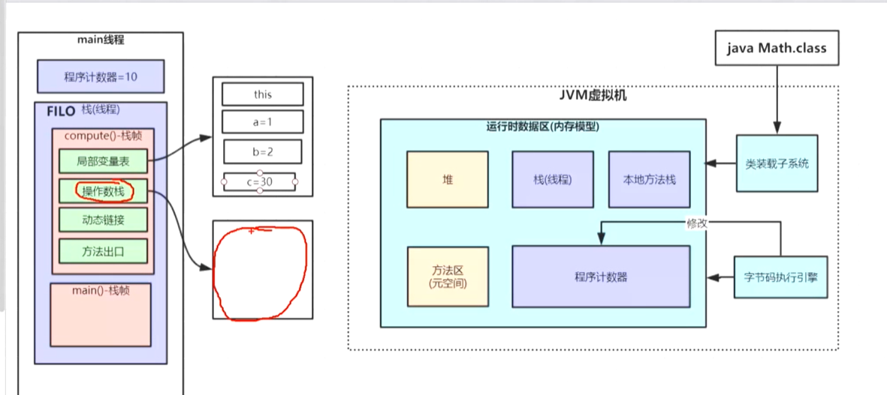
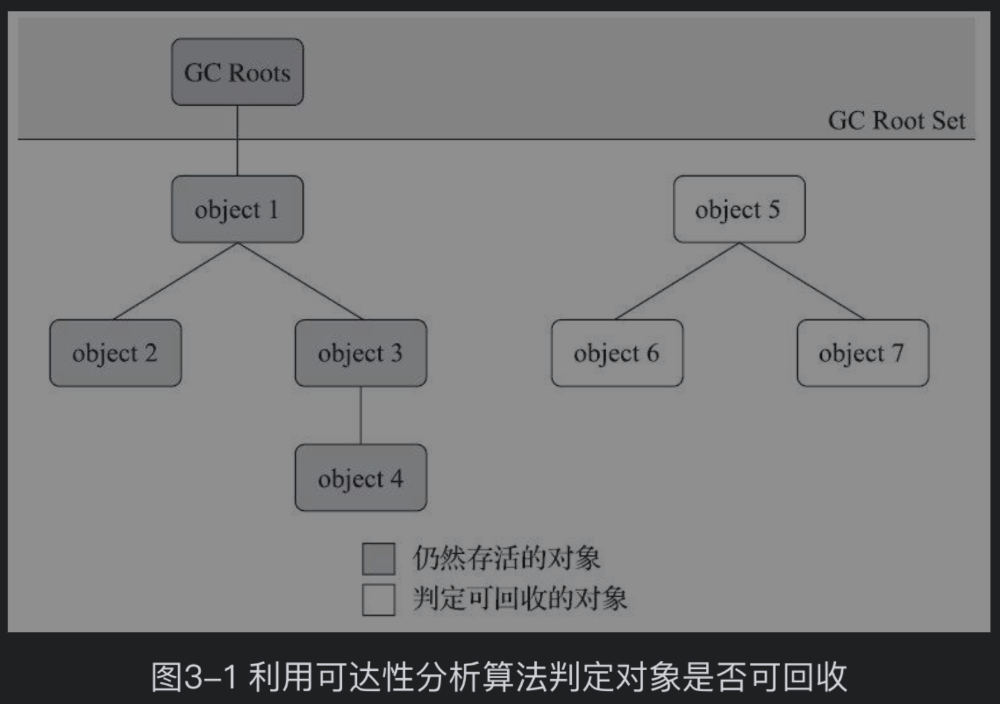

## Java内存

### JDK组成


JRE包括HotSpotVm  

JDK包括JRE  、一些命令行、一些工具

### jVM组成

 

```java
public class A {

    public int getTotal() {
        int a = 1;
        int b = 2;
        int c = (a + b) * 10;
        return c;
    }
    public static void main(String[] args) {
        A a = new A();
        int total = a.getTotal();
        System.out.println(total);
    }
}
```

每一个线程都有栈，程序计算器，本地方法栈

堆和元空间是所有线程共享的


#### 1. 栈：

1. 栈有N个栈帧组成，每一个方法对应一个栈帧，比如一个main方法，有一个栈帧，main里面有N个方法，所以main最后被销毁，满足先进后出

2. 栈帧里面包括：局部变量表，操作数栈，动态连接，方法出口

   **局部变量表**：存储局部变量的空间

   **操作数栈**：计算和存储临时变量的空间，可以理解为变量中转站

   **方法出口**：回到主方法的行号指针

   **动态链接**：网上说：把符号引用转成直接引用，就是比如
   A a =new A();
   A b =new A();
   其实a b拥有的对象的头指针，都会指向方法区里面的同一个类元信息
   a.add(); b.add();其实add()方法在.class文件中是一种符号，而当调用add()方法时，程序就会把它对应到，已经在方法区装载好了的类元信息的地址，而动态链接其实就是存储add()方法在方法区的位置的
   其实方法区也是可以指向堆的，比如类里面存了一个静态的类，就可以把方法区指向堆了

```java
比如int a=1;
先把int常量数值1压入操作数栈，然后把a放到局部变量表分配内存并把刚才操作数栈的1赋值给a
```

#### 2. 程序计数器：

 是每一个线程独有的，反编译的行号，马上要执行或者正在执行的行号，但不是代码行号

#### 3. 堆

栈帧中的局部变量如果是Object类型，就会有从栈指向堆的指针

#### 4. 方法区（JDK8元空间）

```
public class A {
    public  static  final  int num =10;
    public  static  User user=new User();
    }
```

常量 、静态变量、类元信息（XXX.class）

但是如果是静态对象，存储的是元空间到堆的指针


#### 5. 本地方法栈

带native的代码，比如Thread.start()方法，使用C语言实现的，主要是为了跨语言，现在基本不用了，因为跨语言部署瓶颈了，是每一个线程独享的

```java
private native void start0();
```

## JVM

### 引用计数、可达性算法

- 引用计数无法解决循环依赖问题、

```java
A a=new A();
B b=new B();
a.child=b;
b.child=a;
a=null;
b=null;
System.gc();
```

按照道理说，引用计数法没有办法解决这个问题，但是发现GC日志里面[PSYoungGen: 864K->0K(153088K)] 已经被清除了，说明GC成功了，那这种情况肯定不是引用计数法的功劳

- 可达性算法

  此算法的核心思想：通过一系列称为“GC Roots”的对象作为起始点，从这些节点开始向下搜索，搜索走过的路径称为“引用链”，当一个对象到 GC Roots 没有任何的引用链相连时(从 GC Roots 到这个对象不可达)时，证明此对象不可用



### 什么可以作为GcRoot根？

- 静态对象

- 虚拟机栈（栈帧）内被引用的对象

  - 方法栈帧中用到的参数、局部变量、临时变量

  - 方法区常量引用的对象，比如常量池字符串内的引用

  - 本地Native方法引用的对象

  - Java内部对象，比如说基本类型对象、类加载器对象

  - 被sync持有的对象


### 回收方法区（永久代）

方法区垃圾收集的“性价比”通常也是比较低的：在Java堆中，尤其是在新生代中，对常规应用进行一次垃圾收集通常可以回收70%至99%的内存空间，相比之下，方法区回收囿于苛刻的判定条件，其区域垃圾收集的回收成果往往远低于此。

#### 废弃的常量和不再使用的类型

回收废弃常量与回收Java堆中的对象非常类似。举个常量池中字面量回收的例子，假如一个字符串“java”曾经进入常量池中，但是当前系统又没有任何一个字符串对象的值是“java”，换句话说，已经没有任何字符串对象引用常量池中的“java”常量，且虚拟机中也没有其他地方引用这个字面量。如果在这时发生内存回收，而且垃圾收集器判断确有必要的话，这个“java”常量就将会被系统清理出常量池。常量池中其他类（接口）、方法、字段的符号引用也与此类似。

#### 回收废弃的常量三个必要条件

- 该类的所有实例已经被回收，不存在相关类和派生类
- 它的类加载器被回收
- 该类没有在任何地方被引用

#### 永久代回收的意义

在大量使用反射、动态代理、CGLib等字节码框架，动态生成JSP以及OSGi这类频繁自定义类加载器的场景中，通常都需要Java虚拟机具备类型卸载的能力，以保证不会对方法区造成过大的内存压力。

### 垃圾回收分类

- ■新生代收集（Minor GC/Young GC）：指目标只是新生代的垃圾收集。‘

- ■老年代收集（Major GC/Old GC）：指目标只是老年代的垃圾收集。目前只有CMS收集器会有单独收集老年代的行为。另外请注意“Major GC”这个说法现在有点混淆，在不同资料上常有不同所指，读者需按上下文区分到底是指老年代的收集还是整堆收集。

- ■混合收集（Mixed GC）：指目标是收集整个新生代以及部分老年代的垃圾收集。目前只有G1收集器会有这种行为。

- 整堆收集（Full GC）：收集整个Java堆和方法区的垃圾收集。

### 垃圾回收算法

- 标记-清除
  - 2个步骤，先标记，再清除
  - 缺点：连续的碎片空间
  - 适用于：老年代
- 标记- 复制
  - 优点：没有碎片空间
  - 缺点：内存利用率只有一半，在对象存活较多的时候效率很低
  - 适用于：新生代（只需要复制存活对象）

它将可用内存按容量划分为大小相等的两块，每次只使用其中的一块。当这一块的内存用完了，就将还存活着的对象复制到另外一块上面，然后再把已使用过的内存空间一次清理掉。如果内存中多数对象都是存活的，这种算法将会产生大量的内存间复制的开销，但对于多数对象都是可回收的情况，算法需要复制的就是占少数的存活对象，而且每次都是针对整个半区进行内存回收，分配内存时也就不用考虑有空间碎片的复杂情况，只要移动堆顶指针，按顺序分配即可。

- 标记整理
  - 优点：在大多数对象都是存活的情况下，可以用标记整理
  - 适用于老年代

#### 标记整理移动对象思考

- 是否移动对象都存在弊端，移动则内存回收时会更复杂，不移动则内存分配时会更复杂

- 从垃圾收集的停顿时间来看，不移动对象停顿时间会更短，甚至可以不需要停顿，但是从整个程序的吞吐量来看，移动对象会更划算。

- 即使不移动对象会使得收集器的效率提升一些，但因内存分配和访问相比垃圾收集频率要高得多，这部分的耗时增加，总吞吐量仍然是下降的。

HotSpot虚拟机里面关注吞吐量的Parallel Scavenge收集器是基于标记-整理算法的，而关注延迟的CMS收集器则是基于标记-清除算法的，这也从侧面印证这点


#### 标记清除、整理的折中方案

另外，还有一种“和稀泥式”解决方案可以不在内存分配和访问上增加太大额外负担，做法是

- 让虚拟机平时多数时间都采用标记-清除算法，暂时容忍内存碎片的存在，
- 直到内存空间的碎片化程度已经大到影响对象分配时，再采用标记-整理算法收集一次，以获得规整的内存空间。
- 前面提到的基于标记-清除算法的CMS收集器面临空间碎片过多时采用的就是这种处理办法。


### Stop the World


## 垃圾回收器

[一个简单的介绍](https://blog.csdn.net/qq_39455116/article/details/88723214)

###  单线程的Serial、SerialOld（废弃）

- 已经基本废弃，没有讨论的意义
- 缺点：垃圾收集是单线程，造成很长的停顿时间
- 新生代：标记复制
- 老年代：标记整理

### ParNew(Serial的多线程版本)（废弃）

- 基本废弃，不再使用
- 新生代：标记复制
- 老年代：标记整理

### 并行和并发

并行和并发都是并发编程中的专业名词，在谈论垃圾收集器的上下文语境中，它们可以理解为：

- 并行（Parallel）：并行描述的是多条垃圾收集器线程之间的关系，说明同一时间有多条这样的线程在协同工作，通常默认此时用户线程是处于等待状态。
- 并发（Concurrent）：并发描述的是垃圾收集器线程与用户线程之间的关系，说明同一时间垃圾收集器线程与用户线程都在运行。由于用户线程并未被冻结，所以程序仍然能响应服务请求，但由于垃圾收集器线程占用了一部分系统资源，此时应用程序的处理的吞吐量将受到一定影响。

### JDK8默认的PS和PS old

PS和ParNew的区别

Parallel Scavenge收集器除了会显而易见地提供可以精确控制吞吐量的参数，还提供了一个参数-XX:+UseAdaptiveSizePolicy，这是一个开关参数，打开参数后，就不需要手工指定新生代的大小（-Xmn）、Eden和Survivor区的比例（-XX:SurvivorRatio）、晋升老年代对象年龄（-XX:PretenureSizeThreshold）等细节参数了。

虚拟机会根据当前系统的运行情况收集性能监控信息，动态调整这些参数以提供最合适的停顿时间或者最大的吞吐量，这种方式称为GC自适应的调节策略（GC Ergonomics）。自适应调节策略也是Parallel Scavenge收集器与ParNew收集器的一个重要区别。


- 新生代：标记
- 老年代：标记整理

### CMS

1）初始标记——STW （独占CPU）标记GCroot根能直接关联的对象

2）并发标记——和用户线程一起执行，通过GCroot tracing标记能可达的对象

3）重新标记——STW（独占CPU）

4）并发清除（CMS concurrent sweep）其中初始标记、重新标记这两个步骤仍然需要“Stop The World”。

初始标记仅仅只是标记一下GC Roots能直接关联到的对象，速度很快；

并发标记阶段就是从GC Roots的直接关联对象开始遍历整个对象图的过程，这个过程耗时较长但是不需要停顿用户线程，可以与垃圾收集线程一起并发运行；

而重新标记阶段则是为了修正并发标记期间，因用户程序继续运作而导致标记产生变动的那一部分对象的标记记录，这个阶段的停顿时间通常会比初始标记阶段稍长一些，但也远比并发标记阶段的时间短；

最后是并发清除阶段，清理删除掉标记阶段判断的已经死亡的对象，由于不需要移动存活对象，所以这个阶段也是可以与用户线程同时并发的。

#### CMS缺点

- 无法清理浮动垃圾
  - 浮动垃圾是指：**在最后一步并发清理过程中，用户线程执行也会产生垃圾**，但是这部分垃圾是在标记之后，所以只有等**到下一次gc的时候清理掉，这部分垃圾叫浮动垃圾**
- 基于标记-清除算法会带来大量碎片空间，会进入提前FULL GC
- CMS对CPU非常敏感，在并发阶段虽然不会导致用户线程停顿，但是会因为占用了一部分线程使应用变慢

### 为啥CMS要坚持使用标记清除算法呢？

因为CMS作为第一款实现用户线程和收集线程并发执行的收集器！当时的设计理念是减少停顿时间，最好是能并发执行！但是问题来了，如要用户线程也在执行，那么就不能轻易的改变堆中对象的内存地址！不然会导致用户线程无法定位引用对象，从而无法正常运行！而标记整理算法和复制算法都会移动存活的对象，这就与上面的策略不符！因此CMS采用的是标记清理算法！

#### CMS和G1都采用的三色标记算法是什么？

https://www.cnblogs.com/Courage129/p/14385571.html


### JDK9默认G1

- 初始标记
- 并发标记（无需暂停用户线程）
- 最终标记
- 筛选回收

#### 摒弃连续内存牢笼

首先要有一个思想上的改变，在G1收集器出现之前的所有其他收集器，包括CMS在内，垃圾收集的目标范围要么是整个新生代（Minor GC），要么就是整个老年代（Major GC），再要么就是整个Java堆（Full GC）。而G1跳出了这个樊笼，它可以面向堆内存任何部分来组成回收集（Collection Set，一般简称CSet）进行回收，衡量标准不再是它属于哪个分代，而是哪块内存中存放的垃圾数量最多，回收收益最大，这就是G1收集器的Mixed GC模式。 

 #### 单独处理大对象

Region中还有一类特殊的Humongous区域，专门用来存储大对象。G1认为只要大小超过了一个Region容量一半的对象即可判定为大对象。每个Region的大小可以通过参数-XX：G1HeapRegionSize设定，取值范围为1MB～32MB，且应为2的N次幂。而对于那些超过了整个Region容量的超级大对象，将会被存放在N个连续的Humongous Region之中，G1的大多数行为都把Humongous Region作为老年代的一部分来进行看待


#### 跨Region引用对象如何解决？

使用记忆集避免全堆作为GC Roots扫描，但在G1收集器上记忆集的应用其实要复杂很多，它的每个Region都维护有自己的记忆集，这些记忆集会记录下别的Region指向自己的指针，并标记这些指针分别在哪些卡页的范围之内。G1的记忆集在存储结构的本质上是一种哈希表，Key是别的Region的起始地址，Value是一个集合，里面存储的元素是卡表的索引号。这种“双向”的卡表结构（卡表是“我指向谁”，这种结构还记录了“谁指向我”）比原来的卡表实现起来更复杂，同时由于Region数量比传统收集器的分代数量明显要多得多，因此G1收集器要比其他的传统垃圾收集器有着更高的内存占用负担。根据经验，G1至少要耗费大约相当于Java堆容量10%至

#### 并发标记阶段的实现？

譬如，在并发标记阶段如何保证收集线程与用户线程互不干扰地运行？这里首先要解决的是用户线程改变对象引用关系时，必须保证其不能打破原本的对象图结构，导致标记结果出现错误

#### 可预测的停顿什么意思呢？
G1可以有计划的避免在整个JAV堆中进行垃圾收集，可以对每个region里的回收对象价值（回收该区域的时间消耗和能得到的内存比值）进行分析，在最后筛选回收阶段，对每个region里的回收对象价值（回收该区域的时间消耗和能得到的内存比值）最后进行排序，用户可以自定义停顿时间，那么G1就可以对部分的region进行回收！这使得停顿时间是用户自己可以控制的！！！！


### 内存占用、吞吐量、延迟的衡量原则

#### 降低停顿时间的垃圾回收器

- CMS
  - 优点：并发收集、低停顿（也就是STW时间短）
  - 缺点：由于和用户线程一起执行，所以占用CPU，会使程序变慢
  - 缺点2:大量连续碎片空间
  - 缺点3:由于碎片空间不足放大对象的时候，提前进入gc
  - 缺点4:由于和用户线程一起执行，会有大量浮动垃圾

- G1:
  - 优点：开启了一个新的思维模式，大内存分割成小区域
  - 优点2:单个区域标记整理算法，没有内存碎片，两个区域采用标记复制
  - 优点3:可预测停顿，就是根据配置，优先回收那些回收价值比较高的区域
  - 优点4:因为是单独区域，避免了全堆扫描
  - 优点5:大对象分配比较简单，不会进入提前GC
  - 缺点：需要维护每个区域的Remembered Set ，占用了很大的内存空间

### 提高吞吐量的垃圾回收器

啥事吞吐量？

其实就是垃圾收集时间/总执行时间，由于CMS、G1是为了降低延迟也就是STW的时间而努力的，所以避免不了要和用户线程一起执行，一起执行就会让STW的时间缩短，但是相应的会让程序执行的总时间上升，所以也是有缺点的

- PS
  - 优点：提高了吞吐量
  - 缺点是：一次需要STW的时间可能有点久


### JDK ZGC

ZGC和Shenandoah的目标是高度相似的，都希望在尽可能对吞吐量影响不太大的前提下，实现在任意堆内存大小下都可以把垃圾收集的停顿时间限制在十毫秒以内的低延迟