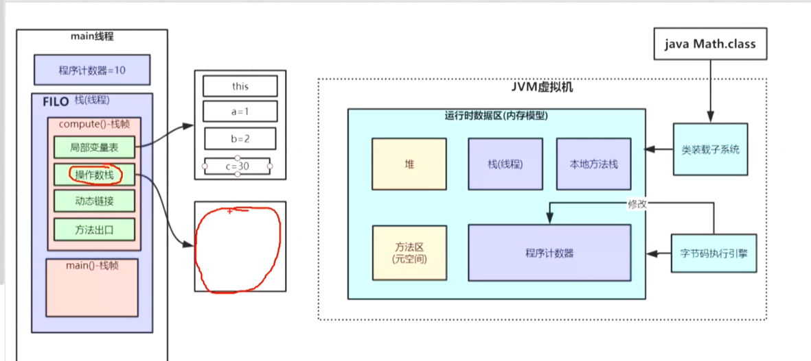

@[toc]

### JDK组成


JRE包括HotSpotVm  

JDK包括JRE  、一些命令行、一些工具

### jVM组成

 

```java
public class A {

    public int getTotal() {
        int a = 1;
        int b = 2;
        int c = (a + b) * 10;
        return c;
    }
    public static void main(String[] args) {
        A a = new A();
        int total = a.getTotal();
        System.out.println(total);
    }
}
```

每一个线程都有栈，程序计算器，本地方法栈

堆和元空间是所有线程共享的


#### 1. 栈：

1. 栈有N个栈帧组成，每一个方法对应一个栈帧，比如一个main方法，有一个栈帧，main里面有N个方法，所以main最后被销毁，满足先进后出

2. 栈帧里面包括：局部变量表，操作数栈，动态连接，方法出口

   **局部变量表**：存储局部变量的空间

   **操作数栈**：计算和存储临时变量的空间，可以理解为变量中转站

   **方法出口**：回到主方法的行号指针

   **动态链接**：网上说：把符号引用转成直接引用，就是比如
   A a =new A();
   A b =new A();
   其实a b拥有的对象的头指针，都会指向方法区里面的同一个类元信息
   a.add(); b.add();其实add()方法在.class文件中是一种符号，而当调用add()方法时，程序就会把它对应到，已经在方法区装载好了的类元信息的地址，而动态链接其实就是存储add()方法在方法区的位置的
   其实方法区也是可以指向堆的，比如类里面存了一个静态的类，就可以把方法区指向堆了

```java
比如int a=1;
先把int常量数值1压入操作数栈，然后把a放到局部变量表分配内存并把刚才操作数栈的1赋值给a
```

#### 2. 程序计数器：

 是每一个线程独有的，反编译的行号，马上要执行或者正在执行的行号，但不是代码行号

#### 3. 堆

栈帧中的局部变量如果是Object类型，就会有从栈指向堆的指针

#### 4. 方法区（JDK8元空间）

```
public class A {
    public  static  final  int num =10;
    public  static  User user=new User();
    }
```

常量 、静态变量、类元信息（XXX.class）

但是如果是静态对象，存储的是元空间到堆的指针


#### 5. 本地方法栈

带native的代码，比如Thread.start()方法，使用C语言实现的，主要是为了跨语言，现在基本不用了，因为跨语言部署瓶颈了，是每一个线程独享的

```java
private native void start0();
```

