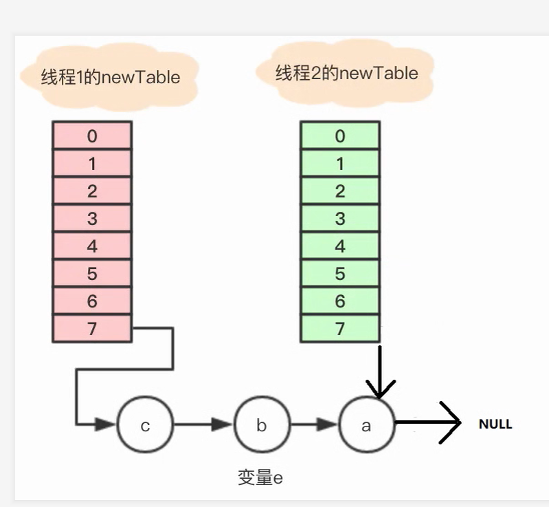

# HashMap

### JDK新增的方法

看之前我们先看一下JDK8新增的方法

- getOrDefault(Object key, V defaultValue)

  获取key的值，当key的值为null时返回指定的defaultValue。

- putIfAbsent(K key, V value)

  当key的值为null或者不存在key时向HashMap中添加元素。

## 基本

### 初始化

JDK1.8的HashMap

```java
public class HashMap<K, V> extends AbstractMap<K, V> 
implements Map<K, V>, Cloneable, Serializable {
    private static final long serialVersionUID = 362498820763181265L;
    //默认数组的长度
    static final int DEFAULT_INITIAL_CAPACITY = 16;
    static final int MAXIMUM_CAPACITY = 1073741824;
    //负载因子
    static final float DEFAULT_LOAD_FACTOR = 0.75F;
    //链表长度大于8变成红黑树
    static final int TREEIFY_THRESHOLD = 8;
    //红黑树长度小于6变成链表
    static final int UNTREEIFY_THRESHOLD = 6;
    //如果数组的长度太小，会造成哈希碰撞频繁，链表结构臃肿，所以HashMap定义了阈值，
    //当HashMap的容量小于这个值时，优先去扩容减小哈希碰撞，而不是去优化链表的结构。
    static final int MIN_TREEIFY_CAPACITY = 64;
    // table存储HashMap中数组的元素
    transient HashMap.Node<K, V>[] table;
    //遍历的入口
    transient Set<Entry<K, V>> entrySet;
    transient int size;
    transient int modCount;
    int threshold;
    final float loadFactor;
```

Node[] table的初始化长度length(默认值是16)，Load factor为负载因子(默认值是0.75)，threshold是HashMap所能容纳的最大数据量的Node(键值对)个数。threshold = length * Load factor。也就是说，在数组定义好长度之后，负载因子越大，所能容纳的键值对个数越多。

## hashMap 结构

HashMap采用数组+链表+红黑树的存储结构。当一个键值对要存储到HashMap中时，HashMap会根据它的键值的哈希值映射到数组的某个位置。如果发生了哈希碰撞，就以链表的形式接在碰撞元素的后边。当链表过长时，就会转变为红黑树。


size是HashMap中已经存储的元素的个数，它并不等于table的长度，也不等于table中已存储的元素的个数。如上图的HashMap，它的size大小是14。

### 1.HashMap 初始化容量算法

```java
static final int tableSizeFor(int cap) {
    int n = cap - 1;
    n |= n >>> 1;
    n |= n >>> 2;
    n |= n >>> 4;
    n |= n >>> 8;
    n |= n >>> 16;
    return (n < 0) ? 1 : (n >= MAXIMUM_CAPACITY) ? MAXIMUM_CAPACITY : n + 1;
}
```

其实这个操作看上去很复杂，但是要实现的功能很简单就是把一个数字变成最接近它的2进制数，比如说50会变成64

原理：从最高位1开始，低位都填充1。

弄清楚了这几个位移的操作就不难理解这个方法了，首先将参数减1，最后再加1。有效位都是1的数加1就是2的倍数。如果指定容量已经是2的倍数，先减1再位移可避免再扩大2倍。

```
比如说50的二进制数是 			0011 0001  50
先减去1变成		 	 		   0011 0000  49
然后把最高位之后的数字都变成1      0011 1111  63
显然63不是我们要找的数，只需要加1即可，也就是代码的最后面
return (n < 0) ? 1 : (n >= MAXIMUM_CAPACITY) ? MAXIMUM_CAPACITY : n + 1;		
```

但是你想为啥要这么操作，直接最高位的上一位变成1，其它都是0不就可以了，这里有个问题是，会超出int的最大限制，可能是基于这点考虑的吧

### 2. 对象和key的hash值如何计算

- 整个对象的hashcode

```java
public final int hashCode() {
return Objects.hashCode(key) ^ Objects.hashCode(value);
}
```

#### key的hash值如何计算

```java
    static final int hash(Object key) {
        int h;
        //运行key为空，同时采用异或算法
        return (key == null) ? 0 : (h = key.hashCode()) ^ (h >>> 16);
    }
```

hash函数是先拿到通过key 的hashcode，是32位的int值，然后让hashcode的高16位和低16位进行异或操作。这个也叫**扰动函数**，这么设计有二点原因：

1. 一定要尽可能降低hash碰撞，越分散越好；
2. 算法一定要尽可能高效，因为这是高频操作, 因此采用位运算；

### 3. hash值怎么对应到数组坐标

####  hashmap的Put方法是这样的

```java
if ((p = tab[i = (n - 1) & hash]) == null)
```

核心是通过`（n-1）&hash`计算坐标

也就是说一个计算出来的hashcode要对数组长度进行与运算，比如：

```java
原来是hash值是：10100101 11000100 00100101
下面进行和数组长度与运算
  
& 00000000 00000000 00001111
----------------------------------
  00000000 00000000 00000101    //高位全部归零，只保留末四位
 
这样算出来的结果是要存储的位置坐标
```

但这时候问题就来了，这样就算我的散列值分布再松散，要是只取最后几位的话，碰撞也会很严重。更要命的是如果散列本身做得不好，分布上成等差数列的漏洞，如果正好让最后几个低位呈现规律性重复，就无比蛋疼。

这时候 hash 函数（“扰动函数”）的价值就体现出来了

```java
    static final int hash(Object key) {
        int h;
        //运行key为空，同时采用异或算法
        return (key == null) ? 0 : (h = key.hashCode()) ^ (h >>> 16);
    }
```

 

### 4.扰动函数的价值

```java
//JDK1.8计算hash值
    static final int hash(Object key) {
        int h;
        return (key == null) ? 0 : (h = key.hashCode()) ^ (h >>> 16);
    }
```

一个hash值右位移16位，正好是32bit的一半，自己的高半区和低半区做异或，就是为了混合原始哈希码的高位和低位，以此来加大低位的随机性。而且混合后的低位掺杂了高位的部分特征，这样高位的信息也被变相保留下来。

 ### 5.为啥扰动函数是让高16位和低16位进行异或运算？

 因为 key.hashCode() 函数调用的是key键值类型自带的哈希函数，返回int型散列值。int值范围为**-2147483648~2147483647**，前后加起来大概40亿的映射空间。只要哈希函数映射得比较均匀松散，一般应用是很难出现碰撞的。但问题是一个40亿长度的数组，内存是放不下的。你想，如果HashMap数组的初始大小才16，用之前需要对数组的长度取模运算，得到的余数才能用来访问数组下标。

所以即使你的hashcode不会出现碰撞，但是在计算元素在数组中的位置的时候，用的始终是低几位的值，高几位的值就没有用了，而为了保留高几位的值，我们让他高16和低16异或，**这样就了混合原始哈希码的高位和低位，以此来加大低位的随机性。**而且混合后的低位掺杂了高位的部分特征，这样高位的信息也被变相保留下来。


### 6. 拉链法

所谓 **“拉链法”** 就是：将链表和数组相结合。也就是说创建一个链表数组，数组中每一格就是一个链表。若遇到哈希冲突，则将冲突的值加到链表中即可。


### 1.7 如何扩容？

```
 if ((e.hash & oldCap) == 0) {
 }else{
 
 }
```

第一点是：if ((e.hash & oldCap) == 0) 这个判断到底是什么意思，还好网上也有解释，如果这个判断为true则说明e这个节点在resize之后不需要挪位置，反之则需要换个位置。虽然这个代码难理解，但是自己举几个例子也能判断出来，比如有1，17两个数，在HashMap大小是16的时候，他们的hash值都是1，如果此时扩容为32，可以看出1的hash是不变的，但是17是会变，也就是说 1 & 16 = 0， 17 & 16 != 0 

```java
//1是下面的结果，是0
1 0000	 
&
0 0001
=
0 0000
而17是下面的结果
1 0000	 
&
1 0001
=
1 0000
```


## JDK8比JDK7做了哪些优化

###  1. 数据结构方面的优化

数组+链表改成了数组+链表或红黑树；

- 目的是什么？
  - 防止发生hash冲突，链表长度过长，将时间复杂度由`O(n)`降为`O(logn)`

### PS-1 为啥不用二叉查找树？

之所以选择红黑树是为了解决二叉查找树的缺陷，二叉查找树在特殊情况下会变成一条线性结构（这就跟原来使用链表结构一样了，造成很深的问题），遍历查找会非常慢

而红黑树在插入新数据后可能需要通过左旋，右旋、变色这些操作来保持平衡，引入红黑树就是为了查找数据快，解决链表查询深度的问题，我们知道红黑树属于平衡二叉树，但是为了保持“平衡”是需要付出代价的，但是该代价所损耗的资源要比遍历线性链表要少，所以当长度大于8的时候，会使用红黑树，如果链表长度很短的话，根本不需要引入红黑树，引入反而会慢。

### 2. 链表插入方式的优化

链表的插入方式从头插法改成了尾插法，简单说就是插入时，如果数组位置上已经有元素，1.7将新元素放到数组中，原始节点作为新节点的后继节点，1.8遍历链表，将元素放置到链表的最后；

### PS-1为啥要变成尾插法？

因为在JDK1.7的头插法，在多线程版本的情况下，会**出现死循环和数据丢失**，为啥？

因为在扩容的时候，在对table进行扩容到newTable后，需要将原来数据转移到newTable中，在转移元素的过程中，使用的是头插法，也就是链表的顺序会翻转，这里也是形成死循环的关键点


在jdk1.8中对HashMap进行了优化，在发生hash碰撞，不再采用头插法方式，而是直接插入链表尾部，因此不会出现环形链表的情况，但是在多线程的情况下仍然不安全，会发生**数据覆盖**

```java
就是A线程其实应该在XX.next后面，但是这个时候没有插入

然后B线程正常执行，XX.next后面就变成了B的值

A进入插入A数据，然后XX.next就变成了A的值，数据B的值丢失
```

首先HashMap是**线程不安全**的，其主要体现：

```json
#1.在jdk1.7中，在多线程环境下，**扩容时会**造成环形链或数据丢失。

#2.在jdk1.8中，在多线程环境下，会发生数据覆盖的情况。
```

### 3.扩容定位位置索引的优化

JDK1.8对HashMap最大的优化是resize函数， 在扩容时不再需要rehash了

**扩容的时候1.7需要对原数组中的元素进行重新hash定位在新数组的位置，1.8采用更简单的判断逻辑，位置不变或索引+旧容量大小；**

回顾JDK1.7的HashMap，在扩容时会rehash即每个entry的位置都要再计算一遍， 性能不好呀， 所以JDK1.8做了这个优化。

- why?

1. 这是由于扩容是扩大为原数组大小的2倍，用于计算数组位置的掩码仅仅只是高位多了一个1，举个例子：

  扩容前长度为16，用于计算 (n-1) & hash 的二进制n - 1为0000 1111， 

   扩容后为32后的二进制就高位多了1，============>为0001 1111。

所以在计算出的hash值之后，要与数组长度进行与运算，而& 运算，1和任何数 & 都是它本身，那就分二种情况所以这个只有两种情况

```
一种是：1&1=1
一种是：0&1=0
所以扩容后的数组index要么是它本身，要么是index+旧容量
```


### 4.判断扩容方式的优化

在插入时，1.7先判断是否需要扩容，再插入，1.8先进行插入，插入完成再判断是否需要扩容；

### 5. 计算Hash时扰动函数优化

```java
//JDK7源码
static int hash(int h) {
    h ^= (h >>> 20) ^ (h >>> 12);
    return h ^ (h >>> 7) ^ (h >>> 4);
}
```

```
   //JDK1.8源码
   static final int hash(Object key) {
        int h;
        return (key == null) ? 0 : (h = key.hashCode()) ^ (h >>> 16);
    }
```

Java1.8相比1.7做了调整，1.7做了四次移位和四次异或，但明显Java 8觉得扰动做一次就够了，做4次的话，多了可能边际效用也不大，所谓为了效率考虑就改成一次了。

## 很多为什么

### 为啥拆用与运算而不是取模%

因为计算机在计算的时候，会把整数换成2进制进行计算

 而&运算是位运算的一种，位运算是：直接对内存数据进行操作，不需要转成十进制，因此处理速度非常快。

比如取模运算的Java实现：

```java
    public static double ramainder(double da, double xiao) {
        return da - da / xiao * xiao;
    }
```

用到了除法乘法和减法，而除法是怎么实现的呢？


### 1 长度为什么是2的幂次方？

为了能让 HashMap 存取高效，尽量较少碰撞，也就是要尽量把数据分配均匀。我们上面也讲到了过了，Hash 值的范围值-2147483648到2147483647，前后加起来大概40亿的映射空间，只要哈希函数映射得比较均匀松散，一般应用是很难出现碰撞的。但问题是一个40亿长度的数组，内存是放不下的。所以这个散列值是不能直接拿来用的。用之前还要先做对数组的长度取模运算，得到的余数才能用来要存放的位置也就是对应的数组下标。这个数组下标的计算方法是“ `(n - 1) & hash`”。（n代表数组长度）。这也就解释了 HashMap 的长度为什么是2的幂次方。

其实上面说了很多，还是没有说明为啥用2的幂次方？

首先我们先说一个原因！

**第一：为了用&运算！为啥，因为&运算比取模运算快，上面也说了原因**

**第二：用了&运算之后，如果不是2的整数倍，就无法均匀分布！**

距离分析：比如一个对象的hash值后5位是11001

如果数组长度是16，那么对于它在数组中的位置是：

```
1 1001  
&
0 1111
=
0 1001
结果是位置9
而对于另一个hash值是1 1000的元素，我们再来计算下位置
1 1000 
&
0 1111
=
0 1000
结果是位置8
```

但是如果数组长度变成了15，会出现什么结果呢？

```
1 1001  
&
0 1110
=
0 1001
结果是位置8
而对于另一个hash值是1 1000的元素，我们再来计算下位置
1 1000 
&
0 1110
=
0 1000
结果位置还是8
```

同样在我们扩容的时候，如果数组长度是15，那么对于11001和11000在数组中的位置也是一样的

 发现了没有，如果不是2的整数倍，我们在计算位置的时候，就会出现不均匀分布的情况，所以总结就是2条：

其实就是为了2点：

**1- 为了进行计算元素在数组中位置时的与运算**

**2- 为了均匀分布**

### 为啥是0.75？

0.75是平衡了时间和空间等因素； 负载因子越小桶的数量越多，读写的时间复杂度越低（极限情况O(1), 哈希碰撞的可能性越小）； 负载因子越大桶的数量越少，读写的时间复杂度越高(极限情况O(n), 哈希碰撞可能性越高)。 0.1，0.9，2，3等都是合法值。

### 什么指标影响hashmap效率？

负载因子和初始容量


### 2. JDK7为啥会出现环形链表？


主要是体现在扩容的时候，要转移

```java
void transfer(Entry[] newTable, boolean rehash) {
    int newCapacity = newTable.length;
    for (Entry<K,V> e : table) {
        while(null != e) {
            Entry<K,V> next = e.next;    //线程1拿到a结点，执行完这一句。线程2已经处理好整个链表。
            if (rehash) {
                e.hash = null == e.key ? 0 : hash(e.key);
            }
            int i = indexFor(e.hash, newCapacity);
            e.next = newTable[i];
            newTable[i] = e;
            e = next;
        }
    }
}
```

看不懂代码没有关系，其实原理就是把链表翻转。先回顾一下链表翻转，用的就是头插法

```java
 public ListNode reverseList(ListNode head) {
        ListNode root=head;
        ListNode pre=null;
        while(root!=null){
            ListNode temp= root;
            root=root.next;
            temp.next=pre;
            pre=temp;
        }
        return pre;
    }
```

1. 刚开始如果数据是：ABC 其中A是头


恰巧ABC重新计算位置之后还在一个数组上，比如换了一个位置7

2. 那么翻转链表后，链表就变成了CBA其中C变成了头，没有问题，不管怎么实现其实都是翻转链表

 


3. 单线程这样肯定没有问题，如果是多线程，当第一个线程T2标记好当前值e，标记好下一个值next值之后， 比如线程2标记好了`e=a, b=next`但是这个时候线程开始切换

   因为虽然是T2你标记好了e 和next但是别的线程才刚开始执行，所以别的线程T1会按照自己的进行重新标记，然后线程T1按照自己的逻辑顺序执行，把代码变成了C-B-A，如下图所示，但是我们要始终记住，T2的标记是`e=a,next=b`


4. 所以当T1执行完之后，T2还是会按照自己的步骤进行翻转链表，这个时候它会把变量e变成头节点，然后把next作为下一次遍历的节点，如下图所示：

```java
e.next = newTable[i];//这时newTable[i]是null,所以这句话就把a指向了null
newTable[i] = e;//把头节点指向了a
e = next; //但是这时next为b，所以下次循环肯定要继续
然后就变成了下图
```

 


5. 但是由于当前值e并不是null，所以要继续翻转链表，把b变成头节点，指针next指向e的下一个节点，如下图所示：


 把头换成b

6. 由于e=a还不为空，那再把e=a变成头节点，同时判等e.next是不是Null，这个时候为空了，停止判断，生成下面的图

为啥：再来看代码：

```java
e.next = newTable[i];//这时newTable[i]是b,所以这句话就把a指向了b
newTable[i] = e;//把头节点指向了a
e = next;//e=next，但是这时next为空，所以要停止循环判断了
```


推荐：[推荐阅读](https://juejin.im/post/5a66a08d5188253dc3321da0)


## ConcurrentHashMap1.7

### 1.7和1.8的区别？

JDK1.7的 ConcurrentHashMap 底层采用 **分段的数组+链表** 实现，JDK1.8 采用的数据结构跟HashMap1.8的结构一样，数组+链表/红黑二叉树。Hashtable 和 JDK1.8 之前的 HashMap 的底层数据结构类似都是采用 **数组+链表** 的形式，数组是 HashMap 的主体，链表则是主要为了解决哈希冲突而存在的；


**在JDK1.7的时候，ConcurrentHashMap（分段锁）** 对整个桶数组进行了分割分段(Segment)，每一把锁只锁容器其中一部分数据，多线程访问容器里不同数据段的数据，就不会存在锁竞争，提高并发访问率。

**到了 JDK1.8 的时候已经摒弃了Segment的概念，而是直接用 Node 数组+链表+红黑树的数据结构来实现，并发控制使用 synchronized 和 CAS 来操作。**

synchronized只锁定当前链表或红黑二叉树的首节点，这样只要hash不冲突，就不会产生并发，效率又提升N倍。

**Hashtable(同一把锁)** :使用 synchronized 来保证线程安全，效率非常低下。当一个线程访问同步方法时，其他线程也访问同步方法，可能会进入阻塞或轮询状态，如使用 put 添加元素，另一个线程不能使用 put 添加元素，也不能使用 get，竞争会越来越激烈效率越低。

## 1.7的具体实现

https://blog.csdn.net/klordy_123/article/details/82933115

**ConcurrentHashMap 是由 Segment 数组结构和 HashEntry 数组结构组成**。

Segment 实现了 ReentrantLock,所以 Segment 是一种可重入锁，扮演锁的角色。HashEntry 用于存储键值对数据。

```java
static class Segment<K,V> extends ReentrantLock implements Serializable {
}
```

```java
/**
 * 默认的并发数量,会影响segments数组的长度(初始化后不能修改)
 */
static final int DEFAULT_CONCURRENCY_LEVEL = 16;
```

```java
/**
 * 每个segment中table数组的长度,必须是2^n,至少为2
 */
static final int MIN_SEGMENT_TABLE_CAPACITY = 2;
```

```java
/**
 * 非锁定情况下调用size和contains方法的重试次数,避免由于table连续被修改导致无限重试
 */
static final int RETRIES_BEFORE_LOCK = 2;
//注意第一次不计入，所以算size和contains至少需要3次统计
```


### 1.结构：Segment+数组+链表

Segment初始容量是16，所以并发度是16,但是segment不扩容，扩容的是table, 而且 创建segments并初始化第一个segment数组,其余的segment延迟初始化

**为啥是16？**

如果并发度设置的过小，会带来严重的锁竞争问题；如果并发度设置的过大，原本位于同一个Segment内的访问会扩散到不同的Segment中，CPU cache命中率会下降，从而引起程序性能下降。


数组被称为table ，在三个参数默认的时候，table的长度是2,每次扩容2倍

链表是由HashEntry组成的

### 2.锁：分段锁继承ReetranLock 

如果存在竞争，那么发生自旋、阻塞

```java
static final class Segment<K,V> extends ReentrantLock implements Serializable {
    private static final long serialVersionUID = 2249069246763182397L;

    /**
     * 对segment加锁时,在阻塞之前自旋的次数
     *
     */
    static final int MAX_SCAN_RETRIES =
            Runtime.getRuntime().availableProcessors() > 1 ? 64 : 1;

    /**
     * 每个segment的HashEntry table数组,访问数组元素可以通过entryAt/setEntryAt提供的volatile语义来完成
     * volatile保证可见性
     */
    transient volatile HashEntry<K,V>[] table;

    /**
     * 元素的数量,只能在锁中或者其他保证volatile可见性之间进行访问
     */
    transient int count;

    /**
     * 当前segment中可变操作发生的次数,put,remove等,可能会溢出32位
     * 它为chm isEmpty() 和size()方法中的稳定性检查提供了足够的准确性.
     * 只能在锁中或其他volatile读保证可见性之间进行访问
     */
    transient int modCount;

    /**
     * 当table大小超过阈值时,对table进行扩容,值为(int)(capacity *loadFactor)
     */
    transient int threshold;

    /**
     * 负载因子
     */
    final float loadFactor;

    /**
     * 构造方法
     */
    Segment(float lf, int threshold, HashEntry<K,V>[] tab) {
        this.loadFactor = lf;
        this.threshold = threshold;
        this.table = tab;
    }
```


### 3.get()方法高效因为volatile修饰 不需要加锁

注意:get方法使用了getObjectVolatile方法读取segment和hashentry,保证是最新的,具有锁的语义,可见性
分析:为什么get不加锁可以保证线程安全
(1) 首先获取value,我们要先定位到segment,使用了UNSAFE的getObjectVolatile具有读的volatile语义,也就表示在多线程情况下,我们依旧能获取最新的segment.
(2) 获取hashentry[],由于table是每个segment内部的成员变量,使用volatile修饰的,所以我们也能获取最新的table.
(3) 然后我们获取具体的hashentry,也时使用了UNSAFE的getObjectVolatile具有读的volatile语义,然后遍历查找返回.
(4) 总结我们发现怎个get过程中使用了大量的volatile关键字,其实就是保证了可见性(加锁也可以,但是降低了性能),get只是读取操作,所以我们只需要保证读取的是最新的数据即可.

```java
/**
 * get 方法
 */
public V get(Object key) {
    Segment<K,V> s; // manually integrate access methods to reduce overhead
    HashEntry<K,V>[] tab;
    int h = hash(key);
    long u = (((h >>> segmentShift) & segmentMask) << SSHIFT) + SBASE; // 获取segment的位置
    // getObjectVolatile getObjectVolatile语义读取最新的segment,获取table
    if ((s = (Segment<K,V>)UNSAFE.getObjectVolatile(segments, u)) != null &&
            (tab = s.table) != null) {
        // getObjectVolatile getObjectVolatile语义读取最新的hashEntry,并遍历
        for (HashEntry<K,V> e = (HashEntry<K,V>) UNSAFE.getObjectVolatile
                (tab, ((long)(((tab.length - 1) & h)) << TSHIFT) + TBASE);
             e != null; e = e.next) {
            K k;
            // 找到相同的key 返回
            if ((k = e.key) == key || (e.hash == h && key.equals(k)))
                return e.value;
        }
    }
    return null;
}
```


### 4.volatile修饰节点指针next

### 5.HashEntry结构

```java
static final class HashEntry<K,V> {
    // hash值
    final int hash;
    // key
    final K key;
    // 保证内存可见性,每次从内存中获取
    volatile V value;
    volatile HashEntry<K,V> next;

    HashEntry(int hash, K key, V value, HashEntry<K,V> next) {
        this.hash = hash;
        this.key = key;
        this.value = value;
        this.next = next;
    }

    /**
     * 使用volatile语义写入next,保证可见性
     */
    final void setNext(HashEntry<K,V> n) {
        UNSAFE.putOrderedObject(this, nextOffset, n);
    }
```


### 1.7 如何定位元素？

一个元素肯定是在某一个Segment的某个数组上，所以

1. **定位Segment**:得key的hashcode值进行一次再散列（通过Wang/Jenkins算法），拿到再散列值后，以再散列值的高位进行取模得到当前元素在哪个segment上。

SegmentShift表示偏移位数，通过前面的int类型的位的描述我们可以得知，int类型的数字在变大的过程中，低位总是比高位先填满的，为保证元素在segment级别分布的尽量均匀，计算元素所在segment时，总是取hash值的高位进行计算。segmentMask作用就是为了利用位运算中取模的操作

```java
 // 定位segments 数组的位置
    int j = (hash >>> segmentShift) & segmentMask;
```

```java

//比如segment得长度是16，那么16=2^4，所以segmentShift=32-4=28
h>>>segmentShift //可以理解为只取hash值得高几位,也就是高4位
segmentMask//segment的长度-1，如果segment长度是16，那么segmentMask是15
所以：
    (h>>>segmentShift  & segmentMask)代表hash值得高几位^（数组长度-1）
```


1. **定位table**：同样是取得key的再散列值以后，用再散列值的全部和table的长度进行取模，得到当前元素在table的哪个元素上。

```java
((tab.length-1) & hash  << SSHIFT )+sbase
```


1. **定位链表:**定位segment和定位table后，依次扫描这个table元素下的的链表，要么找到元素，要么返回null。

具体代码是：

```
private int hash(Object k){
int h=hashSeed;
if(o)
}
```

### 1.7 put()必须加锁吗？

put的时候先定位segement尝试对Segment进行加锁，加锁失败进入自旋

### 1.7如何计算size?

size的时候进行3次不加锁的统计，后2次计算结果和第一次一致直接返回结果，不一致，全部的segment重新加锁再次统计

### 1.7是强一致性还是弱一致性？

get方法和containsKey方法都是通过对链表遍历判断是否存在key相同的节点以及获得该节点的value。但由于遍历过程中其他线程可能对链表结构做了调整，因此get和containsKey返回的可能是过时的数据，这一点是ConcurrentHashMap在弱一致性上的体现。

### 1.8 

1.8种大量使用了JUC.compareAndSwapXXX

的方法，这个方法是利用一个CAS算法实现无锁化的修改值的操作，他可以大大降低锁代理的性能消耗

### 1.7ConcurrentHashMap的get方法是否要加锁，为什么？

不需要

 

get操作可以无锁是由于Node的元素val和指针next是用volatile修饰的，在多线程环境下线程A修改结点的val或者新增节点的时候是对线程B可见的。和数组用volatile修饰没有关系。

```java
    static class Node<K,V> implements Map.Entry<K,V> {
        final int hash;
        final K key;
        volatile V val;
        volatile Node<K,V> next;
```


### ConcurrentHashMap的数组为啥使用volatile修饰？

```java
transient volatile Node<K,V>[] table;
```

我们知道volatile可以修饰数组的，只是意思和它表面上看起来的样子不同。举个栗子，volatile int array[10]是指array的地址是volatile的而不是数组元素的值是volatile的.

### 为啥get的时候不采用table[index]?

看其put操作，在读取table数组的时候，table数组是volatile的，但是，其使用了tabAt调用unsafe的getObjectVolatile方法，直接读取内存数据。

那么问题来了：既然table数组是被volatile修饰的，那么为什么不直接table[index]读取呢？那么volatile修饰的数组能否保证数组内的元素的可见性呢？

 

```csharp
final V putVal(K key, V value, boolean onlyIfAbsent) {
        if (key == null || value == null) throw new NullPointerException();
        int hash = spread(key.hashCode());
        int binCount = 0;
        for (Node<K,V>[] tab = table;;) {
            Node<K,V> f; int n, i, fh;
            if (tab == null || (n = tab.length) == 0)
                tab = initTable();
            else if ((f = tabAt(tab, i = (n - 1) & hash)) == null) {
                if (casTabAt(tab, i, null,
                             new Node<K,V>(hash, key, value, null)))
            。。。
}
static final <K,V> Node<K,V> tabAt(Node<K,V>[] tab, int i) {
        return (Node<K,V>)U.getObjectVolatile(tab, ((long)i << ASHIFT) + ABASE);
    }
```


当用一个局部变量，接收这个变量，然后主线程改变了volatile数组内的元素，另一个线程感知不到。
 原因是：局部变量接收了volatile数组，而局部变量没有volatile修饰（也不能用这个修饰），所以局部变量是不会去嗅探主存中这个table是否改变了的，所以感知不到。
 这个就是，currenthashmap中，为什么用unsafe去读内存中的数据，而不是table[index]的方式，因为，concurrenthashmap用了局部变量接收这个table。

用局部变量接收volatile变量，是一种提高性能的方式，因为，每次都去感知，多少会消耗性能


```
下面是一些探讨volatile修饰数组的原因
https://www.jianshu.com/p/10ef84dc5eef
```

