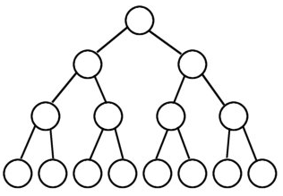
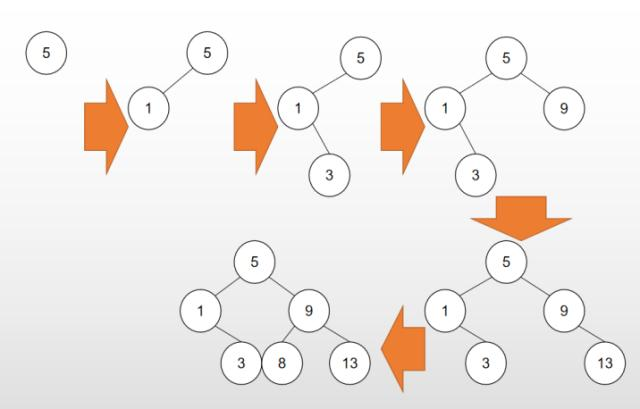
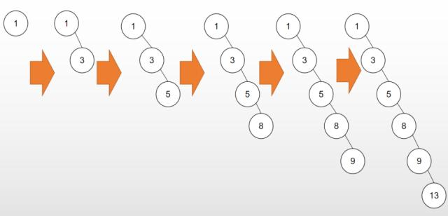
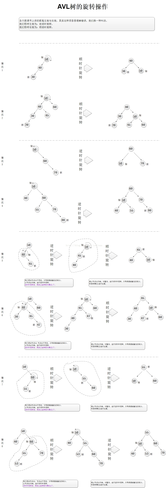
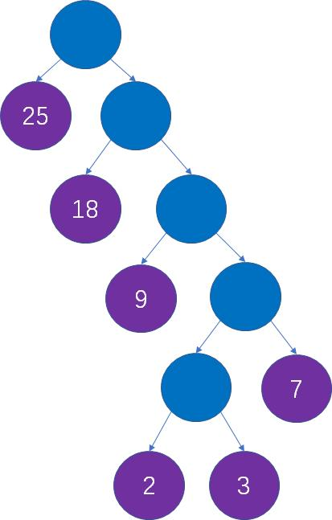

## 树相关的算法

### 二叉树最大深度

```java
public int maxDepth(TreeNode root) {
        if (root == null) {
            return 0;
        }
        int left = maxDepth(root.left);
        int right = maxDepth(root.right);
        return Math.max(left, right) + 1;
    }
```


## 树相关

#### 页节点

NIL或空节点

#### 满二叉树

  满二叉树：从高到低，除了叶节点外，所以节点左右节点都存在。

一棵二叉树的结点要么是叶子结点，要么它有两个子结点（如果一个二叉树的层数为K，且结点总数是(2^k) -1，则它就是满二叉树。）




#### 完全二叉树

 完全二叉树：比满二叉树少几个叶节点，从左向右放子节点。

若设二叉树的深度为k，除第 k 层外，其它各层 (1～k-1) 的结点数都达到最大个数，第k 层所有的结点都**连续集中在最左边**，这就是完全二叉树。


### 1. 二叉搜索树

又叫二叉排序树，简单而言就是左子树上所有节点的值均小于根节点的值，而右子树上所有结点的值均大于根节点的值，左小右大，并不是乱序，因此得名二叉排序树。

[力扣98如何验证是否是二叉搜索树](https://leetcode-cn.com/problems/validate-binary-search-tree/)

- 二叉搜索树有个特性：中序遍历是升序的数组

- 这道题可以用递归和迭代两种方式做，递归就是中序遍历，迭代也是中序遍历的迭代版本

### 验证是否是二叉搜索树

```java
class Solution {
    long pre = Long.MIN_VALUE;
    public boolean isValidBST(TreeNode root) {
        if (root == null) {
            return true;
        }
        // 访问左子树
        if (!isValidBST(root.left)) {
            return false;
        }
        // 访问当前节点：如果当前节点小于等于中序遍历的前一个节点，说明不满足BST，返回 false；否则继续遍历。
        if (root.val <= pre) {
            return false;
        }
        pre = root.val;
        // 访问右子树
        return isValidBST(root.right);
    }
}
```

但是二叉搜索树在插入的数组本身是有序的情况下效率就会变得很糟糕，如下图2

1效率还不错的二叉搜索树

 

​     2 效率很低的二叉搜索树




为了避免二叉搜索树带来的问题，我们就是尽量让树的高度保持在一个正常的水准，所以降低高度我们引入了平衡二叉树（AVL树）

### 2. AVL树（平衡二叉搜索树）

它是一棵空树或它的左右两个子树的高度差的绝对值不超过1，并且左右两个子树都是一棵平衡二叉树。在AVL树中任何节点的两个子树的高度最大差别为一，所以它也被称为平衡二叉树

但是AVL树和平衡二叉树的区别就是是否是二叉搜索树，因为平衡二叉树可能不是二叉搜索树




### 验证是否是平横二叉树


注意：这里不验证是否是AVL树，因为AVL树还要验证是否是二叉搜索树

```java
class Solution {
 public boolean isBalanced(TreeNode root) {
        if (root == null) {
            return true;
        }
        // 访问左子树
        if (!isBalanced(root.left)) {
            return false;
        }
        int cha = maxDepth(root.left) - maxDepth(root.right);
        if (cha > 1 || cha < -1) {
            return false;
        }
        return isBalanced(root.right);
    }

    /**
     * 获取二叉树最大深度
     *
     * @param root
     * @return
     */
    public int maxDepth(TreeNode root) {
        if (root == null) {
            return 0;
        }
        int left = maxDepth(root.left);
        int right = maxDepth(root.right);
        return Math.max(left, right) + 1;
    }
}
```


- 

### 3.红黑树


**[推荐阅读](https://mp.weixin.qq.com/s/JQqdzMJ5cL3AAbZgBXpAIw)**

**性质一：**节点是红色或者是黑色；

在树里面的节点不是红色的就是黑色的，没有其他颜色，要不怎么叫红黑树呢

**性质二：**根节点是黑色；

根节点总是黑色的。它不能为红。

**性质三：**每个叶节点（NIL或空节点）是黑色；

这个可能有点理解困难，可以看图

**性质四：**每个红色节点的两个子节点都是黑色的（也就是说不存在两个连续的红色节点）；

就是连续的两个节点不能是连续的红色，连续的两个节点的意思就是父节点与子节点不能是连续的红色。

**性质五：**从任一节点到其没个叶节点的所有路径都包含相同数目的黑色节点；

从上图可以看见相同数量的黑色节点有三个；


#### AVL树与红黑树（R-B树）的区别与联系

- AVL是严格的平衡树，因此在增加或者删除节点的时候，根据不同情况，旋转的次数比红黑树要多；
- 红黑树是用非严格的平衡来换取增删节点时候旋转次数的降低开销；
- 所以简单说，查询多选择AVL树，查询更新次数差不多选红黑树
- AVL树顺序插入和删除时有20%左右的性能优势，红黑树随机操作15%左右优势，现实应用当然一般都是随机情况，所以红黑树得到了更广泛的应用 索引为B+树 Hashmap为红黑树

#### 为啥redis zset使用跳跃链表而不用红黑树实现

- skiplist的复杂度和红黑树一样，而且实现起来更简单。
- 在并发环境下红黑树在插入和删除时需要rebalance，性能不如跳表。

### 4.哈夫曼树

**[推荐阅读](https://baijiahao.baidu.com/s?id=1663514710675419737&wfr=spider&for=pc)**

而哈夫曼树（Huffman Tree）是在叶子结点和权重确定的情况下，带权路径长度最小的二叉树，也被称为最优二叉树。

比如给定数组【2，3，7，9，18，25】让你生成权值最小的二叉树




```java
import java.util.PriorityQueue;
import java.util.Queue;

/**
 * @author xiyou
 * 漫画解读什么是哈曼西树
 * https://mp.weixin.qq.com/s/dX-8zmSemS0jU21esEYhZA
 */
public class HuffmanTree {

    private HmNode root;

    private HmNode[] list;


    public static void main(String[] args) {
        int arr[] = new int[]{2, 3, 7, 9, 18, 25};
        HuffmanTree tree = new HuffmanTree();
        tree.createHuffmanTree(arr);
        tree.outPrint(tree.root);
    }

    public void createHuffmanTree(int[] weight) {
        Queue<HmNode> nodeQueue = new PriorityQueue<>(weight.length);
        list = new HmNode[weight.length];

        /**
         * 初始化优先队列和原始node
         */
        for (int i = 0, len = weight.length; i < len; i++) {
            list[i] = new HmNode(weight[i]);
            nodeQueue.add(list[i]);
        }
        //主循环，当结点队列只剩一个结点时结束
        while (nodeQueue.size() > 1) {
            HmNode left = nodeQueue.poll();
            HmNode right = nodeQueue.poll();
            //parent
            HmNode parent = new HmNode(left.weight + right.weight, left, right);
            nodeQueue.add(parent);
        }
        root = nodeQueue.poll();
    }


    //前序遍历结果输出
    public void outPrint(HmNode node) {
        if (node == null) {
            return;
        }
        System.out.println(node.weight);
        outPrint(node.left);
        outPrint(node.right);

    }

    /*
        构建树,因为使用的是优先队列，所以用实现比较接口
     */
    public static class HmNode implements Comparable<HmNode> {
        int weight;
        HmNode left;
        HmNode right;

        public HmNode(int weight, HmNode left, HmNode right) {
            this.weight = weight;
            this.left = left;
            this.right = right;
        }

        public HmNode(int weight) {
            this.weight = weight;
        }

        @Override
        public int compareTo(HmNode node) {
            return Integer.valueOf(this.weight).compareTo(Integer.valueOf(node.weight));
        }
    }

}
```

### 5 二叉树序列化和反序列化

- 同样也是le e t C o de的一道原题


序列化是将一个数据结构或者对象转换为连续的比特位的操作，进而可以将转换后的数据存储在一个文件或者内存中，同时也可以通过网络传输到另一个计算机环境，采取相反方式重构得到原数据。

请设计一个算法来实现二叉树的序列化与反序列化。这里不限定你的序列 / 反序列化算法执行逻辑，你只需要保证一个二叉树可以被序列化为一个字符串并且将这个字符串反序列化为原始的树结构。

示例: 

你可以将以下二叉树：

    1
   / \
  2   3
     / \
    4   5

序列化为 "[1,2,3,null,null,4,5]"
提示: 这与 LeetCode 目前使用的方式一致，详情请参阅 LeetCode 序列化二叉树的格式。你并非必须采取这种方式，你也可以采用其他的方法解决这个问题。

来源：力扣（LeetCode）
链接：https://leetcode-cn.com/problems/serialize-and-deserialize-binary-tree
著作权归领扣网络所有。商业转载请联系官方授权，非商业转载请注明出处。

**说明:** 不要使用类的成员 / 全局 / 静态变量来存储状态，你的序列化和反序列化算法应该是无状态的。

#### 序列化

- 序列化可以采用两种方式，BFS和DFS，这里我们采用BFS因为DFS递归是不稳定的
  - 核心思想：树的层级遍历，但是在遇到左右节点其中一个或者2个为空的时候，存null

```java
// Encodes a tree to a single string.
    public String serialize(TreeNode root) {
        //tree: [v1,v2,null,...]
        //node: ,
        //val:  str(val)
        //null: "null"
        StringBuilder res = new StringBuilder("[");
        Queue<TreeNode> queue = new LinkedList();
        queue.add(root);
        while(!queue.isEmpty()){
            TreeNode cur = queue.remove();
            if(cur == null){
                res.append("null,");
            }else{
                res.append(cur.val + ",");
                queue.add(cur.left);
                queue.add(cur.right);
            }
        }
        res.setLength(res.length() - 1);
        res.append("]");
        return res.toString();
    }
//1,2,3,null,null,4,5,null,null,null,null]
```

#### 反序列化

- 核心思想：用队列，从队列末端取一个，然后把它的左右两端都放入数据，然后再取下一个

```java
 // Decodes your encoded data to tree.
    public TreeNode deserialize(String data) {
        String[] nodes = data.substring(1, data.length()-1).split(",");
        TreeNode root = getNode(nodes[0]);
        Queue<TreeNode> parents = new LinkedList();
        TreeNode parent = root;
        boolean isLeft = true;
        for(int i = 1; i < nodes.length; i++){
            TreeNode cur = getNode(nodes[i]);
            if(isLeft){
                parent.left = cur;
            }else{
                parent.right = cur;
            }
            if(cur != null){
                parents.add(cur);
            }
            isLeft = !isLeft;
            if(isLeft){
                parent = parents.peek();
                parents.poll();
            }
        }
        return root;
    }


private TreeNode getNode(String val){
        if(val.equals("null")){
            return null;
        }
        return new TreeNode(Integer.valueOf(val));
    }
```

### 6. 从先序遍历还原二叉树

[1028. 从先序遍历还原二叉树](https://leetcode-cn.com/problems/recover-a-tree-from-preorder-traversal/)

难度困难111

我们从二叉树的根节点 `root` 开始进行深度优先搜索。

在遍历中的每个节点处，我们输出 `D` 条短划线（其中 `D` 是该节点的深度），然后输出该节点的值。（*如果节点的深度为 `D`，则其直接子节点的深度为 `D + 1`。根节点的深度为 `0`）。*

如果节点只有一个子节点，那么保证该子节点为左子节点。

给出遍历输出 `S`，还原树并返回其根节点 `root`。

 

**示例 1：**

****

```java
输入："1-2--3--4-5--6--7"
输出：[1,2,5,3,4,6,7]
```

#### 思路

- 如果是先序遍历，肯定是根-左-右，所以不妨把所有层树的数据都存储下来
- 把字符串用-分割成一个数组，所以肯定会有空的情况，默认层级是1，当遇到数字时，层级不变，当遇到空的时候，层级+1

```java
 public TreeNode recoverFromPreorder(String S) {
        String[] valus = S.split("-");
        List<TreeNode> list = new ArrayList<>();
        //根节点添加到list中
        list.add(new TreeNode(Integer.valueOf(valus[0])));
        int level = 1;
        for (int i = 1; i < valus.length; i++) {
            if (!valus[i].isEmpty()) {
                TreeNode node = new TreeNode(Integer.valueOf(valus[i]));
                //因为是前序遍历，每层我们只需要存储一个结点即可，这个节点值有可能
                //会被覆盖，如果被覆盖了说明这个节点以及他的子节点都以及遍历过了，
                //所以我们不用考虑被覆盖问题
                list.add(level, node);
                //获取父节点
                TreeNode parent = list.get(level - 1);
                if (parent.left == null) {
                    parent.left = node;
                } else {
                    parent.right = node;
                }
                //重新赋值
                level = 1;
            } else {
                //加一层
                level++;
            }
        }
        return list.get(0);
    }
```

