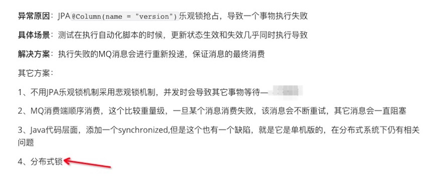
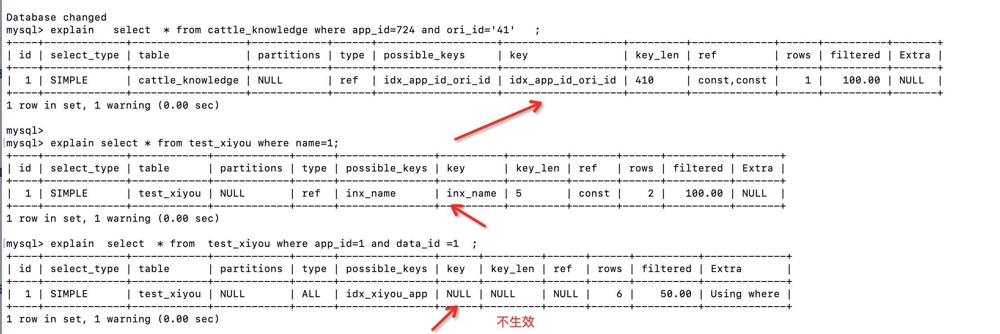

### 一、背景介绍



#### 技术选型

在我们上面的解决方案中1和4的效果都是进行等待，4的话又引入了一个分布式锁，但是效果都是等待，我们该如何选型呢？

如果你能保证select for update 不产生死锁，select for update 是不错的选择，不引入其它组件

 如果不能保证select for update 产生死锁，那你可以用分布式锁

 

### 二、select for update 几种不同的写法
select for update的几种写法,测试发现只有select for update 可以执行成功，其它的SQL放入mysql执行均报错，也就是SQL错误

```sql
会等待行锁释放之后，返回查询结果。
select * from t for update 
不等待行锁释放，提示锁冲突，不返回结果；但是不能执行成功；
select * from t for update nowait 
 ##等待5秒，若行锁仍未释放，则提示锁冲突，不返回结果 ;但是在不能执行成功
select * from t for update wait 5； 
查询返回查询结果，但忽略有行锁的记录；但是不能执行成功
select * from t for update skip locked 
```


### 三、 select for update 行锁和表锁的情况总结

- 使用原理：select for update 的时候，where语句必须是主键、唯一索引、普通索引等索引条件。

- - 因为：如果有索引，则为行锁，如果没有索引则为表锁
  - 有索引的情况，如果索引记录对应的只有一条如主键和唯一索引，锁住的记录只有一条；如果索引对应多条记录，锁住的是多条记录。
  - 如果没有记录，则无锁，但是依旧会对相关索引的insert方法锁住，也就是不能进行相关索引的插入，但是删除和update可以执行因为没有记录
  - 如果没有索引无论查询到记录与否，都为表锁

X：排它锁

S：共享锁
#### 1)主键for update

 **情况一、主键索引for update 即where id=1**

- 主键查询到记录，行锁，此时主键索引上存在一个 X 记录锁

  - 会阻止其他事务对表 t 中 id = 1 的数据执行插入、更新、删除操作。

- 主键查询无记录，无锁。

- - 但是会阻止其它事物ID=1的插入，但是删除和update可以执行因为没有记录
#### 2)唯一索引for update 
**情况二、唯一索引 where un_name='a'对应记录ID=1**

- 唯一查询到记录，行锁，此时主键索引上存在一个 X 记录锁，唯一索引上有一个X记录锁
  - 会阻止其他事务对表 t 中 id = 1 的数据执行插入、更新、删除操作。
  - 会阻止其它事物对表t中un_name ='a'的数据进行插入、更新、删除操作
- 唯一索引查询无记录，无锁。
  - 但是会阻止其它事物对un_name='a'的插入，但是删除和update可以执行因为没有记录
#### 3)for update主键、唯一索引间隙锁问题 
**上诉主键和唯一索引特殊情况**

- 主键或者唯一索引在事物隔离级别为可重复度RR下，如果查询不到记录，会有间隙GAP锁存在。
  下面我们用查询
- select c1 from t where c1 = 16031043800016 for update 这个是查询不到记录的，如果存在间隙锁，则另一个事物无法向其中插入16031043800014——16031043800018的记录

```sql
mysql> select * from t;
+----+----------------+------+------+
| id | c1             | c2   | c3   |
+----+----------------+------+------+
|  1 | 16031043800012 |    1 |    1 |
|  2 | 16031043800013 |    5 |    2 |
|  3 | 16031043800014 |   10 |    3 |
|  4 | 16031043800018 |   10 |    3 |
+----+----------------+------+------+
4 rows in set (0.00 sec)
# c1是唯一索引，c2是普通索引，c3无索引
 CREATE TABLE `t` (
  `id` int(11) NOT NULL,
  `c1` bigint(20) NOT NULL,
  `c2` int(11) DEFAULT NULL,
  `c3` int(11) DEFAULT NULL,
  PRIMARY KEY (`id`),
  UNIQUE KEY `t_c1_uindex` (`c1`),
  KEY `c2_inx` (`c2`)
) ENGINE=InnoDB

```

开启另一个事物测试，结果如下：发现不在16031043800014——16031043800018范围内的都可以插入，但是在范围内的被阻塞，证明有间隙锁存在

```sql
cattle> start transaction
[2021-01-25 10:20:47] 已在 9 ms 中完成
cattle> insert into t (id, c1, c2, c3) VALUES (7,16031043800011,2,1)
[2021-01-25 10:21:54] 8 ms 中有 1 行受到影响
cattle> insert into t (id, c1, c2, c3) VALUES (8,16031043800019,2,1)
[2021-01-25 10:22:11] 11 ms 中有 1 行受到影响
cattle> insert into t (id, c1, c2, c3) VALUES (9,16031043800015,2,1)
[2021-01-25 10:23:12] 正在取消...
```


 ####  4)普通索引for update

**情况三、普通索引 for update 比如： where name ='a' ; name字段是普通索引，比如name='a'对应的ID=8和9**

- 普通索引查询到记录，行锁，此时索引name上存在一个 X 记录锁，主键索引上存在一个 X 记录锁

  - 会锁定name='a'相关记录
  - 此时会阻止name='a'的插入、删除、更新
  - 而且阻止ID=8和9所有的插入、更新、删除
  - 而且会在name字段上添加一个间隙锁GAP锁、next-key锁，这个在后面具体介绍

- 查询不到记录，无锁。

  - 但是会阻止其它事物对name='a'的插入，但是删除和update可以执行因为没有记录

- **这里的普通索引包括联合索引,但是也有特殊情况就是你的索引一定要生效，explain一下**

#### 5)索引不生效时for update

  **联合索引不生效的特殊情况：**

  如图：第三个联合索引没有生效。**possible_keys:表示查询时，可能使用的索引key:表示实际使用的索引**

   

  

至于为啥联合索引没有生效，因为mysql在 select * 的情况下，查询需要回表，如果回表查询效果不如直接扫描全部数据，则mysql放弃索引，这个在数据量较小的情况下会出现

 ####  6)无索引for update


**情况四、无索引查询 for update 即 where status =1**

- 无论查询到记录与否都为表锁。
- 此刻阻止一切表的删除、更新、插入操作（delete update 如果不存在相关记录，可以执行因为不影响结果）

#### 7) 组合查询for update 情况

**Q1、主键索引和普通字段一起查询**：where id =1 and status=1

- 记录查询有结果，只会锁住ID=1的记录，和主键查询效果一致
- 记录查询最终没有结果，但是id=1是有结果的，效果只会锁住id=1的记录，和主键查询效果一致
- 记录查询因为ID没有结果，比如ID=61，效果和主键查询没有结果一样，会阻止ID=61的插入

- 总结：其实和主键索引for update查询查询是一样的

**Q2、普通索引和普通字段一起查询**，如：where name='a' and status=1

- 这个和普通索引for update查询是一致的，也就是说，锁住的是name=‘a’的索引字段
- 普通索引包含联合的普通索引
- 注意索引不生效的时候就相当于无索引查询，这个时候会锁表


### 四、行锁、表锁、间隙锁、next-key锁

#### 行锁

-  根据主键for update 

  - id=1 for update
  - 2 lock struct(s), 1 row lock(s)
  - 日志显示存在 2 个锁结构，锁定了一个记录即ID=1；表 t 上存在 IX 锁，主键索引上存在一个 X 记录锁

- 根据唯一索引for update

  - un_name=2 for update

  - 3 lock struct(s), heap size 1136, 2 row lock(s)

  - 日志显示存在 3 个锁结构，锁定了 2 个记录；除了主键记录，还有un_name=2对应的记录也被锁住了

    表 t 上存在 IX 锁，索引 idx_t_c1 上存在一个 X 记录锁，主键索引上存在一个 X 记录锁

#### 间隙锁

- 主键或者唯一索引查询不存在的记录，比如select for update where id=6，但是ID=6不存在
- 间隙锁特性：
  - 1、间隙锁（Gap Lock）会锁定当前索引及索引之前的间隙.
  - 2、间隙锁只会在某些事务隔离级别（Repeatable Read）使用。
  - 3、InnoDB 间隙锁的唯一目的是阻止其他事务在间隙中插入数据。
  - 4、一定程度上阻止幻读的发生
  - 5、相同的间隙可以被两个事物共存，会造成死锁
- 间隙锁具体的场景：
  - 1、主键索引、唯一索引查询到记录可以锁定一行，所以不需要间隙锁锁定。
  - 2、主键索引、唯一索引查询不到记录则会存在**两个索引之间**的间隙锁，比如有1，5，10三条主键记录，如果select for update where id =6，会锁定（5，10）之间的间隙

#### next-key锁

- 间隙锁+记录锁=next-key锁

- 只会在某些事务隔离级别（Repeatable Read）使用。

- 具体场景：

  - 主键或者唯一索引使用范围属性时，比如select for update where id between 1 and 10

  - 普通索引命中纪录，比如：还是有1,5,10三条普通索引记录，如果select for update where c2=5，则会直接锁定普通索引（1,10）的范围。注意这里只说了锁住普通索引的范围，并没有说主键锁的范围，实际上相关主键也会被锁住的。

    (1,5)和(5,10)是间隙锁，{5}是索引记录锁，所以最终普通索引锁的范围是：(5,10)
  
  - 同理：for update c2=10普通索引加锁范围是:(5,+∞)
  
    区间(5,10)的gap锁，{10}是记录锁，（10,+∞)的gap锁，即普通索引的(5,+∞)都被加上了锁。


### 五、死锁

#### 死锁的原因

都是由于某个区间上或者某一个记录上可以同时持有锁，例如不同事务在同一个间隙gap上的锁不冲突；不同事务中，S锁可以阻塞X锁的获取，但是不会阻塞另一个事务获取该S锁。这样才会出现两个事务同时持有锁，并互相等待，最终导致死锁。

下面用如下场景进行测试，c1为唯一索引，c2是普通索引，c3没有索引

```sql
mysql> select * from t;
+----+----------------+------+------+
| id | c1             | c2   | c3   |
+----+----------------+------+------+
|  1 | 16031043800012 |    1 |    1 |
|  2 | 16031043800013 |    5 |    2 |
|  3 | 16031043800014 |   10 |    3 |
```

#### 模拟死锁

| 时刻 | 事物A                                                        | 事物B                                                        | 备注                                  |
| :--- | :----------------------------------------------------------- | :----------------------------------------------------------- | :------------------------------------ |
| T1   | cattle> start transaction<br/>[2021-01-24 14:08:20] 已在 8 ms 中完成<br/>cattle> select c2 from t where c2 = 5 for update<br/>[2021-01-24 14:08:27] 在 111 ms (execution: 7 ms, fetching: 104 ms) 中从 1 开始检索到1 行 | cattle> start transaction<br/>[2021-01-24 14:08:37] 已在 6 ms 中完成<br/>cattle> select c2 from t where c2 = 10 for update<br/>[2021-01-24 14:08:47] 在 114 ms (execution: 10 ms, fetching: 104 ms) 中从 1 开始检索到1 行 | 事物A锁定(1,10]<br />事物B锁定（5,+∞) |
| T2   | insert into t (id, c1, c2, c3) VALUES (7,16031043800017,7,1) |                                                              | 此时事物Ainsert被阻塞                 |
| T3   |                                                              | cattle> insert into t (id, c1, c2, c3) VALUES (8,16031043800018,8,1) [2021-01-24 14:09:23] [40001][1213] Deadlock found when trying to get lock; try restarting transaction | 事物B直接死锁                         |
| T4   | [2021-01-24 14:09:23] 18 s 169 ms 中有 1 行受到影响          |                                                              | 事物2死锁后，事物Ainsert生效          |


### 六、select for update 带来的问题和解决方案

#### 解决select for update锁区间过大或者表锁问题

1）可以将普通索引换位唯一索引，可以在查询到记录的情况下for update 降低锁区间范围。当然这个要看具体场景，如果不是唯一索引的场景不要换。

2）select for update 不存在的记录时，主键索引、唯一索引、普通索引会锁住两个索引之间的间隙，使范围变大。

所以可以在select for update 前面判断下，如果记录存在，则用select for update ，如果记录不存在，则不用select for update

3）我们可以先查询出来，然后锁ID

#### 解决select for update死锁？

- 造成死锁的原因是：两个事物持有同一个锁区间进行相关等待。

比如一个普通索引，值为1，5，10,15

1）**排除select for update不存在的记录，进行插入数据的时候会造成死锁 。**

select for update 3,锁住的范围锁是(1,5)

select for update 4 ，锁住的范围是(1,5)

这个时候两个事物都进行插入数据，会造成死锁

2）**排除select for update 存在记录，但是进行插入数据的时候由于锁区间问题造成的死锁。**

select for update 5,锁住的范围锁是(1,10)

select for update 10 ，锁住的范围是(5,10)

我们只需要保证两个事物都不进行在这个区间的insert操作，这样就不会因为锁住相同范围但是进行插入造成的死锁

比如select for update where c2=5 ，接下来更新c2=5的记录；select for update where c2=10 ，接下来更新c2=10的记录


### 七、select for update 最终方案

1、判断是否存在，不存在不用for update

2、如果存在，先查询出来，用ID进行锁定，最小范围的把间隙锁的范围降到最小

方法A先查询ID,传给方法B

```java
// 先查询
List<Knowledge> knowledges = knowledgeDAO.findByAppIdAndOriId(appId, knowledgeDTO.getId());
Long id = null;
if (CollectionUtils.isNotEmpty(knowledges)) {
    id = knowledges.get(0).getId();
}
knowledgeService.access(appId, id, knowledgeDTO);
```

方法B用事物直接select for update，但是要用ID锁，这样锁的范围最小

```java
@Transactional(rollbackFor = Exception.class)
public void access(Long appId, Long knowledgeId, KnowledgeDTO dataDTO) {
    log.info("knowledge access data,  appId:{}, id:{}, action:{}", appId, dataDTO.getId(), dataDTO.getAction());
    Knowledge data = null;
    String md5 = dataDTO.getMD5();
    if (knowledgeId == null) {
        data = new Knowledge();
    } else {
        //select  * from cattle_knowledge where id=?1 for update
        data = knowledgeDAO.findByIdForUpdate(knowledgeId);
        ...
    }
    ...
}
```

三、参考

http://dbaplus.cn/news-11-2518-1.html

https://tonydong.blog.csdn.net/article/details/103324323
