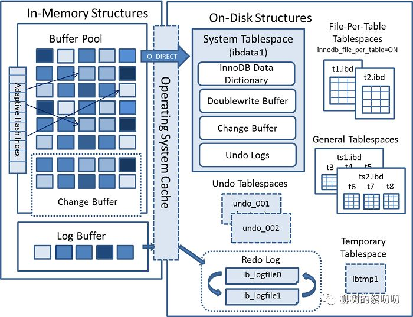
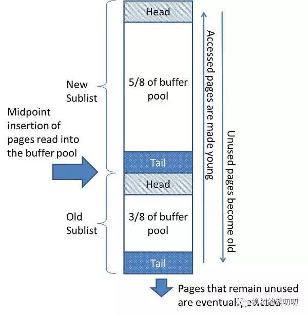
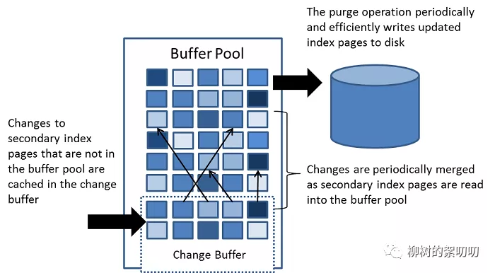
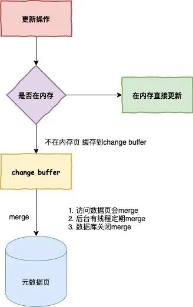
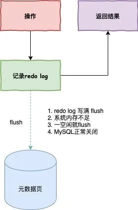

### MySQL MVCC
- [mvcc详解](./docs/mysql/Mysql关于MVCC.md)


### mysql写一个死锁

- [mvcc](./docs/mysql/写一个MySQL死锁的代码.md)


## mysql常见调优与查询命令

- 查询当前活跃的事务

```sql
SELECT * FROM INFORMATION_SCHEMA.INNODB_TRX
```

- mysql8.0查看索引有几层树

```sql
SELECT
	b.NAME,
	a.NAME,
	index_id,
	type,
	a.space,
	a.PAGE_NO 
FROM
	information_schema.INNODB_INDEXES a,
	information_schema.INNODB_TABLES b 
WHERE
	a.table_id = b.table_id 
	AND a.space <> 0;
```

- 查看空闲连接

```mysql
show processlist
```

- ID自增从1000开始

```java
alter table users AUTO_INCREMENT=1000;
```


### 解决连接超时问题

数据库默认的超时时间是8小时，而他们平时六点下班，下班之后系统就没有人用了，等到第二天早上九点甚至十点才上班，这中间的时间已经超过10个小时了，数据库的连接肯定就会断开了。

- 把连接超时时间改长些
- 使用长链接，并定期断开
- 执行**mysql_reset_connection**

但是这里有个缺点，使用长连接之后，内存会飙得很快，我们知道MySQL在执行过程中临时使用的内存是管理在连接对象里面的。

只有在链接断开的时候才能得到释放，那如果一直使用长连接，那就会导致OOM（Out Of Memory），会导致MySQL重启，在JVM里面就会导致频繁的Full GC。

> 那你会怎么解决？

我一般会定期断开长连接，使用一段时间后，或者程序里面判断执行过一个占用内存比较大的查询后就断开连接，需要的时候重连就好了。

> 还有别的方法么？你这种感觉不优雅呀小老弟。

执行比较大的一个查询后，执行**mysql_reset_connection**可以重新初始化连接资

## mysql调优

### Mysql8.0新特性

- 尽量选用高版本而且稳定的版本，比如mysql8.0之后的版本

  - Mysql8.0之后增加了隐藏索引：用于软删除、索引校验、灰度发布
  - Mysql8.0之后增加函数索引，比如字符串问题，字符串类型是这样的【abc+xxx+def】,这样就能用到函数索引
  - Mysql8.0之后添加降序索引
  - Mysql8.0之后添加索引下推
  - Mysql8.0之后添加HashJoin

  但是HashJoin的使用场景很有限，目的是使那些没有索引的字段进行相互匹配的时候效率更高，因为之前是两个for循环匹配，但是要尽量避免使用hashJoin,能走索引还是走索引

  - Mysql8.0之后增加JSON

### 索引方面

1. ID要尽量用数字类型的，比如int 或者long 或者分布式雪花ID，这样建立索引的代价就比较小，引入插入的时候要进行分裂
2. 覆盖索引的使用、联合索引的使用（最左原则）
3. 使用函数索引
4. 判断是否存在优化
5. 防止联合索引因为范围查询导致的索引右边失效的问题

```mysql
select count(*) from xxx where a=xxx and b=xxx
##改为让数据库遇到一个就返回
select 1 from xxx where a=xx and b=xx limit 1
```


1. 合理利用子查询

```mysql
mysql> select * from test where val=4 limit 300000,5;
扫描前30005条，丢掉前面的30000条
+---------+-----+--------+
| id      | val | source |
+---------+-----+--------+
| 3327622 |   4 |      4 |
| 3327632 |   4 |      4 |
| 3327642 |   4 |      4 |
| 3327652 |   4 |      4 |
| 3327662 |   4 |      4 |
+---------+-----+--------+
5 rows in set (15.98 sec)
  
  mysql> select * from test a inner join
  (select id from test where val=4 limit 300000,5) b on a.id=b.id;
+---------+-----+--------+---------+
| id      | val | source | id      |
+---------+-----+--------+---------+
| 3327622 |   4 |      4 | 3327622 |
| 3327632 |   4 |      4 | 3327632 |
| 3327642 |   4 |      4 | 3327642 |
| 3327652 |   4 |      4 | 3327652 |
| 3327662 |   4 |      4 | 3327662 |
+---------+-----+--------+---------+
5 rows in set (0.38 sec)


mysql> select * from test where val=4 limit 300000,5;
+---------+-----+--------+
| id      | val | source |
+---------+-----+--------+| 
3327622 |   4 |      4 |
| 3327632 |   4 |      4 |
| 3327642 |   4 |      4 |
| 3327652 |   4 |      4 |
| 3327662 |   4 |      4 |
+---------+-----+--------+
5 rows in set (26.19 sec)
###buffer pool中关于test表有多少数据页，多少索引页，有4098个数据页，208个索引页。
mysql> select index_name,count(*) from information_schema.INNODB_BUFFER_PAGE where INDEX_NAME in('val','primary') and TABLE_NAME like '%test%' group by index_name;
+------------+----------+
| index_name | count(*) |
+------------+----------+
| PRIMARY    |     4098 |
| val        |      208 |
+------------+----------+2 rows in set (0.04 sec)


而且这会造成一个问题：加载了很多热点不是很高的数据页到buffer pool，
会造成buffer pool的污染，占用buffer pool的空间。遇到的问题

为了在每次重启时确保清空buffer pool，我们需要关闭innodb_buffer_pool_dump_at_shutdown和innodb_buffer_pool_load_at_startup，
这两个选项能够控制数据库关闭时dump出buffer pool中的数据和在数据库开启时载入在磁盘上备份buffer pool的数据。
```

2. 合理利用>条件

```sql
# 第一页
SELECT * FROM `year_score` where `year` = 2017 ORDER BY id limit 0, 20;

# 第N页
SELECT * FROM `year_score` where `year` = 2017 ORDER BY id limit (N - 1) * 20, 20;

改为：

# XXXX 代表已知的数据
SELECT * FROM `year_score` where `year` = 2017 and id > XXXX ORDER BY id limit 20;
```


## Innodb结构



从上面第二张图可以看到，InnoDB 主要分为两大块：

- InnoDB In-Memory Structures 内存
- InnoDB On-Disk Structures     磁盘

### WAL和redo log

WAL全称是write ahead log，也就是更新数据之前先更新日志

- 为啥要引入redo log？

磁盘的写操作是随机io，比较耗性能，所以如果把每一次的更新操作都先写入log中，那么就成了顺序写操作，实际更新操作由后台线程再根据log异步写入。这样对于client端，延迟就降低了。并且，由于顺序写入大概率是在一个磁盘块内，这样产生的io次数也大大降低。所以WAL的核心在于将随机写转变为了顺序写，降低了客户端的延迟，提升了吞吐量。

至于说redo log可以恢复数据，这不是原因，而是结果。如果不用WAL，就直接每一次都裸写磁盘，那根本不会有什么数据恢复的问题，什么时候宕机，那个时候之前的数据就是写入成功的。换句话说，正是因为用了WAL，才需要考虑宕机数据恢复的问题，因为有些数据还没刷到磁盘上啊。

- Redo log的作用

mysql 为了提升性能不会把每次的修改都实时同步到磁盘，而是会先存到Boffer Pool(缓冲池)里头，把这个当作缓存来用。然后使用后台线程去做缓冲池和磁盘之间的同步。

那么问题来了，如果还没来的同步的时候宕机或断电了怎么办？还没来得及执行bufferpool到磁盘的操作。这样会导致丢部分已提交事务的修改信息！

所以引入了redo log来记录已成功提交事务的修改信息，并且会把redo log持久化到磁盘，系统重启之后在读取redo log恢复最新数据。

redo log是用来恢复数据的 用于保障，已提交事务的持久化特性


### mysql内存bufferPool

正如之前提到的，MySQL 不会直接去修改磁盘的数据，因为这样做太慢了，MySQL 会先改内存，然后记录 redo log，等有空了再刷磁盘，如果内存里没有数据，就去磁盘 load。

而这些数据存放的地方，就是 Buffer Pool。

- 所以：buffer pool是一种减少磁盘io读的机制，原理是将访问过的磁盘数据暂留在内存中，这样下次访问相同的数据就不需要读磁盘了。

我们平时开发时，会用 redis 来做缓存，缓解数据库压力，其实 MySQL 自己也做了一层类似缓存的东西。

MySQL 是以「页」（page）为单位从磁盘读取数据的，Buffer Pool 里的数据也是如此，实际上，Buffer Pool 是`a linked list of pages`，一个以页为元素的链表。

为什么是链表？因为和缓存一样，它也需要一套淘汰算法来管理数据。

Buffer Pool 采用基于 LRU（least recently used） 的算法来管理内存：



- MYSQL将LRU链表分为了Young（New）区，和Old区。
- 当数据首次加载时，会先被加载到Old区的头部。如果该数据页在之后再被用到，那么它才有机会晋升到Young区成为热点数据。
- 针对全表扫描和磁盘预读，它们查询时的得到的数据页，**插入点都在Old的头部**，不会影响Young区的热点数据，且之后如果这部分数据没有被用到，就会被新数据淘汰掉


### mysql——ChangeBuffer

上面提到过，如果内存里没有对应「页」的数据，MySQL 就会去把数据从磁盘里 load 出来，如果每次需要的「页」都不同，或者不是相邻的「页」，那么每次 MySQL 都要去 load，这样就很慢了。

对于一次更新操作，innodb引擎会看更新的页是否在buffer pool中，如果在，那么直接更新buffer pool，并且写入一条redo log。这样后续的读取操作可以读到最新的值。如果不在，那么就先将本次更新操作记录到change buffer中，而不是立刻取更新，最后再记录一条redo log。如果后面有读操作，那么再将对应的数据页载入到buffer pool中，同时将change pool中的更新操作应用到该数据页，这个过程叫做merge。当然如果系统是空闲状态，也会有后台线程去做merge过程。
 而把内存数据刷到磁盘的动作，叫 **purge**：

- **merge：Change Buffer -> Buffer Pool**
- **purge：Buffer Pool -> Disk**




上面是 MySQL 官网对 Change Buffer 的定义，仔细看的话，你会发现里面提到：Change Buffer 只在操作「二级索引」（secondary index）时才使用，原因是「聚簇索引」（clustered indexes）必须是「唯一」的，也就意味着每次插入、更新，都需要检查是否已经有相同的字段存在，也就没有必要使用 Change Buffer 了；另外，「聚簇索引」操作的随机性比较小，通常在相邻的「页」进行操作，比如使用了自增主键的「聚簇索引」，那么 insert 时就是递增、有序的，不像「二级索引」，访问非常随机。

### 脏叶

脏页的定义是内存中和磁盘中的不一致页。

- 内存不够的时候，要淘汰一部分老的数据页，如果不刷回磁盘，就会丢失数据
- Redo log 满了，也要刷回脏页
- 系统空闲的时候，自动会刷脏页
- 系统关闭的时候也会刷脏页

### redo log刷盘时机

- Redo log 满了
- 后台线程
- 事物提交，当然这个并不是绝对的，取决于数据库innodb_flush_log_at_trx_commit配置。
- buffer pool满了，需要刷脏页时；
- checkpoint

innodb_flush_log_at_trx_commit配置

参数决定了事务提交时的行为。0：代表每一次提交只是写入到redo log buffer，如果mysql进程挂了，会丢数据，这是不安全的；1：代表每一次提交都写入磁盘，fsync；2：代表每一次提交都写入操作系统写缓冲，write，如果操作系统挂了，会丢数据；


## mysql索引

```mysql
alter table table_name drop index index_name ;
##普通索引
ALTER table t2 ADD INDEX t2index6 (school(length));
## 唯一索引
ALTER table mytable ADD UNIQUE [indexName] (username(length))
```


### 索引如何加速的？

如果没有这棵 B+树，你要根据主键查询，比如

```
select * from student where id = 5;
```

对不起，数据是无序的，你只能全表扫描，犹如大浪淘沙。

> 有同学会说主键不是递增的吗，那不就可以用二分法来查找？不是的，主键虽然是递增的，但是如果你写入磁盘时，没有去维护有序数组这样一个数据结构（比如你删掉了 4，怎么把 5 往前面挪），那数据在磁盘里依旧是无序的，查找时只能随机查找，而如果你维护了有序数组这样的数据结构，其实也是建了索引，只是建了不一样的数据结构的索引罢了。

### 自适应Hash索引

MySQL 索引，不管是在磁盘里，还是被 load 到内存后，都是 B+ 树，B+ 树的查找次数取决于树的深度。你看，数据都已经放到内存了，还不能“一下子”就找到它，还要“几下子”，这空间牺牲的是不是不太值得？

尤其是那些频繁被访问的数据，每次过来都要走 B+ 树来查询，这时就会想到，我用一个指针把数据的位置记录下来不就好了？

这就是「自适应哈希索引」（Adaptive Hash Index）。自适应，顾名思义，MySQL 会自动评估使用自适应索引是否值得，如果观察到建立哈希索引可以提升速度，则建立。

### MySql的一些规定

- 单行长度不能超过65535

### select * 的问题

- 增加网络开销和传输时间
  - 内容大了，自然开销也就大，传输时间也可能变大
- 如果是大型的varchar、text等会增加IO操作
  - 准确来说，长度超过 728 字节的时候，会先把超出的数据序列化到另外一个地方，因此读取这条记录会增加一次 io 操作。（MySQL InnoDB）

- 不能进行覆盖索引
  - 比如只需要索引字段和主键，则不需要回表
  - 如果是* ，则可能要进行回表查询

### count系列

管是 COUNT(1)，还是 COUNT(*)，MySQL 都会用**成本最小**的辅助索引查询方式来计数，也就是使用 COUNT(*) 由于 MySQL 的优化已经保证了它的查询性能是最好的！

count（**）和count（1）的区别是count（*）通过最小索引树遍历后不需要返回行数据直接+1，count（1）是需要返回数据的但是不做为空判断+1

- 在有null的列使用count(*)进行查询数据，count(列名)不会查询为空的列
- 在使用count(distinct name ,mobile) 查询的时候如果其中有一列数据为空，那么即使另一列不为空，count数据也会丢失
- 当某列为空的时候，如果用!=或者<>查询，会丢失为空的列
- 当某列为空，可能会导致sum(column)返回结果为空，而非0，解决方案：select ifnull(sum(num),0)
- 如何正确查询非空数据：select * from where name is not null


MySQL中数据的单位都是页，MySQL又采用了采样统计的方法，采样统计的时候，InnoDB默认会选择N个数据页，统计这些页面上的不同值，得到一个平均值，然后乘以这个索引的页面数，就得到了这个索引的基数。


所以我有个十万数据的表，但是explain的时候却不是10万，这很正常,发现是100300

```java
1	SIMPLE	person		index		create_time	4		100300	100.00	Using index
```

### 发现索引走错怎么办？

就如前文所述，在有多个索引的情况下， 在查询数据前，MySQL 会选择成本最小原则来选择使用对应的索引，这里的成本主要包含两个方面。

- IO 成本: 即从磁盘把数据加载到内存的成本，默认情况下，读取数据页的 IO 成本是 1，MySQL 是以页的形式读取数据的，即当用到某个数据时，并不会只读取这个数据，而会把这个数据相邻的数据也一起读到内存中，这就是有名的程序局部性原理，所以 MySQL 每次会读取一整页，一页的成本就是 1。所以 IO 的成本主要和页的大小有关
- CPU 成本：将数据读入内存后，还要检测数据是否满足条件和排序等 CPU 操作的成本，显然它与行数有关，默认情况下，检测记录的成本是 0.2。


至于MySQL索引可能走错也很好理解，如果走A索引要扫描100行，B所有只要20行，但是他可能选择走A索引，你可能会想MySQL是不是有病啊，其实不是的。

一般走错都是因为优化器在选择的时候发现，走A索引没有额外的代价，比如走B索引并不能直接拿到我们的值，还需要回到主键索引才可以拿到，多了一次回表的过程，这个也是会被优化器考虑进去的。

#### 索引失效案例

```mysql
SELECT * FROM user ORDER BY age DESC
```

上述语句在 age 上加了索引，但依然造成了全表扫描，这是因为我们使用了 SELECT *,导致回表查询，MySQL 认为回表的代价比全表扫描更大，所以不选择使用索引，如果想使用到 age 的索引，我们可以用覆盖索引来代替:

```mysql
SELECT age FROM user ORDER BY age DESC
```

或者加上 limit 的条件（数据比较小）

```mysql
SELECT * FROM user ORDER BY age DESC limit 10
```

这样就能利用到索引。

### 覆盖索引

查询的结果集是索引的内容，不需要进行回表操作

### 联合索引

#### 使用注意

- 联合索引谁放在前面，谁放在后面的问题？

就是谁第一次能过滤更多的饿数据，谁放在前面

```mysql
建立联合索引时，把选择性最高的列放在最前面，比如，对于以下语句：

SELECT * FROM payment WHERE staff_id = xxx AND customer_id = xxx;
单就这个语句而言， (staff_id，customer_id) 和  (customer_id, staff_id) 这两个联合索引我们应该建哪一个呢，可以统计下这两者的选择性。

SELECT 
 COUNT(DISTINCT staff_id)/COUNT(*) as staff_id_selectivity,
 COUNT(DISTINCT customer_id)/COUNT(*) as customer_id_selectivity,
 COUNT(*)
FROM payment
结果为: ;

staff_id_selectivity: 0.0001
customer_id_selectivity: 0.0373
COUNT(*): 16049
从中可以看出 customer_id 的选择性更高，所以应该选择 customer_id 作为第一列。
```

```mysql
DROP TABLE IF EXISTS `t`;
CREATE TABLE `t` (
  `id` bigint(20) NOT NULL AUTO_INCREMENT,
  `mobile` bigint(20) DEFAULT NULL,
  `password` varchar(64) COLLATE utf8mb4_unicode_ci DEFAULT NULL,
  `username` varchar(64) COLLATE utf8mb4_unicode_ci DEFAULT NULL,
  `sex` tinyint(4) NOT NULL DEFAULT '1',
  `birthday` datetime DEFAULT NULL,
  `amount` decimal(18,2) DEFAULT NULL,
  `ismaster` tinyint(1) DEFAULT NULL,
  `istest` bit(1) DEFAULT NULL,
  `updatetime` datetime NOT NULL DEFAULT CURRENT_TIMESTAMP ON UPDATE CURRENT_TIMESTAMP,
  PRIMARY KEY (`id`),
  KEY `san_index` (`username`,`password`,`updatetime`)
) ENGINE=InnoDB AUTO_INCREMENT=101709 DEFAULT CHARSET=utf8mb4 COLLATE=utf8mb4_unicode_ci;

SET FOREIGN_KEY_CHECKS = 1;
```

- 那么单独使用password会不会有索引呢？
  - 答案：不会
- updatetime在前，有木有索引呢？
  - 答案：有索引

```mysql
explain  select  * from  t where   username="吴德丹"  and updatetime='2020-07-25 09:58:39'   ;
1	SIMPLE	t		ref	san_index	san_index	259	const	1	10.00	Using index condition
##下面的语句也是有索引的
explain  select  * from  t where updatetime='2020-07-25 09:58:39'  and username="吴德丹"  ;
##答案是有索引
1	SIMPLE	t		ref	san_index	san_index	259	const	1	10.00	Using index condition

###下面的就没有索引了
explain  select  * from  t where password="3cbaf928375e5aede690fd40e00faa56";
1	SIMPLE	t		ALL					101267	10.00	Using where
```

- Username =xxx and updatetime=xxx和updatetime=xxx and username=xxx用到的索引底层一样吗
- 

### 降序索引

### 隐藏索引

[隐藏索引](https://blog.csdn.net/horses/article/details/85038949)

```mysql
ALTER TABLE t1 ALTER INDEX i_idx INVISIBLE;
ALTER TABLE t1 ALTER INDEX i_idx VISIBLE;

```

查询当前索引是否可见

```mysql
SELECT INDEX_NAME, IS_VISIBLE
       FROM INFORMATION_SCHEMA.STATISTICS
       WHERE TABLE_SCHEMA = 'xxx'   AND TABLE_NAME = 'tableXXX';


show index from tableXXX

```

### 函数索引

[函数索引](https://blog.csdn.net/qq_39455116/article/details/81065181)

- 使用注意

```mysql
CREATE TABLE tbl (
id  int(11) PRIMARY key ,
  col1 LONGTEXT,
  INDEX idx1 ((SUBSTRING(col1, 1, 10)))
);
## 不能用索引
EXPLAIN SELECT * FROM tbl WHERE SUBSTRING(col1, 1, 9) = '123456789';
## 能用索引idx1 
EXPLAIN SELECT * FROM tbl WHERE SUBSTRING(col1, 1, 10) = '1234567890';

```


### 索引下推

[官网介绍: Index Condition Pushdown](https://dev.mysql.com/doc/refman/8.0/en/index-condition-pushdown-optimization.html)
其实就是针对组合索引，比如说`(class,name)`上建立一个组合索引，但是我们name不满足索引条件，如like，这时MySQL也会把name值当作一个条件看看满不满足，这样做的目的就是减少回表，假设有10个数据，只查class的话过滤了40%了，但是还有6万个满足条件的，不走索引下推，就会回表查询6万次，严重浪费了性能

- 如下，一个组合索引，因为第二个条件Like不能使用索引，但是用到了索引下推

```java
mysql> EXPLAIN   SELECT * from student WHERE  school ='12' and class like '%1%';
+----+-------------+---------+------------+------+---------------+------+---------+-------+------+----------+-----------------------+
| id | select_type | table   | partitions | type | possible_keys | key  | key_len | ref   | rows | filtered | Extra                 |
+----+-------------+---------+------------+------+---------------+------+---------+-------+------+----------+-----------------------+
|  1 | SIMPLE      | student | NULL       | ref  | index_two     | aaa  | 1023    | const |    2 |    25.00 | Using index condition |
+----+-------------+---------+------------+------+---------------+------+---------+-------+------+----------+-----------------------+
1 row in set, 1 warning (0.00 sec)

```

### in和exist的区别

```java
 

/*
      1.什么时候用EXISTS，什么时候用IN？
          主表为employees，从表为dept_emp，在主表和从表都对关联的列emp_no建立索引的前提下：
              当主表比从表大时，IN查询的效率较高；
              当从表比主表大时，EXISTS查询的效率较高；
        原因如下：
            in是先执行子查询，得到一个结果集，将结果集代入外层谓词条件执行主查询，子查询只需要执行一次
            exists是先从主查询中取得一条数据，再代入到子查询中，执行一次子查询，判断子查询是否能返回结果，主查询有多少条数据，子查询就要执行多少次
```


### ChangeBffer

这个在我的面试视频里面其实问了好几次了，核心是需要回答到change buffer，那change buffer又是个什么东西呢？

当需要更新一个数据页时，如果数据页在内存中就直接更新，而如果这个数据页还没有在内存中的话，在不影响数据一致性的前提下，InooDB会将这些更新操作缓存在change buffer中，这样就不需要从磁盘中读入这个数据页了。

在下次查询需要访问这个数据页的时候，将数据页读入内存，然后执行change buffer中与这个页有关的操作，通过这种方式就能保证这个数据逻辑的正确性。

需要说明的是，虽然名字叫作change buffer，实际上它是可以持久化的数据。也就是说，change buffer在内存中有拷贝，也会被写入到磁盘上。

将change buffer中的操作应用到原数据页，得到最新结果的过程称为merge。

除了访问这个数据页会触发merge外，系统有后台线程会定期merge。在数据库正常关闭（shutdown）的过程中，也会执行merge操作。




显然，如果能够将更新操作先记录在change buffer，减少读磁盘，语句的执行速度会得到明显的提升。而且，数据读入内存是需要占用buffer pool的，所以这种方式还能够避免占用内存，提高内存利用率

那么，**什么条件下可以使用change buffer呢？**

对于唯一索引来说，所有的更新操作都要先判断这个操作是否违反唯一性约束。

要判断表中是否存在这个数据，而这必须要将数据页读入内存才能判断，如果都已经读入到内存了，那直接更新内存会更快，就没必要使用change buffer了。

因此，唯一索引的更新就不能使用change buffer，实际上也只有普通索引可以使用。

change buffer用的是buffer pool里的内存，因此不能无限增大，change buffer的大小，可以通过参数innodb_change_buffer_max_size来动态设置，这个参数设置为50的时候，表示change buffer的大小最多只能占用buffer pool的50%。

将数据从磁盘读入内存涉及随机IO的访问，是数据库里面成本最高的操作之一，change buffer因为减少了随机磁盘访问，所以对更新性能的提升是会很明显的。

#### change buffer的使用场景

因为merge的时候是真正进行数据更新的时刻，而change buffer的主要目的就是将记录的变更动作缓存下来，所以在一个数据页做merge之前，change buffer记录的变更越多（也就是这个页面上要更新的次数越多），收益就越大。

因此，对于写多读少的业务来说，页面在写完以后马上被访问到的概率比较小，此时change buffer的使用效果最好，这种业务模型常见的就是账单类、日志类的系统。

反过来，假设一个业务的更新模式是写入之后马上会做查询，那么即使满足了条件，将更新先记录在change buffer，但之后由于马上要访问这个数据页，会立即触发merge过程。这样随机访问IO的次数不会减少，反而增加了change buffer的维护代价，所以，对于这种业务模式来说，change buffer反而起到了副作用。

## 给字符串添加索引

### 前缀索引

MySQL是支持前缀索引的，也就是说，你可以定义字符串的一部分作为索引。默认地，如果你创建索引的语句不指定前缀长度，那么索引就会包含整个字符串。

**我们是否可以建立一个区分度很高的前缀索引，达到优化和节约空间的目的呢？**

使用前缀索引，定义好长度，就可以做到既节省空间，又不用额外增加太多的查询成本。

上面说过覆盖索引了，覆盖索引是不需要回表的，但是前缀索引，即使你的联合索引已经包涵了相关信息，他还是会回表，因为他不确定你到底是不是一个完整的信息，就算你用完整的邮箱去查询，它还是不知道是不是完整的，所以他需要回表去判断一下。

- 缺点
  - 不能使用order by 或者group by 
  - 也不能当作覆盖索引，需要回表操作

### 倒叙存储

### hash字符串成为另一个字段

**很长的字段，想做索引我们怎么去优化他呢？**

因为存在一个磁盘占用的问题，索引选取的越长，占用的磁盘空间就越大，相同的数据页能放下的索引值就越少，搜索的效率也就会越低。

我当时就回答了一个hash，把字段hash为另外一个字段存起来，每次校验hash就好了，hash的索引也不大。

## flush 刷盘

redo log大家都知道，也就是我们对数据库操作的日志，他是在内存中的，每次操作一旦写了redo log就会立马返回结果，但是这个redo log总会找个时间去更新到磁盘，这个操作就是flush。

在更新之前，当内存数据页跟磁盘数据页内容不一致的时候，我们称这个内存页为“脏页”。

内存数据写入到磁盘后，内存和磁盘上的数据页的内容就一致了，称为“干净页“。

**那什么时候会flush呢？**

1. InnoDB的redo log写满了，这时候系统会停止所有更新操作，把checkpoint往前推进，redo log留出空间可以继续写。
2. 系统内存不足，当需要新的内存页，而内存不够用的时候，就要淘汰一些数据页，空出内存给别的数据页使用。如果淘汰的是“脏页”，就要先将脏页写到磁盘。

> 你一定会说，这时候难道不能直接把内存淘汰掉，下次需要请求的时候，从磁盘读入数据页，然后拿redo log出来应用不就行了？

这里其实是从性能考虑的，如果刷脏页一定会写盘，就保证了每个数据页有两种状态：

- 一种是内存里存在，内存里就肯定是正确的结果，直接返回；
- 另一种是内存里没有数据，就可以肯定数据文件上是正确的结果，读入内存后返回。这样的效率最高。

1. MySQL认为系统“空闲”的时候，只要有机会就刷一点“脏页”。
2. MySQL正常关闭，这时候，MySQL会把内存的脏页都flush到磁盘上，这样下次MySQL启动的时候，就可以直接从磁盘上读数据，启动速度会很快。




**那我们怎么做才能把握flush的时机呢？**

Innodb刷脏页控制策略，我们每个电脑主机的io能力是不一样的，你要正确地告诉InnoDB所在主机的IO能力，这样InnoDB才能知道需要全力刷脏页的时候，可以刷多快。

这就要用到innodb_io_capacity这个参数了，它会告诉InnoDB你的磁盘能力，这个值建议设置成磁盘的IOPS，磁盘的IOPS可以通过fio这个工具来测试。

正确地设置innodb_io_capacity参数，可以有效的解决这个问题。

这中间有个有意思的点，刷脏页的时候，旁边如果也是脏页，会一起刷掉的，并且如果周围还有脏页，这个连带责任制会一直蔓延，这种情况其实在机械硬盘时代比较好，一次IO就解决了所有问题，


但是现在都是固态硬盘了，innodb_flush_neighbors=0这个参数可以不产生连带制，在MySQL 8.0中，innodb_flush_neighbors参数的默认值已经是0了。

## mysql主从复制

## 主从复制的原理

- MySql主库在事务提交时会把数据变更作为事件记录在二进制日志Binlog中；
- 主库推送二进制日志文件Binlog中的事件到从库的中继日志Relay Log中，之后从库根据中继日志重做数据变更操作，通过逻辑复制来达到主库和从库的数据一致性；
- MySql通过三个线程来完成主从库间的数据复制，其中Binlog Dump线程跑在主库上，I/O线程和SQL线程跑着从库上；
- 当在从库上启动复制时，首先创建I/O线程连接主库，主库随后创建Binlog Dump线程读取数据库事件并发送给I/O线程，I/O线程获取到事件数据后更新到从库的中继日志Relay Log中去，之后从库上的SQL线程读取中继日志Relay Log中更新的数据库事件并应用，如下图所示。

[binlog](https://mp.weixin.qq.com/s/Lx4TNPLQzYaknR7D3gmOmQ)

### 主从两段式提交

redo log与binlog需要两段式提交，防止只有一个写入成功，这样会出现数据不一致；如果只有redo log成功，从库不一致；反之，主库不一致；

大致过程：

```java
redo log prepare；

binglog write；

commit；
```

## 相关解读文章

[索引和磁盘IO解读](https://mp.weixin.qq.com/s/-gmAPfiKMNJgHhIZqR2C4A)

### mysql幻读

快照读：select

当前读：select for update.或者update 或者insert或者delete

- 在快照读情况下，MySQL通过mvcc来避免幻读。
  - 解决的是别的事物插入了一条记录，但是我查询不出来的问题
- 在当前读情况下，MySQL通过next-key来避免幻读
  - 解决的是别的事物插入了一条数据，但是我无法插入的问题
  - 通过select for update来解决
  - 根本是next-key锁
- gap lock和next-key lock 就是为了防止当前读出现幻读，因为它们加了锁，其他事务就无法修改这些数据了。这两个锁主要区别是看事务需不需要锁定某个索引记录，需要的话就是next-key lock，不需要就gap lock。