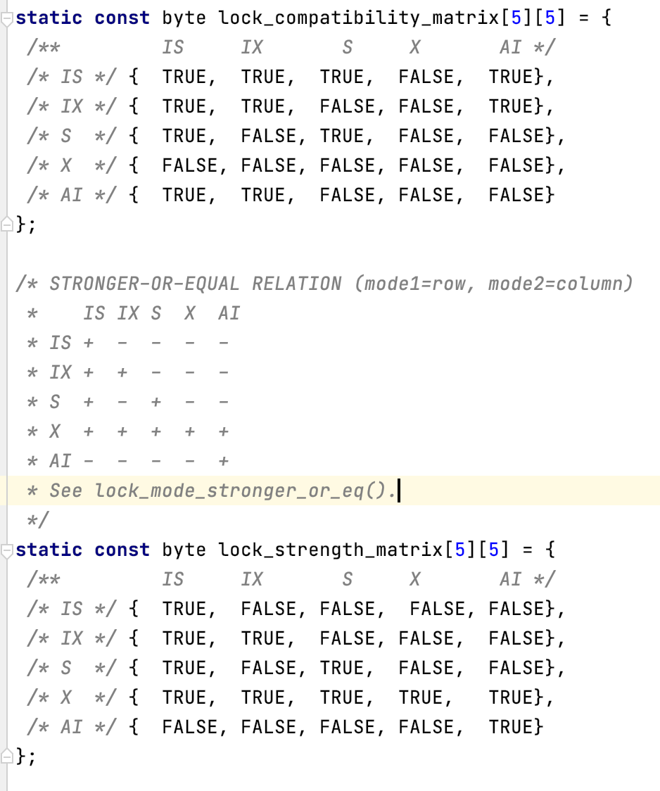
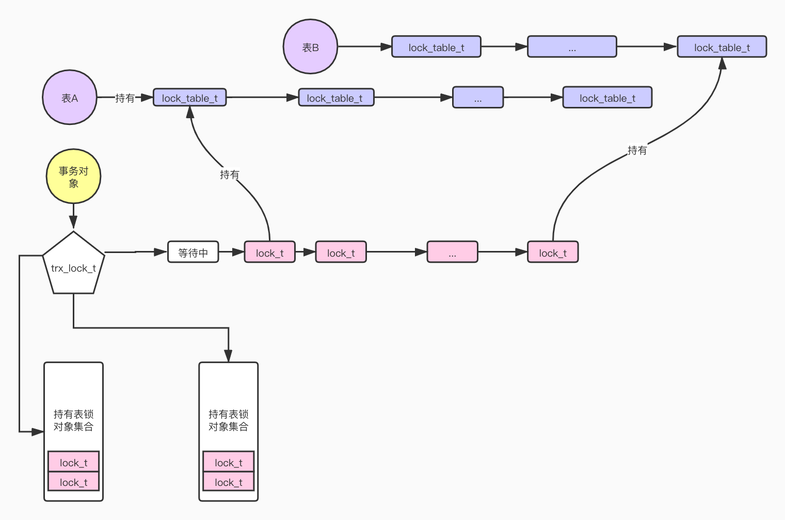
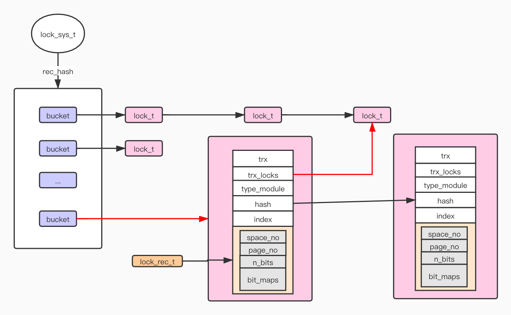
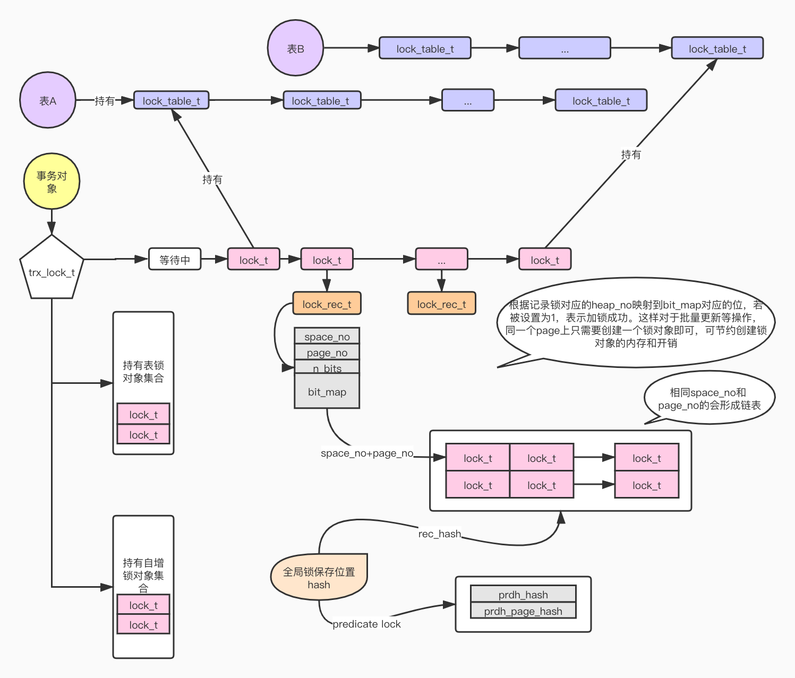
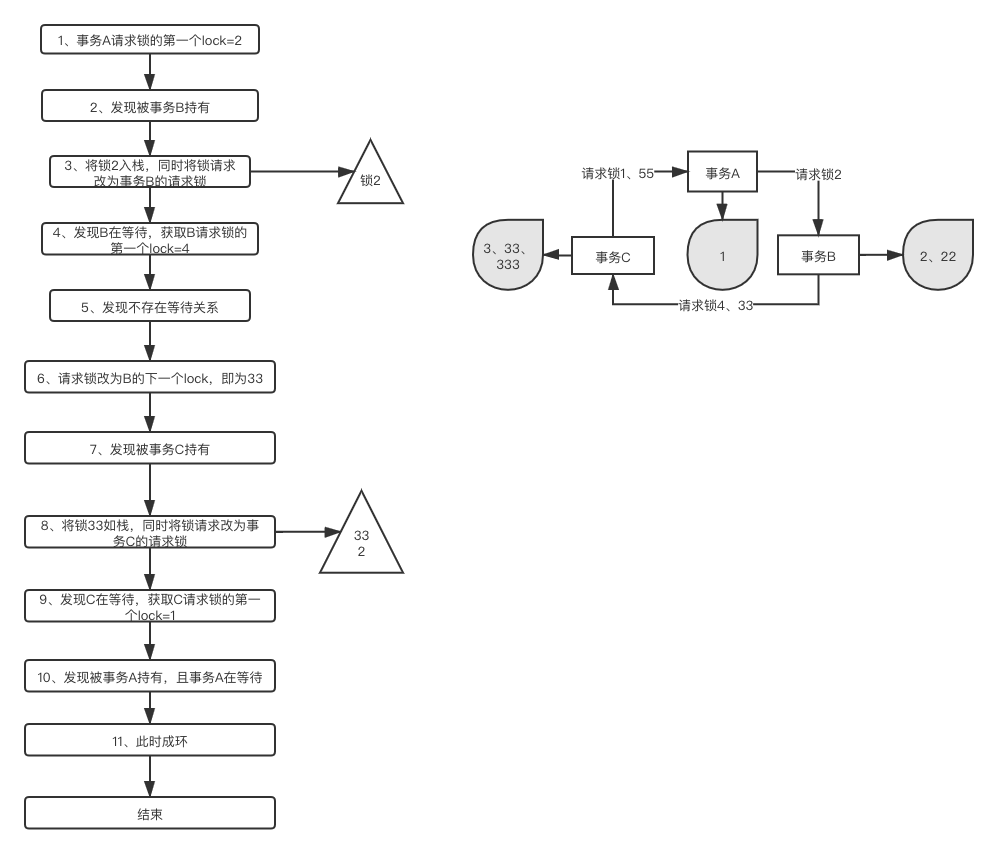
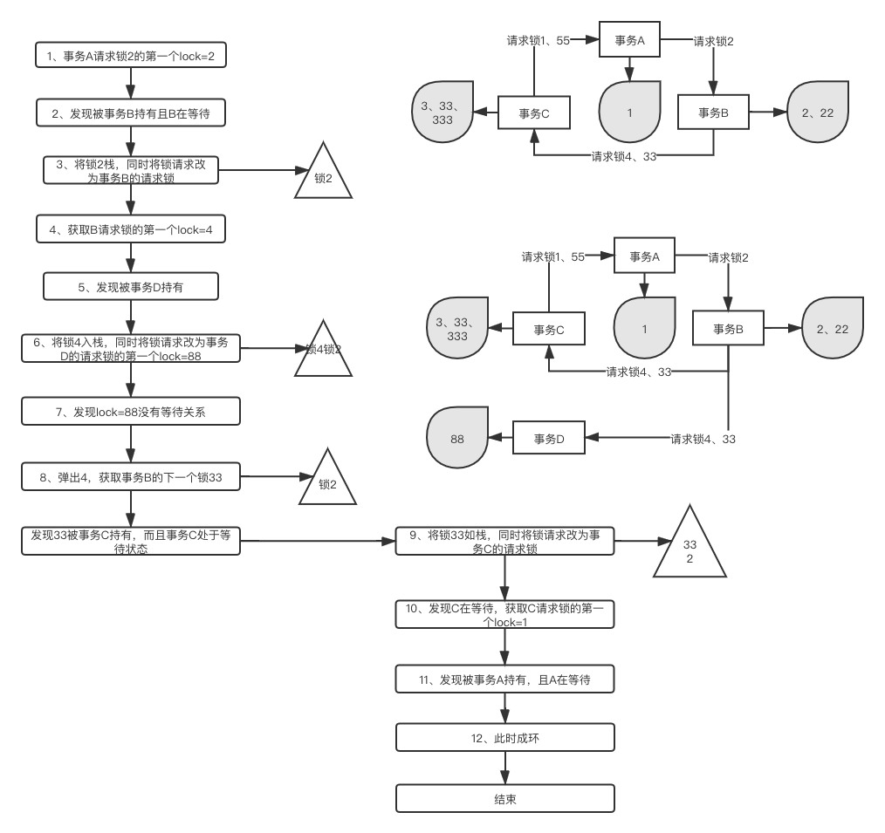

## 锁分类

### 表锁

一、读写锁
1.1读锁,也称共享锁，简称S锁
某个事务对某行或者某表加了读锁后，其他事务依然可以读取，但不能修改
可以同时有多个事务对某行或某表加读锁如：select ... lock in share mode

1.2 写锁，也成独占锁，排它锁，简称X锁
某个事务对某行或者某表加了写锁后，其他事务不能读取和修改记录
同一时刻，只能有一个事务对某行或某表加写锁 如：select ... for update

二、表锁、行锁
三、意向锁（表锁）,分为读意向锁（简称IS锁），以及写意向锁（简称IX锁）

#### 意向锁存在的意义？

当事务1对表中某条记录加了写锁，事务2想对整张表加写锁，就需要遍历整张表，判断是否有记录存在写锁，如果有的话，事务2需要等待事务1完成。
这种方式是非常低效的，所以Mysql引入意向锁解决此问题。事务1在对某条记录加写锁前，需要首先对表加IX锁。当事务2需要对表加写锁时，需要先判断表是否存在IX锁，如果有，则进行等待。

意向锁不会对行锁冲突，只会阻塞对全表的S锁或者X锁 

#### 表锁的兼容和强弱能力

大家可以参考源码：/mysql-server-mysql-5.7.20/storage/innobase/include/lock0priv.h

基本锁类型更强，就比如加了 LOCK_X 就不必要加 LOCK_S 了。lock_mode 基本锁类型之间的强弱关系使用 lock_strength_matrix 判断(lock_mode_stronger_or_eq) 

这个大家又个印象即可，但是其实它有很大的用处在加锁和加锁的过程中



### 行锁

#### 1、记录锁
记录锁定是对索引记录的锁定。例如， select id from t where id= 10 for update; 防止其它事务对id=10的删、改
记录锁针对：主键索引、唯一索引锁定单条记录时

#### 2、间隙锁
间隙锁（Gap Lock）锁定的是索引记录之间的间隙、第一个索引之前的间隙或者最后一个索引之后的间隙。例如，select * from t where id between 1 and 10 for update ;会阻止其他事务将 1 到 10 之间的任何值插入到 id字段中，即使该列不存在这样的数据；因为这些值都会被锁定。一般在RR隔离级别下会使用到GAP锁。

你可以通过切换到RC隔离级别，或者开启选项innodb_locks_unsafe_for_binlog来避免GAP锁。这时候只有在检查外键约束或者duplicate key检查时才会使用到GAP LOCK。

#### 3、next-key锁
锁住某条记录的同时，又阻止其他事务在该记录前面的间隙插入新纪录。（即record和gap锁的合体）

也就是所谓的 NEXT-KEY 锁，包含记录本身及记录之前的GAP。当前 MySQL 默认情况下使用RR的隔离假设索引包含值10、11、13和20。此索引的可能的下一键锁定涵盖以下间隔，其中，圆括号表示排除区间端点，方括号表示包括端点：
(negative infinity, 10]  (10, 11]  (11, 13] (13, 20] (20, positive infinity)
InnoDB对于行的锁都是采用了Next-Key Lock的算法，锁定的不是单个值，而是一个范围。但是，当查询的索引含有唯一属性的时候，Next-Key Lock 会进行优化，将其降级为Record Lock，即仅锁住索引本身，不是范围。

- **QA：如何理解Next-key锁对普通索引会锁住一个范围？**
  比如一个age字段是普通索引，现在有(1,5,10)三个值，如果select   ... for update age=5，结果会怎样？

答案：会把(1,10)整个区间都锁住

##### 为啥对普通索引的时候就是next-key锁，而主键或者唯一索引就是记录锁

1）因为锁是加在索引上的，也就是B+Tree，锁住的也就是树上的一个节点
2）主键或者唯一索引在树上的位置确定，所以锁住了就是锁住了
3）但是普通索引，虽然也是锁住了节点，但是由于普通索引可重复，所以可以有多个相同值的二级索引，所以即使锁住了，也不能阻止其它相同的索引记录插入进来

##### next-key锁的意义是什么？

或者说阻止其它事务对相关普通索引的插入、删除、修改有什么意义呢？

**意义：防止幻读**

防止幻读主要通过两种手段
幻读场景一、普通读：事务A两次select 读取到了事务B已提交的结果，即两次select结果不一致
解决方案：通过MVCC的方式解决幻读问题
但在RC的模式下，MVCC解决不了幻读和不可重复读，因为每次读都会读它自己刷新的快照版本，简单来说就是另一个事务提交，他就刷新一次，去读最新的

幻读场景二、当前读：update 、delete、select for update，会把已提交的数据进行修改，比如select的时候是3条，但是update的结果是4条

解决方案：用的是next-key锁的方式防止幻读

#### 4、插入意向锁

GAP锁的一种，并不属于意向锁（表），如果有多个session插入同一个GAP时，他们无需互相等待，例如当前索引上有记录4和8，两个并发session同时插入记录6，7。他们会分别为(4,8)加上GAP锁，但相互之间并不冲突（因为插入的记录不冲突）。——前提是没有对这个GAP加排他锁

##### 已经有了间隙锁了，插入意向锁的意义又是什么呢？

意义：是为了提高并发插入的性能。间隙锁不允许多个事务同时插入同一个索引间隙，但是插入意向锁允许多个事务同时插入同一个索引间隙内的不同数据值

#### 行锁间的兼容能力

|        | **Record** | **GAP** | **Next** | **II** |
| ------ | ---------- | ------- | -------- | ------ |
| Record |            | 兼容    |          | 兼容   |
| GAP    | 兼容       | 兼容    | 兼容     | 兼容   |
| Next   |            | 兼容    |          | 兼容   |
| II     | 兼容       |         |          | 兼容   |

## 锁结构

### 表锁构建

#### 表锁构建需要考虑的问题

1、每个表都要有一个等待队列
2、每个事务都要存储它自己具体锁了哪些锁对象
3、一个事务如何管理自己所持有锁的对象列表？
（因为一个事务可能有多个锁且涉及锁释放问题——链表）
4、如何判断新来一个事务的所是否需要等待？
       兼容性和强弱能力
5、等待的过程中会不会有死锁的问题？总不能一直等下去吧
	死锁检测机制

#### 锁表结构



可以看到锁对象会加入到不同的集合或者链表中，通过挂载到事务对象上，可以快速检查当前事务是否已经持有表锁；
通过挂到表对象的锁链表上，可以用于检查该表上的全局冲突情况。

### 行锁构建

#### 行锁构建需要考虑的问题

1、行锁是否有必要像表锁那样每个行记录维护一个锁队列？
	行记录本身就是不确定的
2、行锁是否需要为每个行锁都单独申请一个锁空间？
3、行锁如何快速查询和存储？

#### 行锁结构

这是一个行锁具体的结构




下图是行锁和表锁整个的一个结构





## 死锁分类

死锁是指两个或两个以上的进程（线程）在运行过程中因争夺资源而造成的一种僵局（Deadly-Embrace) ) ，若无外力作用，这些进程（线程）都将无法向前推进。

至少2个线程、一般至少2个资源才能形成死锁，当然一个资源也可以，下面有具体示例

四个条件：
互斥条件、不可剥夺条件、请求与保持条件、循环等待条件

  MySQL8.0查看和更改隔离级别

- 查看

```sql
mysql> select @@global.transaction_isolation,@@transaction_isolation;
+--------------------------------+-------------------------+
| @@global.transaction_isolation | @@transaction_isolation |
+--------------------------------+-------------------------+
| REPEATABLE-READ                | REPEATABLE-READ         |
+--------------------------------+-------------------------+
1 row in set (0.00 sec)

```

- 修改

```sql
mysql> set session transaction isolation level read uncommitted;
Query OK, 0 rows affected (0.00 sec)
## 查看
mysql>  select @@global.transaction_isolation,@@transaction_isolation;
+--------------------------------+-------------------------+
| @@global.transaction_isolation | @@transaction_isolation |
+--------------------------------+-------------------------+
| REPEATABLE-READ                | READ-UNCOMMITTED        |
+--------------------------------+-------------------------+
1 row in set (0.00 sec)


```


### 2个线程互相等待2个资源

这个是最常见的死锁代表

​	1、不同表相同记录行锁冲突——死锁

​	2、相同表记录行锁冲突——死锁

比如相同表不同的记录，id=8和id=9都是存在的

| Select  .. where id =8 for update | Select  .. where id =9 for update |
| --------------------------------- | --------------------------------- |
| Update where id=9                 |                                   |
|                                   | Update where id=8                 |
|                                   |                                   |

###  对于资源加锁是有顺序的导致的死锁
- 自增锁死锁

| 1    |                                                              | update log set msg='deadload'  where id =1000                |
| ---- | ------------------------------------------------------------ | ------------------------------------------------------------ |
| 2    | insert into user(email) select msg from log where id <10000 ; <br />// 会进入锁等待 |                                                              |
| 3    |                                                              | update log set msg='deadload'  where id =10 <br />// 直接报错deadlock |

死锁原因：

1、insert into  select from 在有索引的情况下，会一条一条记录的加锁，等到加到1000 的时候发现被其它事务占有则进入等待，对于扫描到的记录添加IS锁
2、事务B再次更新ID=10 的记录，发现被事务A占有，但是事务A在等待事务B，所以死锁了

- 还有一些in操作，一些范围操作

### 单个资源不同锁的兼容性导致的死锁
​	1、X和S锁不兼容导致的死锁

| 事务A                                                        | 事务B                                                        |
| ------------------------------------------------------------ | ------------------------------------------------------------ |
| start transaction ;  <br />select * from tt where id =2 lock in share mode ; <br />获取到S锁 | start transaction ; <br /> select * from tt where id =2 lock in share mode ; <br />获取到S锁 |
| delete from tt where id =2;<br /> blocking...由于要获取X锁，故要等待B的S锁 |                                                              |
|                                                              | delete from tt where id =2; 死锁                             |

### GAP锁兼容性导致的死锁


```sql
create table t3 (a int primary key ,b int);
insert into t3 values (1,2),(2,3),(3,4),(11,22);
```

| session 1                                                    | session 2                                                    |
| :----------------------------------------------------------- | :----------------------------------------------------------- |
| select * from t3 where id=22 for update;<br/>Empty set (0.00 sec) | select * from t3 where id=23  for update;<br/>Empty set (0.00 sec) |
| insert into t3 values(22,'ac','a',now());<br />锁等待.....   |                                                              |
|                                                              | insert into t3 values(23,'bc','b',now());<br />ERROR 1213 (40001): Deadlock found when trying to get lock; try restarting transaction |

原因：对于不存在的记录，会锁住一个GAP，这里锁住了（11,+∞）


### next-key锁区间导致的死锁
​	也是一种加锁顺序的问题，仔细看下面两个示例，一个死锁，一个不死锁

普通索引字段age存在记录：（1,5,10）

| 事务A                                                        | 事务B                                                 |
| ------------------------------------------------------------ | ----------------------------------------------------- |
| start transaction ; <br />select * from tt where age =5 for update;<br />对age=5，添加next-key锁（1，5],(5,10） | start transaction ; <br />                            |
|                                                              | select * from tt where age =5 for update;<br />锁等待 |
| insert into t (age) values (4);<br />插入成功                | 死锁                                                  |

- Next-key锁情况二

普通索引字段age存在记录：（1,5,10）

| 事务A                                                        | 事务B                                                 |
| ------------------------------------------------------------ | ----------------------------------------------------- |
| start transaction ; <br />select * from tt where age =5 for update;<br />对age=5，添加next-key锁（1，5],(5,10） | start transaction ; <br />                            |
|                                                              | select * from tt where age =5 for update;<br />锁等待 |
| insert into t (age) values (6);<br />插入成功                | 没有死锁                                              |

## 死锁发生后怎么办？
### 死锁检测机制

路径：/mysql-server-mysql-5.7.20/storage/innobase/lock/lock0lock.cc:RecLock::deadlock_check

- 1、死锁检测采用深度优先遍历的方式，通过事务对象上的trx_t::lock.wait_lock构造事务的wait-for graph进行判断，当最终发现一个锁请求等待闭环时，可以判定发生了死锁。
- 2、判断is_too_deep()    递归事务超过200 或者遍历锁的个数超过100万个
- 3、栈太长：栈中数据超过4096个

可以通过下面的两张图具体理解下

如下图，一个典型的成环图的死锁检测过程



如下图，在一个成环的图外边还有旁支节点




### 死锁牺牲机制

路径：/mysql-server-mysql-5.7.20/storage/innobase/lock/lock0lock.cc:select_victim

#### 牺牲过程

1、当发生死锁后，会选择一个代价较少的事务进行回滚操作，选择函数：lock_deadlock_select_victim(ctx)。
2、Innodb 中的 victim 选择比较粗暴，不论死锁链条有多长，只会在 ctx->start 和 ctx->wait_lock->trx 二者中选择其一。

#### 如何选择牺牲对象

具体的权重比较函数是 trx_weight_ge, 如果一个事务修改了不支持事务的表，那么认为它的权重较高，否则认为 undo log 数加持有的锁数之和较大的权重较高。

1、修改了非事务表的会话具有更高的权重；（LOW_PRIORITY）
通过执行命令SET LOW_PRIORITY_UPDATES=1,使该连接发出的更新请求优先级降低。

通过指定INSERT、UPDATE、DELETE语句的LOW_PRIORITY属性,降低该语句的优先级。
2、如果两个表都修改了、或者都没有修改事务表，那么就根据的事务的undo数量加上持有的事务锁个数来决定权值（TRX_WEIGHT）；低权重的事务被回滚，高权重的获得锁对象。


不过实际场景中，我们并没有多少机会去设置事务的优先级，这里先抛开这个话题，只考虑默认的场景，即所有的事务优先级都未设置。

