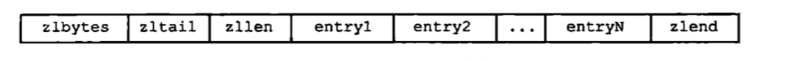

## redis 

- 缓存
- 分布式缓存
- 验证码过期时间，通过设置key的过期时间
- 积分排行榜zset
- 限流，限制IP次数，可以整合AOP+注解的方式
- 消息队列Rpush+lpop 或者blpop
- 分布式锁setnx
- 热门列表
- 限制登录次数
- 唯一登录。在系统登录成功后记录这个账号信息，如果此账号在其他地方又登录，就清除某个token信息

### redis使用规范

[阿里云Redis规范](https://developer.aliyun.com/article/531067)

其中需要注意的是：

**【建议】Redis事务功能较弱，不建议过多使用**

Redis的事务功能较弱(不支持回滚)，而且集群版本(自研和官方)要求一次事务操作的key必须在一个slot上(可以使用hashtag功能解决)

**【建议】Redis集群版本在使用Lua上有特殊要求：**

- 1.所有key都应该由 KEYS 数组来传递，redis.call/pcall 里面调用的redis命令，key的位置，必须是KEYS array, 否则直接返回error，"-ERR bad lua script for redis cluster, all the keys that the script uses should be passed using the KEYS arrayrn"
- 2.所有key，必须在1个slot上，否则直接返回error, "-ERR eval/evalsha command keys must in same slotrn"

### redis 线程模型

它采用 IO 多路复用机制同时监听多个 socket，会将 socket 产生的事件放入队列中排队，事件分派器每次从队列中取出一个事件，把该事件交给对应的事件处理器进行处理。

- 多个 socket
- IO 多路复用程序
- 文件事件分派器
- 事件处理器（连接应答处理器、命令请求处理器、命令回复处理器）


Redis 的线程模型就是典型的单reactor 单线程模型；

Redis 因为是从内存读取数据，所以任务耗时非常短，同时能减少线程切换带来损耗，这种线程模型，还能保证指令的顺序执行。

#### redis选中的是select还是epoll?

Redis的I/O多路复用程序的所有功能是通过包装select、epoll、evport和kqueue这些I/O多路复用函数库来实现的，每个I/O多路复用函数库在Redis源码中都对应一个单独的文件，比如ae_select.c、ae_epoll.c、ae_kqueue.c等。

因为Redis为每个I/O多路复用函数库都实现了相同的API，所以I/O多路复用程序的底层实现是可以互换的.
Redis在I/O多路复用程序的实现源码中用#include宏定义了相应的规则，程序会在编译时自动选择系统中性能最好的I/O多路复用函数库来作为Redis的I/O多路复用程序的底层实现


## redis数据结构

[推荐阅读](https://www.cnblogs.com/hunternet/p/9989771.html)

### SDS动态字符串

- 采用SDS的形式存储

```c++
struct sdshdr{
 int len;
 int free;
 char buf[];
}
```

- SDS的优点：
  - 计数直接用len O（1）的复杂度
  - 杜绝缓冲区溢出，因为C语言拼接的时候，如果第一个字符串空间不足，会导致缓冲区溢出，而redis拼接的时候先会去检查是否剩余的空间足够，不够则先扩展空间
  - 减少字符串分配内存次数
    - 通过空间预分配，也就是free的意义，记录当前预分配多少内存
    - 分配策略：
      1. 如果当前 SDS 的长度小于 1M, 那么分配等于已占用空间的未使用空间，即让 free 等于 len.
      2. 如果当前 SDS 的长度大于 1M, 那么分配 1M 的 free 空间。
    - 所以修改的时候，先判断free是否充足，如果充足，直接拼接
    - 缩短字符串的时候，惰性释放内存，其实也就是不着急释放，以防下次增长使用


字符串类型的值实际可以是字符串（简单的字符串、复杂的字符串（例如JSON、XML））、数字（整数、浮点数），甚至是二进制（图片、音频、视频），但是值最大不能超过512MB。

```
int 8个字节的长整型
embstr <=39字节的字符串
raw    >39 字节的字符串
```

string hash list set zset(有序)

HyperLogLog Pub/Sub BloomFilter

### linkedList链表

redis的链表结构

```c
typedef struct list {
  // 表头结点
  listNode *head;
  // 表尾节点
  listNode *tail;
  // 链表所包含的节点数量
  unsigned long len;
  // 其他函数
  ...
}list;

```

链表的每个节点结构

```c
typedef struct listNode{
  // 前置节点
  struct listNode *prev;
  // 后置节点
  struct listNode *next;
  // 节点的值
  void *value;
}listNode

```

最终效果如图：


特点：双向链表、无环，带有头节点和尾节点、直接能获取长度

### ziplist压缩链表

`zsetkey 和hash`的 zset 内部使用的编码方法其中之一就是 **ziplist**.

为啥说之一，因为当有序集合或哈希的元素数目比较少，且元素都是短字符串时，Redis才使用压缩列表作为其底层数据存储方式

```c
> zadd zsetkey 1.0 a 2.0 b 3.0 c
3
> debug object zsetkey
Value at:0x7fb585166d40 refcount:1 encoding:ziplist serializedlength:36 lru:11299423 lru_seconds_idle:8
> hmset person name zhangsan gender 1 age 22
OK
> object encoding person
ziplist   
```

ziplist的结构

```java
struct ziplist<T>{
    // 整个压缩列表占用字节数
    int32 zlbytes;
    // 最后一个节点到压缩列表起始位置的偏移量，可以用来快速的定位到压缩列表中的最后一个元素
    int32 zltail_offset;
    // 压缩列表包含的元素个数
    int16 zllength;
    // 元素内容列表，用数组存储，内存上紧挨着
    T[] entries;
    // 压缩列表的结束标志位，值永远为 0xFF.
    int8 zlend;
}

```

压缩列表的每一个节点的定义为：

```c
struct entry{
    // 前一个 entry 的长度
    int<var> prevlous_entry_length;
    // 编码方式
    int<vat> encoding;
    // 内容
    optional bute[] content;
}

```

最终结构如图




#### ziplist存在的意义？

- 列表数据结构，我们已经有了链表，为什么还需要重新搞一个压缩列表呢？**为了节省内存**
  - 链表的前后指针是一个非常耗费内存的结构，因此在数据量小的时候，这一部分的空间尤其显得浪费。

具体ziplist相关的请参考：https://segmentfault.com/a/1190000017328042

#### ziplist如何遍历？

1、从链表尾部遍历反向遍历，因为ziplist有一个尾部节点偏移量zltail_offset属性，我们就能拿到尾部节点

2、拿到了尾部节点之后如何遍历其它节点

3、有了尾部节点调用当前节点的`prevlous_entry_length`属性，就可以拿到前一个节点，然后不断向前遍历了。

### quickList快速链表

在 3.0 版本的 Redis 中，List 类型有两种实现方式：linkedList、ziplist

在 3.2 版本后新增了 **quicklist** 数据结构实现了 list

```c
> rpush listkey go py java
6
> debug object listkey
Value at:0x7fb58146b8a0 refcount:1 encoding:quicklist serializedlength:36 lru:11301577 lru_seconds_idle:8 ql_nodes:1 ql_avg_node:6.00 ql_ziplist_max:-2 ql_compressed:0 ql_uncompressed_size:34
```

不再阐述代码结构，只说明为啥要用quick List


#### 为啥引入quickList?

- LinkedList优缺点
  - 双端链表便于在表的两端进行 push 和 pop 操作，但是它的内存开销比较大；
  - 双端链表每个节点上除了要保存数据之外，还要额外保存两个指针；
  - 双端链表的各个节点是单独的内存块，地址不连续，节点多了容易产生内存碎片；
- ziplist优缺点
  - ziplist 由于是一整块连续内存，所以存储效率很高；
  - ziplist 不利于修改操作，每次数据变动都会引发一次内存的 重新分配内存空间realloc；
  - 当 ziplist 长度很长的时候，一次 realloc 可能会导致大批量的数据拷贝，进一步降低性能；


quicklist 是一个双向链表，并且是一个 ziplist 的双向链表，也就是说 quicklist 的每个节点都是一个 ziplist。而通过前面的文章咱们可以知道，ziplist 本身也是一个能维持数据项先后顺序的列表，而且数据项保存在一个连续的内存块中。意味着 quicklist 结合了压缩列表和双端链表的特点，是一个平衡了时间和空间的折中方案

### IntSet整数集合

- 当一个集合只包含整数元素且数量不多的时候就会用intset

- 可以保存int16_、int32_、int64不同类型的整数，并且保证不重复

```java
> sadd numbers 1 2 3 4 5
5
> debug object numbers
Value at:0x7f3e7eedf380 refcount:1 encoding:intset serializedlength:19 lru:11301716 lru_seconds_idle:15
```

结构如下：

```java
//每个intset结构表示一个整数集合
typedef struct intset{
    //编码方式
    uint32_t encoding;
    //集合中包含的元素数量
    uint32_t length;
    //保存元素的数组
    int8_t contents[];
} intset;
```

如下图就是存储int16的结构，按照从小到大排列


#### inset升级

如上图是存储一个int16的结构，如果来了一个int32结构的数字怎么办？

1. 修改encoding为int32
2. 扩展空间大小，为新的int32数字新建内存空间
3. 把原来int16的数字格式全部转为int32,放入新的位置上，保持有序性
4. 把新元素放到指定位置上

但是intset不支持降级

### Dict字典

当我给一个 哈希结构中放了两个短的值，此时 哈希的编码方式是 **ziplist**, 而当我插入一个比较长的值，哈希的编码方式成为了 **hashtable**.

```c
> hset myHashKey desc ahsdaksdhasdguiykeqiuwkebsdhjajsdkajsbansdbashdajhsdjansdakjsdajsdahvj
1
> debug object myHashKey
Value at:0x7f29c35ffb00 refcount:1 encoding:hashtable serializedlength:98 lru:11314525 lru_seconds_idle:2
```

```c#
> hset myHashKey2  name xiaoming
1
> debug object myHashKey2
Value at:0x7fb58146b490 refcount:1 encoding:ziplist serializedlength:28 lru:11314600 lru_seconds_idle:11
```

Redis 的哈希表处理 Hash 冲突的方式和 Java7 中的 HashMap 一样，没有红黑树，选择了分桶的方式，也就是常说的链地址法。Hash 表有两维，第一维度是个数组，第二维度是个链表，当发生了 Hash 冲突的时候，将冲突的节点使用链表连接起来，放在同一个桶内。

由于第二维度是链表，我们都知道链表的查找效率相比于数组的查找效率是比较差的。那么如果 hash 冲突比较严重，导致单个链表过长，那么此时 hash 表的查询效率就会急速下降。

#### Dict代码结构

- 字典结构

```java
typedef struct dict{
  // 类型特定函数
  dictType *type;
  // 私有数据
  void *private;
  // 哈希表
  dictht ht[2];
  // rehash 索引，当当前的字典不在 rehash 时，值为-1
  int trehashidx;
}
```

- hash表结构

```java
typedef struct dictht{
  // 哈希表的数组
  dictEntry **table;
  // 哈希表的大小
  unsigned long size;
  // 哈希表的大小的掩码，用于计算索引值，总是等于 size-1
  unsigned long sizemasky;
  // 哈希表中已有的节点数量
  unsigned long used;
}
```

- 每个节点的结构

```java
typedef struct dictEntry{
  // 键
  void *key;
  // 值
  union {
    void *val;
    uint64_tu64;
    int64_ts64;
  }v;

  // 指向下一个节点的指针
  struct dictEntry *next;
} dictEntry;

```

- 结构图


#### 为啥字典有两个hash表？

上图是一个没有处在 rehash 状态下的字典。可以看到，字典持有两张哈希表，其中一个的值为 null, 另外一个哈希表的 size=4, 其中两个位置上已经存放了具体的键值对，而且没有发生 hash 冲突。

至于为啥要用两个hash表，其实和Redis处理扩容和缩容的方式有关

####  Dict如何扩容、缩容？

dict扩容也是要了解一个hash中的填充程度，所以也是根据负载因子决定的

负载因子是用来描述哈希表当前被填充的程度。计算公式是：负载因子=哈希表以保存节点数量 / 哈希表的大小.

在 Redis 的实现里，扩容缩容有三条规则：

- 当 Redis 没有进行 BGSAVE 相关操作，且 负载因子>1的时候进行扩容。
- 当负载因子>5的时候，强行进行扩容。
- 当负载因子<0.1的时候，进行缩容。

根据程序当前是否在进行 BGSAVE 相关操作，扩容需要的负载因子条件不相同。

这是因为在进行 BGSAVE 操作时，存在子进程，操作系统会使用 写时复制 (Copy On Write) 来优化子进程的效率。Redis 尽量避免在存在子进程的时候进行扩容，尽量的节省内存。


熟悉 hash 表的读者们应该知道，扩容期间涉及到到 rehash 的问题。

因为需要将当前的所有节点挪到一个大小不一致的哈希表中，且需要尽量保持均匀，因此需要将当前哈希表中的所有节点，重新进行一次 hash. 也就是 rehash.

#### Dict如何进行rehash?

在 Java 的 HashMap 中，实现方式是 新建一个哈希表，一次性的将当前所有节点 rehash 完成，之后释放掉原有的 hash 表，而持有新的表。

而 Redis 不是，Redis 使用了一种名为渐进式 hash 的方式来满足自己的性能需求。

rehash 需要重新定位所有的元素，这是一个 O(N) 效率的问题，当对数据量很大的字典进行这一操作的时候，比较耗时。

对于单线程的 Redis 来说，表示很难接受这样的延时，因此 Redis 选择使用 一点一点搬的策略。

Redis渐近式hash过程如下：

- 假如当前数据在 ht[0] 中，那么首先为 ht[1] 分配足够的空间。
- 在字典中维护一个变量，rehashindex = 0. 用来指示当前 rehash 的进度。
- 在 rehash 期间，每次对 字典进行 增删改查操作，在完成实际操作之后，都会进行 一次 rehash 操作，将 ht[0] 在`rehashindex` 位置上的值 rehash 到 ht[1] 上。将 rehashindex 递增一位。
- 随着不断的执行，原来的 ht[0] 上的数值总会全部 rehash 完成，此时结束 rehash 过程。 将 rehashindex 置为-1.

在上面的过程中有两个问题没有提到：

**假如这个服务器很空余呢？中间几小时都没有请求进来，那么同时保持两个 table, 岂不是很浪费内存？**
解决办法是：在 redis 的定时函数里，也加入帮助 rehash 的操作，这样子如果服务器空闲，就会比较快的完成 rehash.

**在保持两个 table 期间，该哈希表怎么对外提供服务呢？**
解决办法：对于添加操作，直接添加到 ht[1] 上，因此这样才能保证 ht[0] 的数量只会减少不会增加，才能保证 rehash 过程可以完结。而删除，修改，查询等操作会在 ht[0] 上进行，如果得不到结果，会去 ht[1] 再执行一遍。

 #### 渐近式hash优缺点

渐进式 hash 带来的好处是显而易见的，他采用了分而治之的思想，将 rehash 操作分散到每一个对该哈希表的操作上以及定时函数上，避免了集中式 rehash 带来的性能压力。

与此同时，渐进式 hash 也带来了一个问题，那就是 在 rehash 的时间内，需要保存两个 hash 表，对内存的占用稍大，而且如果在 redis 服务器本来内存满了的时候，突然进行 rehash 会造成大量的 key 被抛弃。

 #### 缩容的时候会考虑bgsave问题吗？

扩容时考虑 BGSAVE 是因为，扩容需要申请额外的很多内存，且会重新链接链表（如果会冲突的话）, 这样会造成很多内存碎片，也会占用更多的内存，造成系统的压力。

而缩容过程中，由于申请的内存比较小，同时会释放掉一些已经使用的内存，不会增大系统的压力。因此不用考虑是否在进行 BGSAVE 操作。

 ### skiplist跳跃表


  上图展示了一个跳跃表示例,其中最左边的是 skiplist结构,该结构包含以下属性。

- header:指向跳跃表的表头节点，通过这个指针程序定位表头节点的时间复杂度就为O(1)

- tail:指向跳跃表的表尾节点,通过这个指针程序定位表尾节点的时间复杂度就为O(1)

- level:记录目前跳跃表内,层数最大的那个节点的层数(表头节点的层数不计算在内)，通过这个属性可以再O(1)的时间复杂度内获取层高最好的节点的层数。

- length:记录跳跃表的长度,也即是,跳跃表目前包含节点的数量(表头节点不计算在内)，通过这个属性，程序可以再O(1)的时间复杂度内返回跳跃表的长度。

  结构右方的是四个 zskiplistNode结构,该结构包含以下属性

- 层(level):

    节点中用1、2、L3等字样标记节点的各个层,L1代表第一层,L代表第二层,以此类推。

    每个层都带有两个属性:前进指针和跨度。

  - 前进指针：用于访问位于表尾方向的其他节点,而跨度则记录了前进指针所指向节点和当前节点的距离(跨度越大、距离越远)。

  - 跨度：在上图中,连线上带有数字的箭头就代表前进指针,而那个数字就是跨度。当程序从表头向表尾进行遍历时,访问会沿着层的前进指针进行。

  - BW后退指针

  - 分值(score):

      各个节点中的1.0、2.0和3.0是节点所保存的分值。在跳跃表中,节点按各自所保存的分值从小到大排列。

  - 成员对象(oj):

      各个节点中的o1、o2和o3是节点所保存的成员对象。在同一个跳跃表中,各个节点保存的成员对象必须是唯一的,但是多个节点保存的分值却可以是相同的:分值相


#### 如何访问数据？

类似2分查询

#### 排名问题

前面提到了 `跨度` 这个属性，当我们需要查找某个元素的排名时，跳跃表首先开始一次查询过程，找到该节点时，也可以找到从顶层索引找到该节点的 **查找路径**, 将 路径上的所有节点的 **跨度** 值相加就是该节点的排名。

#### 跳跃表总结

- 跳跃表基于单链表加索引的方式实现
  - 比如100条数据，加一层50个，再加一层10个，再加一层3个，最终效果就是Olog(n)
  - 达到一种类似二分效果的目的
- 跳跃表以空间换时间的方式提升了查找速度
- Redis有序集合在节点元素较大或者元素数量较多时使用跳跃表实现
- Redis的跳跃表实现由 zskiplist和 zskiplistnode两个结构组成,其中 zskiplist用于保存跳跃表信息(比如表头节点、表尾节点、长度),而zskiplistnode则用于表示跳跃表节点
- Redis每个跳跃表节点的层高都是1至32之间的随机数
- 在同一个跳跃表中,多个节点可以包含相同的分值,但每个节点的成员对象必须是唯一的跳跃表中的节点按照分值大小进行排序,当分值相同时,节点按照成员对象的大小进行排序。

### 数据结构总结

| 数据类型 | 结构                                                      |
| -------- | --------------------------------------------------------- |
| String   | SDS——int、raw、embstr                                     |
| List     | 之前是 ziplist 和 linkedlist, 现在全是 quicklist 了       |
| set      | intset 或者 hashtable                                     |
| Zset     | ziplist 或者 `skiplist`, skiplist 编码中使用了跳跃表+字典 |
| hash     | ziplist 或者 hashtable                                    |


### [过期时间](http://www.redis.cn/commands/expire.html)

如果假设你设置了一批 key 只能存活1个小时，那么接下来1小时后，我们如何把该key删除呢

方案一：我们首先想到为每个key都设置一个定时器，到了时间就把该key删除，但是这样为每一个都设置一个定时器，这种策略对内存很友好，但是对 `CPU` 不友好，因为每个定时器都会占用一定的 `CPU` 资源。

方案二：惰性删除：每次获取的时候判断过期才去删除，这种策略对内存不够友好，可能会浪费很多内存。

方案三：定期扫描删除：系统每隔一段时间就定期扫描一次，发现过期的键就进行删除，这个扫描的时间间隔要去控制，不能太频繁，也不能长时间不扫描

那redis是怎么对这批key进行删除的？redis选用的是方案二和方案三

**定期删除+惰性删除。**

通过名字大概就能猜出这两个删除方式的意思了。

- **定期删除**：redis默认是每隔 100ms 就**随机抽取**一些设置了过期时间的key，检查其是否过期，如果过期就删除。注意这里是随机抽取的。为什么要随机呢？你想一想假如 redis 存了几十万个 key ，每隔100ms就遍历所有的设置过期时间的 key 的话，就会给 CPU 带来很大的负载！

  - 这些过期的key，其实存在一个特殊的区域，redis不用全盘扫描，只要扫描特定的这个区域即可，这个区域就是过期key所在的内存

  -  `Redis`的定期扫描只会扫描设置了过期时间的键，因为设置了过期时间的键 `Redis`会单独存储，所以不会出现扫描所有键的情况

  - ```c++
    
    typedef struct redisDb {
        dict *dict; //所有的键值对
        dict *expires; //设置了过期时间的键值对
       dict *blocking_keys; //被阻塞的key,如客户端执行BLPOP等阻塞指令时
       dict *watched_keys; //WATCHED keys
       int id; //Database ID
       //... 省略了其他属性
    } redisDb;
    ```

    

- 定期删除官方版本介绍：[官网](http://www.redis.cn/commands/expire.html)

  具体就是Redis每秒10次做的事情：也就是每隔100毫秒

  1. 测试随机的20个keys进行相关过期检测。
  2. 删除所有已经过期的keys。
  3. 如果有多于25%的keys过期，重复步奏1.

  这是一个平凡的概率算法，基本上的假设是，我们的样本是这个密钥控件，并且我们不断重复过期检测，直到过期的keys的百分百低于25%,这意味着，在任何给定的时刻，最多会清除1/4的过期keys。

- **惰性删除** ：定期删除可能会导致很多过期 key 到了时间并没有被删除掉。所以就有了惰性删除。假如你的过期 key，靠定期删除没有被删除掉，还停留在内存里，除非你的系统去查一下那个 key，才会被redis给删除掉。这就是所谓的惰性删除，也是够懒的哈！

- 但是仅仅通过设置过期时间还是有问题的。我们想一下：如果定期删除漏掉了很多过期 key，然后你也没及时去查，也就没走惰性删除，此时会怎么样？如果大量过期key堆积在内存里，导致redis内存块耗尽了。怎么解决这个问题呢？ **redis 内存淘汰机制。**


### redis内存淘汰机制

- FIFO

先进先出first in first out

- LRU

Least Recently Used 

挑选最新最不经常使用的key进行淘汰

- TTL

Time To Live

挑选即将过期的key进行淘汰

- random

随机

- lfu

  Least frequently used

  挑选被访问次数最少的进行淘汰


**redis 提供 6种数据淘汰策略：**

1. **volatile-lru**：从已设置过期时间的数据集（server.db[i].expires）中挑选最近最少使用的数据淘汰
2. **volatile-ttl**：从已设置过期时间的数据集（server.db[i].expires）中挑选将要过期的数据淘汰
3. **volatile-random**：从已设置过期时间的数据集（server.db[i].expires）中任意选择数据淘汰
4. **allkeys-lru**：当内存不足以容纳新写入数据时，在键空间中，移除最近最少使用的key（这个是最常用的）
5. **allkeys-random**：从数据集（server.db[i].dict）中任意选择数据淘汰
6. **no-eviction**：禁止驱逐数据，也就是说当内存不足以容纳新写入数据时，新写入操作会报错。这个应该没人使用吧！

4.0版本后增加以下两种：

1. **volatile-lfu**：从已设置过期时间的数据集(server.db[i].expires)中挑选最不经常使用的数据淘汰
2. **allkeys-lfu**：当内存不足以容纳新写入数据时，在键空间中，移除最不经常使用的key


#### Redis 改进后的 LRU 算法

在 `Redis` 当中，并没有采用传统的 `LRU` 算法，因为传统的 `LRU` 算法存在 `2` 个问题：

- 需要额外的空间进行存储,比如Java的双向链表。
- 可能存在某些 `key` 值使用很频繁，但是最近没被使用，从而被 `LRU` 算法删除。

为了避免以上 `2` 个问题，`Redis` 当中对传统的 `LRU` 算法进行了改造，**通过抽样的方式进行删除**。

配置文件中提供了一个属性 `maxmemory_samples 5`，默认值就是 `5`，表示随机抽取 `5` 个 `key` 值，然后对这 `5` 个 `key` 值按照 `LRU` 算法进行删除，所以很明显，`key` 值越大，删除的准确度越高。

另外：`Redis`3.0之后又改善了算法的性能，会提供一个待淘汰候选key的`pool`，里面默认有16个key，按照空闲时间排好序。更新时从`Redis`键空间随机选择N个key，分别计算它们的空闲时间`idle`，key只会在`pool`不满或者空闲时间大于`pool`里最小的时，才会进入`pool`，然后从`pool`中选择空闲时间最大的key淘汰掉。

#### LRU管理热点数据

redis 的结构如下：

```c++
typedef struct redisObject {
    unsigned type:4;//对象类型（4位=0.5字节）
    unsigned encoding:4;//编码（4位=0.5字节）
    unsigned lru:LRU_BITS;//记录对象最后一次被应用程序访问的时间（24位=3字节）
    int refcount;//引用计数。等于0时表示可以被垃圾回收（32位=4字节）
    void *ptr;//指向底层实际的数据存储结构，如：SDS等(8字节)
} robj;
```

`lru` 属性是创建对象的时候写入，对象被访问到时也会进行更新。正常人的思路就是最后决定要不要删除某一个键肯定是用当前时间戳减去 `lru`，差值最大的就优先被删除。但是 `Redis` 里面并不是这么做的，`Redis` 中维护了一个全局属性 `lru_clock`，这个属性是通过一个全局函数 `serverCron` 每隔 `100` 毫秒执行一次来更新的，记录的是当前 `unix` 时间戳。

最后决定删除的数据是通过 `lru_clock` 减去对象的 `lru` 属性而得出的。那么为什么 `Redis` 要这么做呢？直接取全局时间不是更准确吗？

这是因为这么做可以避免每次更新对象的 `lru` 属性的时候可以直接取全局属性，而不需要去调用系统函数来获取系统时间，从而提升效率（`Redis` 当中有很多这种细节考虑来提升性能，可以说是对性能尽可能的优化到极致）。

不过这里还有一个问题，我们看到，`redisObject` 对象中的 `lru` 属性只有 `24` 位，`24` 位只能存储 `194` 天的时间戳大小，一旦超过 `194` 天之后就会重新从 `0` 开始计算，所以这时候就可能会出现 `redisObject` 对象中的 `lru` 属性大于全局的 `lru_clock` 属性的情况。

正因为如此，所以计算的时候也需要分为 `2` 种情况：

- 当全局 `lruclock` > `lru`，则使用 `lruclock` - `lru` 得到空闲时间。
- 当全局 `lruclock` < `lru`，则使用 `lruclock_max`（即 `194` 天） - `lru`+ `lruclock` 得到空闲时间。

需要注意的是，这种计算方式并不能保证抽样的数据中一定能删除空闲时间最长的。这是因为首先超过 `194` 天还不被使用的情况很少，再次只有 `lruclock` 第 `2` 轮继续超过 `lru` 属性时，计算才会出问题。

比如对象 `A` 记录的 `lru` 是 `1` 天，而 `lruclock` 第二轮都到 `10` 天了，这时候就会导致计算结果只有 `10-1=9` 天，实际上应该是 `194+10-1=203`天。但是这种情况可以说又是更少发生，所以说这种处理方式是可能存在删除不准确的情况，但是本身这种算法就是一种近似的算法，所以并不会有太大影响。

#### LFU管理热点数据

`LFU` 全称为：`Least Frequently Used`。即：最近最少频率使用，这个主要针对的是使用频率。这个属性也是记录在`redisObject` 中的 `lru` 属性内。

当我们采用 `LFU` 回收策略时，`lru` 属性的高 `16` 位用来记录访问时间（last decrement time：ldt，单位为分钟），低 `8` 位用来记录访问频率（logistic counter：logc），简称 `counter`。

`LFU` 计数器每个键只有 `8` 位，它能表示的最大值是 `255`，所以 `Redis`使用的是一种基于概率的对数器来实现 `counter` 的递增。

- 频次增加

给定一个旧的访问频次，当一个键被访问时，`counter` 按以下方式递增：

1. 提取 `0` 和 `1` 之间的随机数 `R`。
2. `counter` - 初始值（默认为 `5`），得到一个基础差值，如果这个差值小于 `0`，则直接取 `0`，为了方便计算，把这个差值记为 `baseval`。
3. 概率 `P` 计算公式为：`1/(baseval * lfu_log_factor + 1)`。
4. 如果 `R < P` 时，频次进行递增（`counter++`）。

公式中的 `lfu_log_factor` 称之为对数因子，默认是 `10` ，可以通过参数来进行控制：

```c++
lfu_log_factor 10
```


当对数因子 `lfu_log_factor` 为 `100` 时，大概是 `10M（1000万）` 次访问才会将访问 `counter` 增长到 `255`，而默认的 `10` 也能支持到 `1M（100万）` 次访问 `counter` 才能达到 `255` 上限，这在大部分场景都是足够满足需求的。

- 频次减少

如果访问频次 `counter` 只是一直在递增，那么迟早会全部都到 `255`，也就是说 `counter` 一直递增不能完全反应一个 `key` 的热度的，所以当某一个 `key` 一段时间不被访问之后，`counter` 也需要对应减少。

`counter` 的减少速度由参数 `lfu-decay-time` 进行控制，默认是 `1`，单位是分钟。默认值 `1` 表示：`N` 分钟内没有访问，`counter` 就要减 `N`。

```c++
lfu-decay-time 1
```

具体算法如下：

1. 获取当前时间戳，转化为**分钟**后取低 `16` 位（为了方便后续计算，这个值记为 `now`）。
2. 取出对象内的 `lru` 属性中的高 `16` 位（为了方便后续计算，这个值记为 `ldt`）。
3. 当 `lru` > `now` 时，默认为过了一个周期（`16` 位，最大 `65535`)，则取差值 `65535-ldt+now`：当 `lru` <= `now` 时，取差值 `now-ldt`（为了方便后续计算，这个差值记为 `idle_time`）。
4. 取出配置文件中的 `lfu_decay_time` 值，然后计算：`idle_time / lfu_decay_time`（为了方便后续计算，这个值记为`num_periods`）。
5. 最后将`counter`减少：`counter - num_periods`。

看起来这么复杂，其实计算公式就是一句话：取出当前的时间戳和对象中的 `lru` 属性进行对比，计算出当前多久没有被访问到，比如计算得到的结果是 `100` 分钟没有被访问，然后再去除配置参数 `lfu_decay_time`，如果这个配置默认为 `1`也即是 `100/1=100`，代表 `100` 分钟没访问，所以 `counter` 就减少 `100`。

### HyperLogLog

作用：当统计不同的id个数的时候，我们可以用set进行存储，然后count但是这样如果有几千万数据的时候占用特别大的内存空间，而HyperLogLog最多占用12K的空间，就能统计2^64个不同的元素

- 算法思想

HyperLogLog算法的基础是概率问题，比如连续抛出8次反面硬币的概率是1/2^8

 因此，从概率论上来说，假如每一轮抛硬币的结果都不一样，我们最多尝试2^k轮就能抛出连续反面的情况。

HyperLogLog算法也是基于上面这个概率论知识，他认为：**给定一系列的随机整数，我们可以通过这些随机整数的低位连续零位的最大长度 k，估算出随机数的数量**，估算的公式为：n=2^k（n为随机数数量）。

- 算法问题

因为这种概率问题其实还有很大的误差的，所以我们引入调和平均函数

所谓调和平均，其实就是倒数的平均：

```
普通平均：avg=(1+2+3+4)/4

调和平均：avg=4/(1/1+1/2+1/3+1/4)
```

为什么调和平均能降低特例带来的误差呢？我们举个栗子来说明：

假如小猿月薪1000大洋，他老板月薪10000大洋，如果按传统的方法来算平均工资，平均月薪=(1000+10000)/2=5500，这对小猿来说会很不公，“为什么我会这么严重地拉低平均工资？ 不行，我要回农村”，小猿如是想。

如果用调和平均来算，平均月薪=2/(1/1000+1/10000)=1818.18，小猿会觉得他也没拉低平均工资多少，努力一把就上去了，这样他会继续留在城里打拼，走上人生巅峰，迎娶白富美。

从上述例子可以看出：**调和平均算法总是偏向低的一方。**

 假如我只尝试了两个不同的数，它们的二进制分别为“00010”和“10000”，用普通求平均数算法估算出我们出尝试了2^4 =16个不同的数，但用调和平均算法估算出我们尝试了2^(2/(1/1+1/4)) =2^1.6=3个不同的数，因此使用调和平均的算法更贴近实际值。

 #### redis实现的HyperLogLog

Redis在去重计算时怎么和HyperLogLog算法联系起来呢？这个问题我（小菜鸟）思考了好久。

当在Redis中添加（pfadd命令）一个计数元素时，这个元素会被散列到某个桶中，它就相当于上述代码中的随机数，最终我们可以通过pfcount命令获取去重之后的随机数个数。

当统计元素很少时，使用12k太浪费空间了，Redis针对这个问题做了一些优化。在计数比较小时，Redis使用稀疏矩阵存储，空间占用很小，仅仅在计数慢慢变大后，稀疏矩阵占用空间渐渐超过了阈值时才会一次性转变成稠密矩阵，占用 12k的空间。这就是为什么说Redis最多占用12的内存了。

那么这12k的空间是怎么分配给每个桶的呢？Redis的HyperLogLog实现中用到了2^14 =16384个桶，每个桶占6bit，因此总共占用内存就是2^14*6/8=12k字节。

 

### 布隆过滤器

原理：通过多个hash函数算出不同的hash值，然后把hash值对应位置设置为1

查询的时候：还是根据算出的不同hash值，判断对应位置是否为1即可

- 期望插入的值的个数和错误率

```java
BloomFilter<String> stringBloomFilter =
   BloomFilter.create(Funnels.stringFunnel(Charset.forName("utf-8")), 1000, 0.001);
```

比hashMap更节省空间

理论上存一百万个数，一个int是4字节32位，需要4*8*1000000=3200万位。如果使用HashMap去存，按HashMap50%的存储效率，需要6400万位。可以看出BloomFilter的存储空间很小，只有HashMap的1/10左右

而Bloom Filter只需要哈希表 1/8到 1/4 的大小就能解决同样的问题。

### redis 缓存击穿、穿透

缓存穿透：在高并发下，查询一个不存在的值时，缓存不会被命中，导致大量请求直接落到数据库上，如活动系统里面查询一个不存在的活动。


缓存击穿，是指一个key非常热点，在不停的扛着大并发，大并发集中对这一个点进行访问，当这个key在失效的瞬间，持续的大并发就穿破缓存，直接请求数据库，就像在一个屏障上凿开了一个洞。

比如说：黑客模拟攻击或者redis值过期

### 缓存雪崩

如果大量的key过期时间设置的过于集中，到过期的那个时间点，redis可能会出现短暂的卡顿现象。严重的话会出现缓存雪崩，我们一般需要在时间上加一个随机值，使得过期时间分散一些。

#### 


## Redis持久化

1. 客户端向数据库 **发送写命令** *(数据在客户端的内存中)*
2. 数据库 **接收** 到客户端的 **写请求** *(数据在服务器的内存中)*
3. 数据库 **调用系统 API** 将数据写入磁盘 *(数据在内核缓冲区中)*
4. 操作系统将 **写缓冲区** 传输到 **磁盘控控制器** *(数据在磁盘缓存中)*
5. 操作系统的磁盘控制器将数据 **写入实际的物理媒介** 中 *(数据在磁盘中)*

### RDB-**快照snapshotting**

redis可以通过创建快照来获得存储在内存里面的数据在某个时间点上的副本。Redis创建快照之后，可以对快照进行备份，可以将快照复制到其他服务器从而创建具有相同数据的服务器副本（Redis主从结构，主要用来提高Redis性能），还可以将快照留在原地以便重启服务器的时候使用。

所以 **快照持久化** 可以完全交给 **子进程** 来处理，**父进程** 则继续 **处理客户端请求**。**子进程** 做数据持久化，它 **不会修改现有的内存数据结构**，它只是对数据结构进行遍历读取，然后序列化写到磁盘中。但是 **父进程** 不一样，它必须持续服务客户端请求，然后对 **内存数据结构进行不间断的修改**。

这个时候就会使用操作系统的 COW 机制来进行 **数据段页面** 的分离。数据段是由很多操作系统的页面组合而成，当父进程对其中一个页面的数据进行修改时，会将被共享的页面复 制一份分离出来，然后 **对这个复制的页面进行修改**。这时 **子进程** 相应的页面是 **没有变化的**，还是进程产生时那一瞬间的数据。

子进程因为数据没有变化，它能看到的内存里的数据在进程产生的一瞬间就凝固了，再也不会改变，这也是为什么 **Redis** 的持久化 **叫「快照」的原因**。接下来子进程就可以非常安心的遍历数据了进行序列化写磁盘了。

快照持久化是Redis默认采用的持久化方式，在redis.conf配置文件中默认有此下配置：

```java

save 900 1           #在900秒(15分钟)之后，如果至少有1个key发生变化，Redis就会自动触发BGSAVE命令创建快照。

save 300 10          #在300秒(5分钟)之后，如果至少有10个key发生变化，Redis就会自动触发BGSAVE命令创建快照。

save 60 10000        #在60秒(1分钟)之后，如果至少有10000个key发生变化，Redis就会自动触发BGSAVE命令创建快照。

```

1. redis调用系统函数fork() ，创建一个子进程进行持久化。

2. 子进程将数据集写入到一个临时 RDB 文件中（持久化，也就是将内存中的数据写入临时文件）。

3. 当子进程完成对临时RDB文件的写入时，redis 用新的临时RDB 文件替换原来的RDB 文件，并删除旧 RDB 文件。

#### 触发方式

- 手动
- 自动

手动是调用save或者bgsave命令，自动是redis配置文件里面的

save命令会阻塞Redis服务器进程，直到RDB文件创建完毕为止，在Redis服务器阻塞期间，服务器不能处理任何命令请求。

bgsave命令执行过程中，只有fork子进程时会阻塞服务器，而对于save命令，整个过程都会阻塞服务器，因此save已基本被废弃，线上环境要杜绝save的使用；

### AOP 追加append only file

与快照持久化相比，AOF持久化 的实时性更好，因此已成为主流的持久化方案。默认情况下Redis没有开启AOF（append only file）方式的持久化，可以通过appendonly参数开启：

```conf
appendonly yes
```

开启AOF持久化后每执行一条会更改Redis中的数据的命令，Redis就会将该命令写入硬盘中的AOF文件。AOF文件的保存位置和RDB文件的位置相同，都是通过dir参数设置的，默认的文件名是appendonly.aof。

在Redis的配置文件中存在三种不同的 AOF 持久化方式，它们分别是：

```conf
appendfsync always    #每次有数据修改发生时都会写入AOF文件,这样会严重降低Redis的速度
appendfsync everysec  #每秒钟同步一次，显示地将多个写命令同步到硬盘
appendfsync no        #让操作系统决定何时进行同步Copy to clipboardErrorCopied
```

为了兼顾数据和写入性能，用户可以考虑 appendfsync everysec选项 ，让Redis每秒同步一次AOF文件，Redis性能几乎没受到任何影响。而且这样即使出现系统崩溃，用户最多只会丢失一秒之内产生的数据。当硬盘忙于执行写入操作的时候，Redis还会优雅的放慢自己的速度以便适应硬盘的最大写入速度。

#### AOF重写

```java
auto-aof-rewrite-min-size 64mb //默认超过64M就开始重写
```

**Redis** 在长期运行的过程中，AOF 的日志会越变越长。如果实例宕机重启，重放整个 AOF 日志会非常耗时，导致长时间 Redis 无法对外提供服务。所以需要对 **AOF 日志 "瘦身"**。

**Redis** 提供了 `bgrewriteaof` 指令用于对 AOF 日志进行瘦身。其 **原理** 就是 **开辟一个子进程** 对内存进行 **遍历** 转换成一系列 Redis 的操作指令，**序列化到一个新的 AOF 日志文件** 中。序列化完毕后再将操作期间发生的 **增量 AOF 日志** 追加到这个新的 AOF 日志文件中，追加完毕后就立即替代旧的 AOF 日志文件了，瘦身工作就完成了。

在执行 BGREWRITEAOF 命令时，Redis 服务器会维护一个 AOF 重写缓冲区，该缓冲区会在子进程创建新AOF文件期间，记录服务器执行的所有写命令。当子进程完成创建新AOF文件的工作之后，服务器会将重写缓冲区中的所有内容追加到新AOF文件的末尾，使得新旧两个AOF文件所保存的数据库状态一致。最后，服务器用新的AOF文件替换旧的AOF文件，以此来完成AOF文件重写操作

#### redis为啥要先执行命令再存储日志

 Redis 收到客户端修改指令后，会先进行参数校验、逻辑处理，如果没问题，就 **立即** 将该指令文本 **存储** 到 AOF 日志中，也就是说，**先执行指令再将日志存盘**。这一点不同于 `MySQL`、`LevelDB`、`HBase` 等存储引擎，如果我们先存储日志再做逻辑处理，这样就可以保证即使宕机了，我们仍然可以通过之前保存的日志恢复到之前的数据状态，但是 **Redis 为什么没有这么做呢？**

仅仅是因为，由于AOF文件会比较大，为了避免写入无效指令（错误指令），必须先做指令检查？如何检查，只能先执行了。因为语法级别检查并不能保证指令的有效性，比如删除一个不存在的key。而MySQL这种是因为它本身就维护了所有的表的信息，所以可以语法检查后过滤掉大部分无效指令直接记录日志，然后再执行。

#### 区别

- 由于rdb文件都是二进制文件，所以很小，在灾难恢复的时候会快些。
- 他的效率（主进程处理命令的效率，而不是持久化的效率）相对于aof要高（bgsave而不是save），因为每来个请求他都不会处理任何事，只是bgsave的时候他会fork()子进程且可能copyonwrite，但copyonwrite只是一个寻址的过程，纳秒级别的。而aof**每次**都是写盘操作，毫米级别。没法比。

Redis 4.0 开始支持 RDB 和 AOF 的混合持久化（默认关闭，可以通过配置项 `aof-use-rdb-preamble` 开启）。

如果把混合持久化打开，AOF 重写的时候就直接把 RDB 的内容写到 AOF 文件开头。这样做的好处是可以结合 RDB 和 AOF 的优点, 快速加载同时避免丢失过多的数据。当然缺点也是有的， AOF 里面的 RDB 部分是压缩格式不再是 AOF 格式，可读性较差。

### Redis4.0RDB+AOP

重启 Redis 时，我们很少使用 `rdb` 来恢复内存状态，因为会丢失大量数据。我们通常使用 AOF 日志重放，但是重放 AOF 日志性能相对 `rdb` 来说要慢很多，这样在 Redis 实例很大的情况下，启动需要花费很长的时间。

**Redis 4.0** 为了解决这个问题，带来了一个新的持久化选项——**混合持久化**。将 `rdb` 文件的内容和增量的 AOF 日志文件存在一起。这里的 AOF 日志不再是全量的日志，而是 **自持久化开始到持久化结束** 的这段时间发生的增量 AOF 日志，通常这部分 AOF 日志很小

于是在 Redis 重启的时候，可以先加载 `rdb` 的内容，然后再重放增量 AOF 日志就可以完全替代之前的 AOF 全量文件重放，重启效率因此大幅得到提升。

### [RDB原理](https://mp.weixin.qq.com/s/m5A45_jl0_hN2p1o_WTnSQ)


bgsave原理是fork() + copyonwrite

#### fork()有什么用

fork()用于创建一个子进程，注意是子进程，不是子线程。fork()出来的进程共享其父类的内存数据。仅仅是共享fork()出子进程的那一刻的内存数据，后期主进程修改数据对子进程不可见，同理，子进程修改的数据对主进程也不可见。

比如：A进程fork()了一个子进程B，那么A进程就称之为主进程，这时候主进程子进程所指向的内存空间是同一个，所以他们的数据一致。但是A修改了内存上的一条数据，这时候B是看不到的，A新增一条数据，删除一条数据，B都是看不到的。而且子进程B出问题了，对我主进程A完全没影响，我依然可以对外提供服务，但是主进程挂了，子进程也必须跟随一起挂。这一点有点像守护线程的概念。Redis正是巧妙的运用了fork()这个牛逼的api来完成RDB的持久化操作。

#### redis如何利用fork()

Redis巧妙的运用了fork()。当bgsave执行时，Redis主进程会判断当前是否有fork()出来的子进程，若有则忽略，若没有则会fork()出一个子进程来执行rdb文件持久化的工作，子进程与Redis主进程共享同一份内存空间

我们说了他们之后的修改内存数据对彼此不可见，但是明明指向的都是同一块内存空间，这是咋搞得？肯定不可能是fork()出来子进程后顺带复制了一份数据出来，如果是这样的话比如我有4g内存，那么其实最大有限空间是2g，我要给rdb留出一半空间来，扯淡一样！那他咋做的？采取了copyonwrite技术。

#### copyOnWrite

主进程fork()子进程之后，内核把主进程中**所有的内存页的权限都设为read-only**，然后子进程的地址空间指向主进程。这也就是共享了主进程的内存，当其中某个进程写内存时(这里肯定是主进程写，因为子进程只负责rdb文件持久化工作，不参与客户端的请求)，CPU硬件检测到内存页是read-only的，于是**触发页异常中断**（page-fault），陷入内核的一个中断例程。

中断例程中，内核就会把触发的异常的页复制一份（这里仅仅复制异常页，也就是所修改的那个数据页，而不是内存中的全部数据），于是主子进程各自持有独立的一份。

其实就是更改数据的之前进行copy一份更改数据的数据页出来，比如主进程收到了`set k 1`请求(之前k的值是2)，然后这同时又有子进程在rdb持久化，那么主进程就会把k这个key的数据页拷贝一份，并且主进程中k这个指针指向新拷贝出来的数据页地址上，然后进行更改值为1的操作，这个主进程k元素地址引用的新拷贝出来的地址，而子进程引用的内存数据k还是修改之前的。

#### 会有多个子进程吗？

1. 如果支持并行存在多个子进程，那么不仅会拉低服务器性能，还会造成数据问题，比如八点的bgsave在工作，九点又来个bgsave命令。这时候九点的先执行完了，八点的后执行完了，那九点的不白执行了吗？这是我所谓的数据问题。再比如，都没执行完，十点又开一个bgsave，越积越多，服务器性能被拉低。
2. 那为什么不阻塞？判断有子进程在工作，就等待，等他执行完我在上场，那一样，越积越多，文件过大，只会造成堆积。

#### 不采用copyOnWrite有什么影响？

1. 假设是全量复制，那么内存空间直接减半，浪费资源不说，数据量10g，全量复制这10g的时间也够长的。这谁顶得住？
2. 如果不全量复制，会是怎样？相当于我一边复制，你一边写数据，看着貌似问题不大，其实不然。比如现在Redis里有k1的值是1，k2的值是2，比如bgsave了，这时候rdb写入了k1的值，在写k2的值之前时，有个客户端请求

```
set k1 11 
set k2 22
```

那么持久化进去的是k2 22，但是k1的值还是1，而不是最新的11，所以会造成数据问题，所以采取了copyonwrite技术来保证触发bgsave请求的时候无论你怎么更改，都对我rdb文件的数据持久化不会造成任何影响。

### redis事务

事务流程：1.watch监听多个值或者一个值 2.开启一个队列，把命令存入队列 3.exec4. 	如果被监听的值发生改变，则不执行exec

Redis 通过 MULTI、EXEC、WATCH 等命令来实现事务(transaction)功能。事务提供了一种将多个命令请求打包，然后一次性、按顺序地执行多个命令的机制，并且在事务执行期间，服务器不会中断事务而改去执行其他客户端的命令请求，它会将事务中的所有命令都执行完毕，然后才去处理其他客户端的命令请求。

**redis同一个事务中如果有一条命令执行失败，其后的命令仍然会被执行，没有回滚**

```
redis错误分为：语法错误，比如1/0的形式，则抛出异常，其它命令正常执行
编译错误，比如setget key，根本不存在的命令，但是如果用Java的话一般不会出现
```


#### redis事务watch

WATCH命令是在MULTI命令之前执行的，表示监视任意数量的key，与它对应的命令就是UNWATCH命令，取消监视的key。

WATCH命令有点**「类似于乐观锁机制」**，在事务执行的时候，若是被监视的任意一个key被更改，则队列中的命令不会被执行，直接向客户端返回(nil)表示事务执行失败。

### redis分布式锁

### redis扫描key

- keyskeys指令会导致线程阻塞一段时间，线上服务会停顿，直到指令执行完毕，服务才能恢复。
- scan`scan`指令可以无阻塞的提取出指定模式的key列表，但是会有一定的重复概率，在客户端做一次去重就可以了，但是整体所花费的时间会比直接用keys指令长。

不过，增量式迭代命令也不是没有缺点的： 举个例子， 使用 SMEMBERS 命令可以返回集合键当前包含的所有元素， 但是对于 SCAN 这类增量式迭代命令来说， 因为在对键进行增量式迭代的过程中， 键可能会被修改， 所以增量式迭代命令只能对被返回的元素提供有限的保证 。

 ### redis异步队列

一般使用list结构作为队列，`rpush`生产消息，`lpop`消费消息。当lpop没有消息的时候，要适当sleep一会再重试。

list还有个指令叫`blpop`，在没有消息的时候，它会阻塞住直到消息到来。

```java
public class EasyConsumer extends Thread{
    private Jedis jedis;
    private String queueName;
    public EasyConsumer(String ip, int port, String queueName) {
        super();
        jedis = new Jedis(ip, port);
        this.queueName = queueName;
    }
    @Override
    public void run() {
        while (true) {
          //参数0表示一直阻塞下去，直到List出现数据
            List<String> list = jedis.brpop(0, this.queueName);
            for(String s : list) {
                System.out.println("这里是消费者："+s);
            }
        }
    }
    @Override
    protected void finalize() throws Throwable {
        super.finalize();
        jedis.close();
    }

    public static void main(String[] args) {
        EasyConsumer consumer = new EasyConsumer("127.0.0.1", 6379, "message_queue");
        consumer.start();
    }
}

```


### redis延时消息队列

- 时间戳是：当前时间+要延时的时间
- 获取的时候：获取当前时间以前的即可

使用sortedset，拿时间戳作为score，消息内容作为key调用zadd来生产消息，消费者用`zrangebyscore`指令获取N秒之前的数据轮询进行处理。然后再用zrem把数据删除了，可以用lua脚本实现整合中一起

```java
public class DelayQueue<T> {

    static class TaskItem<T> {
        public String id;
        public T msg;
    }

    private Type taskType = new TypeReference<TaskItem<T>>() {
    }.getType();

    private Jedis jedis;
    private String queueName;

    public DelayQueue(Jedis jedis, String queueName) {
        this.jedis = jedis;
        this.queueName = queueName;
    }

    public void delay(T msg, long delayTime) {
        TaskItem<T> task = new TaskItem<>();
        task.id = UUID.randomUUID().toString();
        task.msg = msg;
        jedis.zadd(queueName, System.currentTimeMillis() + delayTime, JSON.toJSONString(task));
    }

    public void loop() {
        while (!Thread.interrupted()) {
          //dqueue名称,min最小值,max最大值,偏移量，数量
            Set<String> set = jedis.zrangeByScore(queueName, 0, System.currentTimeMillis(), 0, 1);
            if (set.isEmpty()) {
                try {
                    Thread.sleep(500);
                } catch (InterruptedException e) {
                    break;
                }
                continue;
            }

            String s = set.iterator().next();
          //将set的元素删除
            if (jedis.zrem(queueName, s) > 0) {
                TaskItem<T> task = JSON.parseObject(s, taskType);
                System.out.println(task.msg);
            }
        }
    }
```


### redis发布订阅

```
# 订阅频道：
SUBSCRIBE channel [channel ....]   # 订阅给定的一个或多个频道的信息
PSUBSCRIBE pattern [pattern ....]  # 订阅一个或多个符合给定模式的频道
# 发布频道：
PUBLISH channel message  # 将消息发送到指定的频道
# 退订频道：
UNSUBSCRIBE [channel [channel ....]]   # 退订指定的频道
PUNSUBSCRIBE [pattern [pattern ....]]  #退订所有给定模式的频道
```


```
struct redisServer {
    // ...
    dict *pubsub_channels;  //普通订阅频道，是一个字典
    list *pubsub_patterns;  // 模糊订阅频道是一个链表
    // ...
};
```


#### SUBSCRIBE订阅原理

当客户端订阅某一个频道之后，Redis 就会往 `pubsub_channels` 这个字典中新添加一条数据，实际上这个 `dict` 字典维护的是一张链表，比如，下图展示的 `pubsub_channels` 示例中，`client 1`、`client 2` 就订阅了 `channel 1`，而其他频道也分别被其他客户端订阅：

```
def SUBSCRIBE(client, channels):
    # 遍历所有输入频道
    for channel in channels:
        # 将客户端添加到链表的末尾
        redisServer.pubsub_channels[channel].append(client)
```

注意下面的是字典数据结构


#### PSUBSCRIBE模糊订阅

下面的是链表的数据结构：

 举个例子，假设在一个 redisServer 实例中，有一个叫做 news.* 的模式同时被客户端client_789 和 client_999 订阅，那么这个 redisServer 结构看起来应该是这样子：


比如刚才是wmyskxz.redis频道被Client1、Client2订阅了，如果来了一个Cliendt3订阅了wmyskxz.java这个时候数据结构是什么样子的


这个时候客户端 `client 3` 执行 `PSUBSCRIBE wmyskxz.java.*`，那么 `pubsub_patterns` 链表就会被更新成这样：


通过遍历整个 `pubsub_patterns` 链表，程序可以检查所有正在被订阅的模式，以及订阅这些模式的客户端。

#### 发布Publish 原理

因为 `PUBLISH` 除了将 `message` 发送到 **所有订阅 `channel` 的客户端** 之外，它还会将 `channel` 和 `pubsub_patterns` 中的 **模式** 进行对比，如果 `channel` 和某个模式匹配的话，那么也将 `message` 发送到 **订阅那个模式的客户端**。

比如发布消息频道是news.java

1. 发布到指定频道news.java的所有客户端
2. 发布消息到news.*的所有客户端

```java
def PUBLISH(channel, message):
    # 遍历所有订阅频道 channel 的客户端
    for client in server.pubsub_channels[channel]:
        # 将信息发送给它们
        send_message(client, message)
    # 取出所有模式，以及订阅模式的客户端
    for pattern, client in server.pubsub_patterns:
        # 如果 channel 和模式匹配
        if match(channel, pattern):
            # 那么也将信息发给订阅这个模式的客户端
            send_message(client, message)
```

#### PubSub缺点

- ACK机制
- 持久化机制

#### Redis5.0Stream 

**Redis 5.0** 新增了 `Stream` 数据结构，这个功能给 Redis 带来了 **持久化消息队列**，从此 PubSub 作为消息队列的功能可以说是就消失了..

### 手写LRU

```java
public class LRUCache<K, V> extends LinkedHashMap<K, V> {
    private int cacheSize;

    public LRUCache(int cacheSize) {
        //构造函数一定要放在第一行
        //那个f如果不加  就是double类型，然后该构造没有该类型的入参。 然后最为关键的就是那个入参 true
        super(16, 0.75f, true);
        this.cacheSize = cacheSize;
    }

    @Override
    //重写LinkedHashMap原方法
    protected boolean removeEldestEntry(Map.Entry<K, V> eldest) {
        //临界条件不能有等于，否则会让缓存尺寸小1
        return size() > cacheSize;
    }

}
```

使用pub/sub主题订阅者模式，可以实现 1:N 的消息队列。

在消费者下线的情况下，生产的消息会丢失，得使用专业的消息队列如`RocketMQ`等。

### 缓存雪崩、穿透、击穿

- 缓存雪崩：大规模的缓存数据同一时间失效，请求直接打到了数据库，导致数据库挂掉
  
  - 解决方案：缓存时间添加random或者不设置失效时间，有更新操作即可
  - 集群高可用，防止宕机
  
- 缓存穿透：越过redis直接把请求打到了MySQL

  比如：id=-1或者不存在的id

  - 缓存无效key，当这个值缓存中不存在，再去查询数据库是否存在，如果也不存在，缓存它
  - 布隆过滤器
  - IP限制，假如一个用户反复请求

- 缓存击穿

  - 解决方案：热点数据永不过期

而缓存击穿不同的是`缓存击穿`是指一个Key非常热点，在不停的扛着大并发，大并发集中对这一个点进行访问，当这个Key在失效的瞬间，持续的大并发就穿破缓存，直接请求数据库，就像在一个完好无损的桶上凿开了一个洞。

​	

```java
一般避免以上情况发生我们从三个时间段去分析下：

事前：Redis 高可用，主从+哨兵，Redis cluster，避免全盘崩溃。

事中：本地 ehcache 缓存 + Hystrix 限流+降级，避免MySQL 被打死。

事后：Redis 持久化 RDB+AOF，一旦重启，自动从磁盘上加载数据，快速恢复缓存数据
```


## redis 主从、哨兵、集群

### 主从


Redis可以使用主从同步，从从同步。第一次同步时，主节点做一次bgsave，也就是RDB的方式，并同时将后续修改操作记录到内存buffer，待完成后将RDB文件全量同步到复制节点，复制节点接受完成后将RDB镜像加载到内存。加载完成后，再通知主节点将期间修改的操作记录同步到复制节点进行重放就完成了同步过程。后续的增量数据通过AOF日志同步即可，有点类似数据库的binlog。


#### SYNC 命令是一个非常耗费资源的操作

每次执行 `SYNC` 命令，主从服务器需要执行如下动作：

1. **主服务器** 需要执行 `BGSAVE` 命令来生成 RDB 文件，这个生成操作会 **消耗** 主服务器大量的 **CPU、内存和磁盘 I/O 的资源**；
2. **主服务器** 需要将自己生成的 RDB 文件 发送给从服务器，这个发送操作会 **消耗** 主服务器 **大量的网络资源** *(带宽和流量)*，并对主服务器响应命令请求的时间产生影响；
3. 接收到 RDB 文件的 **从服务器** 需要载入主服务器发来的 RBD 文件，并且在载入期间，从服务器 **会因为阻塞而没办法处理命令请求**；

特别是当出现 **断线重复制** 的情况是时，为了让从服务器补足断线时确实的那一小部分数据，却要执行一次如此耗资源的 `SYNC` 命令，显然是不合理的。


####  数据传输的时候断网了或者服务器挂了怎么办啊？

传输过程中有什么网络问题啥的，会自动重连的，并且连接之后会把缺少的数据补上的。

#### PSYNC 命令的引入

所以在 **Redis 2.8** 中引入了 `PSYNC` 命令来代替 `SYNC`，它具有两种模式：

1. **全量复制：** 用于初次复制或其他无法进行部分复制的情况，将主节点中的所有数据都发送给从节点，是一个非常重型的操作；
2. **部分复制：** 用于网络中断等情况后的复制，只将 **中断期间主节点执行的写命令** 发送给从节点，与全量复制相比更加高效。**需要注意** 的是，如果网络中断时间过长，导致主节点没有能够完整地保存中断期间执行的写命令，则无法进行部分复制，仍使用全量复制；

部分复制的原理主要是靠主从节点分别维护一个 **复制偏移量**，有了这个偏移量之后断线重连之后一比较，之后就可以仅仅把从服务器断线之后确实的这部分数据给补回来了。

 ### 哨兵

[官网介绍](http://www.redis.cn/topics/sentinel.html)


搭建教程，注意docker-compose up -d


在 Compose 中你可以使用 YAML 文件来配置你的应用服务。然后，只需要一个简单的命令，就可以创建并启动你配置的所有服务。

[https://www.funtl.com/zh/apache-dubbo-codeing/Redis-Sentinel-%E9%9B%86%E7%BE%A4%E9%83%A8%E7%BD%B2.html#%E6%90%AD%E5%BB%BA-sentinel-%E9%9B%86%E7%BE%A4](https://www.funtl.com/zh/apache-dubbo-codeing/Redis-Sentinel-集群部署.html#搭建-sentinel-集群)

Redis Sentinal着眼于高可用，在master宕机时会自动将slave提升为master，继续提供服务。


集群监控：负责监控 Redis master 和 slave 进程是否正常工作。

- 主观挂机：每个哨兵(sentinel) 会向其它哨兵(sentinel)、master、slave定时发送消息,以确认对方是否”活”着,如果发现对方在指定时间(可配置)内未回应,则暂时认为对方已挂
- 客观挂机：若“哨兵群”中的多数sentinel,都报告某一master没响应,系统才认为该master"彻底死亡"

消息通知：如果某个 Redis 实例有故障，那么哨兵负责发送消息作为报警通知给管理员。

-  首先是从主服务器的从服务器中选出一个从服务器作为新的主服务器。
- 选点的依据依次是：网络连接正常->5秒内回复过INFO命令->10*down-after-milliseconds内与主连接过的->从服务器优先级->复制偏移量->运行id较小的。
- 选出之后通过slaveif no ont将该从服务器升为新主服务器。

故障转移：如果 master node 挂掉了，会自动转移到 slave node 上。

配置中心：如果故障转移发生了，通知 client 客户端新的 master 地址。


### 选举规则

简单来说 Sentinel 使用以下规则来选择新的主服务器：

1. 在失效主服务器属下的从服务器当中， 那些被标记为主观下线、已断线、或者最后一次回复 PING 命令的时间大于五秒钟的从服务器都会被 **淘汰**。
2. 在失效主服务器属下的从服务器当中， 那些与失效主服务器连接断开的时长超过 down-after 选项指定的时长十倍的从服务器都会被 **淘汰**。
3. 在 **经历了以上两轮淘汰之后** 剩下来的从服务器中， 我们选出 **复制偏移量（replication offset）最大** 的那个 **从服务器** 作为新的主服务器；如果复制偏移量不可用，或者从服务器的复制偏移量相同，那么 **带有最小运行 ID** 的那个从服务器成为新的主服务器。


### 集群

Redis Cluster着眼于扩展性，在单个redis内存不足时，使用Cluster进行分片存储。

[官网Redis 集群规范](http://www.redis.cn/topics/cluster-spec.html)

[官网Redis集群教程](http://www.redis.cn/topics/cluster-tutorial.html)

#### 集群举例

　Cluster中有三个master节点：A、B、C。A有1个slave节点A1，B有1个slave节点B1，C有2个slave节点C1和C2。Aj节点失效了，将A1节点提升为master节点。

考虑不进行自动的slave节点的复制迁移：

　　如果A失效了，则会将唯一的slave节点A1提升为master节点，但是它没有slave节点。这时如果A1节点又失效了，则原来A节点负责的slots将失效，导致整个cluster不能正常工作。

　　考虑进行自动的slave节点的复制迁移：

　　如果A节点失效了，将唯一的slave节点A1提升为master节点，由于它没有slave节点，此时发现C节点有2个slave节点，将其中的C2节点重新配置为A1节点S的子节点。这时，Cluster中每个master节点至少有1个slave节点。如果A1节点失效，可将C2节点提升为master。这样的结果是提高了整个cluster的可用性。 

#### redis集群一致性保证

Redis 并不能保证数据的**强一致性**. 这意味这在实际中集群在特定的条件下可能会丢失写操作.

**第一个原因是因为集群是用了异步复制**. 写操作过程:

- 客户端向主节点B写入一条命令.
- 主节点B向客户端回复命令状态.
- 主节点将写操作复制给他得从节点 B1, B2 和 B3.

**redis 集群另外一种可能会丢失命令的情况是集群出现了网络分区**， 并且一个客户端与至少包括一个主节点在内的少数实例被孤立。

举个例子 假设集群包含 A 、 B 、 C 、 A1 、 B1 、 C1 六个节点， 其中 A 、B 、C 为主节点， A1 、B1 、C1 为A，B，C的从节点， 还有一个客户端 Z1 假设集群中发生网络分区，那么集群可能会分为两方，大部分的一方包含节点 A 、C 、A1 、B1 和 C1 ，小部分的一方则包含节点 B 和客户端 Z1 .

Z1仍然能够向主节点B中写入, 如果网络分区发生时间较短,那么集群将会继续正常运作,如果分区的时间足够让大部分的一方将B1选举为新的master，那么Z1写入B中得数据便丢失了.

注意， 在网络分裂出现期间， 客户端 Z1 可以向主节点 B 发送写命令的最大时间是有限制的， 这一时间限制称为节点超时时间（node timeout）， 是 Redis 集群的一个重要的配置选项：

```
引言
哨兵机制是基于主从模式实现，作用有两点：

监控master和slave是否正常运行
master出现故障时，自动将slave升级为master
哨兵的三个定时任务
来源于：哨兵机制的原理

任务1
每个哨兵节点每10秒会向主节点和从节点发送info命令获取最新的拓扑结构图,哨兵配置时只需要配置对主节点的监控即可，通过向主节点发送info，获取从节点的信息，并当有新的从节点加入时可以马上感知。

任务2
每个哨兵节点每隔2秒会向redis数据节点的指定频道上（sentinel:hello）发送该哨兵节点对于主节点的判断以及当前哨兵节点的信息，同时每个哨兵节点也会订阅该频道，来了解其他哨兵节点的信息以及对主节点的判断。其实就是通过publish与subscribe来完成。

任务3
每隔1秒每个哨兵会向主节点、从节点、其他哨兵发送ping命令，做心跳检测。

主观下线与客观下线
主观下线
当任务3心跳时间过长时，哨兵节点认为该节点下线。

客观下线
当主观下线的节点时主节点时，该哨兵会联系其他哨兵对此主节点进行判断，大部分哨兵都统一下线时，次主节点为客观下线。

哨兵选举机制
当redis主节点下线后，哨兵会选出领导者哨兵来执行下一步的故障转移，哨兵的选举机制为raft算法。
规则：

所有的哨兵都有被选举权。
每次哨兵选举后，不管成功与失败，都会计数epoch。
在一个epoch内，所有的哨兵都有一次将某哨兵设置为局部领头的机会，并且局部领头一旦设置，在这个epoch内就不能改变。
每个发现主服务器进入客观下线的哨兵都会要求其他哨兵选举自己。
哨兵选举局部领头的原则是先到先得，后来的拒绝。
如果一个哨兵获得的选票大于半数，则成为领头。
故障转移
分为三个步骤：

在已下线master属下的所有slave里面选出一个状态良好，数据完整的slave，并将其转为新master。
让老master属下的所有slave改为复制新的master。
将老master降级为slave,成为新master的从服务器。
新master的选择
将已下线主服务器的所有从服务器保存在一个列表中。

删除列表中所有下线或者处于断线状态的从服务器。
删除列表中所有最近5秒内没有回复过领头哨兵的从服务器。
删除所有与已下线主服务器连接断开时间超过设置时间的从服务器，确保剩余服务器数据比较新。
获取最高优先级中的复制偏移量最大的从服务器。
如果还没有选出来，则按照ID排序，获取运行ID最小的从服务器。

 
```


### redis一致性hash算法

#### 普通的HASH算法的缺点：
在使用Redis集群的时候，如果直接使用HASH算法 `hash(key) % length`，当缓存服务器变化时(宕机或新增节点)，length字段变化，导致所有缓存的数据需要重新进行HASH运算，这样就导致原来的哪些数据访问不到了。而这段时间如果访问量上升了，容易引起服务器雪崩。因此，引入了一致性哈希

#### 一致性哈希

通过对2^32取模的方式，保证了在增加/删除缓存服务器的情况下，其他缓存服务器的缓存仍然可用，从而不引起雪崩问题。但是会有严重的数据倾斜问题

主要原因是：一致性哈希分区的主要问题在于，当 **节点数量较少** 时，增加或删减节点，**对单个节点的影响可能很大**，造成数据的严重不平衡，假如原本有Node1-4个节点，如果去掉 `node2`，node2会向node4倾斜，`node4` 中的数据由总数据的 `1/4` 左右变为 `1/2` 左右，与其他节点相比负载过高。

#### 一致性hash+虚拟节点

该方案在 **一致性哈希分区的基础上**，引入了 **虚拟节点** 的概念。Redis 集群使用的便是该方案，其中的虚拟节点称为 **槽（slot）**。槽是介于数据和实际节点之间的虚拟概念，每个实际节点包含一定数量的槽，每个槽包含哈希值在一定范围内的数据。

#### redis hash 槽

Redis Cluster 使用分片机制，在内部分为 16384 个 slot 插槽，分布在所有 master 节点上，每个 master 节点负责一部分 slot。数据操作时按 key 做 CRC16 来计算在哪个 slot，由哪个 master 进行处理。数据的冗余是通过 slave 节点来保障。


在使用了槽的一致性哈希分区中，**槽是数据管理和迁移的基本单位**。槽 **解耦** 了 **数据和实际节点** 之间的关系，增加或删除节点对系统的影响很小。仍以上图为例，系统中有 `4` 个实际节点，假设为其分配 `16` 个槽(0-15)；

- 槽 0-3 位于 node1；4-7 位于 node2；以此类推....

如果此时删除 `node2`，只需要将槽 4-7 重新分配即可，例如槽 4-5 分配给 `node1`，槽 6 分配给 `node3`，槽 7 分配给 `node4`；可以看出删除 `node2` 后，数据在其他节点的分布仍然较为均衡。


### 缓存一致性
#### 删除缓存Or更新缓存？
- 更新缓存的问题
  - AB先后更新缓存，但是A由于网络原因慢于A，最后的结果可能就是缓存的是A的数据，而非B的数据，导致脏数据
  - 如果一个缓存要经过复杂计算得到，频繁更新性能就很差了
  - 如果是写多读少的场景，很多数据都没有被读取的时候就更新了，有点得不偿失


#### 先删缓存Or后删除缓存

- 先删除缓存

先删除缓存，数据库还没有更新成功，此时如果读取缓存，缓存不存在，去数据库中读取到的是旧值，缓存不一致发生。

- 先更新数据库，再删除缓存

更新数据库成功，如果删除缓存失败或者还没有来得及删除，那么，其他线程从缓存中读取到的就是旧值，还是会发生不一致。

所以我们要选择哪个？

我们选择先操作数据库后删除缓存，为啥因为后删除缓存，出现数据不一致的情况下是在删除缓存失败的情况下才会出现，这个如果你的redis本身支持高可用的情况下概率会很低

#### 双写真的可以保证一致性吗？

实际上，没办法做到数据库与缓存**绝对的一致性**。

- 加锁可以嘛？并发写期间加锁，任何读操作不写入缓存？
- 缓存及数据库封装CAS乐观锁，更新缓存时通过lua脚本？
- 分布式事务，3PC？TCC？

其实，这是由**CAP理论**决定的。缓存系统适用的场景就是非强一致性的场景，它属于CAP中的AP。**个人觉得，追求绝对一致性的业务场景，不适合引入缓存**。


#### 延时双删

延时双删的方案的思路是，为了避免更新数据库的时候，其他线程从缓存中读取不到数据然后重新设置了缓存脏数据，就在更新完数据库之后，再sleep一段时间，然后再次删除缓存。

sleep的时间要对业务读写缓存的时间做出评估，sleep时间大于读写缓存的时间即可。

流程如下：

1. 线程1删除缓存，然后去更新数据库
2. 线程2来读缓存，发现缓存已经被删除，所以直接从数据库中读取，这时候由于线程1还没有更新完成，所以读到的是旧值，然后把旧值写入缓存
3. 线程1，根据估算的时间，sleep，由于sleep的时间大于线程2读数据+写缓存的时间，所以缓存被再次删除
4. 如果还有其他线程来读取缓存的话，就会再次从数据库中读取到最新值

- 其实延时双删也有一个问题，就是如果后一次redis删除失败怎么办？还是一样的问题
  - 其实无论是哪种方案都有可能删除缓存失败的情况，可以引入重试策略
  - 当然重试也要有个限度，比如下一次的更新已经生效了，这个时候就不需要重试了，还比如缓存时间都过了还在重试

 #### Canal监听binlog删除缓存

- 引入了中间价Canal+Kakfa，系统复杂度和稳定性需要得到保证