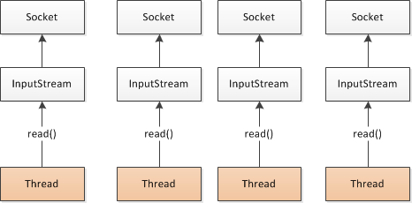
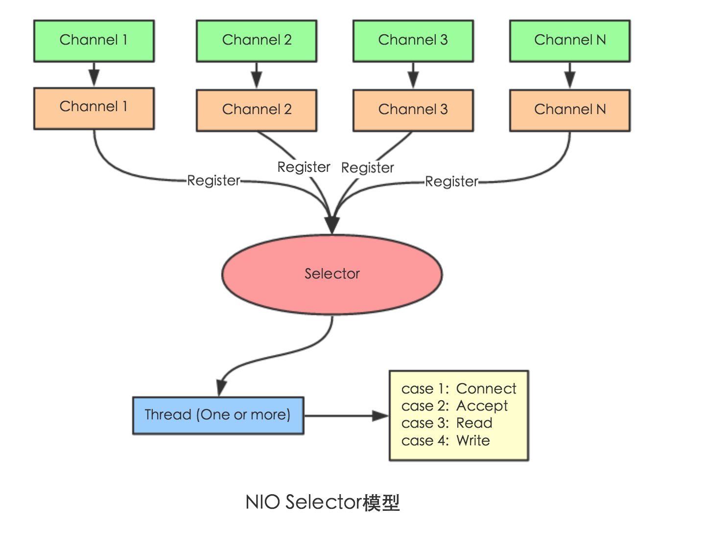

## 自己理解的dubbo

- 透明的远程调用，就像调用本地方法一样调用远程方法；只需简单配置，没有任何 API 侵入
- 负载均衡
- 超时、重试机制
- 服务降级

### dubbo实际开发中遇到的问题？

比如说：接口超时时间的配置

### dubbo新功能

2017.7阿里重启DUBBO

### dubbo2.7新功能


- 异步化改造
- 三大中心改造
- 服务治理增强

http://dubbo.apache.org/zh-cn/blog/dubbo-27-features.html


### gRpc支持

http://dubbo.apache.org/zh-cn/blog/index.html

- 添加REST接口调用

- 整合Nacos

- 异步化接口

  - Dubbo 2.7 中使用了 JDK1.8 提供的 `CompletableFuture` 原生接口对自身的异步化做了改进。`CompletableFuture` 可以支持 future 和 callback 两种调用方式，用户可以根据自己的喜好和场景选择使用，非常灵活。

## RPC 原理

一次完整的RPC调用流程（同步调用，异步另说）如下： 

***\*1）服务消费方（client）调用以本地调用方式调用服务；\**** 

2）client 代理对象接收到调用后负责将方法、参数等组装成能够进行网络传输的消息体； 

3）client  代理对象找到服务地址，并将消息发送到服务端； 

4）server  代理对象收到消息后进行解码； 

5）server 代理对象根据解码结果调用本地的服务； 

6）server本地服务执行并将结果返回给server  代理对象； 

7）server  代理对象将返回结果打包成消息并发送至消费方； 

8）client  代理对象接收到消息，并进行解码； 

***\*9）服务消费方得到最终结果。\****

RPC框架的目标就是要2~8这些步骤都封装起来，这些细节对用户来说是透明的，不可见的。


### IO 模型

- BIO阻塞IO
- NIO非阻塞IO
- 多路复用IO
- 异步AIO


### 多路复用I/O

elect，poll，epoll都是IO多路复用的机制。I/O多路复用就是通过一种机制，一个进程可以监视多个描述符，一旦某个描述符就绪（一般是读就绪或者写就绪），能够通知程序进行相应的读写操作。但select，poll，epoll本质上都是同步I/O，因为他们都需要在读写事件就绪后自己负责进行读写，也就是说这个读写过程是阻塞的，而异步I/O则无需自己负责进行读写，异步I/O的实现会负责把数据从内核拷贝到用户空间。


在 select/poll中，进程只有在调用一定的方法后，内核才对所有监视的文件描述符进行扫描，而epoll事先通过epoll_ctl()来注册一 个文件描述符，一旦基于某个文件描述符就绪时，内核会采用类似callback的回调机制，迅速激活这个文件描述符，当进程调用epoll_wait() 时便得到通知。(此处去掉了遍历文件描述符，而是通过监听回调的的机制。这正是epoll的魅力所在。)

#### select

用户程序发起读操作后，将阻塞查询读数据是否可用，直到内核准备好数据后，用户程序才会真正的读取数据。

- 数据结构是数组，所以有最大限制
- 一个线程可以处理N个Socket请求
- 每次调用Select，轮询所有socket

原理？

监听连接时，从用户层的角度看，
（1）会构建3个fd数组，分别关注读/写/异常事件，设置超时时间，调用系统提供的select方法。
（2）调用select方法时，需要将fd数组传到内核态，等待部分fd就绪后，把fd数组（包含就绪状态）返回到用户态
（3）用户程序对fd数组进行遍历，处理就绪的fd
（4）重新调用select方法。

可以看出不好的地方是（1）每次都要传入fd数组，返回整个fd数组，导致了大量在用户空间和内核空间的相互拷贝。
（2）用户程序仍需要遍历fd数组才能找出就绪的fd

 

#### poll

poll与select的原理相似，用户程序都要阻塞查询事件是否就绪，但poll没有最大文件描述符的限制。

- 数据结构是链表，没有最大限制

#### epoll

epoll使用“事件”的方式通知用户程序数据就绪，并且使用内存拷贝的方式使用户程序直接读取内核准备好的数据，不用再读取数据

数据结构： 红黑树+双向链表

epoll相对select改善了很多。
（1）在使用epoll时，首先会构建epoll对象。
（2）有连接接入时，会插入到epoll对象中，epoll对象里实际是一个红黑树+双向链表，fd插入到红黑树中，通过红黑树查找到是否重复
（3）一旦fd就绪，会触发回调把fd的插入到就绪链表中，并唤醒等待队列中的线程。
（4）调用epoll_wait方法时只需要检查就绪链表，如有则返回给用户程序，如没有进入等待队列。

由于epoll把fd管理起来，不需要每次都重复传入，而且只返回就绪的fd，因此减少了用户空间和内核空间的相互拷贝，在fd数量庞大的时候更加高效

 

### Netty







网络IO和磁盘IO都可以称为IO

- BIO:每个请求都开一个Socket，并开一个线程处理
  - 阻塞IO、读写都阻塞
  - 不能同时处理大量请求

- NIO
  - Selector（多路复用选择器） 监听多个通道的各种事件
  - 某个通道的某个事件准备好了，开一个线程进行
  - 其实多路复用就是：同时监听多个Channel，当某个channel的任务完成的时候，比如读取完成了，才去开启一个线程执行。而BIO是来了就阻塞
  - 一个selector对应一个线程


### netty流程


1. ServerBootstrap启动，绑定并监听某个端口，把这个端口的所有请求都接管
2. 初始化NIOServerSocketChannel，并注册到Selector中
3. 建立一个与worker的通道NIOSocketChannel并注册到worker的Selector中
4. boss里面的selector是监听的accept事件，也就是接受准备就绪的状态
5. 而worder的selector监听的是read、write准备就绪的状态
6. 然后去执行相应的任务


**`EventLoop` 的主要作用实际就是负责监听网络事件并调用事件处理器进行相关 I/O 操作的处理。**

那 `Channel` 和 `EventLoop` 直接有啥联系呢？

`Channel` 为 Netty 网络操作(读写等操作)抽象类，`EventLoop` 负责处理注册到其上的`Channel` 处理 I/O 操作，两者配合参与 I/O 操作。


```java
Netty抽象出两组线程池 BossGroup 专门负责接收客户端的连接, WorkerGroup 专门负责网络的读写
BossGroup 和 WorkerGroup 类型都是 NioEventLoopGroup
NioEventLoopGroup 相当于一个事件循环组, 这个组中含有多个事件循环 ，每一个事件循环是 NioEventLoop
NioEventLoop 表示一个不断循环的执行处理任务的线程， 每个NioEventLoop 都有一个selector , 用于监听绑定在其上的socket的网络通讯
NioEventLoopGroup 可以有多个线程, 即可以含有多个NioEventLoop
每个Boss NioEventLoop 循环执行的步骤有3步
轮询accept 事件
处理accept 事件 , 与client建立连接 , 生成NioScocketChannel , 并将其注册到某个worker NIOEventLoop 上的 selector 
处理任务队列的任务 ， 即 runAllTasks
7) 每个 Worker NIOEventLoop 循环执行的步骤
轮询read, write 事件
处理i/o事件， 即read , write 事件，在对应NioScocketChannel 处理
处理任务队列的任务 ， 即 runAllTasks
8) 每个Worker NIOEventLoop  处理业务时，会使用pipeline(管道), pipeline 中包含了 channel , 即通过pipeline 可以获取到对应通道, 管道中维护了很多的 处理器

```


### Netty线程模型

#### 传统线程模型

- 传统阻塞I/O模型

- Reactor线程模型

  - 根据Reactor的数量和处理资源线程池的数量不同，有3种具体的实现
  - 单Reactor单线程

  一个线程需要执行处理所有的 `accept`、`read`、`decode`、`process`、`encode`、`send` 事件。对于高负载、高并发，并且对性能要求比较高的场景不适用。

  - 单Reactor多线程

  一个 Acceptor 线程只负责监听客户端的连接，一个 NIO 线程池负责具体处理： `accept`、`read`、`decode`、`process`、`encode`、`send` 事件。满足绝大部分应用场景，并发连接量不大的时候没啥问题，但是遇到并发连接大的时候就可能会出现问题，成为性能瓶颈。

  - 主从Reactor多线程

1. (一主，多从三层结构，一个主Reactor监听，通过Acceptor处理连接事件)

2. 当Accept处理连接事件后，MainRector将连接分配给SubReactor，从而保证mainReactor只负责接入认证、握手等操作。
3. SubReactor将连接加入到连接队列，并创建Handler，当有新事件发生时，SubReactor就会调用对应的Handler处理

从一个 主线程 NIO 线程池中选择一个线程作为 Acceptor 线程，绑定监听端口，接收客户端连接的连接，其他线程负责后续的工作。连接建立完成后，Sub NIO 线程池负责具体处理 I/O 读写。如果多线程模型无法满足你的需求的时候，可以考虑使用主从多线程模型 。

- Netty线程模型
  - 基于主从Reactor多线程模型进行了改进

## dubbo

### 框架设计

http://dubbo.apache.org/zh-cn/docs/dev/design.html

- business 用户关注的层面，由接口和实现类组成、
- RPC
  - Config: 解析配置信息
  - Proxy：生成客户、服务端代理对象进行调用方法
  - Rregistry：注册中心，服务的注册与发现
  - Cluster：负载均衡
  - Monitor：监控中心
  - Protocol：核心：Invoker 、Protocol、Exporter也就是只要有 Protocol + Invoker + Exporter 就可以完成非透明的 RPC 调用，然后在 Invoker 的主过程上 Filter 拦截点。

- R emoting：远程通信层
  - Exchange：客户端和服务端的通信
  - Transport——netty框架
  - Serialize 序列化、反序列化

### dubbo服务暴露过程

1. 首先将服务的实现封装成一个Invoker，Invoker中封装了服务的实现类。

2. 将Invoker封装成Exporter，并缓存起来，缓存里使用Invoker的url作为key。

3. 服务端Server启动，监听端口。（请求来到时，根据请求信息生成key，到缓存查找Exporter，就找到了Invoker，就可以完成调用。）


### Dubbo提供了哪3个关键功能？

基于接口的远程调用

容错和负载均衡

自动服务注册和发现

### dubbo关键点有哪些？

- privider
- consumer
- Registry 服务注册和发现中心
- Monitor 统计服务调用次数和调用时间
- Container服务运行的容器

### dubbo服务注册流程

1. 服务容器负责启动，加载，运行服务提供者。
2. 服务提供者在启动时，向注册中心注册自己提供的服务。
3. 服务消费者在启动时，向注册中心订阅自己所需的服务。
4. 注册中心返回服务提供者地址列表给消费者，如果有变更，注册中心将基于长连接推送变更数据给消费者。
5. 服务消费者，从提供者地址列表中，基于软负载均衡算法，选一台提供者进行调用，如果调用失败，再选另一台调用。
6. 服务消费者和提供者，在内存中累计调用次数和调用时间，定时每分钟发送一次统计数据到监控中心。

### dubbo流程图

 

### dubbo注册中心

zookeeper 、redis、Multicast、Nacos、Simple

[注册中心分类](http://dubbo.apache.org/zh-cn/docs/user/references/registry/nacos.html)

### dubbo核心配置

| 标签                                                         | 用途         | 解释                                                         |
| ------------------------------------------------------------ | ------------ | ------------------------------------------------------------ |
| `<dubbo:service/>`                                           | 服务配置     | 用于暴露一个服务，定义服务的元信息，一个服务可以用多个协议暴露，一个服务也可以注册到多个注册中心 |
| `<dubbo:reference/>` [[2\]](http://dubbo.apache.org/zh-cn/docs/user/configuration/xml.html#fn2) | 引用配置     | 用于创建一个远程服务代理，一个引用可以指向多个注册中心       |
| `<dubbo:protocol/>`                                          | 协议配置     | 用于配置提供服务的协议信息，协议由提供方指定，消费方被动接受 |
| `<dubbo:application/>`                                       | 应用配置     | 用于配置当前应用信息，不管该应用是提供者还是消费者           |
| `<dubbo:module/>`                                            | 模块配置     | 用于配置当前模块信息，可选                                   |
| `<dubbo:registry/>`                                          | 注册中心配置 | 用于配置连接注册中心相关信息                                 |
| `<dubbo:monitor/>`                                           | 监控中心配置 | 用于配置连接监控中心相关信息，可选                           |
| `<dubbo:provider/>`                                          | 提供方配置   | 当 ProtocolConfig 和 ServiceConfig 某属性没有配置时，采用此缺省值，可选 |
| `<dubbo:consumer/>`                                          | 消费方配置   | 当 ReferenceConfig 某属性没有配置时，采用此缺省值，可选      |
| `<dubbo:method/>`                                            | 方法配置     | 用于 ServiceConfig 和 ReferenceConfig 指定方法级的配置信息   |
| `<dubbo:argument/>`                                          | 参数配置     | 用于指定方法参数配置                                         |

### 接口配置优先级


以 timeout 为例，下图显示了配置的查找顺序，其它 retries, loadbalance, actives 等类似：

- 方法级优先，接口级次之，全局配置再次之。
- 如果级别一样，则消费方优先，提供方次之。

其中，服务提供方配置，通过 URL 经由注册中心传递给消费方。


**（建议由服务提供方设置超时，因为一个方法需要执行多长时间，服务提供方更清楚，如果一个消费方同时引用多个服务，就不需要关心每个服务的超时设置）。**


### 配置文件优先级

优先级从高到低：

- JVM -D参数，当你部署或者启动应用时，它可以轻易地重写配置，比如，改变dubbo协议端口；
- XML, XML中的当前配置会重写dubbo.properties中的；
- Properties，默认配置，仅仅作用于以上两者没有配置时。

### dubbo 启动检查

Dubbo 缺省会在启动时检查依赖的服务是否可用，不可用时会抛出异常，阻止 Spring 初始化完成，以便上线时，能及早发现问题，默认 `check="true"`。

可以通过 `check="false"` 关闭检查，比如，测试时，有些服务不关心，或者出现了循环依赖，必须有一方先启动。

另外，如果你的 Spring 容器是懒加载的，或者通过 API 编程延迟引用服务，请关闭 check，否则服务临时不可用时，会抛出异常，拿到 null 引用，如果 `check="false"`，总是会返回引用，当服务恢复时，能自动连上。

### 如何直连

- -D

```
java -Dcom.alibaba.xxx.XxxService=dubbo://localhost:20890
.properties
```

- XML

```
 <dubbo:reference id="xxxService"
 interface="com.alibaba.xxx.XxxService" url="dubbo://localhost:20890" />
```

- .properties

```
java -Ddubbo.resolve.file=xxx.properties

```

-xxxxxx.properties配置如下

```
com.alibaba.xxx.XxxService=dubbo://localhost:20890
```


```java
消费者上面加上注解 添加dubbo服务的url
@Reference(url = "127.0.0.1:20882")
```


```java

…
 
ReferenceConfig<XxxService> reference = new ReferenceConfig<XxxService>(); // 此实例很重，封装了与注册中心的连接以及与提供者的连接，请自行缓存，否则可能造成内存和连接泄漏
// 如果点对点直连，可以用reference.setUrl()指定目标地址，设置url后将绕过注册中心，
// 其中，协议对应provider.setProtocol()的值，端口对应provider.setPort()的值，
// 路径对应service.setPath()的值，如果未设置path，缺省path为接口名
reference.setUrl("dubbo://10.20.130.230:20880/com.xxx.XxxService"); 
 
```

###14.Dubbo配置来源有几种？分别是？

4种

- JVM System Properties，-D参数
- Externalized Configuration，外部化配置
- ServiceConfig、ReferenceConfig等编程接口采集的配置
- 本地配置文件dubbo.properties

### 如何禁用某个服务的启动检查？

```xml
<dubbo:reference interface = "com.foo.BarService" check = "false" />
```

### 负载均衡策略

Dubbo 提供了4种负载均衡实现，分别是

基于权重随机算法的 RandomLoadBalance、

基于最少活跃调用数算法的 LeastActiveLoadBalance、

基于 hash 一致性的 ConsistentHashLoadBalance，

以及基于加权轮询算法的 RoundRobinLoadBalance。

> 一致性 Hash，相同参数的请求总是发到同一提供者。
>
> 当某一台提供者挂时，原本发往该提供者的请求，基于虚拟节点，平摊到其它提供者，不会引起剧烈变动。

### 如何兼容老版本

多版本号(version)

当一个接口实现，出现不兼容升级时，可以用版本号过渡，版本号不同的服务相互间不引用。

可以按照以下的步骤进行版本迁移：

在低压力时间段，先升级一半提供者为新版本

再将所有消费者升级为新版本

然后将剩下的一半提供者升级为新版本

```xml
老版本服务提供者配置：
<dubbo:service interface="com.foo.BarService" version="1.0.0" />

新版本服务提供者配置：
<dubbo:service interface="com.foo.BarService" version="2.0.0" />

老版本服务消费者配置：
<dubbo:reference id="barService" interface="com.foo.BarService" version="1.0.0" />

新版本服务消费者配置：
<dubbo:reference id="barService" interface="com.foo.BarService" version="2.0.0" />

如果不需要区分版本，可以按照以下的方式配置：
<dubbo:reference id="barService" interface="com.foo.BarService" version="*" />
```

### 集群容错方式

```xml
Failover Cluster
失败自动切换，当出现失败，重试其它服务器。通常用于读操作，但重试会带来更长延迟。可通过 retries="2" 来设置重试次数(不含第一次)。

重试次数配置如下：
<dubbo:service retries="2" />
或
<dubbo:reference retries="2" />
或
<dubbo:reference>
    <dubbo:method name="findFoo" retries="2" />
</dubbo:reference>

Failfast Cluster
快速失败，只发起一次调用，失败立即报错。通常用于非幂等性的写操作，比如新增记录。

Failsafe Cluster
失败安全，出现异常时，直接忽略。通常用于写入审计日志等操作。

Failback Cluster
失败自动恢复，后台记录失败请求，定时重发。通常用于消息通知操作。

Forking Cluster
并行调用多个服务器，只要一个成功即返回。通常用于实时性要求较高的读操作，但需要浪费更多服务资源。可通过 forks="2" 来设置最大并行数。

Broadcast Cluster
广播调用所有提供者，逐个调用，任意一台报错则报错 [2]。通常用于通知所有提供者更新缓存或日志等本地资源信息。

集群模式配置
按照以下示例在服务提供方和消费方配置集群模式
<dubbo:service cluster="failsafe" />
或
<dubbo:reference cluster="failsafe" />
```

### dubbo有哪些协议

- dubbo://(推荐)[官网](http://dubbo.apache.org/zh-cn/docs/user/references/protocol/dubbo.html)
  - Dubbo 缺省协议采用单一长连接和 NIO 异步通讯，适合于小数据量大并发的服务调用，以及服务消费者机器数远大于服务提供者机器数的情况。
  - 反之，Dubbo 缺省协议不适合传送大数据量的服务，比如传文件，传视频等，除非请求量很低。
  - 连接个数：单连接
  - 连接方式：长连接
  - 传输协议：t c p
  - 传输方式：NIO异步传输
  - 序列化H essian二进制序列化
  - 适用场景：常规远程服务方法调用
  - **约束：参数及返回值需实现 `Serializable` 接口**
    - 还有很多注意的地方：比如
    - A传输到B，A多了一个属性或者说B少了一个属性，传输正常没有异常，但是B的那个属性会没有
    - A——B传输，但是序列号ID不同，结果：正常传输
    - A——B属性名称一样，但是类型不同，结果：抛出异常
  - 如何使用：**protocol="dubbo"**
  - 为啥不能传大包？
    - 因为dubbo默认是单一长连接，如果每次请求的数据包都是500KB，而一般的每条连接最大的值是7M，7/500=14，也就是每秒14个消费者TPS，所以严重阻塞
  - 为啥du bbo默认会用这种方式呢？
    - 因为真正的服务提供者其实很少，就几台机器，但是消费者众多，单一长连接可以减少握手验证，并使用异步IO复用线程池
- rmi://
- hessian://
- http://
- webservice://
- thrift://
- memcached://
- redis://
- rest://
- grpc

Dubbo 自 2.7.5 版本开始支持 gRPC 协议，对于计划使用 HTTP/2 通信，或者想利用 gRPC 带来的 Stream、反压、Reactive 编程等能力的开发者来说， 都可以考虑启用 gRPC 协议。

http://dubbo.apache.org/zh-cn/docs/user/references/protocol/gRPC.html

### dubbo 通信框架

netty

### dubbo默认端口号

- dubbo:20880
- http:80
- hessian:80
- rmi:80

 

### Dubbo默认序列化框架?其他的你还知道？

- dubbo协议缺省为hessian2
- rmi协议缺省为java
- http协议缺省为json

### 一个服务多重实现，如何处理？

可以用group分组，服务提供方和消费放都指定同一个group。

### dubbo调用是阻塞的？还是其它的？

默认是同步等待结果阻塞的，同时也支持异步调用。

Dubbo 是基于 NIO 的非阻塞实现并行调用，客户端不需要启动多线程即可完成并行调用多个远程服务，相对多线程开销较小，异步调用会返回一个 Future 对象。

### dubbo分布式追踪方案？

- Zipkin
- Pinpoint
- SkyWalking

### io线程池大小默认？

cpu个数 + 1

### dubbo协议适用场景

采用单一长链接和NIO异步通讯，适用于小数量大并发的服务调用，以及服务消费者机器数远大于服务提供者机器数的情况。

不适合传送大数据量的服务，比如传文件，传视频等，除非请求量很低。

### 自动剔除什么原理

zookeeper临时节点，会话保持原理。


