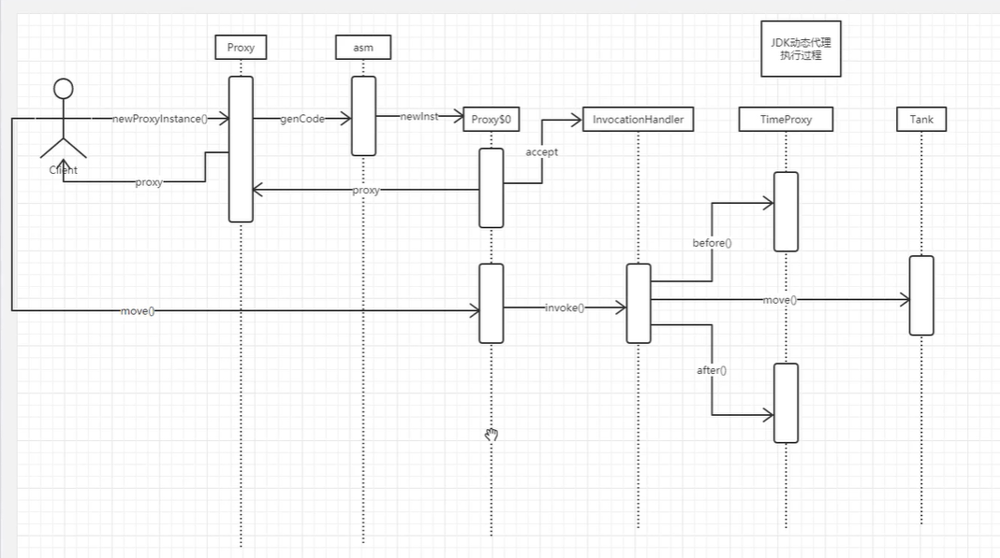

## 代理模式

### 为啥使用代理模式？

我的理解是：在实际应用中别人写了一个代码，但是你要扩展自己的东西又不想改别人的代码，你就可以用代理模式去解决

变成了下面的逻辑

```
....代理开始
别人的正常代码执行.....
...代理结束
```

在执行别人的代码前或者代码后你可以添加自己的逻辑，正常是你再写一个serviceB方法，里面去调用serviceA即可，但是这样做不够通用，比如说：我们现在要对所有的service方法都去实现一个添加方法执行时间的操作，你再不改变别人的代码前提下，只能创建N个Service，然后添加时间的操作，这样太累了

所以代理模式的优点可以总结下：

- **不改变别人代码前提下，实现自己要添加的功能**
- **可以实现一套通用的逻辑，避免重复操作**

##  静态代理

若代理类在程序运行前就已经存在，这种方式称为静态代理 

静态：由程序员创建代理类或特定工具自动生成源代码再对其编译。在程序运行前代理类的.class文件就已经存在了。

- 顶层接口A

```java
/**
 * @author xiyou
 * JDK动态代理
 */
public interface PersionService {
 public void sayHello(String name)；
}
```

- StudentServiceImpl实现了A的方法

```java
/**
 * @author xiyou
 */
public class StudentServiceImpl implements  PersionService {
    @Override
    public void sayHello(String name) {
        System.out.println("student"+name);
    }
}
```

- Student2ServiceImpl也实现了service方法

```java
public class Student2ServiceImpl implements  PersionService {
    @Override
    public void sayHello(String name) {
        System.out.println("student"+name);
    }
}
```

- 代理接口，里面传入的是原始接口

```java
public class Proxy2StudentServiceImpl implements PersionService {

    private PersionService persionService;

    public Proxy2StudentServiceImpl(PersionService sa) {
        this.persionService = sa;
    }

    @Override
    public void sayHello(String name) {
        System.out.println("proxy2..... start" + name);
        persionService.sayHello(name);
        System.out.println("proxy2..... end" + name);

    } 
}
```


```java
/**
 * @author xiyou
 * 静态代理对象
 */
public class ProxyStudentServiceImpl implements PersionService {

    private PersionService persionService;

    public ProxyStudentServiceImpl(PersionService sa) {
        this.persionService = sa;
    }

    @Override
    public void sayHello(String name) {
        System.out.println("proxy start" + name);
        persionService.sayHello(name);
        System.out.println("proxy end" + name);

    }

    public static void main(String[] args) {
        ProxyStudentServiceImpl proxy = new ProxyStudentServiceImpl(new StudentServiceImpl());
        ProxyStudentServiceImpl proxy2 = new ProxyStudentServiceImpl(new Student2ServiceImpl());
        proxy.sayHello("xiyou");
        proxy2.sayHello("111111xiyou");
    }
}
```

- 结果

```sql
proxy startxiyou
studentxiyou
proxy endxiyou
proxy start111111xiyou
student111111xiyou
proxy end111111xiyou
```

- **上面可以看除代理模式的第一个优点：可以在不改变原有接口的前提下实现自己的扩展逻辑**

**但是代理模式还有第二个优点：嵌套组合**

比如说又来了一个代理模式实现自己的功能，同样去实现接口

```java
public class Proxy2StudentServiceImpl implements PersionService {

    private PersionService persionService;

    public Proxy2StudentServiceImpl(PersionService sa) {
        this.persionService = sa;
    }

    @Override
    public void sayHello(String name) {
        System.out.println("proxy2..... start" + name);
        persionService.sayHello(name);
        System.out.println("proxy2..... end" + name);
    }
}
```

那么这个时候，代理模式之间就能嵌套了

```java
Proxy2StudentServiceImpl proxy2 = new Proxy2StudentServiceImpl(new ProxyStudentServiceImpl(new StudentServiceImpl()));
proxy2.sayHello("xiyou");
System.out.println("-----------------------");
ProxyStudentServiceImpl proxy3 = new ProxyStudentServiceImpl(new Proxy2StudentServiceImpl(new StudentServiceImpl()));
proxy3.sayHello("xiyou");
```


### 静态代理优点

- 可以在不改变原有接口的前提下实现自己的扩展逻辑
- 代理之前嵌套代理

比如一个代理P1是代理日志的，一个代理P2是代理时间的，一个代理P3是代理事务的，那么其实他们之间就可以来回嵌套组合来实现你要的功能

### 静态代理缺点

- 每一个代理对象都要去实现被代理对象的方法

- 而且只能是接口，不能是类


## 反射

JAVA反射机制是在运行状态中，对于任意一个类，都能够知道这个类的所有属性和方法；

对于任意一个对象，都能够调用它的任意方法和属性；这种动态获取信息以及动态调用对象方法的功能称为java语言的反射机制。

反射就是通过二进制二进制字节码（class文件）分析类的各种属性和方法

而且反射只能获取，但是改变不了他原本的方法，比如说动态删除、添加一个方法，这个需要ASM来实现

- 反射有关的类

### Class类

代表类的实体，在运行的Java应用程序中表示类和接口

这里有很多，不一一列举，可以参考文章[传送门](https://www.jianshu.com/p/9be58ee20dee)

#### 获取类相关信息

| 方法                      | 用途                                                   |
| ------------------------- | :----------------------------------------------------- |
| getClassLoader()          | 获得类的加载器                                         |
| getClasses()              | 返回一个数组，数组中包含该类中所有公共类和接口类的对象 |
| forName(String className) | 根据类名返回类的对象                                   |
| getName()                 | 获得类的完整路径名字                                   |
| newInstance()             | 创建类的实例                                           |
| getInterfaces()           | 获得当前类实现的类或是接口                             |

#### 获取构造器相关方法


| 方法                                       | 用途                                   |
| ------------------------------------------ | -------------------------------------- |
| getConstructor(Class...<?> parameterTypes) | 获得该类中与参数类型匹配的公有构造方法 |
| getConstructors()                          | 获得该类的所有公有构造方法             |

#### 获取类中方法

| 方法                                               | 用途                   |
| -------------------------------------------------- | ---------------------- |
| getMethod(String name, Class...<?> parameterTypes) | 获得该类某个公有的方法 |
| getMethods()                                       | 获得该类所有公有的方法 |


### Field类

代表类的成员变量（成员变量也称为类的属性）

| 方法                          | 用途                    |
| ----------------------------- | ----------------------- |
| equals(Object obj)            | 属性与obj相等则返回true |
| get(Object obj)               | 获得obj中对应的属性值   |
| set(Object obj, Object value) | 设置obj中对应属性值     |

### Method类

代表类的方法

| 方法                               | 用途                                     |
| ---------------------------------- | ---------------------------------------- |
| invoke(Object obj, Object... args) | 传递object对象及参数调用该对象对应的方法 |

### Constructor 类

代表类的构造方法

| 方法                            | 用途                       |
| ------------------------------- | -------------------------- |
| newInstance(Object... initargs) | 根据传递的参数创建类的对象 |

## JDK动态代理

### JDK动态代理传入参数

- proxy代理对象
- `Proxy.newProxyInstance`传入三个参数
- target被代理对象，其实就是接口的实现类

- `target.getClass().getClassLoader()`为了获取被代理的目标对象
- `target.getClass().getInterfaces()`为了实现被代理对象的目标接口
- MyInvocationHandlerImpl是要自己实现的InvocationHandler（调用处理器），其实就是被代理对象要被调用的时候要执行的逻辑

```java
 Object proxy = Proxy.newProxyInstance(target.getClass().getClassLoader(), 
 target.getClass().getInterfaces(),
 new MyInvocationHandlerImpl(target));
```

#### 自定义InvocationHandler

```
/**
 * 调用处理器实现类
 * 每次生成动态代理类对象时都需要指定一个实现了该接口的调用处理器对象
 *
 * @author xiyou
 */
public class MyInvocationHandlerImpl implements InvocationHandler {

    /**
     * 这个就是我们要被代理的真实对象
     */
    private Object subject;

    /**
     * 构造方法，给我们要被代理的真实对象赋初值
     *
     * @param subject
     */
    public MyInvocationHandlerImpl(Object subject) {
        this.subject = subject;
    }

    @Override
    public Object invoke(Object o, Method method, Object[] objects) throws Throwable {
        //在代理真实对象前我们可以添加一些自己的操作
        System.out.println("在调用之前..........head，我要干点啥呢？"+method.getName());
        //当代理对象调用真实对象的方法时，其会自动的跳转到代理对象关联的handler对象的invoke方法来进行调用
        Object returnValue = method.invoke(subject, objects);
        //在代理真实对象后我们也可以添加一些自己的操作
        System.out.println("在调用之后...........end，我要干点啥呢？"+method.getName());
        return returnValue;
    }
}
```

### 动态代理demo

- 写一个要代理的接口

```java
/**
 * @author xiyou
 * JDK动态代理
 */
public interface DataChangeListener {
    /**
     * When db changed, we will callback this method to execute custom business.
     * Warning: be careful blocking thread.
     *
     * @param obj Model of db declare
     */
    void listener(Object obj);

    /**
     * 测试JDK动态代理
     *
     * @param name
     * @return
     */
    String sayHello(String name);

}
```

- 接口实现写一下

```java
import lombok.extern.slf4j.Slf4j;

/**
 * @author xiyou
 * JDK动态代理监听器
 */
@Slf4j
public class DataChangeListerImpl implements DataChangeListener {
 
    @Override
    public String sayHello(String name) {
        name=name + System.currentTimeMillis();
        log.info(name);
        return name;
    }
     @Override
    public void listener(Object obj) {
        log.info("user update data={}", obj.toString());
    }
}
```

- 动态代理演示

```java
    public static void main(String[] args) {
        //代理的真实对象
        DataChangeListener realSubject = new DataChangeListerImpl();
        MyInvocationHandlerImpl myInvocationHandler=new MyInvocationHandlerImpl(realSubject);
        DataChangeListener subject = (DataChangeListener) Proxy.newProxyInstance(
            //传入ClassLoader
                realSubject.getClass().getClassLoader(),
            //传入接口
                realSubject.getClass().getInterfaces(),
            //传入自己实现的处理器
                myInvocationHandler);

        String hello = subject.sayHello("xiyou");
        subject.listener(new Object());

    }
```

- 打印结果

```java
在调用之前..........head，我要干点啥呢？sayHello
 INFO   DataChangeListerImpl ---- xiyou1591202232800
在调用之后...........end，我要干点啥呢？sayHello
在调用之前..........head，我要干点啥呢？listener
INFO   DataChangeListerImpl ---- user update data=java.lang.Object@124c278f
在调用之后...........end，我要干点啥呢？listener
```


Java 动态代理，具体有如下四步骤：

- 通过实现 InvocationHandler 接口创建自己的调用处理器；
  - 主要是实现里面的Invoke方法
- 通过为 Proxy 类指定 ClassLoader 对象和一组 interface 来创建动态代理类；
  - 步骤就是：写一个接口A和A的实现类AImpl  然后获取它的ClassLoader 和Interface
- 通过反射机制获得动态代理类的构造函数，其唯一参数类型是调用处理器接口类型；
  - 因为有类并不一定有实例，所以要反射获取构造函数
- 通过构造函数创建动态代理类实例，构造时调用处理器对象作为参数被传入。
  - 有了构造函数就能创建实例


### 动态代理实现$proxy0.class

```
//设置系统属性，会生成一个$proxy0.class
System.getProperties().put("sun.misc.ProxyGenerator.saveGeneratedFiles", "true"); 
//代理的真实对象
DataChangeListener realSubject = new DataChangeListerImpl();
MyInvocationHandlerImpl myInvocationHandler=new MyInvocationHandlerImpl(realSubject);
DataChangeListener subject = (DataChangeListener) Proxy.newProxyInstance(
realSubject.getClass().getClassLoader(),
realSubject.getClass().getInterfaces(),
myInvocationHandler);

String hello = subject.sayHello("xiyou");
subject.listener(new Object());
```

其实是生成了一个$proxy0.class

```java
//
// Source code recreated from a .class file by IntelliJ IDEA
// (powered by Fernflower decompiler)
//

package com.sun.proxy;

import cn.net.health.user.aop.dynamic.DataChangeListener;
import java.lang.reflect.InvocationHandler;
import java.lang.reflect.Method;
import java.lang.reflect.Proxy;
import java.lang.reflect.UndeclaredThrowableException;

public final class $Proxy0 extends Proxy implements DataChangeListener {
    //下面的几个方法分别对应hash toString equals
    //还有你自己实现的方法sayHello listener
    private static Method m1;
    private static Method m3;
    private static Method m4;
    private static Method m2;
    private static Method m0;

    public $Proxy0(InvocationHandler var1) throws  {
        super(var1);
    }


    public final String sayHello(String var1) throws  {
        try {
            return (String)super.h.invoke(this, m3, new Object[]{var1});
        } catch (RuntimeException | Error var3) {
            throw var3;
        } catch (Throwable var4) {
            throw new UndeclaredThrowableException(var4);
        }
    }
 
 

    public final void listener(Object var1) throws  {
        try {
            super.h.invoke(this, m4, new Object[]{var1});
        } catch (RuntimeException | Error var3) {
            throw var3;
        } catch (Throwable var4) {
            throw new UndeclaredThrowableException(var4);
        }
    }
 

    static {
        try {
            m1 = Class.forName("java.lang.Object").getMethod("equals", Class.forName("java.lang.Object"));
            m3 = Class.forName("cn.net.health.user.aop.dynamic.DataChangeListener").getMethod("sayHello", Class.forName("java.lang.String"));
            m2 = Class.forName("java.lang.Object").getMethod("toString");
            m4 = Class.forName("cn.net.health.user.aop.dynamic.DataChangeListener").getMethod("listener", Class.forName("java.lang.Object"));
            m0 = Class.forName("java.lang.Object").getMethod("hashCode");
        } catch (NoSuchMethodException var2) {
            throw new NoSuchMethodError(var2.getMessage());
        } catch (ClassNotFoundException var3) {
            throw new NoClassDefFoundError(var3.getMessage());
        }
    }
}

```

自信看我们自己写的listener和sayHello方法，其实都是取调用的下面的代码

```java
(String)super.h.invoke(this, m3, new Object[]{var1});
super.h.invoke(this, m4, new Object[]{var1});
```

上面的代码什么意思呢？

```java
super代表父类Proxy对象
super.h代表的是传入的InvocationHandler对象  在Proxy源码中我们可以看到：protected InvocationHandler h;
super.h.invoke其实就是调用的我们自己定义的MyInvocationHandlerImpl的invoke方法
```

所以我们具体看下我们自己的MyInvocationHandlerImpl的invoke方法

```java
 //proxy对象是生成的Proxy0.class对象 这里没有啥用，但是他要传给你 
//method是你具体调用的方法，比如说是sayHello方法
//args是sayHello方法的参数
//subject是被代理对象
@Override
    public Object invoke(Object proxy, Method method, Object[] args) throws Throwable {
        //在代理真实对象前我们可以添加一些自己的操作
        System.out.println("在调用之前..........head，我要干点啥呢？"+method.getName());
        //当代理对象调用真实对象的方法时，其会自动的跳转到代理对象关联的handler对象的invoke方法来进行调用
        Object returnValue = method.invoke(subject, args);
        //在代理真实对象后我们也可以添加一些自己的操作
        System.out.println("在调用之后...........end，我要干点啥呢？"+method.getName());
        return returnValue;
    }
```

```
其实这个就是反射调用被代理对象的方法，并获取返回值
Object returnValue = method.invoke(subject, objects);
```

### 动态代理图解过程

以下是马士兵老师讲的过程，好像是基于JDK11的

https://www.bilibili.com/video/BV1tK411W7xx/?p=28&t=441

总结一下：

- 获取根据传入的接口获取接口的所有信息（接口名、参数、异常和返回类型）
- 根据接口的所有信息去生成字节码文件class文件，其实就是动态的去写，比如把原来接口的hash equal toString写入，然后再把自己的方法写入进去
- 然后把Class文件加载到JVM里面返回一个Class对象
- 然后根据Class对象去获取构造器去创建一个实例

1. 既然已经生成了代理对象Proxy$0.class而且有了实例当我们调用方法的时候，比如sayHello()
2. 调用Proxy$0的sayHello方法其实是调用的是InvocationHandler的invoke方法
3. 但是invoke方法其实调用的是我们被代理对象都的sayHello方法




第一个过程是生成代理对象Proxy$0的过程

```java
 @CallerSensitive
    public static Object newProxyInstance(ClassLoader loader,
                                          Class<?>[] interfaces,
                                          InvocationHandler h)
        throws IllegalArgumentException
    {
        //1.非空检验
        Objects.requireNonNull(h);
		//2.克隆所有接口
        final Class<?>[] intfs = interfaces.clone();
        final SecurityManager sm = System.getSecurityManager();
        if (sm != null) {
            checkProxyAccess(Reflection.getCallerClass(), loader, intfs);
        }

        /*
        * 3.寻找或者生成指定的代理对象class，如果不存在就生成，存在就找出来
         * Look up or generate the designated proxy class.
         */
        Class<?> cl = getProxyClass0(loader, intfs);

 
        try {
            if (sm != null) {
                checkNewProxyPermission(Reflection.getCallerClass(), cl);
            }
			// 4.根据class对象获取它的构造器
            final Constructor<?> cons = cl.getConstructor(constructorParams);
            final InvocationHandler ih = h;
            if (!Modifier.isPublic(cl.getModifiers())) {
                AccessController.doPrivileged(new PrivilegedAction<Void>() {
                    public Void run() {
                        cons.setAccessible(true);
                        return null;
                    }
                });
            }
            //5. 根据构造器创建一个实例
            return cons.newInstance(new Object[]{h});
        } catch (IllegalAccessException|InstantiationException e) {
            throw new InternalError(e.toString(), e);
        } catch (InvocationTargetException e) {
            Throwable t = e.getCause();
            if (t instanceof RuntimeException) {
                throw (RuntimeException) t;
            } else {
                throw new InternalError(t.toString(), t);
            }
        } catch (NoSuchMethodException e) {
            throw new InternalError(e.toString(), e);
        }
    }
```


#### 疑问1？怎么根据classLoader和接口数组找到或者生成被代理对象的class

- 我们发现它是先从缓存中找，如果不存在，则用将通过ProxyClassFactory工厂类来创建

```java
//寻找或者生成指定的代理class，其实就是不存在创建，存在找到
* Look up or generate the designated proxy class.
Class<?> cl = getProxyClass0(loader, intfs);    
     
// If the proxy class defined by the given loader implementing
// the given interfaces exists, this will simply return the cached copy;
// otherwise, it will create the proxy class via the ProxyClassFactory
//如果存在由实现了给定接口的给定加载器定义的代理类，则将仅返回缓存的副本；
//否则，它将通过ProxyClassFactory工厂类，创建代理类
private static Class<?> getProxyClass0(ClassLoader loader,
                                           Class<?>... interfaces) {
	return proxyClassCache.get(loader, interfaces);  
 }
```

#### ProxyClassFactory是怎么创建代理对象的class的？

创建其实是：先生成字节码数组，然后把字节码加载到JVM中，然后返回Class

```
 //1. 生成字节码数组
byte[] proxyClassFile = ProxyGenerator.generateProxyClass(
proxyName, interfaces, accessFlags);
//2. 把字节码加载到JVM中，返回代理类对象的class
return defineClass0(loader, proxyName,
proxyClassFile, 0, proxyClassFile.length);
```

## 动态代理哪里用到了反射

```java
 Object proxy = Proxy.newProxyInstance(target.getClass().getClassLoader(), 
 target.getClass().getInterfaces(),
 new MyInvocationHandlerImpl(target));
```

1. 这里用到了反射，根据target对象获取它的类的ClassLoader和Interface

2. MyInvocationHandlerImpl里面的invoke方法调用了反射调用相关方法
3. $Proxy0.class里面有一行代码，如下，用到了反射的Class.forName方法

```java
m3 = Class.forName("cn.net.health.user.aop.dynamic.DataChangeListener").getMethod("sayHello", Class.forName("java.lang.String"));
```

4. 根据反射出来的对象$Proxy0.class去创建一个实例

```java
return cons.newInstance(new Object[]{h});
```


其实可以归结成两大类：

1. 根据被XXImpl代理对象去反射生成代理对象Proxy0.class的过程
2. 根据Proxy0.class调用构造器去生成实例的过程

## cglib实现动态代理

- 写一个类，没有必要必须是接口

```java
/**
 * @author xiyou
 * cglib 要被代理的对象
 * 同时cglib不需要有接口
 */
public class BaseXiyouServiece {

    public void sayName(String name) {
        System.out.println("cglib目标类的方法" + name);
    }
}
```

- 测试

```java

import org.springframework.cglib.proxy.Enhancer;
import org.springframework.cglib.proxy.MethodInterceptor;
import org.springframework.cglib.proxy.MethodProxy;

import java.lang.invoke.MethodHandleInfo;
import java.lang.reflect.Method;
import java.lang.reflect.Modifier;

/**
 * @author xiyou
 * cglib动态的拦截切入成功了
 * cglib动态代理的方式是在运行时动态的生成目标类（Base）的子类,并且在目标类现有方法的基础上添加了很多cglib特有的方法。
 */
public class CglibProxy implements MethodInterceptor {
    @Override
    public Object intercept(Object o, Method method, Object[] objects, MethodProxy methodProxy) throws Throwable {
        System.out.println("before-------切面加入逻辑");
        methodProxy.invokeSuper(o, objects);
        System.out.println("after-------切面加入逻辑");
        return null;
    }

    public static void main(String[] args) {
        CglibProxy proxy = new CglibProxy();
        Enhancer enhancer = new Enhancer();
        enhancer.setSuperclass(BaseXiyouServiece.class);
        //回调方法的参数为代理类对象CglibProxy,最后增强目标类调用的是代理类对象CglibProxy中的intercept方法
        enhancer.setCallback(proxy);
        //此刻，base不是单车的目标类，而是增强过的目标类
        BaseXiyouServiece base = (BaseXiyouServiece) enhancer.create();
        base.sayName("xiyou");


        //没有被增强过的base类
        BaseXiyouServiece base2 = new BaseXiyouServiece();
        System.out.println("未增强过的类的父类：" + base2.getClass().getSuperclass().getName());
        System.out.println("=============打印增未强过的目标类的方法===============");
        printMethods(base2.getClass());//打印没有增强过的类的所有方法


        Class<? extends BaseXiyouServiece> baseClass = base.getClass();
        //查看增强过的类的父类是不是未增强的Base类
        System.out.println("增强过的类的父类：" + baseClass.getSuperclass().getName());
        System.out.println("============打印增强过的类的所有方法==============");
        printMethods(baseClass);
    }

    //打印该类的所有方法
    public static void printMethods(Class cl) {
        System.out.println();
        //获得包含该类所有其他方法的数组
        Method[] methods = cl.getDeclaredMethods();
        //遍历数组
        for (Method method : methods) {
            System.out.print("  ");
            //获得该方法的修饰符并打印
            String modifiers = Modifier.toString(method.getModifiers());
            if (modifiers.length() > 0) {
                System.out.print(modifiers + " ");
            }
            //打印方法名
            System.out.print(method.getName() + "(");

            //获得该方法包含所有参数类型的Class对象的数组
            Class[] paramTypes = method.getParameterTypes();
            //遍历数组
            for (int i = 0; i < paramTypes.length; i++) {
                if (i > 0) {
                    System.out.print(",");
                }
                System.out.print(paramTypes[i].getName());
            }
            System.out.println(");");
        }
    }
}
```

### JDK动态代理为啥必须实现接口？

因为$Proxy0.class已经extend继承Proxy类，而Java不支持多重继承，所以必须实现接口

## cglib和JDK动态代理的区别

java动态代理是利用反射机制生成一个实现代理接口的匿名类，在调用具体方法前调用InvokeHandler来处理。

而cglib动态代理是利用asm开源包，对代理对象类的class文件加载进来，通过修改其字节码生成子类来处理。

1、如果目标对象实现了接口，默认情况下会采用JDK的动态代理实现AOP 
2、如果目标对象实现了接口，可以强制使用CGLIB实现AOP 

3、如果目标对象没有实现了接口，必须采用CGLIB库，spring会自动在JDK动态代理和CGLIB之间转换

    1. JDK动态代理只能对实现了接口的类生成代理，而不能针对类 
    
    2. CGLIB是针对类实现代理，主要是对指定的类生成一个子类，覆盖其中的方法因为是继承，所以该类或方法最好不要声明成final
## AOP和动态代理的关系

[利用动态代理来手写AOP](./docs/springboot/利用JDK动态代理手写AOP.md)