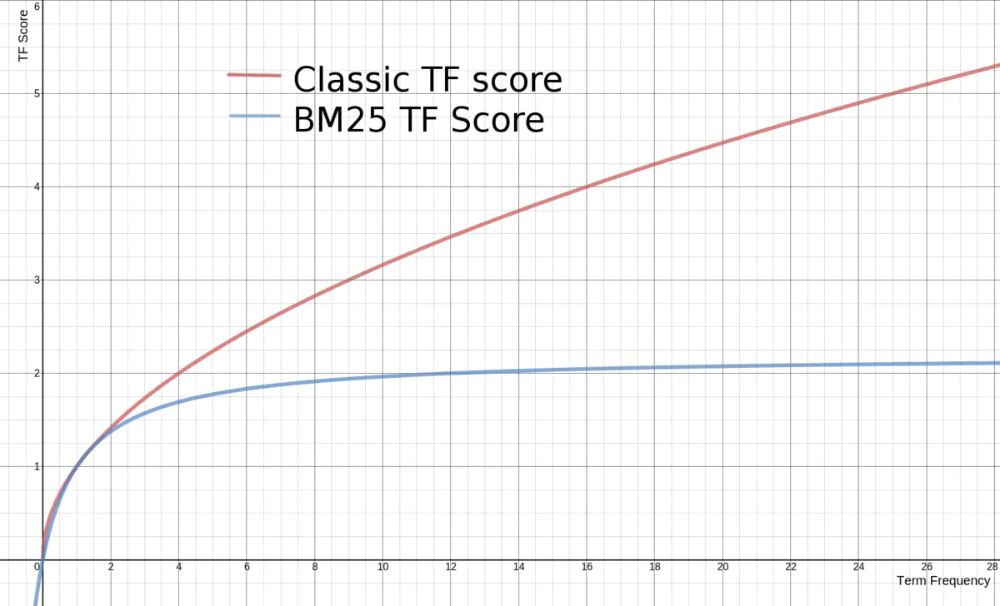

## ES 原理


### 分词

- 词条

词条是索引里面最小的存储和查询单元。一般来说，在英文语境中词条是一个单词，在中文语境中词条指的是分词后的一个词组。

- 词典又称字典
词典是词条的集合。单词词典一般是由网页或文章集合中出现过的所有词构成的字符串集合。

- 词典和倒排表是分两部分存储的，词典存储在内存中，倒排表存储在磁盘上。

### ES相关技术

#### 倒排索引


**核心结构**


#### FST压缩算法


1）空间占用小。通过对词典中单词前缀和后缀的重复利用，压缩了存储空间；
2）查询速度快

B-Tree通过减少磁盘寻道次数来提高查询性能，Elasticsearch也是采用同样的思路，直接通过内存查找term，不读磁盘，但是如果term太多，term dictionary也会很大，放内存不现实，于是有了**Term Index**，就像字典里的索引页一样，A开头的有哪些term，分别在哪页，可以理解term index是一颗树

所以term index不需要存下所有的term，而仅仅是他们的一些前缀与Term Dictionary的block之间的映射关系，再结合FST(Finite State Transducers)的压缩技术，可以使term index缓存到内存中。从term index查到对应的term dictionary的block位置之后，再去磁盘上找term，大大减少了磁盘随机读的次数

#### Frame of Reference压缩算法

一种增量编码的方式将一系列 ID 进行压缩存储，即称为Frame Of Reference的压缩方式（FOR）


备注：`227` 的二进制是 `1110 0011`，`30` 的二进制是 `0001 1110`。为了保证数据不丢失，则位数至少要能存储最大的数字，自然前者用8位，后者用5位

#### 跳表(Skip list)

多个field索引的联合查询


#### 整个流程

“将磁盘里的东西尽量搬进内存减少磁盘随机读取次数(同时也利用磁盘顺序读特性)，结合各种奇技淫巧的压缩算法，用及其苛刻的态度使用内存。”

### ES评分机制

ES最常用的评分模型是 `TF/IDF`和`BM25`，**TF-IDF属于向量空间模型，而BM25属于概率模型**

在ES 5.0版本之前使用了TF/IDF算法实现，而在5.0之后默认使用BM25方法实现。

#### TF/IDF

TF：词频，即分数和词频正相关

IDF：**逆文档频率**，一个词在N篇文章都出现了，那么分数自然就下降了，分数和IDF负相关

TF/IDF算法简单来说就是：一个词语在某一篇文档中出现次数越多，同时在所有文档中出现次数越少，那么该文档越能与其它文章区分开来，评分就会越高。

#### BM25

BM25做了两点优化：

一、传统的TF值理论上是可以无限大的。而BM25与之不同，它在TF计算方法中增加了一个常量k，用来限制TF值的增长极限。下面是两者的公式：

```java
传统 TF Score = sqrt(tf)
BM25的 TF Score = ((k + 1) * tf) / (k + tf)
```

二、引入字段长度的归一化，即正确看待文档长度

字段某个词的频率所带来的重要性会被这个字段长度抵消，但是在实际的评分函数中会将所有字段以同等方式对待，认为所有较短的title 比较长的body 字段更重要。

BM25 当然也认为较短字段应该有更多的权重，但是它会分别考虑每个字段内容的平均长度，这样就能区分短 `title` 字段和 `长` title 字段。

BM25的TF公式里，除了k外，引入另外两个参数：L和b。L是文档长度与平均长度的比值。如果文档长度是平均长度的2倍，则L＝2。b是一个常数，它的作用是规定L对评分的影响有多大。加了L和b的公式变为：

```java
TF Score = ((k + 1) * tf) / (k * (1.0 - b + b * L) + tf)
```

最终BM的公式为：

```java
simlarity = IDF * ((k + 1) * tf) / (k * (1.0 - b + b * (|d|/avgDl)) + tf)
```




#### ES 默认配置

```json
{
    "settings":{
        "index":{
            "analysis":{
                "analyzer":"ik_smart"
            }
        },
        "similarity":{
            "my_custom_similarity":{
                "type":"BM25",
                "k1":1.2,
                "b":0.75,
                "discount_overlaps":true
            }
        }
    }
}
```

- `k1`：控制对于得分而言词频（TF）的重要性，默认为1.2。
- `b`：是介于0 ~ 1之间的数值，控制文档篇幅对于得分的影响程度，默认为0.75。
- `discount_overlaps`：在某个字段中，多少个分词出现在同一位置，是否应该影响长度的标准化，默认值是true。

如果我们要使用某种特定的打分模型，并且希望应用到全局，那么就在`elasticsearch.yml`配置文件中加入：

```java
index.similarity.default.type: BM25
```

#### ES 评分细节

ES背后的评分过程比我们想象的要复杂，有时候某个查询结果可能跟我们的预期不太一样，这时候可以通过`explain`让ES解释一下评分细节。

```json
{
  "query": {
    "match": {
      "title": "北京"
    }
  },
  "explain": true,
  "_source": "title", 
  "size": 1
}
```


### ES集群的形成

#### [传输层用于集群间系统通信方式](https://www.elastic.co/guide/en/elasticsearch/reference/current/modules-transport.html)

- Rest客户端通过HTTP将请求发送到您的ES集群，但是接收到客户端请求的节点肯定是要请求进一步传递给其它节点处理。传输层用于集群间的内部通信

- 节点间通信的方式。两个节点由很多长期存在的TCP连接组成。而且，ES要求这些连接需要保持open的状态

### ES基于分片的分页原理


- 正常分页，我们只需要指定limit 990,10,这样就能查询990-1000的数据了，但是ES由于是分片集群，数据都被分配到了不同的分片中，这个时候如何分页呢？

- 分片分页原理：
  - 但是在ES处理的时候，会分别从每个分片上拿到1000条数据
  - 然后在`coordinating`的节点上根据查询条件聚合出1000条记录
  - 最后返回其中的10条。
  - 所以分页越深，ES处理的开销就大，占用内存就越大。
  
- ES分页限制：
  - ES默认的分页深度是10000，也就是说from+size超过10000就会报错 
#### search after方案

  有时候我们会遇到一些业务场景，需要进行很深度的分页，但是可以不指定页数翻页，只要可以实时请求下一页就行。比如一些实时滚动的场景。

  - search after利用实时有游标来帮我们解决实时滚动的问题，简单来说前一次查询的结果会返回一个唯一的字符串，下次查询带上这个字符串，进行`下一页`的查询
  - 原理很简单：就是利用有序的特性，每页去取10条，比如三个分片，则只需要取出来30条，然后返回前10条即可。
  - 缺点：只能上下翻页，不能随机选择页数、如果数据发生变化，可能下次搜索的结果还有上次搜索的部分

#### scroll API方案

  还有一种查询场景，我们需要一次性或者每次查询大量的文档，但是对实时性要求并不高。ES针对这种场景提供了scroll api的方案。这个方案牺牲了实时性，但是查询效率确实非常高。

原理：条件不变的情况下，第一次查询会生产一个当前查询的结果快照，后面每次翻页都是基于这个快照进行查询，即使有新的数据也查询不到

  - 查询条件：查询的时候需要指定一个过期时间，比如1分钟，然后把上次的scroll_id带上

  - 查询结果：每次会返回一个scroll_id，然后作为下一次查询的条件 

  - `scroll`超过超时时间后，搜索上下文将自动删除。但是，如上[一节](https://www.elastic.co/guide/en/elasticsearch/reference/7.x/paginate-search-results.html#scroll-search-context)所述，保持滚动打开是有代价的， 因此，一旦不再使用`clear-scroll`API使用滚动，则应立即清除滚动 

#### scroll 为啥高效

ES的检索分为查询（query）和获取（fetch）两个阶段，query阶段比较高效，只是查询满足条件的文档id汇总起来。fetch阶段则基于每个分片的结果在coordinating节点上进行全局排序，然后最终计算出结果。

scroll查询的时候，在query阶段把符合条件的文档id保存在前面提到的`search context`里。 后面每次scroll分批取回只是根据scroll_id定位到游标的位置，然后抓取size大小的结果集即可。

#### scroll API方案缺点

  - 不能跳页、不能指定页数

  - 结果需要缓存快照、占用内存、且非实时数据

#### 官方不再建议 使用scroll

目前官方建议：我们不再建议使用scroll API进行深度分页。如果在分页浏览超过10,000个匹配项时需要保留索引状态，请使用[`search_after`](https://www.elastic.co/guide/en/elasticsearch/reference/7.x/paginate-search-results.html#search-after)带有时间点（PIT）的参数。

#### 使用search_after带有时间点（PIT）参数

参考：[ES 搜索建议](https://www.elastic.co/guide/en/elasticsearch/reference/7.x/paginate-search-results.html)

**步骤一、创建一个PIT**

```json
POST /my-index-000001/_pit?keep_alive=1m
```

```json
{
  "id": "返回的PIT ID"
}

```

**步骤二、正常搜索带上要指定PIT ID，指定缓存时间为1分钟等**

```json
GET /_search
{
  "size": 10000,
  "query": {
    "match" : {
      "user.id" : "elkbee"
    }
  },
  "pit": {
	    "id":  "PIT ID",       # 搜索的 PIT ID
	    "keep_alive": "1m"
  },
  "sort": [    # 对搜索结果进行排序
    {"@timestamp": "asc"},
    {"tie_breaker_id": "asc"}
  ]
}

```

搜索会返回一个新的PIT ID

```
{
  "pit_id" : "新的PIT ID",    # 该时间点更新了的 ID
  "took" : 17,
  "timed_out" : false,
  "_shards" : ...,
  "hits" : {
    "total" : ...,
    "max_score" : null,
    "hits" : [
      ...
      {
        "_index" : "my-index-000001",
        "_id" : "FaslK3QBySSL_rrj9zM5",
        "_score" : null,
        "_source" : ...,
        "sort" : [       # 返回的最后一个匹配的值                         
          4098435132000,
          "FaslK3QBySSL_rrj9zM5"
        ]
      }
    ]
  }
}
 
```

**步骤三、根据新的PIT ID进行搜索下一页数据**，但是query条件和sort条件不能变

form参数必须为0（默认）或者-1，然后把search_after填写上

```json
GET /_search
{
  "size": 10000,
  "query": {
    "match" : {
      "user.id" : "elkbee"
    }
  },
  "pit": {
	    "id":  "新的PIT ID",    # 先前搜索返回的 PIT ID
	    "keep_alive": "1m"
  },
  "sort": [
    {"@timestamp": "asc"},
    {"tie_breaker_id": "asc"}
  ],
  "search_after": [        # 对上一次搜索的最后一个匹配结果之后的值进行排序                        
    4098435132000,
    "FaslK3QBySSL_rrj9zM5"
  ]
} 
 
```

**步骤四、不用的时候记得把PIT删除**

```json
DELETE /_pit
{
    "id" : "xxxPIT ID"
}
 
```

