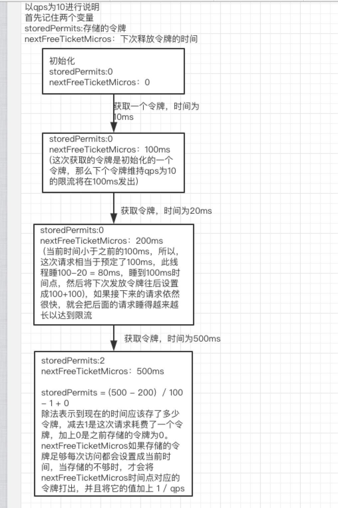

# 限流算法

###  0.滑动时间窗口限流

所谓的滑动时间算法指的是以当前时间为截止时间，往前取一定的时间，比如往前取 60s 的时间，在这 60s 之内运行最大的访问数为 100，此时算法的执行逻辑为，先清除 60s 之前的所有请求记录，再计算当前集合内请求数量是否大于设定的最大请求数 100，如果大于则执行限流拒绝策略，否则插入本次请求记录并返回可以正常执行的标识给客户端。

我们可以借助 Redis 的有序集合 ZSet 来实现时间窗口算法限流，实现的过程是先使用 ZSet 的 key 存储限流的 ID，score 用来存储请求的时间，每次有请求访问来了之后，先清空之前时间窗口的访问量，统计现在时间窗口的个数和最大允许访问量对比，如果大于等于最大访问量则返回 false 执行限流操作，负责允许执行业务逻辑，并且在 ZSet 中添加一条有效的访问记录，具体实现代码如下。

比如下面的代码，运行到一定的线程就会被限流

```java
import redis.clients.jedis.Jedis;

public class RedisLimit {
    // Redis 操作客户端
    static Jedis jedis = new Jedis("127.0.0.1", 6379);

    public static void main(String[] args) throws InterruptedException {
        for (int i = 0; i < 100; i++) {
            boolean res = isPeriodLimiting("java", 3, 10);
            if (res) {
                System.out.println("正常执行请求：" + i);
            } else {
                System.out.println("被限流：" + i);
            }
        }
        // 休眠 4s
        Thread.sleep(4000);
        // 超过最大执行时间之后，再从发起请求
        boolean res = isPeriodLimiting("java", 3, 10);
        if (res) {
            System.out.println("休眠后，正常执行请求");
        } else {
            System.out.println("休眠后，被限流");
        }
    }

    /**
     * 限流方法（滑动时间算法）
     * @param key      限流标识
     * @param period   限流时间范围（单位：秒）
     * @param maxCount 最大运行访问次数
     * @return
     */
    private static boolean isPeriodLimiting(String key, int period, int maxCount) {
        long nowTs = System.currentTimeMillis(); // 当前时间戳
        // 删除非时间段内的请求数据（清除老访问数据，比如 period=60 时，标识清除 60s 以前的请求记录）
        jedis.zremrangeByScore(key, 0, nowTs - period * 1000);
        long currCount = jedis.zcard(key); // 当前请求次数
        if (currCount >= maxCount) {
            // 超过最大请求次数，执行限流
            return false;
        }
        // 未达到最大请求数，正常执行业务
        jedis.zadd(key, nowTs, "" + nowTs); // 请求记录 +1
        return true;
    }
}
```

此实现方式存在的缺点有两个：

- 使用 ZSet 存储有每次的访问记录，如果数据量比较大时会占用大量的空间，比如 60s 允许 100W 访问时；
- 此代码的执行非原子操作，先判断后增加，中间空隙可穿插其他业务逻辑的执行，最终导致结果不准确。

但是也有优点：

- 可以灵活设置限流的时间，比如10分钟限流100，1小时限流1万等
- 针对并发redis不安全，也可以用LUA解决，当然你想到的Redis早就想到了，参见下文的Redis令牌桶限流

### 1. 漏桶算法

漏桶算法思路很简单，水（请求）先进入到漏桶里，漏桶以一定的速度出水，当水流入速度过大会直接溢出，可以看出漏桶算法能强行限制数据的传输速率


漏桶算法的实现步骤是，先声明一个队列用来保存请求，这个队列相当于漏斗，当队列容量满了之后就放弃新来的请求，然后重新声明一个线程定期从任务队列中获取一个或多个任务进行执行，这样就实现了漏桶算法。

- 相当于注入水，流出来的就是访问成功的请求
- 输入速率可能很大，但是输出速率保持不变

漏桶算法最经典的应用就是：Nginx限流

### 2. 令牌桶算法

漏桶算法能够强行限制数据的传输速率，而令牌桶算法在能够限制数据的平均传输速率外，**还允许某种程度的突发传输**。在令牌桶算法中，只要令牌桶中存在令牌，那么就允许突发地传输数据直到达到用户配置的门限，**因此它适合于具有突发特性的流量**。

[guava实现源码地址](https://github.com/google/guava/blob/master/guava/src/com/google/common/util/concurrent/RateLimiter.java)

[原理推荐阅读](https://segmentfault.com/a/1190000012875897)

#### 1. 非阻塞式

非阻塞式获取令牌：请求进来后，若令牌桶里没有足够的令牌，会尝试等待设置好的时间（这里写了1000ms），其会自动判断在1000ms后，这个请求能不能拿到令牌，如果不能拿到，直接返回抢购失败。如果timeout设置为0，则等于阻塞时获取令牌。

```java
rateLimiter.tryAcquire(1000, TimeUnit.MILLISECONDS)
```

#### 2. 阻塞式

阻塞式获取令牌：请求进来后，若令牌桶里没有足够的令牌，就在这里阻塞住，等待令牌的发放。

```java
rateLimiter.acquire()
```

#### 3.令牌是如何产生的？

根据令牌桶算法，桶中的令牌是持续生成存放的，有请求时需要先从桶中拿到令牌才能开始执行，谁来持续生成令牌存放呢？

- 一种解法是，开启一个定时任务，由定时任务持续生成令牌。这样的问题在于会极大的消耗系统资源，如，某接口需要分别对每个用户做访问频率限制，假设系统中存在6W用户，则至多需要开启6W个定时任务来维持每个桶中的令牌数，这样的开销是巨大的
- 另一种解法则是延迟计算，如下`resync`函数。该函数会在每次获取令牌之前调用，其实现思路为，若当前时间晚于nextFreeTicketMicros，则计算该段时间内可以生成多少令牌，将生成的令牌加入令牌桶中并更新数据。这样一来，只需要在获取令牌时计算一次即可

Guava有两种限流模式，一种为稳定模式(SmoothBursty:令牌生成速度恒定)，一种为渐进模式(SmoothWarmingUp:令牌生成速度缓慢提升直到维持在一个稳定值)
两种模式实现思路类似，主要区别在等待时间的计算上，本篇重点介绍SmoothBursty

在调用`create`接口时，实际实例化的为`SmoothBursty`类

```java
public static RateLimiter create(double permitsPerSecond) {
    return create(permitsPerSecond, SleepingStopwatch.createFromSystemTimer());
}

static RateLimiter create(double permitsPerSecond, SleepingStopwatch stopwatch) {
    RateLimiter rateLimiter = new SmoothBursty(stopwatch, 1.0 /* maxBurstSeconds */);
    rateLimiter.setRate(permitsPerSecond);
    return rateLimiter;
}
```

在解析SmoothBursty原理前，重点解释下SmoothBursty中几个属性的含义

```java
//在RateLimiter未使用时，最多存储几秒的令牌
 final double maxBurstSeconds;
//当前存储令牌数
double storedPermits;
//最大存储令牌数=maxBurstSeconds * stableIntervalMicros(见下文)
double maxPermits;
//添加令牌时间间隔=SECONDS.toMicros(1L) / permitsPerSecond；(1秒/每秒的令牌数)
double stableIntervalMicros;
 /**
 * 下一次请求可以获取令牌的起始时间
 * 由于RateLimiter允许预消费，上次请求预消费令牌后
 * 下次请求需要等待相应的时间到nextFreeTicketMicros时刻才可以获取令牌
 */
private long nextFreeTicketMicros = 0L; 
```


```java
//代码位置：SmoothRateLimiter.resync()
void resync(long nowMicros) {
    // if nextFreeTicket is in the past, resync to now
    if (nowMicros > nextFreeTicketMicros) {
      double newPermits = (nowMicros - nextFreeTicketMicros) / coolDownIntervalMicros();
      storedPermits = min(maxPermits, storedPermits + newPermits);
      nextFreeTicketMicros = nowMicros;
    }
}
```

该函数用于获取requiredPermits个令牌，并返回需要等待到的时间点
其中，`storedPermitsToSpend`为桶中可以消费的令牌数，`freshPermits`为还需要的(需要补充的)令牌数，根据该值计算需要等待的时间，追加并更新到`nextFreeTicketMicros`

需要注意的是，该函数的返回是更新前的(上次请求计算的)`nextFreeTicketMicros`，而不是本次更新的`nextFreeTicketMicros`，通俗来讲，**本次请求需要为上次请求的预消费行为埋单**，这也是RateLimiter可以预消费(处理突发)的原理所在。若需要禁止预消费，则修改此处返回更新后的`nextFreeTicketMicros`值。

#### 4.令牌桶里可以存储多少令牌？

回头来看`SmoothBursty`的构造函数

```java
SmoothBursty(SleepingStopwatch stopwatch, double maxBurstSeconds) {
  super(stopwatch);
  this.maxBurstSeconds = maxBurstSeconds; // 最大存储maxBurstSeconds秒生成的令牌
}

@Override
void doSetRate(double permitsPerSecond, double stableIntervalMicros) {
  double oldMaxPermits = this.maxPermits;
  maxPermits = maxBurstSeconds * permitsPerSecond; // 计算最大存储令牌数
  if (oldMaxPermits == Double.POSITIVE_INFINITY) {
    // if we don't special-case this, we would get storedPermits == NaN, below
    storedPermits = maxPermits;
  } else {
    storedPermits =
        (oldMaxPermits == 0.0)
            ? 0.0 // initial state
            : storedPermits * maxPermits / oldMaxPermits;
  }
}
```

桶中可存放的最大令牌maxPermits=maxBurstSeconds*permitsPerSecond

即桶中存储的最大令牌=最大能存储多少秒的令牌数*每次生成令牌的时间间隔

#### 5.如何理解突发性流量？

假如一桶水里面有50个令牌，但是我们的速率是要控制在10个/s，那么在稳定情况下，一秒钟确实只能请求10个，但是假如一段时间请求速度变慢，那么桶里面积攒了一些令牌，那么我们就能一下子取走50个令牌，突破速率的限制。 

- 相当于水桶里一直有水，而且会以一定的速率滴出来，获取水滴成功的请求就是访问成功的请求
- 以固定的速率向桶里添加令牌，允许输出速率根据突发大小而定

---

举个例子，一个系统限制 60 秒内的最大访问量是 60 次，换算速率是 1 次/秒，如果在一段时间内没有访问量，那么对漏桶而言此刻是空的。现在，一瞬间涌入 60 个请求，那么流量整形后，漏桶会以每秒 1 个请求的速度，花上 1 分钟将 60 个请求漏给下游。换成令牌桶的话，则是从令牌桶中一次性取走 60 个令牌，一下子塞给下游。

---

#### 6.如何理解预消费？

通俗来讲，**本次请求需要为上次请求的预消费行为埋单**，这也是RateLimiter可以预消费(处理突发)的原理所在。

但是上一个预支没有完成之前，本次不能预支，但是上一个如果完成了，本次就能预支

#### 7. 画个图说明下令牌的产生和消费

下图QPS=10，也就是每100ms释放一个令牌的阻塞式获取令牌的过程，因为阻塞的时候要睡眠

1. 初始化的时候令牌桶里面没有令牌，下次生产令牌的时间为0
2. 第一次在10ms获取的时候拿到了第一个令牌，但是由于预先消费，会把下次释放令牌的时间更新为nextTime=100ms
3. 第二次在20ms获取令牌，但是明显小于nextTime=100ms，相当于它要预定100ms的令牌，但是桶里面没有令牌，所以它要睡眠到100毫秒的时候才能拿到锁，同时把nextTime设置为200
   - 第二次预支了吗？其实也可以理解它预支了，只不过它的预支不能直接预支
   - 可以简单的理解为前面一个人预支的令牌还没有还完的时候必须等待，只要上一个人还完了，你才能预支
   - 最终第二次还是预支了100ms
4. 第三次500ms的时候获取令牌，这个时候其实已经存储了（500-200）/100=3个令牌，这次会取走一个，所以桶里面还有2个




### 3. redis令牌桶限流

```sql
> cl.throttle mylimit 15 30 60
1）（integer）0 # 0 表示获取成功，1 表示拒绝
2）（integer）15 # 漏斗容量
3）（integer）14 # 漏斗剩余容量
4）（integer）-1 # 被拒绝之后，多长时间之后再试（单位：秒）-1 表示无需重试
5）（integer）2 # 多久之后漏斗完全空出来
```

redis 4.0 以后开始支持扩展模块，[redis-cell](https://github.com/brandur/redis-cell) 是一个用rust语言编写的基于令牌桶算法的的限流模块，提供原子性的限流功能，并允许突发流量，可以很方便的应用于分布式环境中。

####  


# 秒杀里面的限流和抢购如何结合？

### 1. 乐观锁

如果采用乐观锁更新，普通的更新如下，

- 普通CAS更新，但是会出现ABA问题，详情请查看CAS讲解

```sql
update table set value = newValue where  and id =XXX and value = #{oldValue}
//oldValue就是我们执行前查询出来的值
```

- 带版本号的更新方式，但是更新成功率会很低

```sql
update table set value = newValue ，vision = vision + 1 where id =XXX and
value = #{oldValue} and vision = #{vision} 
// 判断原来的值和版本号是否匹配，中间有别的线程修改，值可能相等，但是版本号100%不一样
```

- 针对秒杀的可以进一步优化：
  - 因为秒杀系统，库存都是依次递减的，所以不需要有版本号标识

```sql
update table set value = oldValue -1 where  and id =XXX and value = #{oldValue}
```

#### 乐观锁和限流的结合

- controller

```java
    @RequestMapping("/createOptimisticOrder/{sid}")
    @ResponseBody
    public String createOptimisticOrder(@PathVariable int sid) {
        // 阻塞式获取令牌
        //LOGGER.info("等待时间" + rateLimiter.acquire());
        // 非阻塞式获取令牌
        if (!rateLimiter.tryAcquire(1000, TimeUnit.MILLISECONDS)) {
            LOGGER.warn("你被限流了，真不幸，直接返回失败");
            return "购买失败，库存不足";
        }
        int id;
        try {
            id = orderService.createOptimisticOrder(sid);
            LOGGER.info("购买成功，剩余库存为: [{}]", id);
        } catch (Exception e) {
            LOGGER.error("购买失败：[{}]", e.getMessage());
            return "购买失败，库存不足";
        }
        return String.format("购买成功，剩余库存为：%d", id);
    }
```

- service
  - 当前service没有加事务，而且里面的子方法（减少库存、创建订单）也没有加事务

```java

    @Override
    public int createOptimisticOrder(int sid) {
        //校验库存
        Stock stock = checkStock(sid);
        //乐观锁更新库存
        saleStockOptimistic(stock);
        //创建订单
        int id = createOrder(stock);
        return stock.getCount() - (stock.getSale()+1);
    }
```

- 核心乐观锁更新代码

```sql
  <update id="updateByOptimistic" parameterType="cn.monitor4all.miaoshadao.dao.Stock">
    update stock
    <set>
      sale = sale + 1,
    </set>
    WHERE id = #{id,jdbcType=INTEGER}
    AND sale = #{sale,jdbcType=INTEGER}
  </update>
```


所以我们用乐观锁的时候，如果配合限流，可以不用事务，但是真实的场景是秒杀成功之后要下单，要发短信或者邮件等一些列操作，所以还是要有事务的，鉴于现在的下单比较简单，所以没有用事务

- 问题：上述的乐观锁更新代码的Mapper层面**updateByOptimistic**这个会有很大问题，就是假如有100个人都校验库存有剩余，然后剩余库存都是50个，然后这50个人用**updateByOptimistic**乐观锁更新，但是最后只有一个人会成功，所以成功率极低，那么你就会说能不能用下面的判断条件

```sql
    WHERE id = #{id,jdbcType=INTEGER}
    AND sale >0
```

可以用，但是用了就不是MVCC乐观锁了

### 2. 悲观锁

- controller

```java
    /**
     * 事务for update更新库存
     * @param sid
     * @return
     */
    @RequestMapping("/createPessimisticOrder/{sid}")
    @ResponseBody
    public String createPessimisticOrder(@PathVariable int sid) {
        int id;
        try {
            id = orderService.createPessimisticOrder(sid);
            LOGGER.info("购买成功，剩余库存为: [{}]", id);
        } catch (Exception e) {
            LOGGER.error("购买失败：[{}]", e.getMessage());
            return "购买失败，库存不足";
        }
        return String.format("购买成功，剩余库存为：%d", id);
    }
```

- service
  - service方法添加事务，如果遇到回滚，则返回Exception，并且事务传播使用`PROPAGATION_REQUIRED–支持当前事务，如果当前没有事务，就新建一个事务`

```java
    @Transactional(rollbackFor = Exception.class, propagation = Propagation.REQUIRED)
    @Override
    public int createPessimisticOrder(int sid){
        //校验库存(悲观锁for update)
        Stock stock = checkStockForUpdate(sid);
        //更新库存
        saleStock(stock);
        //创建订单
        int id = createOrder(stock);
        return stock.getCount() - (stock.getSale());
    }
```

- 悲观锁在大量请求的请求下，有着更好的卖出成功率。

- 核心是：`Stock selectByPrimaryKeyForUpdate(Integer id);` for update锁住当前记录

  但是需要注意的是，如果请求量巨大，悲观锁会导致后面的请求进行了长时间的阻塞等待，用户就必须在页面等待，很像是“假死”，可以通过配合令牌桶限流（参考乐观锁），或者是给用户显著的等待提示来优化。


## 感谢

[github项目地址](https://github.com/qqxx6661/miaosha/tree/master/miaosha-dao)

[微信公众号讲解](https://mp.weixin.qq.com/s/i5QLxas3h8XauA3HvW9f8w)

```java
https://github.com/qqxx6661/miaosha/tree/master/miaosha-dao
https://mp.weixin.qq.com/s/i5QLxas3h8XauA3HvW9f8w
```

## 额外

此外令牌桶限流算法，其实上述有些麻烦，如果想在N个接口都是用推荐用

- [AOP+注解+令牌桶实现指定接口限流](https://mp.weixin.qq.com/s/vyQZvJm5sjnEnrpi1siP2A)
- AOP+注解+令牌桶实现通用接口限流

  - 而且是不同接口对限流的速率不一样

- [redis+lua限流](https://mp.weixin.qq.com/s/v7aIF__Z_2ALjH3JJFFXpg)

