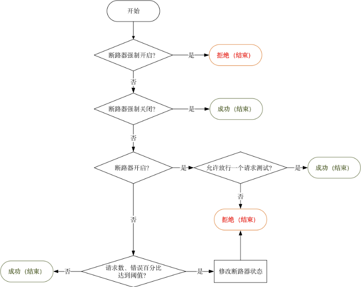
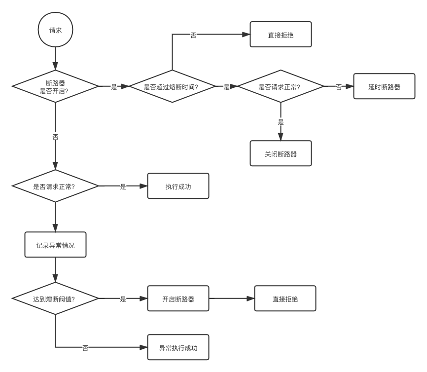
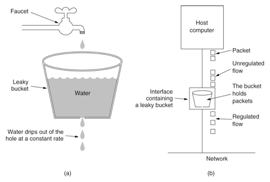
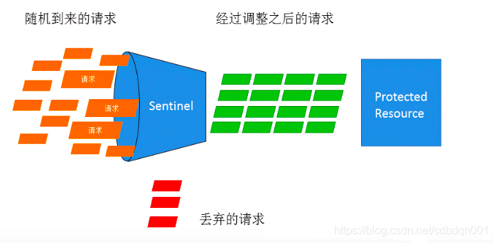
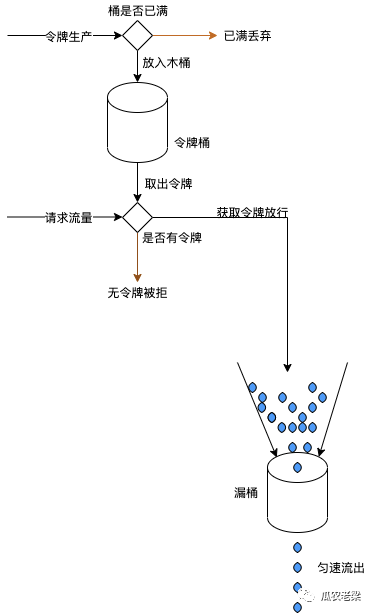

### 熔断的必要性

假如ABC三个服务，B因为C服务宕机出现了异常，线程B的线程还在为A相应。这样随着并发进来的时候，B服务线程池出现爆满而导致CPU上升，这个时候B服务的其他接口也会因此收到CPU的上升导致相应速度下降，进而出现服务之间的连锁反应——雪崩

### 1、熔断组件Hystrix

Hystrix 通过隔离服务之间的访问来实现分布式系统中延迟及容错机制来解决服务雪崩场景并且基于hystrix可以提供备选方案(fallback)。但是官网上已经停止维护并推荐使用resilience4j

原理是：hystrix提出了一种资源隔离的策略，利用信号量或者线程池对资源隔离。

流程是：




#### 1.1项目如何使用Hystrix

首先在启动类中添加注解：@EnableHystrix，不加的话单独给一个方法即使添加@HystrixCommand注解也不会生效，但是为啥feign会默认可以，因为feign默认开启了

#### 1.2Hystrix注解

```java
public @interface HystrixCommand {
    String groupKey() default "";//默认方法名
 
    String commandKey() default "";//默认方法名
 
    String threadPoolKey() default "";//默认方法名
 
    String fallbackMethod() default "";//fallback函数
 
    HystrixProperty[] commandProperties() default {};//command相关配置
 
    HystrixProperty[] threadPoolProperties() default {};// 线程池相关配置
 
    //  忽略熔断异常,调用服务时，除了HystrixBadRequestException之外，
    //  其他@HystrixCommand修饰的函数抛出的异常均会被Hystrix认为命令执行失败而触发服务降级的处理逻辑（调用fallbackMethod指定的回调函数）
    //  所以当需要在命令执行中抛出不触发降级的异常时来使用它，通过这个参数指定，哪些异常抛出时不触发降级（不去调用fallbackMethod），而是将异常向上抛出。
    Class<? extends Throwable>[] ignoreExceptions() default {};
 
    ObservableExecutionMode observableExecutionMode() default ObservableExecutionMode.EAGER;
 
    HystrixException[] raiseHystrixExceptions() default {};//任何不可忽略的异常都包含在HystrixRuntimeException中；
 
    String defaultFallback() default "";//默认fallback
}
```


#### 1.3单独方法Hystrix

```java
	@HystrixCommand(
            groupKey = "order-service-getPaymentInfo",
            commandKey = "getPaymentInfo",
            threadPoolKey = "orderServicePaymentInfo",
            commandProperties = {
                    @HystrixProperty(name = "execution.isolation.thread.timeoutInMilliseconds",value = "1000")
            },
            threadPoolProperties = {
                    @HystrixProperty(name = "coreSize" ,value = "6"),
                    @HystrixProperty(name = "maxQueueSize",value = "100"),
                    @HystrixProperty(name = "keepAliveTimeMinutes",value = "2"),
                    @HystrixProperty(name = "queueSizeRejectionThreshold",value = "100")

            },
            fallbackMethod = "getPaymentInfoFallback"
    )
    @RequestMapping(value = "/getpayment/{id}",method = RequestMethod.GET)
    public ResultInfo getPaymentInfo(@PathVariable("id") Long id) {
         ...
    }
    public ResultInfo getPaymentInfoFallback(@PathVariable("id") Long id) {
        log.info("已经进入备选方案了，下面交由自由线程执行"+Thread.currentThread().getName());
        return new ResultInfo();
    }
```

#### 1.4Feign使用Hystrix

- 简单配置fallback

```java
@FeignClient(name = "user",fallback = UserFallbackService.class)
public interface UserClient
{
    @RequestMapping("/user/hello")
    String hello();
}
 
 
@Component
public class UserFallbackService implements UserClient
{
    @Override
    public String hello()
    {
        String rt="";
        rt="少年，服务被降级停用了，等等再来吧！！";
        return  rt;
    }
}
```

- 配置fallbackFactory

```java
@FeignClient(name = "hello", fallbackFactory = HelloServiceFallbackFactory.class)
public interface HelloService {
 
    /**
     * 调用服务提供方的输出接口.
     *
     * @param str 用户输入
     * @return hello result
     */
    @GetMapping("/hello/{str}")
    String hello(@PathVariable("str") String str);
}
 
 
 
 
@Component
public class HelloServiceFallbackFactory implements FallbackFactory<HelloServiceFallback> {
 
    @Override
    public HelloServiceFallback create(Throwable throwable) {
        return new HelloServiceFallback(throwable);
    }
}
 
 
 
 
public class HelloServiceFallback implements HelloService {
 
    private Throwable throwable;
 
    HelloServiceFallback(Throwable throwable) {
        this.throwable = throwable;
    }
 
    /**
     * 调用服务提供方的输出接口.
     *
     * @param str 用户输入
     * @return
     */
    @Override
    public String hello(String str) {
        return "服务调用失败，降级处理。异常信息：" + throwable.getMessage();
    }
}
```

##### Feign使用Hystrix配置注意

默认一个Feign类中用的线程池是一个，所以如果想要某个方法单独用一个线程池，就要分开写

#### 1.5Hystrix高级配置之ThreadPool

| 属性                        | 说明                                                         | 默认值                                                       |
| :-------------------------- | :----------------------------------------------------------- | :----------------------------------------------------------- |
| coreSize                    | 核心线程池大小                                               | 10                                                           |
| maximumSize                 | 最大线程池大小                                               | 10                                                           |
| keepAliveTimeMinutes        | 线程存活时间，单位分钟                                       | 1                                                            |
| maxQueueSize                | 最大队列大小此属性仅在初始化时适用，因为在不重新启动不支持的线程执行程序的情况下，无法调整或更改队列实现的大小。 | 默认-1，即不使用队列，使用的是SynchronousQueue如果是正值，将配合使用LinkedBlockingQueue |
| queueSizeRejectionThreshold | 队列拒绝阈值，即认为的设置最大队列大小，即使maxQueueSize没有达到最大值，也会发生拒绝为啥会存在这个属性？因为maxQueueSize除了重启不能修改，但是我们能更改这个属性来实际影响队列大小。所以此属性不适用maxQueueSize == -1的情况 | 5                                                            |


 线程池大小如何设置才算合理，这里有一个公式：

线程池大小=QPS*（99%的请求响应时间）+预留缓冲线程数

比如：QPS=30，99%的平均响应时间为0.2秒，预留缓冲线程数为4，则线程池大小=30*0.2+4=10

#### 1.6Hystrix高级配置之Command

| 属性                                                         | 类型                                                         | 说明                                                         | 默认值 | 高级属性 |
| :----------------------------------------------------------- | :----------------------------------------------------------- | :----------------------------------------------------------- | :----- | :------- |
| 属性                                                         | 类型                                                         | 说明                                                         | 默认值 | 高级属性 |
| execution.isolation.thread.timeoutInMilliseconds             | Exception                                                    | 超时时间，单位ms                                             | 1000   | 是       |
| execution.timeout.enabled 对应hystrix的withExecutionTimeoutEnabled | 是否应该具有超时                                             | true                                                         |        |          |
| execution.isolation.thread.interruptOnTimeout                | 在超时发生时是否应中断执行                                   | true                                                         |        |          |
| execution.isolation.thread.interruptOnCancel                 | 在发生取消时是否应中断执行                                   | false                                                        |        |          |
| execution.isolation.semaphore.maxConcurrentRequests          | 信号量模式下允许的最大并发数如果达到此最大并发限制，则后续请求将被拒绝。 | 10                                                           |        |          |
| fallback.isolation.semaphore.maxConcurrentRequests           | fallback                                                     | 不管是信号量还是线程模式，fallback统一用的都是信号量模式进行fallback信号量模式下允许方法从调用线程进行的最大请求数如果达到了最大并发限制，则后续请求将被拒绝，并且由于无法检索到任何后备，将引发异常。 | 10     |          |
| fallback.enabled                                             | 在发生故障或拒绝时是否尝试fallback如果是false，代码中的fallback逻辑将会失效 | true                                                         |        |          |
| circuitBreaker.enabled                                       | 熔断                                                         | 断路器是否将用于跟踪运行状况以及在跳闸时用于短路请求。       | true   | 否       |
| circuitBreaker.forceOpen                                     | 如果该属性为true，则将使断路器进入断开（跳闸）状态，在该状态下断路器将拒绝所有请求 | false                                                        |        |          |
| circuitBreaker.forceClosed                                   | 如果为true，此属性将使断路器进入闭合状态，在该状态下，无论错误百分比如何，断路器都将允许请求 | false                                                        |        |          |
| circuitBreaker.requestVolumeThreshold                        | 10秒内熔断触发的最小请求数例如，如果该值为20，则如果在滚动窗口（例如10秒的窗口）中仅收到19个请求，则即使所有19个失败，也不会熔断 | 20                                                           |        |          |
| circuitBreaker.errorThresholdPercentage                      | 触发熔断请求的最小百分比                                     | 50                                                           |        |          |
| circuitBreaker.sleepWindowInMilliseconds                     | 熔断时间窗口大小，就是熔断时长，单位ms                       | 5000                                                         |        |          |


这里需要注意的是：如果业务的执行时间大于1秒，比如文件上传等，可以适当修改

#### 1.7Hystrix信号量模式和线程池模式

**hystrix执行隔离策略：**
信号量隔离：它在调用线程上执行，并发请求受信号量限制
线程池隔离：它在单独的线程上执行，并发请求受线程池中线程数的限制
区别：
1、线程池隔离会对每个资源单独用一个线程池，这样如果当前线程池耗尽，最多也就是当前线程池的接口服务受影响，其它仍然正常。
2、信号量隔离，不需要格外线程切换，避免了线程切换开销，但是信号量不支持异步，也不支持超时，也就是说当服务不可用时，信号量会控制超过限制的请求立刻返回，
但是已经持有信号量的线程只能等待服务响应或者超时返回，即可能会出现长时间的等待。
3、线程池模式下，当超过指定时间未响应的服务，Hystrix会通过响应中断的方式通知线程立刻结束执行并返回

| 隔离方式   | 是否支持超时     | 是否支持熔断                                                 | 隔离原理             | 是否是异步调用                         | 资源消耗                                     |
| ---------- | ---------------- | ------------------------------------------------------------ | -------------------- | -------------------------------------- | -------------------------------------------- |
| 线程池隔离 | 支持，可直接返回 | 支持，当线程池到达maxSize后，再请求会触发fallback接口进行熔断 | 每个服务单独用线程池 | 可以是异步，也可以是同步。看调用的方法 | 大，大量线程的上下文切换，容易造成机器负载高 |
| 信号量隔离 | 不支持           | 支持，当信号量达到maxConcurrentRequests后。再请求会触发fallback | 通过信号量的计数器   | 同步调用，不支持异步                   | 小，只是个计数器                             |

HystrixCommand：默认策略是线程池隔离
HystrixObseravleCommand:默认策略是信号量隔离

#### 1.8Hystrix相关疑惑？

| QA                                                           | 说明                                                         |
| :----------------------------------------------------------- | :----------------------------------------------------------- |
| fallback.enabled慎用                                         | 参数的作用是让代码中的fallback起作用如果修改为false，则代码中的fallback逻辑失效 |
| 如果要给一个不是feign的接口使用hystrix，需要添加@EnableHystrix注解 | feign默认开启，所以如果项目中全都是feign在使用@EnableHystrix则不需要添加注解 |
| 熔断时间结束后的疑问？比如熔断时间为10秒，因为熔断时间结束后是半开状态，如果结束后是正常的请求，则关闭熔断器，如果是错误请求则熔断器继续打开 | 问题一：因为半开状态失败请求导致重新打开的熔断器，新一轮的熔断时间10秒内的所有请求也都会拒绝吗？是的会拒绝 |
|                                                              | 问题二：假如半开状态下又发了一次正常的请求，然后熔断器关闭了。但是这个时候又发了1次错误的请求，刚好又到了统计时间的阀值，会不会又给熔断了？不会，因为每次关闭熔断后都会重新计算 |
| 一个类中所有的方法默认使用一个线程池                         | 所以如果用Hystrix的线程池模式进行熔断，但是不指定线程池，默认所有方法用一个线程池。这样会导致一个后果：一个方法占据所有线程后，其它方法由于没有线程可用，直接拒绝了。推荐使用方案：如果是这样，可以为每个方法设定一个线程池 |
| 线程池配置举例说明                                           | 如果是线程池模式，如果maxQueueSize为-1，queueSizeRejectionThreshold即使设置也不生效 |
|                                                              | 线程池模式下，如果maxQueueSize为10，最大线程也为10，也就是说当前最多允许有20个请求通过，相当于限流的阀值为20 |
|                                                              | 线程池模式下，如果maxQueueSize为100，最大线程也为10，queueSizeRejectionThreshold=5，也就是说当前最多允许有10+5=15个请求通过，相当于限流的阀值为15 |
|                                                              | 如果线程池模式，如果maxQueueSize为-1，最大线程是10，此时限流的阀值是10 |
| 如果信号量模式下，所用线程池配置大小为10，队列为-1，相当于阀值为10，此时如果配置信号量最大并发为50，那么限流的阀值是50还是10？答案：50 | 如果配置为信号量模式，则不理会线程池相关的配置               |

### 2、熔断限流组件Sentinel

sentinel相比Hystrix多了很多功能，具体可以参考官网：https://github.com/alibaba/Sentinel/wiki/%E4%BB%8B%E7%BB%8D

这里主要说其中的熔断、降级以及热点数据这块

#### 2.1Sentinel流控

**sentinel流控官网：[https://github.com/alibaba/Sentinel/wiki/%E6%B5%81%E9%87%8F%E6%8E%A7%E5%88%B6](https://github.com/alibaba/Sentinel/wiki/流量控制)**

**何谓流控**：流量控制（flow control），其原理是监控应用流量的 QPS 或并发线程数等指标，当达到指定的阈值时对流量进行控制，以避免被瞬时的流量高峰冲垮，从而保障应用的高可用性。

**流控的方式有哪些**：流量控制主要有两种统计类型，一种是统计并发线程数，另外一种则是统计 QPS

**并发线程流控**：并发数控制用于保护业务线程池不被慢调用耗尽。

1、例如，当应用所依赖的下游应用由于某种原因导致服务不稳定、响应延迟增加，对于调用者来说，意味着吞吐量下降和更多的线程数占用，极端情况下甚至导致线程池耗尽。

2、为应对太多线程占用的情况，业内有使用隔离的方案，比如通过不同业务逻辑使用不同线程池来隔离业务自身之间的资源争抢（线程池隔离）。

3、这种隔离方案虽然隔离性比较好，但是代价就是线程数目太多，线程上下文切换的 overhead 比较大，特别是对低延时的调用有比较大的影响。

4、Sentinel 并发控制不负责创建和管理线程池，而是简单统计当前请求上下文的线程数目（正在执行的调用数目），如果超出阈值，新的请求会被立即拒绝，效果类似于信号量隔离。

5、并发数控制通常在调用端进行配置。

#### 流控模式：QPS和线程数

当 QPS 超过某个阈值的时候，则采取措施进行流量控制。流量控制的效果包括以下几种：直接拒绝、Warm Up、匀速排队

##### 流控效果一：直接拒绝

  表面意思，超过了就直接拒绝请求

##### 流控效果二：匀速排队

它的中心思想是，以固定的间隔时间让请求通过。

1、当请求到来的时候，如果当前请求距离上个通过的请求通过的时间间隔不小于预设值，则让当前请求通过；

2、否则，计算当前请求的预期通过时间，如果该请求的预期通过时间小于规则预设的 timeout 时间，则该请求会等待直到预设时间到来通过（排队等待处理）；

3、若预期的通过时间超出最大排队时长，则直接拒接这个请求。

- 超过的话就排队等待，等待有默认超时时间500ms，匀速排队是漏桶算法
- 这种方式主要用于处理间隔性突发的流量，可能第1秒会有很多流量进来，但是后面就空闲了，我们希望系统慢慢的处理请求，而不是第一秒拒绝太多请求

4、sentinel匀速排队模式暂时不支持 QPS > 1000 的场景。为啥？https://blog.csdn.net/gaoliang1719/article/details/109567962和https://www.daqianduan.com/17408.html

##### 流控效果三：warm up

**warm up（预热、冷启动）**：当系统长期处于低水位的情况下，当流量突然增加时，直接把系统拉升到高水位可能瞬间把系统压垮。通过"冷启动"，让通过的流量缓慢增加，在一定时间内逐渐增加到阈值上限，给冷系统一个预热的时间，避免冷系统被压垮

**简单的理解**：就是让系统在访问的时候并不是一开始就达到设定的阈值，而是慢慢的达到设定的阈值。

**举例分析**：比如设定QPS=100，这个QPS什么时候才会达到100呢？

系统会根据codeFactor（冷加载因子，默认为3），从阈值=100除以codeFactor=3，也就是刚开始QPS是100/3=33，经过预热时长（默认是10秒）设置为10秒，才达到设置的QPS阈值100

默认配置地址：

```java
com.alibaba.csp.sentinel.slots.block.flow.FlowRule
```

 折叠源码

```java
public class FlowRule extends AbstractRule {
    ...
    private int controlBehavior = 0;
    //预热时长
    private int warmUpPeriodSec = 10;
    private int maxQueueingTimeMs = 500;
    ...
```

| 属性              | 说明                                                   | 默认      |
| :---------------- | :----------------------------------------------------- | :-------- |
| `resource`        | `注解中定义的资源名称`                                 |           |
| count             | 限流阀值                                               |           |
| grade             | 限流策略，默认是QPS=1，线程数的方式是0                 | 1QPS      |
| controlBehavior   | 流量控制效果（0默认方式直接拒绝、1Warm Up、2匀速排队） | 0直接拒绝 |
| warmUpPeriodSec   | 预热冷启动期望的时间                                   | 10秒      |
| maxQueueingTimeMs | 最大排队等待时长（仅在匀速排队模式生效）               | 500       |

限流模式总结：

| 默认        | 模式     | 说明                                                         | 其它                                       |
| :---------- | :------- | :----------------------------------------------------------- | :----------------------------------------- |
| QPS、线程数 | 直接拒绝 |                                                              |                                            |
| QPS、线程数 | warm up  | 默认冷启动时间10秒系统会根据codeFactor（冷加载因子，默认为3），从阈值=100除以codeFactor=3，也就是刚开始QPS是100/3=33，经过预热时长（默认是10秒）设置为10秒，才达到设置的QPS阈值100 |                                            |
| QPS、线程数 | 排队等待 | 默认最大排队等待时间500ms                                    | 匀速排队模式暂时不支持 QPS > 1000 的场景。 |

为啥线程数限流同样支持排队和warm up，官网咋没有解释，其实sentinel的线程数限流其实是一种伪线程，它并没有创造实在的线程池来出来请求。排队和冷启动走的都是令牌桶的这一套

#### 2.2 sentinel熔断降级策略

https://github.com/alibaba/Sentinel/wiki/%E7%86%94%E6%96%AD%E9%99%8D%E7%BA%A7

##### 异常比例 (`ERROR_RATIO`)

1、当单位统计时长（statIntervalMs）内请求数目大于设置的最小请求数目，并且异常的比例大于阈值，则接下来的熔断时长内请求会自动被熔断。

2、经过熔断时长后熔断器会进入探测恢复状态（HALF-OPEN 状态），若接下来的一个请求成功完成（没有错误）则结束熔断，否则会再次被熔断。

3、异常比率的阈值范围是 `[0.0, 1.0]`，代表 0% - 100%。

##### 异常数 (`ERROR_COUNT`)

1、当单位统计时长内的异常数目超过阈值之后会自动进行熔断

2、经过熔断时长后熔断器会进入探测恢复状态（HALF-OPEN 状态），若接下来的一个请求成功完成（没有错误）则结束熔断，否则会再次被熔断


##### 慢调用比例 (`SLOW_REQUEST_RATIO`)

RT：(最大的响应时间）

1、选择以慢调用比例作为阈值，需要设置允许的慢调用 RT（即最大的响应时间），请求的响应时间大于该值则统计为慢调用

2、单位统计时长（`statIntervalMs`）内请求数目大于设置的最小请求数目，并且慢调用的比例大于阈值，则接下来的熔断时长内请求会自动被熔断

3、经过熔断时长后熔断器会进入探测恢复状态（HALF-OPEN 状态），若接下来的一个请求响应时间小于设置的慢调用 RT 则结束熔断，若大于设置的慢调用 RT 则会再次被熔断

##### 注意点

 在**异常比例和慢调用比例模式**下，有一个限定条件需要注意：就是**单位统计时间内请求的数量大于设置的最小请求数目**，如何理解呢？

即：单位时间内熔断触发的最小请求数，请求数小于该值时即使异常比率超出阈值也不会熔断

默认单位统计时间是1秒，最小请求数量默认值是：5，地址是：com.alibaba.csp.sentinel.slots.block.degrade.DegradeRule的DegradeRule变量

也就是说：如果1秒内请求数量没有超过5个，比如4个，那么有100秒都是这个效果，依然不会熔断，所以熔断是判断单位时间内，而且异常数量超过5个

#### 2.3图解降级策略



#### 2.4降级规则配置说明

熔断降级规则（DegradeRule）包含下面几个重要的属性：

| Field              | 说明                                                         | 默认值      |
| :----------------- | :----------------------------------------------------------- | :---------- |
| Field              | 说明                                                         | 默认值      |
| resource           | 资源名，即规则的作用对象                                     |             |
| grade              | 熔断策略，支持慢调用比例/异常比例/异常数策略0 慢调用比例、1异常比例、2异常数 | 0慢调用比例 |
| count              | 慢调用比例模式下为慢调用临界 RT（超出该值计为慢调用）；异常比例/异常数模式下为对应的阈值 |             |
| timeWindow         | 熔断时长，单位为 s                                           |             |
| minRequestAmount   | 熔断触发的最小请求数，请求数小于该值时即使异常比率超出阈值也不会熔断（1.7.0 引入） | 5           |
| statIntervalMs     | 统计时长（单位为 ms），如 60*1000 代表分钟级（1.8.0 引入）   | 1000 ms     |
| slowRatioThreshold | 慢调用比例阈值，仅慢调用比例模式有效（1.8.0 引入）           |             |

| 模式         | 需要参数                                                     | 其它 |
| :----------- | :----------------------------------------------------------- | :--- |
| 慢调用比例RT | 1、最大允许慢操作时间，注意阀值设置的应该ms格式的时间，比如2000代表2000ms2、时间窗口大小3、慢请求比例0-1即slowRatioThreshold参数 |      |
| 异常数       | 1、降级阀值2、时间窗口大小                                   |      |
| 异常比例     | 1、降级阀值2、时间窗口大小                                   |      |

#### 2.5 Sentinel注解说明

```java
public @interface SentinelResource {
      
    String value() default "";
 
    EntryType entryType() default EntryType.OUT;
 
    int resourceType() default 0;
 
 
    String blockHandler() default "";
 
    Class<?>[] blockHandlerClass() default {};
 
    String fallback() default "";
 
    String defaultFallback() default "";
 
    Class<?>[] fallbackClass() default {};
 
    Class<? extends Throwable>[] exceptionsToTrace() default {Throwable.class};
 
    Class<? extends Throwable>[] exceptionsToIgnore() default {};
}
```

下面关于注解的解释来自sentinel官网：

https://github.com/alibaba/Sentinel/wiki/%E6%B3%A8%E8%A7%A3%E6%94%AF%E6%8C%81

- `value`：资源名称，必需项（不能为空）

- `entryType`：entry 类型，可选项（默认为 `EntryType.OUT`）

- `blockHandler` / `blockHandlerClass`: `blockHandler`对应处理 `BlockException` 的函数名称，可选项。blockHandler 函数访问范围需要是 `public`，返回类型需要与原方法相匹配，参数类型需要和原方法相匹配并且最后加一个额外的参数，类型为 `BlockException`。blockHandler 函数默认需要和原方法在同一个类中。若希望使用其他类的函数，则可以指定 `blockHandlerClass` 为对应的类的 `Class` 对象，注意对应的函数必需为 static 函数，否则无法解析。

- ```
  fallbackfallback 函数名称，可选项，用于在抛出异常的时候提供 fallback 处理逻辑。fallback 函数可以针对所有类型的异常（除了exceptionsToIgnore里面排除掉的异常类型）进行处理
  ```

- exceptionsToIgnore

  里面排除掉的异常类型）进行处理。fallback 函数签名和位置要求：

  - 返回值类型必须与原函数返回值类型一致；
  - 方法参数列表需要和原函数一致，或者可以额外多一个 `Throwable` 类型的参数用于接收对应的异常。
  - fallback 函数默认需要和原方法在同一个类中。若希望使用其他类的函数，则可以指定 `fallbackClass` 为对应的类的 `Class` 对象，注意对应的函数必需为 static 函数，否则无法解析。

- defaultFallback
  
  （since 1.6.0）：默认的 fallback 函数名称，可选项，通常用于通用的 fallback 逻辑（即可以用于很多服务或方法）。默认 fallback 函数可以针对所有类型的异常（除了

- exceptionsToIgnore

  里面排除掉的异常类型）进行处理。若同时配置了 fallback 和 defaultFallback，则只有 fallback 会生效。defaultFallback 函数签名要求：
  
  - 返回值类型必须与原函数返回值类型一致；
  - 方法参数列表需要为空，或者可以额外多一个 `Throwable` 类型的参数用于接收对应的异常。
  - defaultFallback 函数默认需要和原方法在同一个类中。若希望使用其他类的函数，则可以指定 `fallbackClass` 为对应的类的 `Class` 对象，注意对应的函数必需为 static 函数，否则无法解析。

- `exceptionsToIgnore`（since 1.6.0）：用于指定哪些异常被排除掉，不会计入异常统计中，也不会进入 fallback 逻辑中，而是会原样抛出。

##### 特别注意

**特别地，若 blockHandler 和 fallback 都进行了配置，则被限流降级而抛出 `BlockException` 时只会进入 `blockHandler` 处理逻辑。**

**若未配置 `blockHandler`、`fallback` 和 `defaultFallback`，则被限流降级时会将 `BlockException` 直接抛出（若方法本身未定义 throws BlockException 则会被 JVM 包装一层 `UndeclaredThrowableException`）。**

**意思就是：如果熔断和限流同时发生，被打到限流blockHandler里面的流量只会进行限流处理，不会再进行熔断，而不是说优先限流**

### 3、Hystrix和Sentinel的对比

一、从限流角度来说

sentinel 以系统QPS、并发数为基准，在秒级别通过预热、匀速等对流量进行整形达到限流的目的。

而hystrix只能有限的支持限流（当前线程池资源或者信号量耗尽来拒绝请求），所以从流量控制层面来说，sentinel优于hystrix

二、从熔断降级角度来说

sentinel 熔断是在统计时间范围内（1秒）查询异常数、异常比例、RT等纬度进行查询，如果超过就熔断

hystrix支持信号量和线程池2种资源隔离模式，控制会更精细,更适合做熔断，而且feign默认使用的便是hystrix模式


### 4、源码阅读

#### 漏桶算法

漏桶算法其思路是：水流（请求）先进入到漏桶里，漏桶以一定的速率匀速流出，当流入量过大的时候，多余水流（请求）直接溢出，从而达到对系统容量的保护。



#### sentinel 漏桶算法——对应匀速排队模式

对应Sentinel使用漏桶算法进行流量整形的效果就如下图所示：



具体限流的算法在：https://github.com/alibaba/Sentinel/blob/master/sentinel-core/src/main/java/com/alibaba/csp/sentinel/slots/block/flow/controller/RateLimiterController.java

核心算法：

```java
@Override
public boolean canPass(Node node, int acquireCount, boolean prioritized) {
    if (acquireCount <= 0) {
        return true;
    }
    if (count <= 0) {
        return false;
    }

    long currentTime = TimeUtil.currentTimeMillis();
    // 计算此次令牌颁发所需要的时间，其中： (1.0 / count * 1000)代表每个令牌生成的耗时，然后乘以acquireCount得到此次所需令牌生成耗时
    long costTime = Math.round(1.0 * (acquireCount) / count * 1000);
    // 在上次通过时间的基础上加上本次的耗时，得到期望通过的时间点
    long expectedTime = costTime + latestPassedTime.get();

    if (expectedTime <= currentTime) {
        // 如果期望时间小于当前时间，那么说明当前令牌充足，可以放行，同时将当前时间设置为上次通过时间
        latestPassedTime.set(currentTime);
        return true;
    } else {
        // 当期望时间大于当前时间，那么说明令牌不够，需要等待
        long waitTime = costTime + latestPassedTime.get() - TimeUtil.currentTimeMillis();
        if (waitTime > maxQueueingTimeMs) {
            // 如果需要等待时间大于设置的最大等待时长，那么直接丢弃，不用等待，下面同理
            return false;
        } else {
            long oldTime = latestPassedTime.addAndGet(costTime);
            try {
                // 再次检查等待时长
                waitTime = oldTime - TimeUtil.currentTimeMillis();
                if (waitTime > maxQueueingTimeMs) {
                    latestPassedTime.addAndGet(-costTime);
                    return false;
                }
                // in race condition waitTime may <= 0
                if (waitTime > 0) {
                    Thread.sleep(waitTime);
                }
                return true;
            } catch (InterruptedException e) {
            }
        }
    }
    return false;
}
```

其思路就是根据当前令牌请求数量acquireCount乘以令牌生成速率得到本次所需令牌的生成时间，然后加上上次通过时间得到一个本次请求的期望通过时间，如果期望通过时间小于当前时间那么说明容量足够直接通过，如果期望通过时间大于当前时间那么说明系统容量不够需要等待，然后结合设置的等待时间判断是继续等待还是直接放弃。

需要特别注意的是，匀速模式具有局限性，它只支持1000以内的QPS。我们可以看对应的语句

count就是我们设置的阈值，比如QPS=100,count=100，acquireCount=1代表每次通过一个请求

costTime是两次请求的时间间隔

```
long costTime = Math.round(1.0 * (acquireCount) / count * 1000);
long expectedTime = costTime + latestPassedTime.get();
```

costTime在小于1000的时候=1/count*1000，比如100的时候为10

costTime在小于2000的时候=1/count*1000，比如1500的时候为10=2/3，四舍五入之后为1

costTime在大于2000的时候=1/count*1000，比如3000的时候为30=1/3，四舍五入之后为0

很容易得到如下结果，每种阈值对应的令牌生成时间(单位：毫秒)：

所以当阈值count大于2000后，每个令牌生成的时间间隔计算为0，那么后面的判断就没有意义了。所以Sentinel的匀速器只支持QPS在1000以内的请求。

#### 令牌桶算法


#### sentinel Warm up

Sentinel还提供一种预热+排队等待相结合的限流模式，也就是令牌桶和漏桶相结合的模式，示意图如下：请求的通过需要从令牌桶中获取令牌，获取令牌的流量需要经过漏桶匀速通过。

优点：预热模式+排队等待模式比单纯的预热模式，在请求通过是增加了请求之间时间间隔的判断；

相比单纯的排队模式，在时间间隔上更加灵活，根据预热时的Qps计算时间间隔。

https://github.com/alibaba/Sentinel/blob/master/sentinel-core/src/main/java/com/alibaba/csp/sentinel/slots/block/flow/controller/WarmUpRateLimiterController.java



#### sentinel 重要概念

推荐阅读地址：https://gitee.com/all_4_you/sentinel-tutorial

Sentinel 中有很多比较重要的概念，我们要了解一个框架，首先要对框架中重要的概念实体进行分析，本文我将跟大家一起来分析一下 Sentinel 中非常重要的几个概念。

##### Resource

Resource 是 Sentinel 中最重要的一个概念， Sentinel 通过资源来保护具体的业务代码或其他后方服务。 Sentinel 把复杂的逻辑给屏蔽掉了，用户只需要为受保护的代码或服务定义一个资源，然后定义规则就可以了，剩下的通通交给 Sentinel 来处理了。并且资源和规则是解耦的，规则甚至可以在运行时动态修改。定义完资源后，就可以通过在程序中埋点来保护你自己的服务了

埋点方式：注解

通过注解除了可以定义资源外，还可以指定 `blockHandler` 和 `fallback` 方法。

##### Slot

Sentinel 的工作流程就是围绕着一个个插槽所组成的插槽链来展开的。需要注意的是每个插槽都有自己的职责，他们各司其职完好的配合，通过一定的编排顺序，来达到最终的限流降级的目的。默认的各个插槽之间的顺序是固定的，因为有的插槽需要依赖其他的插槽计算出来的结果才能进行工作。

但是这并不意味着我们只能按照框架的定义来，Sentinel 通过 `SlotChainBuilder` 作为 SPI 接口，使得 Slot Chain 具备了扩展的能力。我们可以通过实现 `SlotsChainBuilder` 接口加入自定义的 slot 并自定义编排各个 slot 之间的顺序，从而可以给 Sentinel 添加自定义的功能。


#####  Context

context中维护着当前调用链的元数据

##### node

Node 中保存了资源的实时统计数据，例如：passQps，blockQps，rt等实时数据。正是有了这些统计数据后， Sentinel 才能进行限流、降级等一系列的操作

#####  Metric

Metric 是 Sentinel 中用来进行实时数据统计的度量接口，node就是通过metric来进行数据统计的。而metric本身也并没有统计的能力，他也是通过Window来进行统计的。

#### 调用链

每个Slot执行完业务逻辑处理后，会调用fireEntry()方法，该方法将会触发下一个节点的entry方法，下一个节点又会调用他的fireEntry，以此类推直到最后一个Slot，由此就形成了sentinel的责任链。

这里大概的介绍下每种Slot的功能职责：

- `NodeSelectorSlot` 负责收集资源的路径，并将这些资源的调用路径，以树状结构存储起来，用于根据调用路径来限流降级；
- `ClusterBuilderSlot` 则用于存储资源的统计信息以及调用者信息，例如该资源的 RT, QPS, thread count 等等，这些信息将用作为多维度限流，降级的依据；
- `StatisticsSlot` 则用于记录，统计不同维度的 runtime 信息；
- `SystemSlot` 则通过系统的状态，例如 load1 等，来控制总的入口流量；
- `AuthoritySlot` 则根据黑白名单，来做黑白名单控制；
- `FlowSlot` 则用于根据预设的限流规则，以及前面 slot 统计的状态，来进行限流；
- `DegradeSlot` 则通过统计信息，以及预设的规则，来做熔断降级；

#### 滑动窗口

我们了解了 Sentinel 是如何构造资源调用链的，以及每种Slot的具体作用，其中最重要的一个Slot非StatisticSlot莫属，因为他做的事是其他所有的Slot的基础。包括各种限流，熔断的规则，都是基于StatisticSlot统计出来的结果进行规则校验的

 Sentinel 是如何进行qps等指标的统计的，首先要确定的一点是，sentinel是基于滑动时间窗口来实现的。


其实就是利用2个窗口进行统计，随着时间的流逝，时间窗口也在发生变化，在当前时间点中进入的请求，会被统计到当前时间对应的时间窗口中。计算qps时，会用当前采样的时间窗口中对应的指标统计值除以时间间隔，就是具体的qps

