### BIO

#### 回顾传统IO模型

1. 每一个请求使用一个单独的线程处理，同时由于BIO模型可能会产生阻塞，所以又降低了实际可用的线程数。为了应对更高的压力，提高线程数是重要的选择。

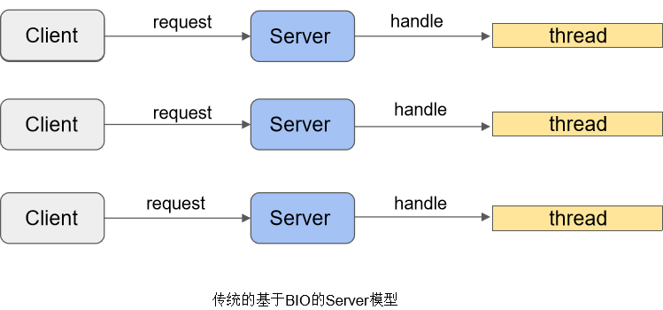

2. 以Linux 64位系统为例，每一个Java线程即占用1MB空间，那么有1024个线程呢?

也许你可以通过减小每个线程栈的大小，但这并不是根本的解决办法，不是吗?

3. 从另一个方面说，更多的线程数真的是更好的选择吗？这个答案也许没有明确的答案，但是可以肯定的是后者占用了更少的内存资源。问题的本质是如何高效/充分的利用资源。
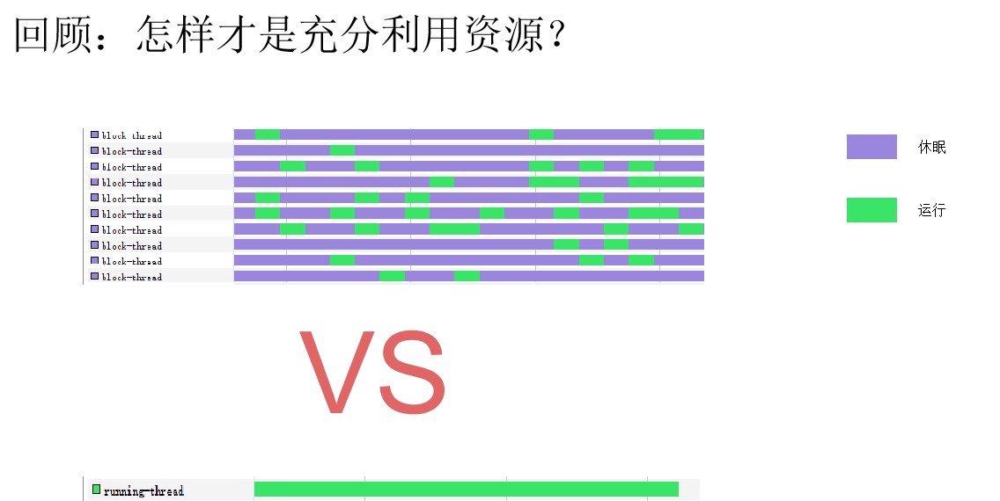

4. 所以，问题的核心是如何减少不必要的阻塞与等待，让线程更多地以绿色执行，而不是过度关注线程数的多少

#### BIO阻塞在哪里？

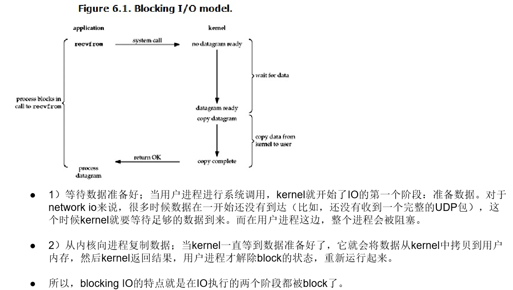

1. 我们用下面这个图来看下

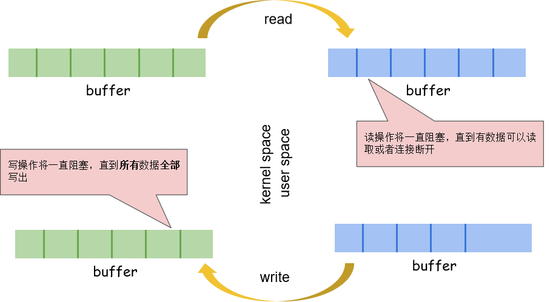

#### 怎么解决BIO阻塞问题？

- 为什么没有数据可以读时一定要等在那里？而不是让内核通知我们可以读/写了，这便是NIO

### NIO

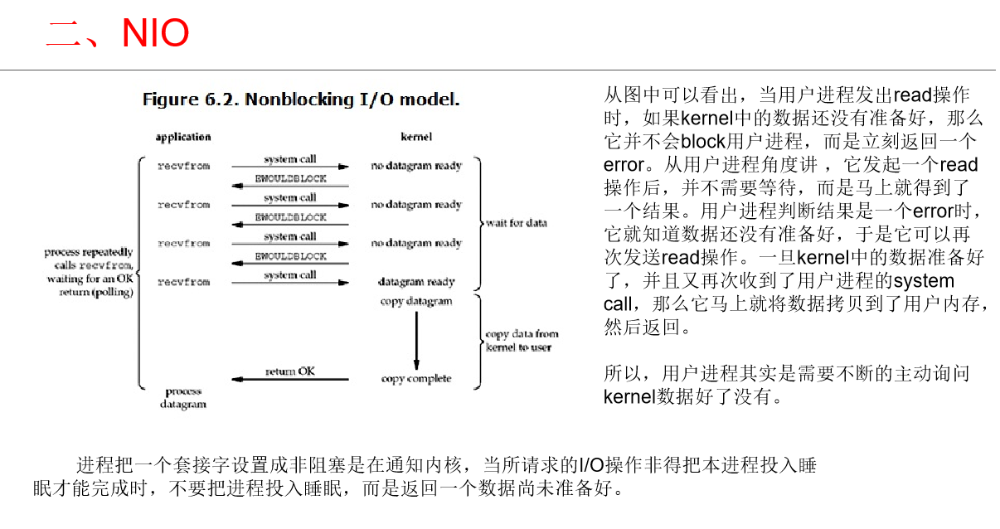

#### BIO与NIO的区别？

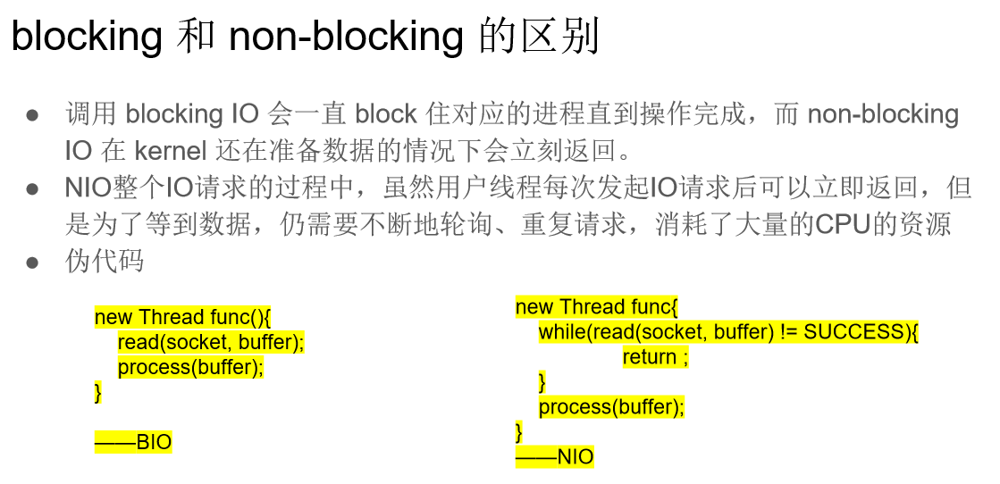

1. 单线程BIO的优化

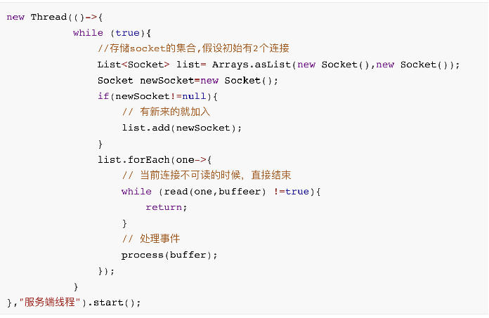

优点：单个线程可以同时处理多个请求
缺点：还是主动的一对一的方式去判断是否可读,假如有1万个连接，光获取结果读取就花费了很长时间

可优化点：
1）能不能通过一次获取所有请求是否响应
能不能不是我去请求判断它是否响应了，而是你替我监控
2）能不能只返回有响应的请求　
3)   能不能有响应了直接回调，而不是自己再去操作　

​       先不解释什么是多路复用IO模型，上面就是理解多路复用IO的基础，也是多路复用IO要解决的三个核心问题

#### 扩展－臭名昭著的NIO空转Bug

Bug现象:  本应阻塞Selector.select方法在没有IO事件的情况下唤醒，导致死循环发生

Bug原因：Oracle和Linux撕逼中，Oracle官方将bug归咎于Linux 2.6以下版本内核

解决情况: Oracle宣称在JDK 1.6 update18中进行了修复，但是从源码和实际角度来看，直到1.8
	此bug似乎依然存在，见:https://www.zhihu.com/question/58242499

Workaround: 统计Selector返回零的次数，到达一定的阈值时，即认为Bug产生，此时重新创建一个新的Selector对象，Jetty和Netty均采用此方案
netty的解决代码在package io.netty.channel.nio.nioEventLoop这个类下面的rebuildSelector方法

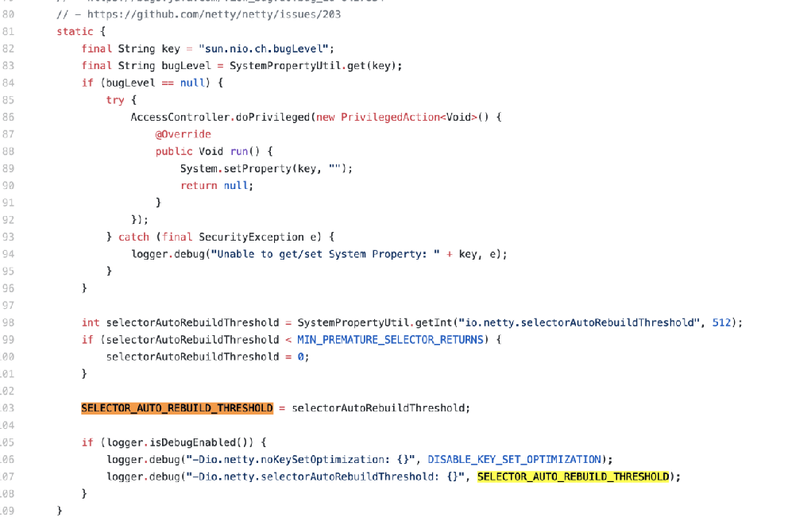

### 多路复用IO

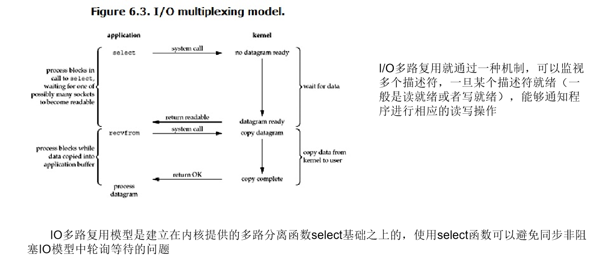

1、我们拿到了一堆文件描述符(不管是网络相关的、还是磁盘文件相关等等，任何文件描述符都可以)
２、通过调用某个函数告诉内核：“这个函数你先不要返回，你替我监视着这些描述符当这堆文件描述符中有可以进行I/O读写操作的时候你再返回
３、当调用的这个函数返回后我们就能知道哪些文件描述符可以进行I/O操作了。

#### 三剑客之select

1、把想监控的文件描述集合通过函数参数的形式告诉select
2、select会将这些文件描述符集合拷贝到内核中
3、select返回后我们仅仅能知道有些文件描述符可以读写了，但是我们不知道是哪一个
4、因此必须再遍历一边找到具体是哪个文件描述符可以读写了

缺点：
1、文件描述符数量有限，不能超过1024个
2、用户给我的文件描述符需要拷贝的内核中
3、我只能告诉你有文件描述符满足要求了，但是我不知道是哪个，需要遍历

#### 三剑客之poll

1、poll和select是非常相似的，poll相对于select的优化仅仅在于解决了文件描述符不能超过1024个的限制
２、select和poll都会随着监控的文件描述增加而出现性能下降，因此不适合高并发场景。

####　三剑客之epoll

select三个问题：文件描述符数量、拷贝到内核、需要遍历
poll二个问题：拷贝到内核、需要遍历

1、epoll内部使用了mmap共享了用户和内核的部分空间，避免了数据的来回拷贝
2、epoll基于事件驱动，epoll_ctl注册事件并注册callback回调函数，epoll_wait只返回发生的事件避免了像select和poll对事件的整个轮寻操作。比如10个注册，epoll_wait只返回了2个事件。其实是两个独立的结构分别存储注册的事件和完成的事件

epollCreate:创建一个epoll实例，返回一个数字作为文件描述符
epollCtl： add、update、del事件
epollWait:监听有相应的集合，如果有数据，直接返回集合，否则等待相应

3、最大优点：效率提升，不是轮询的方式，不会随着FD数目的增加效率下降。只有活跃可用的FD才会调用callback函数；即Epoll最大的优点就在于它只管你“活跃”的连接，而跟连接总数无关

#### 三剑客不同之处

| ** **    | **select**       | **poll**       | **epoll**                                       |
| -------- | ---------------- | -------------- | ----------------------------------------------- |
| 数据结构 | bitmap           | 数组           | 红黑树                                          |
| 最大连接 | 1024             | 无上线         | 无上线                                          |
| fb拷贝   | 没次调用select时 | 每次调用poll时 | fd首次调用epoll_ctl拷贝每次调用epoll_wait不拷贝 |
| 复杂度   | O(n)             | O(n)           | O(1)每当有事件就绪，回调函数就会被调用          |
| 平台支持 |                  |                | 只在linux系统                                   |

送快递例子说明：
BIO：一个快递员送一个快递，送快递人不在家蹲着等人回家
NIO：一个快递员送一个快递，先打电话，不在家一直打，等到在家再去送
多路复用：雇人监视客户（黄牛），啥时候到家
1)select:一个快递员送10个快递，每隔一段时间找黄牛，问他哪个在家送哪个，poll送的快递数量可以超过1024
2)epoll:还是10个快递，告诉黄牛哪个人在家就直接给你打电话，不用再主动问黄牛了。给你打电话需要你的电话，也就是注册回调函数，而给你打电话的时候也不是都打，而是只打到家的

#### 多路复用的缺点
1、不管是select、poll、epoll当有大量1万连接过来的时候，每时每刻都有各种事件去处理，那么它不管是在哪种模式下，下一次select肯定会阻塞很长的时间
2、由于阻塞时间较长，可能会造成新连接超时

###　Reactor模式

Reactor模式思想：分而治之+事件驱动

分而治之：一个连接里完整的网络处理过程一般分为accept、read、decode、process、encode、send这几步。Reactor模式将每个步骤映射为一个Task，服务端线程执行的最小逻辑单元不再是一次完整的网络请求，而是Task，且采用非阻塞方式执行。
事件驱动：每个Task对应特定网络事件。当Task准备就绪时，Reactor收到对应的网络事件通知，并将Task分发给绑定了对应网络事件的Handler执行。

- Reactor：负责响应事件，将事件分发给绑定了该事件的Handler处理；

- Handler：事件处理器，绑定了某类事件，负责执行对应事件的Task对事件进行处理；

- Acceptor：Handler的一种，绑定了connect事件。当客户端发起connect请求时，Reactor会将accept事件分发给Acceptor处理。

#### 回顾传统BIO

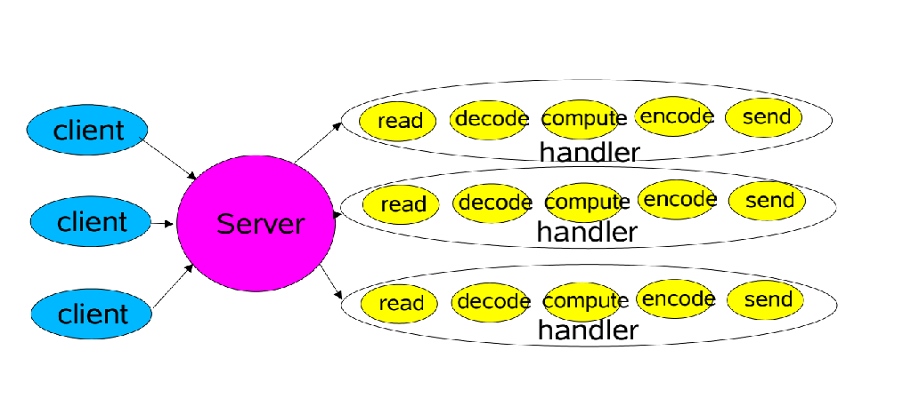

#### Reactor单线程模型

1、Reactor 将 I/O 事件分派给对应的 Handler
2、Acceptor 处理客户端新连接, 并分派请求到处理器链中
3、Handlers 执行非阻塞 读 / 写 任务

总结：一个线程基于多路复用就完成了所有的 IO 操作（包括连接，读数据、业务处理、写数据等），没有多线程间通信、竞争的问题，实现简单 缺点：单线程 Reactor 模型存在性能瓶颈, 同时也存在一定的可靠性问题

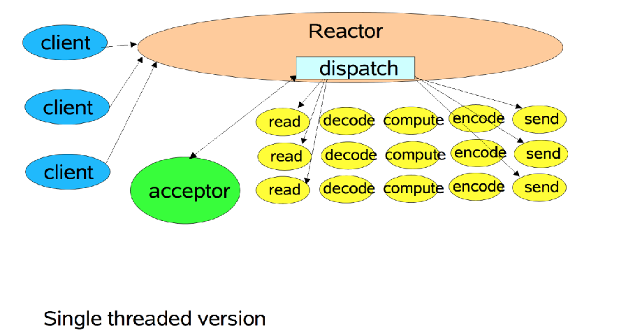

##### 代码实现：

```java
package nio;
import java.io.IOException;
import java.net.InetSocketAddress;
import java.nio.ByteBuffer;
import java.nio.channels.SelectionKey;
import java.nio.channels.Selector;
import java.nio.channels.ServerSocketChannel;
import java.nio.channels.SocketChannel;
import java.util.Iterator;
import java.util.Set;
 
/**
 * 多路复用器-selector单线程版本
 **/
public class SocketServerSelectorSingleThread {
 
    /**
     * 服务器端通道
     */
    private static ServerSocketChannel serverSocketChannel;
 
    /**
     * 服务器端多路复用器
     */
    private static Selector selector;
 
    /**
     * 服务器端端口号
     */
    private static Integer serverPort = 8080;
 
    /**
     * 初始化服务器端信息
     */
    private void initServerSocket() throws IOException {
        serverSocketChannel = ServerSocketChannel.open();
        serverSocketChannel.bind(new InetSocketAddress(serverPort));//绑定端口号
        System.out.println("step1 : new ServerSocket(" + serverPort + ") ");
        serverSocketChannel.configureBlocking(false);//设置服务端非阻塞模式
        selector = Selector.open();
        serverSocketChannel.register(selector, SelectionKey.OP_ACCEPT);
    }
 
    public void start() throws IOException {
        initServerSocket();
        System.out.println("服务端已经启动..........");
        while (true) {
            //无限阻塞，如果有数据或者有事件传入行为到达则返回值大于0
            if (selector.select() > 0) {
                Set<SelectionKey> selectionKeys = selector.selectedKeys();
                Iterator<SelectionKey> iterator = selectionKeys.iterator();
                while (iterator.hasNext()) {
                    SelectionKey selectionKey = iterator.next();
                    iterator.remove();
                    if (selectionKey.isConnectable()) {
                        System.out.println("---------------selectionKey.isConnectable()......");
                    } else if (selectionKey.isAcceptable()) {
                        //客户端请求连接事件
                        acceptHandler(selectionKey);
                    } else if (selectionKey.isReadable()) {
                        //客户端数据到达事件
                        readHandler(selectionKey);
                    } else if (selectionKey.isValid()) {
                        System.out.println("---------------selectionKey.isValid()......");
                    } else if (selectionKey.isWritable()) {
                        System.out.println("---------------selectionKey.isWritable()......");
                    }
                }
            }
        }
    }
 
    /**
     * 客户端连接建立处理类
     *
     * @param selectionKey
     */
    private void acceptHandler(SelectionKey selectionKey) {
        try {
            /**
             * 由于在之前已经把ServerSocketChannel
             * <p>serverSocketChannel.register(selector, SelectionKey.OP_ACCEPT);</p>
             * 已经注册到多路复用器（selector）中,因此现阶段可以直接把服务端通道直接取出
             */
            ServerSocketChannel serverSocketChannel = (ServerSocketChannel) selectionKey.channel();
            /**
             * 调用accept接口从服务端通道中获取客户端连接
             */
            SocketChannel clientSocketChannel = serverSocketChannel.accept();
            /**
             * 设置客户端连接也为非阻塞状态
             */
            clientSocketChannel.configureBlocking(false);
 
            /**
             * 创建一个8字节的数据缓冲区
             * 暂且不论该缓冲区大小是否足够
             * 该缓冲区的作用为：******一个客户端通道对应一个数据缓冲区，防止缓冲区公用
             */
            ByteBuffer byteBuffer = ByteBuffer.allocateDirect(8192);
            /**
             * 把新的客户端连接也注册到多路复用器当中，并且注册监听事件为读取就绪
             * 这样在新的<p>SelectionKey</p>  中就即可以拿到自己的客户端，也可以拿到与客户端绑定的缓冲区
             *
             * 附加选项---byteBuffer
             */
            SelectionKey clientSelectionKey = clientSocketChannel.register(selector, SelectionKey.OP_READ, byteBuffer);
            System.out.println("--------------------------------------------------");
            System.out.println("------新客户端进入------：" + clientSocketChannel.getRemoteAddress());
            System.out.println("--------------------------------------------------");
        } catch (IOException e) {
            e.printStackTrace();
        }
    }
 
    /**
     * 客户端数据读取处理类
     *
     * @param selectionKey
     */
    private void readHandler(SelectionKey selectionKey) {
        /**
         * 由于在之前<p>acceptHandler </p>方法中已经把SocketChannel(客户端连接)
         *  <p> SelectionKey clientSelectionKey = clientSocketChannel.register(selector,SelectionKey.OP_READ,byteBuffer);</p>
         *   已经注册到多路复用器（selector）中,因此现阶段可以直接把客户端连接从选择器中取出
         */
        SocketChannel clientSocketChannel = (SocketChannel) selectionKey.channel();
 
        /**
         * 附加选项---byteBuffer
         * 由于在之前<p>acceptHandler </p>方法中已经把ByteBuffer（缓冲区）
         *          *  <p> SelectionKey clientSelectionKey = clientSocketChannel.register(selector,SelectionKey.OP_READ,byteBuffer);</p>
         *          *   已经注册到多路复用器（selector）中,因此现阶段可以直接把客户端连接对应的byteBuffer(缓冲区)从选择器中取出。
         */
        ByteBuffer byteBuffer = (ByteBuffer) selectionKey.attachment();
        byteBuffer.clear();//清空缓冲区
        try {
            int read = 0;
            while (true) {
                read = clientSocketChannel.read(byteBuffer);//从客户端中读取数据到缓冲区
                if (read > 0) {//读取到数据
                    byteBuffer.flip();//准备开始从缓冲区中读取数据，指针反转
                    byte[] bytes = new byte[read];
                    byteBuffer.get(bytes);//从缓冲区中获取数据到字节数组
                    String clientStr = new String(bytes);
                    //打印客户传入的数据信息
                    System.out.println("客户端【" + clientSocketChannel.getRemoteAddress() + "】有数据传入：" + clientStr);
 
                    /**
                     * 数据读取完毕，开始准备写入数据
                     */
                    byteBuffer.clear(); //清空缓冲区
                    String returnClientStr = "---server port---" + serverPort + "---accept client port---" + clientSocketChannel.getRemoteAddress() + "---data---" + clientStr;
                    byteBuffer.put(returnClientStr.getBytes());
                    byteBuffer.flip();//准备开始从缓冲区中读取数据，指针反转
                    while (byteBuffer.hasRemaining()) {//判断当前缓冲区中是否有数据
                        clientSocketChannel.write(byteBuffer);//把当前缓冲区中数据写回客户端。
                    }
                    byteBuffer.clear();
                } else if (read == 0) {//没有数据传入跳过
                    break;
                } else { //-1 close_wait  bug  客户端可能断开
                    System.out.println("---client port---" + clientSocketChannel.getRemoteAddress() + "---offline---");
                    /**
                     * 检测到客户端关闭，删除selectionKey监听事件，
                     * 否则会一直受到这个selectionKey的动作。
                     */
                    selectionKey.cancel();
                    clientSocketChannel.close();
                }
            }
 
        } catch (IOException e) {
            e.printStackTrace();
            try {
                /**
                 * 如果这里不做处理  在 read读取数据的时候就可能会报错
                 * <p>
                 *       java.io.IOException: 远程主机强迫关闭了一个现有的连接
                 *
                 *       java.io.IOException: 远程主机强迫关闭了一个现有的连接。
                 *         at sun.nio.ch.SocketDispatcher.read0(Native Method)
                 *         at sun.nio.ch.SocketDispatcher.read(Unknown Source)
                 *         at sun.nio.ch.IOUtil.readIntoNativeBuffer(Unknown Source)
                 *         at sun.nio.ch.IOUtil.read(Unknown Source)
                 *         at sun.nio.ch.SocketChannelImpl.read(Unknown Source)
                 * </p>
                 * 主要原因是客户端强制关闭了连接（没有调用SocketChannel的close方法），服务端还在read事件中，此时读取客户端的信息时会报错。
                 * 代码不够健壮导致的；
                 * 可以把这个catch中的代码注释掉，重启serversocket,然后使用nc命令连接后再强制关闭，看一下错误日志信息打印。
                 */
                System.out.println("---client port---" + clientSocketChannel.getRemoteAddress() + "---offline---");
                /**
                 * 检测到客户端关闭，删除selectionKey监听事件，
                 * 否则会一直受到这个selectionKey的动作。
                 */
                selectionKey.cancel();
                clientSocketChannel.socket().close();
                clientSocketChannel.close();
            } catch (IOException ex) {
                ex.printStackTrace();
            }
 
        }
 
    }
 
    public static void main(String[] args) throws IOException {
        SocketServerSelectorSingleThread one = new SocketServerSelectorSingleThread();
        one.start();
    }
 
}
```

如何测试：连接命令：nc 127.0.0.1 8080

#### 单Reactor多线程模型

1、一个 Acceptor 线程只负责监听客户端的连接
2、一个 NIO 线程池负责具体处理： accept、read、decode、process、encode、send 事件。
3、一个 NIO 线程池处理N条链路, 但是一个链路只对应一个 NIO 线程, 防止并发问题

满足绝大部分应用场景，但并发百万客户端连接，或者服务端需要对客户端握手进行安全认证，但是认证本身非常损耗性能，单独一个 Acceptor 线程可能会存在性能不足问题

**详细过程介绍：**
1、Reactor对象通过select 监控client端的请求事件, 收到事件后，通过dispatch进行分发。
2、如果是连接建立请求，则由acceptor通过accept处理连接请求，然后分配一个Handler对象处理完成连接后的数据读写。
3、如果不是连接请求，则由reactor分发(dispatch)给连接对应的Handler来处理。
4、Handler只负责响应IO事件，不做具体的业务处理。read数据后，会分发给Worker线程池的某个线程进行业务逻辑处理。
5、Worker线程池会分配单独的线程完成真正的业务处理，包括编解码、逻辑计算，完成处理后将结果数据返回给handler。
6、Handler收到响应后，通过send将数据返回给client端。


总结：这种模型下，Reactor线程只负责处理所有的事件的监听和响应(数据读、写)，而不参与数据的业务处理(数据编解码、逻辑处理)。业务处理的任务交给线程池中的线程处理，提高了并发性能


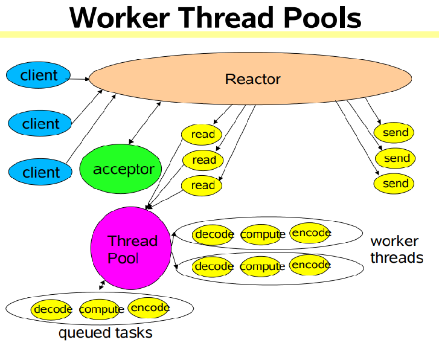

#### 主从-Reactor模型

1、从一个 主线程 NIO 线程池中选择一个线程作为 Acceptor 线程，绑定监听端口，接收客户端连接的连接，其他线程负责后续的接入认证等工作。（前台只负责登记，扫码、安检等是线程池完成）
2、连接建立完成后，Sub NIO 线程池负责具体处理各种事件。（N个服务员）
3、一个 NIO 线程池处理N条链路, 但是一个链路只对应一个 NIO 线程, 防止并发问题（一个服务员跟全程）

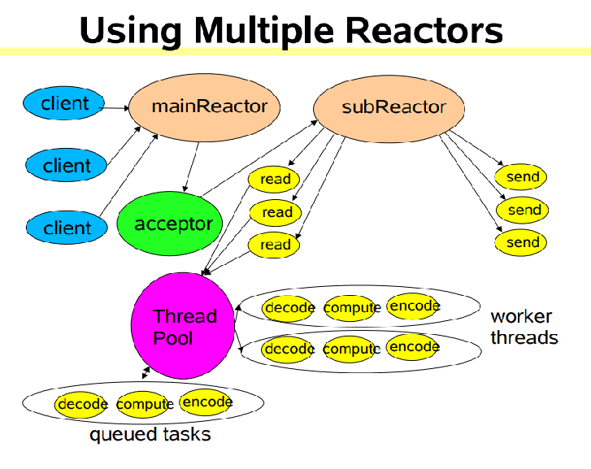

1、Reactor主线程mainReactor通过select 监听连接事件，收到事件后，通过acceptor处理连接事件。
2、当acceptor处理连接事件后，mainReactor将连接分配给subReactor 。subReactor是Reactor的子线程，和mainReactor不在一个线程中。
3、subReactor将连接加入到连接队列进行监听，并负责创建handler进行各种事件的处理(数据的读、写)。
4、subReactor也通过select监听，当有新事件发生时，subreactor就会调用对应的handler处理。
5、handler只负责数据的I/O，针对数据的业务处理还是由worker线程池中的线程处理，并返回结果。
6、handler收到worker线程的响应数据后，通过send将结果数据返回给client。

##### 代码实现

```java
package nio;
 
import java.nio.channels.ServerSocketChannel;
 
import java.io.IOException;
import java.net.InetSocketAddress;
import java.nio.ByteBuffer;
import java.nio.channels.SelectionKey;
import java.nio.channels.Selector;
import java.nio.channels.SocketChannel;
import java.util.Iterator;
import java.util.Set;
import java.util.concurrent.BlockingQueue;
import java.util.concurrent.LinkedBlockingQueue;
import java.util.concurrent.atomic.AtomicInteger;
 
/**
 * 多路复用器-selector多线程版本
 **/
public class SocketServerSelectorMultiplexingThreads {
 
 
    /**
     * 服务端通道
     */
    private ServerSocketChannel serverSocketChannel;
 
    /**
     * 服务端端口
     */
    private int serverPort;
 
    /**
     * 主选择器-主要用于客户端的的接入-OP_ACCEPT-事件
     */
    private Selector bossSelector;
 
    /**
     * 任务选择器-主要用于客户端数据的传入处理-OP_READ-事件
     */
    private Selector[] workerSelectors;
 
    /**
     * 任务选择器数量
     */
    private int workerNum;
 
 
    /**
     * @param serverPort 服务端端口
     * @param workerNum  任务选择器数量
     * @throws IOException
     */
    public SocketServerSelectorMultiplexingThreads(int serverPort, int workerNum) throws IOException {
        this.serverPort = serverPort;
        this.workerNum = workerNum;
        /**
         * 创建并绑定端口号
         */
        serverSocketChannel = ServerSocketChannel.open();
        serverSocketChannel.bind(new InetSocketAddress(serverPort));
        serverSocketChannel.configureBlocking(false);
 
        System.out.println("step1 : new ServerSocket(" + serverPort + ") ");
 
        /**
         * 创建主（boss）选择器
         */
        bossSelector = Selector.open();
        /**
         * serverSocket注册到
         */
        serverSocketChannel.register(bossSelector, SelectionKey.OP_ACCEPT);
 
        /**
         * 初始化任务选择器-根据设定的任务选择器数量
         */
        initWorderSelector();
 
    }
 
    /**
     * 初始化 任务选择器
     *
     * @throws IOException
     */
    private void initWorderSelector() throws IOException {
        workerSelectors = new Selector[workerNum];
        for (int i = 0; i < workerNum; i++) {
            workerSelectors[i] = Selector.open();
        }
    }
 
    public Selector getBossSelector() {
        return bossSelector;
    }
 
    public Selector[] getWorkerSelectors() {
        return workerSelectors;
    }
 
    public int getWorkerNum() {
        return workerNum;
    }
 
    public static void main(String[] args) throws IOException, InterruptedException {
        int serverPort = 8080;
        int workerNum = 3;
        System.out.println("准备启动服务端端口号：" + serverPort + "---准备启动worker数量：" + workerNum);
        SocketServerSelectorMultiplexingThreads server = new SocketServerSelectorMultiplexingThreads(serverPort, workerNum);
        NioThread bossThreadRunnable = new NioThread(server.getBossSelector(), workerNum);
        Thread bossThread = new Thread(bossThreadRunnable);
        bossThread.start();
        Thread.sleep(2000);
 
        Thread workerThread = null;
        Selector[] workerSelectors = server.getWorkerSelectors();
        for (Selector selector : workerSelectors) {
            NioThread workerNioThread = new NioThread(selector);
            workerThread = new Thread(workerNioThread);
            workerThread.start();
        }
 
 
    }
}
 
class NioThread implements Runnable {
 
    /**
     * 传入的  选择器-私有
     */
    private Selector selector;
 
    /**
     * 任务选择器数量-多线程可见
     */
    private static int workerSelectorNum;
 
    /**
     * 每个任务选择器对应一个 队列  -多线程可见
     */
    static BlockingQueue<SocketChannel>[] clientSocketChannelQueues;
 
 
    /**
     * 任务选择器下标的数值-用于需任务选择器队列中获取自己的阻塞队列
     * 每个worker生成自己的ID。
     * <p>
     * 这个workerID是与<p>BlockingQueue<SocketChannel>[] clientSocketChannelQueues</p>中阻塞队列进行间接绑定了的
     */
    int id = 0;
 
    /**
     * 是否为工作任务的选择器线程
     * 默认为工作任务的选择器线程
     * 如果为非工作任务的选择器线程则设置为false
     */
    private boolean workerSign = true;
 
    /**
     * 自增ID-多线程可见
     */
    static AtomicInteger idx = new AtomicInteger();
 
    /**
     * Boss  选择器专用构造器
     *
     * @param selector          boss任务选择器
     * @param workerSelectorNum 任务选择器数量
     */
    public NioThread(Selector selector, int workerSelectorNum) {
        this.selector = selector;
        NioThread.workerSelectorNum = workerSelectorNum;
        this.workerSign = false;
 
        clientSocketChannelQueues = new LinkedBlockingQueue[workerSelectorNum];
        initWorderSocketChannelQueues();
 
        System.out.println("Boss 启动");
    }
 
    /**
     * 初始化任务选择器所需的阻塞队列数组
     * 一个阻塞队列对应一个任务选择器
     *
     * @throws IOException
     */
    private void initWorderSocketChannelQueues() {
        for (int i = 0; i < workerSelectorNum; i++) {
            clientSocketChannelQueues[i] = new LinkedBlockingQueue<>();
        }
    }
 
    /**
     * worker 任务选择器专用构造器
     *
     * @param selector
     */
    public NioThread(Selector selector) {
        this.selector = selector;
        /**
         * 每个worker生成自己的ID。
         */
        id = idx.getAndIncrement() % workerSelectorNum;//任务选择器队列下标
        System.out.println("任务线程 【worker---" + id + "】启动");
    }
 
    @Override
    public void run() {
        try {
            while (true) {
                if (selector.select(10) > 0) {//10毫秒延迟获取  不完全阻塞
                    Set<SelectionKey> selectionKeys = selector.selectedKeys();
                    Iterator<SelectionKey> iterator = selectionKeys.iterator();
                    while (iterator.hasNext()) {
                        SelectionKey selectionKey = iterator.next();
                        iterator.remove();
 
                        if (selectionKey.isConnectable()) {
                            System.out.println("---------------selectionKey.isConnectable()......");
                        } else if (selectionKey.isAcceptable()) {//客户端请求连接事件---其时只有boss选择器才能走到这一步
                            acceptHandler(selectionKey);
                        } else if (selectionKey.isReadable()) {//客户端数据到达事件
                            readHandler(selectionKey);
                        } else if (selectionKey.isValid()) {
                            System.out.println("---------------selectionKey.isValid()......");
                        } else if (selectionKey.isWritable()) {
                            System.out.println("---------------selectionKey.isWritable()......");
                        }
                    }
                }
                /**
                 * boss 不参与这个过程
                 * 只有工作任务的选择器线程
                 * 且
                 * 对应的阻塞队列不为空的时候，才会执行
                 */
                if (workerSign && !clientSocketChannelQueues[id].isEmpty()) {
                    //默认创建一个8字节的缓冲区
                    ByteBuffer byteBuffer = ByteBuffer.allocateDirect(8192);
                    //从阻塞队列中取出对应的客户端
                    SocketChannel clientSocketChannel = clientSocketChannelQueues[id].take();
                    clientSocketChannel.register(selector, SelectionKey.OP_READ, byteBuffer);
                    System.out.println("-----------------------------------------------------");
                    System.out.println("客户端连接进入：" + clientSocketChannel.socket().getPort() + "被分配到workder ---" + id);
                    System.out.println("-----------------------------------------------------");
                }
            }
        } catch (IOException e) {
            e.printStackTrace();
        } catch (InterruptedException e) {
            e.printStackTrace();
        }
    }
 
    /**
     * 其时这一步 只有 boss选择器可以进入
     *
     * @param selectionKey
     * @throws IOException
     */
    private void acceptHandler(SelectionKey selectionKey) throws IOException {
        /**
         * 从选择器中获取服务端注册时的通道
         */
        ServerSocketChannel serverSocketChannel = (ServerSocketChannel) selectionKey.channel();
        /**
         * 接收传入的客户端SocketChannel
         */
        SocketChannel clientSocketChannel = serverSocketChannel.accept();
        clientSocketChannel.configureBlocking(false);//设置客户端类型为非阻塞
 
        /**
         * 由于boss选择器所在的线程并不会处理客户端的链接，
         * 他只是把接受到的选择器按照自增的规则取模后放到不同的阻塞队列当中
         * 每次来一个客户端  idx都会自增1 ，然后取模后放到不同的任务队列。
         */
        //轮询分配
        int index = idx.getAndIncrement() % workerSelectorNum;
        /**
         * 把接受到的客户端放入不同任务选择器归属的阻塞队列中
         */
        clientSocketChannelQueues[index].add(clientSocketChannel);
        System.out.println("bossSelector 将连接:" + clientSocketChannel.socket().getPort() + "分配给worker-" + index);
    }
 
    /**
     * 其时这一步只有worker
     *
     * @param selectionKey
     * @throws IOException
     */
    private void readHandler(SelectionKey selectionKey) throws IOException {
        SocketChannel clientSocketChannel = (SocketChannel) selectionKey.channel();
        ByteBuffer byteBuffer = (ByteBuffer) selectionKey.attachment();
        byteBuffer.clear();
        int readNum = 0;
        try {
            while (true) {
                readNum = clientSocketChannel.read(byteBuffer);
                if (readNum < 0) {
                    System.out.println("client port --" + clientSocketChannel.socket().getPort() + "---offline---");
                    selectionKey.cancel();
                    clientSocketChannel.socket().close();
                    clientSocketChannel.close();
                } else if (readNum == 0) {
                    break;
                } else {
                    byteBuffer.flip();//每次读取之前都要反转一次
                    byte[] bytes = new byte[readNum];
                    byteBuffer.get(bytes);
                    String clientStr = new String(bytes);
                    System.out.println("client port --" + clientSocketChannel.socket().getPort() + "---data---" + clientStr);
 
                    String returnStr = "server get client data" + clientStr;
                    byteBuffer.clear();//把数据返回
                    byteBuffer.put(returnStr.getBytes());
                    byteBuffer.flip();//每次写出之前都要反转一次
                    while (byteBuffer.hasRemaining()) {//判断当前缓冲区中是否有数据
                        clientSocketChannel.write(byteBuffer);//把当前缓冲区中数据写回客户端。
                    }
                    byteBuffer.clear();//写完之后清空。
                }
            }
        } catch (IOException e) {
            e.printStackTrace();
            System.out.println("client port --" + clientSocketChannel.socket().getPort() + "---offline---");
            selectionKey.cancel();
            clientSocketChannel.socket().close();
            clientSocketChannel.close();
        }
    }
}
```

如何测试：连接命令：nc 127.0.0.1 8080

#### 主从Reactor可优化方案

可优化方案：注册多个subReactor，将请求分发

 Netty线程模型：基于主从Reactor模型，注册了多个subReactor，只不过换了个名字：BossGroup、WorkerGroup(老板是接活的，干还是员工干)

### Netty线程模型

Netty线程模型：基于主从Reactor模型，注册了多个subReactor，只不过换了个名字：BossGroup、WorkerGroup(老板是接活的，干还是员工干)


1、BossGroup相当于mainReactor，负责建立连接并且把连接注册到WorkGroup中。WorkGroup负责处理连接对应的读写事件。
2、BossGroup和WorkGroup是两个线程池，里面有多个NioEventGroup(实际上是线程)，默认BossGroup和WorkGroup里的线程数是cpu核数的两倍（源码中有体现）。
3、每一个NioEventGroup都是一个无限循环，负责监听相对应的事件。
4、Pipeline(通道)里包含多个ChannelHandler(业务处理)，按顺序执行。