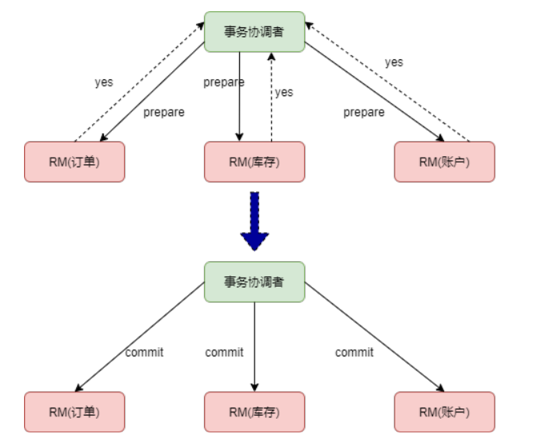
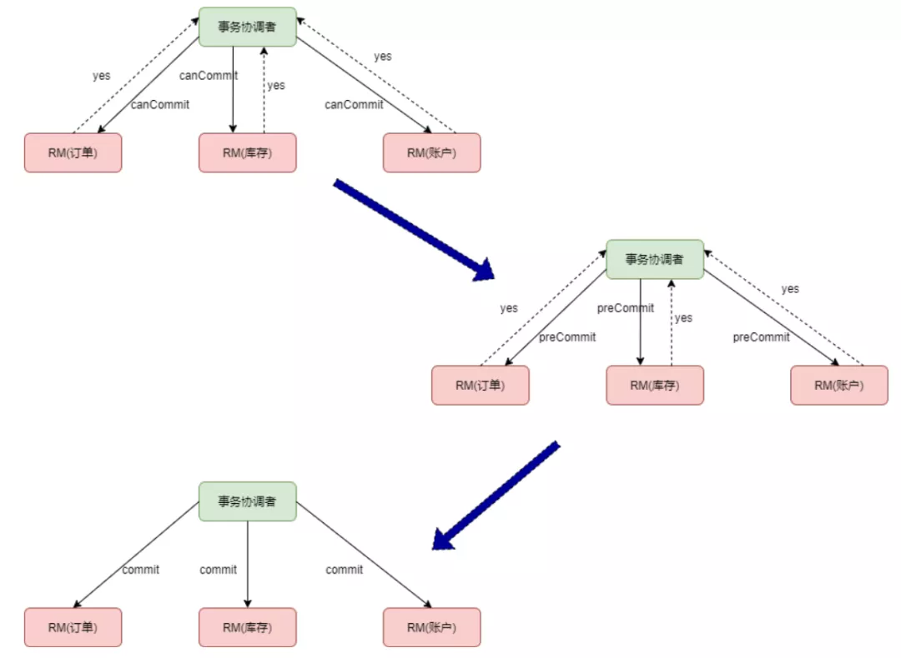
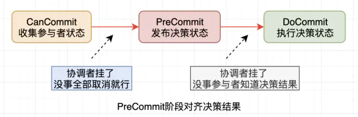

[springCloudAlibaba](https://github.com/alibaba/spring-cloud-alibaba)

[seata](https://github.com/seata/seata)

[seata 模式](http://seata.io/zh-cn/docs/dev/mode/xa-mode.html)

## 2PC和3PC一致性问题

参考文章：

[分布式系统一致性之3PC协议浅谈](https://www.jianshu.com/p/459897aba629)

[2PC 和3PC](https://juejin.cn/post/6955364874444603405)

### 2PC 

分布式事务的两阶段提交是把整个事务提交分为 prepare 和 commit 两个阶段。以电商系统为例，分布式系统中有订单、账户和库存三个服务，如下图：




第一阶段，事务协调者向事务参与者发送 prepare 请求，事务参与者收到请求后，如果可以提交事务，回复 yes，否则回复 no。

第二阶段，如果所有事务参与者都回复了 yes，事务协调者向所有事务参与者发送 commit 请求，否则发送 rollback 请求。

##### 2PC存在三个问题

- 同步阻塞，本地事务在 prepare 阶段锁定资源，如果有其他事务也要修改 xiaoming 这个账户，就必须等待前面的事务完成。这样就造成了系统性能下降。
- 协调节点单点故障，如果第一个阶段 prepare 成功了，但是第二个阶段协调节点发出 commit 指令之前宕机了，所有服务的数据资源处于锁定状态，事务将无限期地等待。
- 数据不一致，如果第一阶段 prepare 成功了，但是第二阶段协调节点向某个节点发送 commit 命令时失败，就会导致数据不一致。

 ### 3PC

为了解决两阶段提交的问题，三阶段提交做了改进：

- 在协调节点和事务参与者都引入了超时机制。
- 第一阶段的 prepare 阶段分成了两步，canCommi 和 preCommit。




##### 3PC存在的问题

引入 preCommit 阶段后，协调节点会在 commit 之前再次检查各个事务参与者的状态，保证它们的状态是一致的。但是也存在问题，那就是如果第三阶段发出 rollback 请求，有的节点没有收到，那没有收到的节点会在超时之后进行提交，造成数据不一致。

- 为啥超时之后要提交呢？因为commit只有两种情况，commit和rollback，如果超时的时候不提交而是选择回滚，那同样在未接收到commit的时候也会造成数据不一致的情况。其实就是一种决策问题

 ### 2PC和3PC的对比

2PC协议只有协调者有超时机制，3PC协议对参与者也引入了超时机制，在不同的阶段进行不同的超时处理，但是由于网络波动和网络分区存在让参与者的超时处理带来新的不确定性，甚至可能出现数据不一致。

3PC协议增加一轮询问阶段所以整个交互过程比2PC更长了，性能相比2PC是会有一些下降的，但是3PC协议对于网络分区等情况也并没有处理地很好。

总体来说，3PC相比2PC做了很多改进有一定的效果，但是仍然存在数据不一致问题，还需继续努力。

##### 2PC决策状态的确认

**5.2 决策状态的对齐**

我们知道2PC协议的决策结果初始阶段只有决策者知道，只有在它发送了决策解决才有参与者知道，这样就存在决策结果丢失的情况。假如协调者挂掉，新协调者可以咨询所有的参与者来确定决策状态，根据所有参与者的情况来确定，但是万一真理掌握在少数人手中呢?

**极端情况：**

假如有10个参与者，9个都是正常的，1个状态未知(先叫做A吧)，10个参与者都向协调者发送了反馈，如果A反馈的是Not Ready信号，其他9个都是Ready信号。协调者汇总结果决策出不具备执行条件，开始向所有参与者发送rollback，恰好第一个收到信号的是A机器，协调者挂了，A收到信号后也挂了。新的协调者询问了其余9个都是OK，新的协调者就认为具备条件了从而发送Commit信号，这样就出现了不一致。

举个例子：皇帝立储，叫来了10个大臣，但是只告诉第一个大臣A的时候，皇帝和大臣A都死了，其它大臣还没有收到消息，那么剩下的人决策极有可能是错的

##### 3PC决策状态透明化

在3PC中仍然存在只有1台机器收到指令然后挂掉的情况，但是如果出现在前置阶段，对整个结果是没有影响的，因为会被取消并且参与者并没有本地执行。

现在看3PC的思想是把做重大动作时的决策结果透明化统一化，产生的影响也就非常小了，因此PreCommit阶段的状态是明确的。

我们需要把决策结果透明化，让所有参与者都知道决策结果，3PC的PreCommit阶段对齐了结果，只要有1台还活着，整个事务的状态就是确定的，毕竟所有参与者全挂的情况概率非常低。




| 模式        | 说明                                   | 缺点                                                         | 优点                                  |
| ----------- | -------------------------------------- | ------------------------------------------------------------ | ------------------------------------- |
| XA          | 二阶段提交                             | 1、数据锁定<br />2、 协议阻塞：XA prepare 后，分支事务进入阻塞阶段，收到 XA commit 或 XA rollback 前必须阻塞等待。<br />3、性能差：单个事务因为要被协调增加相应时间；数据库锁冲突 | 1、无侵入仅仅依赖数据库本身的ACID特性 |
| AT<br />TXC | 二阶段提交<br />无侵入<br />代理数据源 | 1、需要undo_log表<br />2、需要做SQL解析                      | 1、全局锁降低了数据库锁冲突           |
|             |                                        |                                                              |                                       |
|             |                                        |                                                              |                                       |
|             |                                        |                                                              |                                       |


### XA

[XA协议](https://baike.baidu.com/item/XA/6370881?fr=aladdin)mysql 从 5.0 版本开始，innoDB 存储引擎已经支持 XA 协议

XA 协议是由 X/Open 组织提出的分布式事务处理规范，主要定义了事务管理器 TM 和局部资源管理器 RM 之间的接口

  XA协议同样也具备事务的ACID特性。

```java
import com.mysql.jdbc.jdbc2.optional.MysqlXADataSource;
import com.mysql.jdbc.jdbc2.optional.MysqlXid;
 
import javax.sql.XAConnection;
import javax.transaction.xa.XAResource;
import javax.transaction.xa.Xid;
import java.sql.Connection;
import java.sql.Statement;
 
public class XADemo {
    public static MysqlXADataSource getDataSource(String connStr, String user, String pwd) {
        try {
 
            MysqlXADataSource ds = new MysqlXADataSource();
            ds.setUrl(connStr);
            ds.setUser(user);
            ds.setPassword(pwd);
 
            return ds;
        } catch (Exception e) {
            e.printStackTrace();
        }
 
        return null;
    }
 
    public static void main(String[] arg) {
        String connStr1 = "jdbc:mysql://xxx:3306/wjq";
        String connStr2 = "jdbc:mysql://xxx:3307/wjq";
 
        try {
            //从不同数据库获取数据库数据源
            MysqlXADataSource ds1 = getDataSource(connStr1, "root", "XXXXXXXX");
            MysqlXADataSource ds2 = getDataSource(connStr2, "root", "XXXXXXXX");
 
            //数据库1获取连接
            XAConnection xaConnection1 = ds1.getXAConnection();
            XAResource xaResource1 = xaConnection1.getXAResource();
            Connection connection1 = xaConnection1.getConnection();
            Statement statement1 = connection1.createStatement();
 
            //数据库2获取连接
            XAConnection xaConnection2 = ds2.getXAConnection();
            XAResource xaResource2 = xaConnection2.getXAResource();
            Connection connection2 = xaConnection2.getConnection();
            Statement statement2 = connection2.createStatement();
 
            //创建事务分支的xid
            Xid xid1 = new MysqlXid(new byte[]{0x01}, new byte[]{0x02}, 100);
            Xid xid2 = new MysqlXid(new byte[]{0x011}, new byte[]{0x012}, 100);
 
            try {
                //事务分支1关联分支事务sql语句
                xaResource1.start(xid1, XAResource.TMNOFLAGS);
                int update1Result = statement1.executeUpdate("UPDATE accounts SET BALANCE = CAST('9700.00' AS DECIMAL) WHERE CUSTOMER_NO = '001'");
                xaResource1.end(xid1, XAResource.TMSUCCESS);
 
                //事务分支2关联分支事务sql语句
                xaResource2.start(xid2, XAResource.TMNOFLAGS);
                int update2Result = statement2.executeUpdate("INSERT INTO user_purchase_his(CUSTOMER_NO, SERIAL_NO, AMOUNT, CURRENCY, REMARK) "
                        + " VALUES ('001', '20190303204700000001', 200, 'CNY', '购物消费')");
                xaResource2.end(xid2, XAResource.TMSUCCESS);
 
                // 两阶段提交协议第一阶段
                int ret1 = xaResource1.prepare(xid1);
                int ret2 = xaResource2.prepare(xid2);
 
                // 两阶段提交协议第二阶段
                if (XAResource.XA_OK == ret1 && XAResource.XA_OK == ret2) {
                    //引擎级别提交
                    xaResource1.commit(xid1, false);
                    xaResource2.commit(xid2, false);
 
                    System.out.println("reslut1:" + update1Result + ", result2:" + update2Result);
                } else {
                    xaResource1.rollback(xid1);
                    xaResource2.rollback(xid2);
                }
            } catch (Exception e) {
                e.printStackTrace();
            }
        } catch (Exception e) {
            e.printStackTrace();
        }
    }
}
```


### AT

##### AT第一阶段：代理数据源，解析SQL，保存镜像

数据源被代理后，通过被DataSourceProxy代理后，你所执行的sql，会被提取，解析，保存前镜像后，再执行业务sql，再保存后镜像，以便与后续出现异常，进行二阶段的回滚操作。

 

- 一阶段本地事务提交前，需要确保先拿到 **全局锁** 。
- 拿不到 **全局锁** ，不能提交本地事务。
- 拿 **全局锁** 的尝试被限制在一定范围内，超出范围将放弃，并回滚本地事务，释放本地锁。

以一个示例来说明：

两个全局事务 tx1 和 tx2，分别对 a 表的 m 字段进行更新操作，m 的初始值 1000。

tx1 先开始，开启本地事务，拿到本地锁，更新操作 m = 1000 - 100 = 900。本地事务提交前，先拿到该记录的 **全局锁** ，本地提交释放本地锁。 tx2 后开始，开启本地事务，拿到本地锁，更新操作 m = 900 - 100 = 800。本地事务提交前，尝试拿该记录的 **全局锁** ，tx1 全局提交前，该记录的全局锁被 tx1 持有，tx2 需要重试等待 **全局锁** 。ß

##### AT第二阶段：提交

二阶段如果是提交的话，因为“业务 SQL”在一阶段已经提交至数据库，
所以 Seata 框架只需将一阶段保存的快照数据和行锁删掉，完成数据清理即可。

##### AT第二阶段：提交

1、二阶段如果是回滚的话，Seata 就需要回滚一阶段已经执行的“业务 SQL”，还原业务数据。回滚方式便是用“before image”还原业务数据

2、但在还原前要首先要校验脏写，对比“数据库当前业务数据”和 “after image”，如果两份数据完全一致就说明没有脏写，可以还原业务数据，如果不一致就说明有脏写，出现脏写就需要转人工处理。

### TCC

TCC（Try-Confirm-Cancel） 实际上是服务化的两阶段提交协议，业务开发者需要实现这三个服务接口，第一阶段服务由业务代码编排来调用 Try 接口进行资源预留，所有参与者的 Try 接口都成功了，事务管理器会提交事务，并调用每个参与者的 Confirm 接口真正提交业务操作，否则调用每个参与者的 Cancel 接口回滚事务。

AT 模式（[参考链接 TBD](http://seata.io/zh-cn/docs/dev/mode/tcc-mode.html)）基于 **支持本地 ACID 事务** 的 **关系型数据库**：

- 一阶段 prepare 行为：在本地事务中，一并提交业务数据更新和相应回滚日志记录。
- 二阶段 commit 行为：马上成功结束，**自动** 异步批量清理回滚日志。
- 二阶段 rollback 行为：通过回滚日志，**自动** 生成补偿操作，完成数据回滚。

相应的，TCC 模式，不依赖于底层数据资源的事务支持：

- 一阶段 prepare 行为：调用 **自定义** 的 prepare 逻辑。
- 二阶段 commit 行为：调用 **自定义** 的 commit 逻辑。
- 二阶段 rollback 行为：调用 **自定义** 的 rollback 逻辑。

所谓 TCC 模式，是指支持把 **自定义** 的分支事务纳入到全局事务的管理中。


### Saga

### 分布式事务总结

Seata 的定位是分布式事全场景解决方案，未来还会有 XA 模式的分布式事务实现，每种模式都有它的适用场景，AT 模式是无侵入的分布式事务解决方案，适用于不希望对业务进行改造的场景，几乎0学习成本。TCC 模式是高性能分布式事务解决方案，适用于核心系统等对性能有很高要求的场景。Saga 模式是长事务解决方案，适用于业务流程长且需要保证事务最终一致性的业务系统，Saga 模式一阶段就会提交本地事务，无锁，长流程情况下可以保证性能，多用于渠道层、集成层业务系统。事务参与者可能是其它公司的服务或者是遗留系统的服务，无法进行改造和提供 TCC 要求的接口，也可以使用 Saga 模式。

 ### Seata实现原理

#### seata 分布式ID实现原理

[原文链接](https://juejin.cn/post/6961225337002786847)。但是基本上都是在snowflake上进行了扩展


