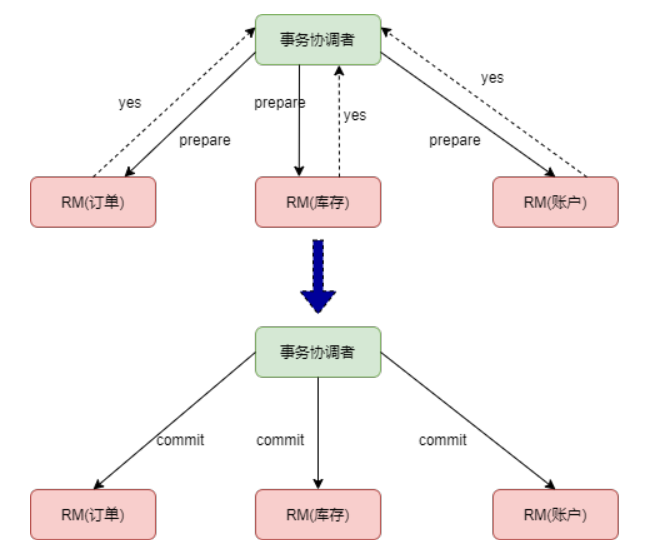
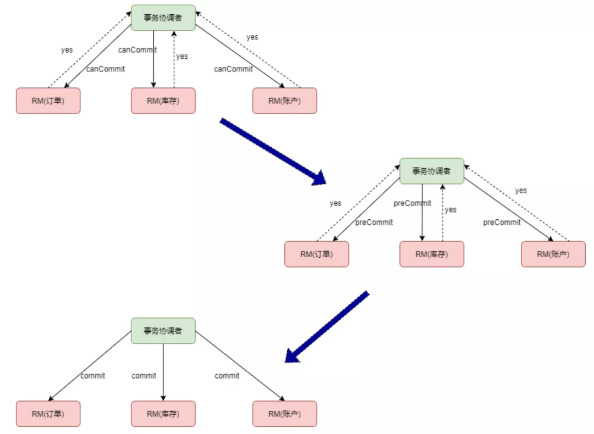
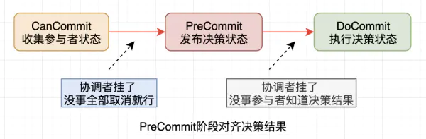

## 分布式事务推荐阅读
[springCloudAlibaba](https://github.com/alibaba/spring-cloud-alibaba)

[seata](https://github.com/seata/seata)

[seata 模式](http://seata.io/zh-cn/docs/dev/mode/xa-mode.html)

[TCC](https://www.cnblogs.com/jajian/p/10014145.html)

[小米技术团队关于分布式事务的讲解](https://xiaomi-info.github.io/2020/01/02/distributed-transaction/)

## 1、2PC和3PC一致性问题

参考文章：

[分布式系统一致性之3PC协议浅谈](https://www.jianshu.com/p/459897aba629)

[2PC 和3PC](https://juejin.cn/post/6955364874444603405)

### 2PC 

分布式事务的两阶段提交是把整个事务提交分为 prepare 和 commit 两个阶段。以电商系统为例，分布式系统中有订单、账户和库存三个服务，如下图：

第一阶段，事务协调者向事务参与者发送 prepare 请求，事务参与者收到请求后，如果可以提交事务，回复 yes，否则回复 no。

第二阶段，如果所有事务参与者都回复了 yes，事务协调者向所有事务参与者发送 commit 请求，否则发送 rollback 请求。

##### 2PC存在三个问题

- 同步阻塞，本地事务在 prepare 阶段锁定资源，如果有其他事务也要修改 xiaoming 这个账户，就必须等待前面的事务完成。这样就造成了系统性能下降。
- 协调节点单点故障，如果第一个阶段 prepare 成功了，但是第二个阶段协调节点发出 commit 指令之前宕机了，所有服务的数据资源处于锁定状态，事务将无限期地等待。
- 数据不一致，如果第一阶段 prepare 成功了，但是第二阶段协调节点向某个节点发送 commit 命令时失败，就会导致数据不一致。

 ### 3PC

为了解决两阶段提交的问题，三阶段提交做了改进：

- 在协调节点和事务参与者都引入了超时机制。
- 第一阶段的 prepare 阶段分成了两步，canCommi 和 preCommit。

##### 3PC存在的问题

引入 preCommit 阶段后，协调节点会在 commit 之前再次检查各个事务参与者的状态，保证它们的状态是一致的。但是也存在问题，那就是如果第三阶段发出 rollback 请求，有的节点没有收到，那没有收到的节点会在超时之后进行提交，造成数据不一致。

- 为啥超时之后要提交呢？因为commit只有两种情况，commit和rollback，如果超时的时候不提交而是选择回滚，那同样在未接收到commit的时候也会造成数据不一致的情况。其实就是一种决策问题

 ### 2PC和3PC的对比

2PC协议只有协调者有超时机制，3PC协议对参与者也引入了超时机制，在不同的阶段进行不同的超时处理，但是由于网络波动和网络分区存在让参与者的超时处理带来新的不确定性，甚至可能出现数据不一致。

3PC协议增加一轮询问阶段所以整个交互过程比2PC更长了，性能相比2PC是会有一些下降的，但是3PC协议对于网络分区等情况也并没有处理地很好。

总体来说，3PC相比2PC做了很多改进有一定的效果，但是仍然存在数据不一致问题，还需继续努力。

##### 2PC决策状态的确认

**5.2 决策状态的对齐**

我们知道2PC协议的决策结果初始阶段只有决策者知道，只有在它发送了决策解决才有参与者知道，这样就存在决策结果丢失的情况。假如协调者挂掉，新协调者可以咨询所有的参与者来确定决策状态，根据所有参与者的情况来确定，但是万一真理掌握在少数人手中呢?

**极端情况：**

假如有10个参与者，9个都是正常的，1个状态未知(先叫做A吧)，10个参与者都向协调者发送了反馈，如果A反馈的是Not Ready信号，其他9个都是Ready信号。协调者汇总结果决策出不具备执行条件，开始向所有参与者发送rollback，恰好第一个收到信号的是A机器，协调者挂了，A收到信号后也挂了。新的协调者询问了其余9个都是OK，新的协调者就认为具备条件了从而发送Commit信号，这样就出现了不一致。

举个例子：皇帝立储，叫来了10个大臣，但是只告诉第一个大臣A的时候，皇帝和大臣A都死了，其它大臣还没有收到消息，那么剩下的人决策极有可能是错的

##### 3PC决策状态透明化

在3PC中仍然存在只有1台机器收到指令然后挂掉的情况，但是如果出现在前置阶段，对整个结果是没有影响的，因为会被取消并且参与者并没有本地执行。

现在看3PC的思想是把做重大动作时的决策结果透明化统一化，产生的影响也就非常小了，因此PreCommit阶段的状态是明确的。

我们需要把决策结果透明化，让所有参与者都知道决策结果，3PC的PreCommit阶段对齐了结果，只要有1台还活着，整个事务的状态就是确定的，毕竟所有参与者全挂的情况概率非常低。

其实这个非常好理解就是：只要一个人收到了Commit ，那就证明之前大家都同意过了，所以新选举出来的协调者一旦发现有人是commit或者prepare-commit的话就执行commit

## 2、Seata分布式事务

### XA

[XA协议](https://baike.baidu.com/item/XA/6370881?fr=aladdin)mysql 从 5.0 版本开始，innoDB 存储引擎已经支持 XA 协议

XA 协议是由 X/Open 组织提出的分布式事务处理规范，主要定义了事务管理器 TM 和局部资源管理器 RM 之间的接口

  XA协议同样也具备事务的ACID特性。

### AT

##### AT第一阶段：代理数据源，解析SQL，保存镜像

数据源被代理后，通过被DataSourceProxy代理后，你所执行的sql，会被提取，解析，保存前镜像后，再执行业务sql，再保存后镜像，以便与后续出现异常，进行二阶段的回滚操作。

 

- 一阶段本地事务提交前，需要确保先拿到 **全局锁** 。
- 拿不到 **全局锁** ，不能提交本地事务。
- 拿 **全局锁** 的尝试被限制在一定范围内，超出范围将放弃，并回滚本地事务，释放本地锁。

以一个示例来说明：

两个全局事务 tx1 和 tx2，分别对 a 表的 m 字段进行更新操作，m 的初始值 1000。

tx1 先开始，开启本地事务，拿到本地锁，更新操作 m = 1000 - 100 = 900。本地事务提交前，先拿到该记录的 **全局锁** ，本地提交释放本地锁。 tx2 后开始，开启本地事务，拿到本地锁，更新操作 m = 900 - 100 = 800。本地事务提交前，尝试拿该记录的 **全局锁** ，tx1 全局提交前，该记录的全局锁被 tx1 持有，tx2 需要重试等待 **全局锁** 。ß

##### AT第二阶段：提交

二阶段如果是提交的话，因为“业务 SQL”在一阶段已经提交至数据库，
所以 Seata 框架只需将一阶段保存的快照数据和行锁删掉，完成数据清理即可。

##### AT第二阶段：提交

1、二阶段如果是回滚的话，Seata 就需要回滚一阶段已经执行的“业务 SQL”，还原业务数据。回滚方式便是用“before image”还原业务数据

2、但在还原前要首先要校验脏写，对比“数据库当前业务数据”和 “after image”，如果两份数据完全一致就说明没有脏写，可以还原业务数据，如果不一致就说明有脏写，出现脏写就需要转人工处理。

### TCC

TCC（Try-Confirm-Cancel） 实际上是服务化的两阶段提交协议，业务开发者需要实现这三个服务接口，第一阶段服务由业务代码编排来调用 Try 接口进行资源预留，所有参与者的 Try 接口都成功了，事务管理器会提交事务，并调用每个参与者的 Confirm 接口真正提交业务操作，否则调用每个参与者的 Cancel 接口回滚事务。

confirm/cancel执行的本地事务逻辑确认/取消预留资源，以保证最终一致性，也就是所谓的`补偿型事务`

AT 模式（[参考链接 TBD](http://seata.io/zh-cn/docs/dev/mode/tcc-mode.html)）基于 **支持本地 ACID 事务** 的 **关系型数据库**：

- 一阶段 prepare 行为：在本地事务中，一并提交业务数据更新和相应回滚日志记录。
- 二阶段 commit 行为：马上成功结束，**自动** 异步批量清理回滚日志。
- 二阶段 rollback 行为：通过回滚日志，**自动** 生成补偿操作，完成数据回滚。

相应的，TCC 模式，不依赖于底层数据资源的事务支持：

- 一阶段 prepare 行为：调用 **自定义** 的 prepare 逻辑。
- 二阶段 commit 行为：调用 **自定义** 的 commit 逻辑。
- 二阶段 rollback 行为：调用 **自定义** 的 rollback 逻辑。

所谓 TCC 模式，是指支持把 **自定义** 的分支事务纳入到全局事务的管理中。

#### demo理解

比如要修改一个订单的状态为已付款，那么按照 TCC 的思想就要有下面三个方法来实现事务：

- 1. Try : 订单状态更新态，将订单状态改为 UPDATE。
- 1. Confirm：确认订单状态修改，将订单状态改为已付款。
- 1. Cancle：取消订单状态的修改，一旦发生错误，则使用此方法做数据回滚。

#### TCC cancel时机

https://www.zhihu.com/question/48627764

一个TCC服务的Try操作是否生效，这是TCC事务框架应该知道的，因为其Try业务所参与的RM事务也是由TCC事务框架所commit/rollbac的（前提是TCC事务框架接管了Spring的事务管理器）。所以，TCC事务回滚时，TCC事务框架可考虑如下处理策略：

1）如果TCC事务框架发现某个服务的Try操作的本地事务尚未提交，应该直接将其回滚，而后就不必再执行该服务的cancel业务；

2）如果TCC事务框架发现某个服务的Try操作的本地事务已经回滚，则不必再执行该服务的cancel业务；

3）如果TCC事务框架发现某个服务的Try操作尚未被执行过，那么，也不必再执行该服务的cancel业务。

总之，TCC事务框架应该保障：

1）已生效的Try操作应该被其Cancel操作所回撤；

2）尚未生效的Try操作，则不应该执行其Cancel操作。

#### TCC异常情况

TCC 分布式事务的核心思想，说白了，就是当遇到下面这些情况时：

- 某个服务的数据库宕机了。
- 某个服务自己挂了。
- 那个服务的 Redis、Elasticsearch、MQ 等基础设施故障了。
- 某些资源不足了，比如说库存不够这些。

先来 Try 一下，不要把业务逻辑完成，先试试看，看各个服务能不能基本正常运转，能不能先冻结我需要的资源。

如果 Try 都 OK，也就是说，底层的数据库、Redis、Elasticsearch、MQ 都是可以写入数据的，并且你保留好了需要使用的一些资源（比如冻结了一部分库存）。

接着，再执行各个服务的 Confirm 逻辑，基本上 Confirm 就可以很大概率保证一个分布式事务的完成了。

那如果 Try 阶段某个服务就失败了，比如说底层的数据库挂了，或者 Redis 挂了，等等。

此时就自动执行各个服务的 Cancel 逻辑，把之前的 Try 逻辑都回滚，所有服务都不要执行任何设计的业务逻辑。保证大家要么一起成功，要么一起失败。

**问题一、如果有一些意外的情况发生了，比如说订单服务突然挂了，然后再次重启，TCC 分布式事务框架是如何保证之前没执行完的分布式事务继续执行的呢？**

所以，TCC 事务框架都是要记录一些分布式事务的活动日志的，可以在磁盘上的日志文件里记录，也可以在数据库里记录。保存下来分布式事务运行的各个阶段和状态。

问题还没完，**万一某个服务的 Cancel 或者 Confirm 逻辑执行一直失败怎么办呢？**

那也很简单，TCC 事务框架会通过活动日志记录各个服务的状态。举个例子，比如发现某个服务的 Cancel 或者 Confirm 一直没成功，会不停的重试调用它的 Cancel 或者 Confirm 逻辑，务必要它成功！

当然了，如果你的代码没有写什么 Bug，有充足的测试，而且 Try 阶段都基本尝试了一下，那么其实一般 Confirm、Cancel 都是可以成功的！

#### TCC优缺点

- 缺点

1、对应用的侵入性强。业务逻辑的每个分支都需要实现try、confirm、cancel三个操作，应用侵入性较强，改造成本高。
2、实现难度较大。需要按照网络状态、系统故障等不同的失败原因实现不同的回滚策略。为了满足一致性的要求，confirm和cancel接口必须实现幂等。

- 优点

相比于XA和AT，让应用自己定义数据库操作的粒度，使得降低锁冲突、提高吞吐量成为可能。

### Saga

暂未学习

### 分布式事务总结

- AT和AT 模式是无侵入的分布式事务解决方案，适用于不希望对业务进行改造的场景，几乎0学习成本。
- TCC 模式是高性能分布式事务解决方案，适用于核心系统等对性能有很高要求的场景。
- 

| 模式        | 说明                                   | 缺点                                                         | 优点                                         |
| ----------- | -------------------------------------- | ------------------------------------------------------------ | -------------------------------------------- |
| XA          | 二阶段提交                             | 1、数据锁定 2、 协议阻塞：XA prepare 后，分支事务进入阻塞阶段，收到 XA commit 或 XA rollback 前必须阻塞等待。 3、性能差：单个事务因为要被协调增加相应时间；数据库锁冲突 | 1、无侵入仅仅依赖数据库本身的ACID特性        |
| AT TXC | 二阶段提交 无侵入 代理数据源 | 1、需要undo_log表 2、需要做SQL解析                      | 1、全局锁降低了数据库锁冲突                  |
| TCC         | 补偿型                                 | 1、改造成本高，每个接口都要实现3中状态方法 2、          | 1、最终一致性方案 2、锁颗粒度小，并发高 |
|             |                                        |                                                              |                                              |
|             |                                        |                                                              |                                              |

## 3、RocketMQ分布式事务消息

[阿里云介绍RocketMQ事务消息](https://help.aliyun.com/document_detail/43348.html)

[小米技术团队关于分布式事务的讲解](https://xiaomi-info.github.io/2020/01/02/distributed-transaction/)

#### 事务消息执行流程

1. Producer发送Half(prepare)消息到broker；

2. half消息发送成功之后执行本地事务；

3. （由用户实现）本地事务执行如果成功则返回commit，如果执行失败则返回roll_back。

- 如果broker收到了确认消息

   - 如果收到的结果是commit，则broker视为整个事务过程执行成功，将消息下发给Conusmer端消费；
   - 如果收到的结果是rollback，则broker视为本地事务执行失败，broker删除Half消息，不下发给consumer。
   
- 如果broker未收到了确认消息

   - broker定时回查本地事务的执行结果；

4、broker接收到的如果是commit，则broker视为整个事务过程执行成功，将消息下发给Conusmer端消费。如果是rollback，则broker视为本地事务执行失败，broker删除Half消息，不下发给consumer

#### Broker回查事务消息

简单理解就是定时回查。核心变量就是：事务超时时间、最大回查次数

#### 如果下游服务消费失败怎么办？

B 系统定期消费 mq 中的 confirm 消息，执行本地事务，并发送 ack 消息。如果 B 系统中的本地事务失败，会一直不断重试，如果是业务失败，会向 A 系统发起回滚请求

 

