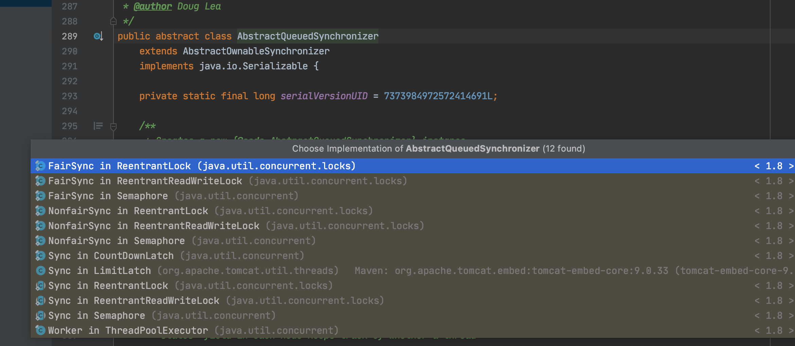
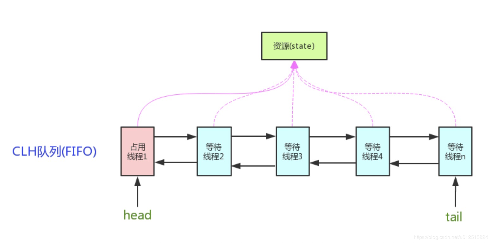

## 从lock开始说AQS

### LOCK怎么起到锁的作用的呢？

如果你熟悉 synchronized，你知道程序编译成 CPU 指令后，在临界区会有 `moniterenter` 和 `moniterexit` 指令的出现，可以理解成进出临界区的标识

从范式上来看：

- `lock.lock()` 获取锁，“等同于” synchronized 的 moniterenter指令
- `lock.unlock()` 释放锁，“等同于” synchronized 的 moniterexit 指令

那 Lock 是怎么做到的呢？

> 其实很简单，比如在  ReentrantLock 内部维护了一个 volatile 修饰的变量 state，通过 CAS 来进行读写（最底层还是交给硬件来保证原子性和可见性），如果CAS更改成功，即获取到锁，线程进入到 try 代码块继续执行；如果没有更改成功，线程会被【挂起】，不会向下执行

但 Lock 是一个接口，里面根本没有 state 这个变量的存在：其实主要看ReentrantLock的实现,我们来看下它的源码,发现它只是实现了lock接口，但是内部有一个Sync对象，而Sync对象是继承了AQS，所以要学习Lock还是要学习AQS

```java
public class ReentrantLock implements Lock, java.io.Serializable {
    private final Sync sync;

    abstract static class Sync extends AbstractQueuedSynchronizer {
```

### 为啥要看AQS源码？



相信看到这个截图你就明白一二了，你听过的，面试常被问起的，工作中常用的

- `ReentrantLock`
- `ReentrantReadWriteLock`
- `Semaphore(信号量)`
- `CountDownLatch`
- `公平锁`
- `非公平锁`
- `ThreadPoolExecutor` (关于线程池的理解，可以查看 为什么要使用线程池? )

都和 AQS 有直接关系，所以了解 AQS 的抽象实现，在此基础上再稍稍查看上述各类的实现细节，很快就可以全部搞定，不至于查看源码时一头雾水，丢失主线

## JUC 

```java
package java.util.concurrent;包下面的
```


## AQS同步器

package java.util.concurrent;包下面的Exchanger

Exchanger可以

exchange只能是两个线程之间，交换这个东西只能两两进行。AQS同步器

**[一篇介绍的AQS的博文](https://www.jianshu.com/p/a8d27ba5db49)**

```java
package java.util.concurrent.locks;包下面的AQS：AbstractQuenedSynchronizer
```

AQS：AbstractQuenedSynchronizer抽象的队列式同步器。是除了java自带的synchronized关键字之外的锁机制。
AQS的全称为（AbstractQueuedSynchronizer），这个类在java.util.concurrent.locks包

```java
public abstract class AbstractQueuedSynchronizer
    extends AbstractOwnableSynchronizer
 
    private transient volatile Node head;

    private transient volatile Node tail;

    private volatile int state;
```

而每一个Node都有一个p rev和一个next说明，node是一个双向链表

```java
static final class Node {
    /**
     * Marker to indicate a node is waiting in shared mode
     */
    static final Node SHARED = new Node();
    /**
     * Marker to indicate a node is waiting in exclusive mode
     */
    static final Node EXCLUSIVE = null;
    //取消
    static final int CANCELLED = 1;
    //等待触发
    static final int SIGNAL = -1;
    //等待条件
    static final int CONDITION = -2;
    //状态需要向后传播
    static final int PROPAGATE = -3;

    volatile int waitStatus;
    volatile Node prev;
    volatile Node next;
    volatile Thread thread;
    Node nextWaiter;
}
```


但是发现AQS也是继承了一个类，叫AbstractOwnableSynchronizer，其作用就是获取、设置拥有该锁的线程

```java
public abstract class AbstractOwnableSynchronizer
    implements java.io.Serializable {


    protected AbstractOwnableSynchronizer() { }

	//当前拥有排它锁的线程
    private transient Thread exclusiveOwnerThread;


    protected final void setExclusiveOwnerThread(Thread thread) {
        exclusiveOwnerThread = thread;
    }


    protected final Thread getExclusiveOwnerThread() {
        return exclusiveOwnerThread;
    }
}
```

### 1.AQS的核心思想

  AQS的核心思想是基于volatile int state这样的volatile变量，配合Unsafe工具对其原子性的操作来实现对当前锁状态进行修改。同步器内部依赖一个FIFO的双向队列来完成资源获取线程的排队工作。

用volatile修饰一个共享变量，线程通过CAS取改变，成功获取锁，失败进入等待队列，等待被唤醒，所以AQS是自旋锁

J.U.C是基于AQS实现的，AQS是一个同步器，设计模式是模板模式。
核心数据结构：双向链表 + state(锁状态)

底层是CAS

### AQS同步队列

  


 同步器AQS内部的实现是依赖同步队列（一个FIFO的双向队列，其实就是数据结构双向链表）来完成同步状态的管理。

  当前线程获取同步状态失败时，同步器AQS会将**当前线程和等待状态**等信息构造成为一个节点（node）加入到同步队列，同时会阻塞当前线程；

  当同步状态释放的时候，会把首节点中的线程唤醒，使首节点的线程再次尝试获取同步状态。

**AQS是独占锁和共享锁的实现的父类。**

### 4. AQS模版方法

AQS已经为我们提供了同步器的基础操作，如果要自定义同步器，必须实现以下几个方法：

- `tryAcquire(int)`：独占方式。尝试获取资源，成功则返回true，失败则返回false。

- `tryRelease(int)`：独占方式。尝试释放资源，成功则返回true，失败则返回false。

- `tryAcquireShared(int)`：共享方式。尝试获取资源。负数表示失败；0表示成功，但没有剩余可用资源；正数表示成功，且有剩余资源。

- `tryReleaseShared(int)`：共享方式。尝试释放资源，成功则返回true，失败则返回false。

- `isHeldExclusively()`：该线程是否正在独占资源。只有用到Condition才需要去实现它。

  - 代码如下

  ```java
     protected final boolean isHeldExclusively() {
              // While we must in general read state before owner,
              // we don't need to do so to check if current thread is owner
       //判断持有锁的线程是否是当前线程
              return getExclusiveOwnerThread() == Thread.currentThread();
          }
  ```

  

---


- 独占锁：锁在一个时间点只能被一个线程占有。根据锁的获取机制，又分为“公平锁”和“非公平锁”。**等待队列**中按照FIFO的原则获取锁，等待时间越长的线程越先获取到锁，这就是公平的获取锁，即公平锁。而非公平锁，线程获取的锁的时候，无视**等待队列**直接获取锁。ReentrantLock和ReentrantReadWriteLock.Writelock是独占锁。
  - **说明：**独占模式下获取资源/锁，忽略中断的影响。内部主要调用了三个方法，其中tryAcquire需要自定义实现。后面会对各个方法进行详细分析。`acquire`方法流程如下：
    1. `tryAcquire()` 尝试直接获取资源，如果成功则直接返回，失败进入第二步；
    2. `addWaiter()` 获取资源失败后，将当前线程加入等待队列的尾部，并标记为独占模式；
    3. `acquireQueued()` 使线程在等待队列中自旋等待获取资源，一直获取到资源后才返回。如果在等待过程中被中断过，则返回true，否则返回false。
    4. 如果线程在等待过程中被中断(interrupt)是不响应的，在获取资源成功之后根据返回的中断状态调用`selfInterrupt()`方法再把中断状态补上。
- 共享锁：同一个时候能够被多个线程获取的锁，能被共享的锁。JUC包中ReentrantReadWriteLock.ReadLock，CyclicBarrier，CountDownLatch和Semaphore都是共享锁。
  - 在`tryAcquireShared`中获取资源失败后，将当前线程加入等待队列尾部等待唤醒，成功获取资源后返回。在阻塞结束后成功获取到资源时，如果还有剩余资源，就调用`setHeadAndPropagate`方法继续唤醒之后的线程

### 公平锁lock的执行过程

A1:当我们执行xxx.lock的时候其实进入的是下面的方法

```java
   public void lock() {
        sync.lock();
    }
```

A2:所以我们具体看下sync.lock的实现，比如公平锁中的实现

```java
        final void lock() {
            acquire(1);
        }
```

A3：我们进入acquire方法,如果

```java
    public final void acquire(int arg) {
      //如果没有获取到资源并且加入了队列尾部
        if (!tryAcquire(arg) &&
            acquireQueued(addWaiter(Node.EXCLUSIVE), arg))
            selfInterrupt();
    }
```

A4:发现其调用了tryAcquire方法，我们看下ReentrantLock公平锁的tryAcquire方法实现，如下

```java
//公平锁
protected final boolean tryAcquire(int acquires) {
    final Thread current = Thread.currentThread();
    int c = getState();
    //如果为0，说明没有被别人占用，可以进入
    if (c == 0) {
       //判断是否有有其它线程在排队,公平性操作
        if (!hasQueuedPredecessors() &&
            //如果没有其它线程在排队则用CAS比较交换
                compareAndSetState(0, acquires)) {
            setExclusiveOwnerThread(current);
            return true;
        }
    }
  //或者当前线程就是那个占有的线程，则重入
    else if (current == getExclusiveOwnerThread()) {
        int nextc = c + acquires;
        if (nextc < 0)
            throw new Error("Maximum lock count exceeded");
        setState(nextc);
        return true;
    }
    return false;
}
```

5. 所以执行lock指令不一定能获取锁，如果没有获取锁，则就会把它加入到队列尾部

### 非公平锁lock过程

B1:调用xxx.lock之后，进入下面的lock方法，发现是直接CAS比较交换，成功则设置拥有者就是当前线程,失败了调用acquire方法的非公平实现

```java
*/
final void lock() {
if (compareAndSetState(0, 1))
setExclusiveOwnerThread(Thread.currentThread());
else
acquire(1);
}

protected final boolean tryAcquire(int acquires) {
return nonfairTryAcquire(acquires);
}
```

B2:还记得上吗的acquire的实现是什么吗？直接把上面的copy过来，其实就是失败了直接加入队列尾部

```java
    public final void acquire(int arg) {
      //如果没有获取到资源并且加入了队列尾部
        if (!tryAcquire(arg) &&
            acquireQueued(addWaiter(Node.EXCLUSIVE), arg))
            selfInterrupt();
    }
```

B3:是不是公平锁和非公平锁没有区别？NO，我们再去看上面的B1代码,里面重写了tryAcquire方法，具体调用的就是nonfairTryAcquire这个方法

```java
final boolean nonfairTryAcquire(int acquires) {
            final Thread current = Thread.currentThread();
            int c = getState();
            if (c == 0) {
                if (compareAndSetState(0, acquires)) {
                    setExclusiveOwnerThread(current);
                    return true;
                }
            }
            else if (current == getExclusiveOwnerThread()) {
                int nextc = c + acquires;
                if (nextc < 0) // overflow
                    throw new Error("Maximum lock count exceeded");
                setState(nextc);
                return true;
            }
            return false;
        }
```

我们发现它不再判断当前队列里面有没有元素，而是直接CAS竞争了

这就是公平锁和非公平锁的区别

### AQS哪里用到了自旋操作？

#### 加入队尾的时候自旋

```
private Node enq(final Node node) {
//CAS自旋，直到加入队尾
        for (;;) {
            Node t = tail;
            if (t == null) { // Must initialize
                if (compareAndSetHead(new Node()))
                    tail = head;
            } else {
                node.prev = t;
                if (compareAndSetTail(t, node)) {
                    t.next = node;
                    return t;
                }
            }
        }
    }
```

#### 队列中第二个节点自旋获取资源

```java
final boolean acquireQueued(final Node node, int arg) {
  // 标识是否获取资源失败
        boolean failed = true;
        try {
          /// 标识当前线程是否被中断过
            boolean interrupted = false;
          //自旋
            for (;;) {
          
								// 获取当前节点的前继节点
                final Node p = node.predecessor();
               //如果前驱是head，即该结点已成老二，那么便有资格去尝试获取资源（
   							//可能是老大释放完资源唤醒自己的，当然也可能被interrupt了。
                if (p == head && tryAcquire(arg)) {
                  ////拿到资源后，将head指向该结点。所以head所指的标杆结点，就是当前获取到资源的那个结点或null。
                    setHead(node);
                    p.next = null; // help GC
                    failed = false;
                   // 返回中断标记
                    return interrupted;
                }
					  // 若前继节点不是头结点，或者获取资源失败，
            // 则需要通过shouldParkAfterFailedAcquire函数
            // 判断是否需要阻塞该节点持有的线程
            // 若shouldParkAfterFailedAcquire函数返回true，
            // 则继续执行parkAndCheckInterrupt()函数，
            // 将该线程阻塞并检查是否可以被中断，若返回true，则将interrupted标志置于true
                if (shouldParkAfterFailedAcquire(p, node) &&
                    parkAndCheckInterrupt())
                    interrupted = true;
            }
        } finally {
            if (failed)
                cancelAcquire(node);
        }
    }
```

我们再来看下什么时候能够进入休息状态

```java
private static boolean shouldParkAfterFailedAcquire(Node pred, Node node) {
        int ws = pred.waitStatus;
        if (ws == Node.SIGNAL)
						// 如果已经告诉前驱拿完号后通知自己一下，那就可以安心休息了
            return true;
        if (ws > 0) {

          /*
            * 如果前驱放弃了，那就一直往前找，直到找到最近一个正常等待的状态，并排在它的后边。
            * 注意：那些放弃的结点，由于被自己“加塞”到它们前边，它们相当于形成一个无引用链，稍后就会被保安大叔赶走了(GC回收)！*/

            do {
                node.prev = pred = pred.prev;
            } while (pred.waitStatus > 0);
            pred.next = node;
        } else {
           //如果前驱正常，那就把前驱的状态设置成SIGNAL，告诉它拿完号后通知自己一下。
          //以保证下次自旋时，shouldParkAfterFailedAcquire直接返回true
            compareAndSetWaitStatus(pred, ws, Node.SIGNAL);
        }
        return false;
    }
```

整个流程中，如果前驱结点的状态不是SIGNAL，那么自己就不能安心去休息，需要去找个安心的休息点，同时可以再尝试下看有没有机会轮到自己拿号。

### 加入队列的整个流程


1. 结点进入队尾后，检查状态，找到安全休息点；
2. 调用park()进入waiting状态，等待unpark()或interrupt()唤醒自己；
3. 被唤醒后，看自己是不是有资格能拿到号。如果拿到，head指向当前结点，并返回从入队到拿到号的整个过程中是否被中断过；如果没拿到，继续流程1。


### 为啥AQS要用park()、UnPark()？

为啥不用sleep、wait(),唤醒的时候为啥不用notify()

- 为啥不用notify，因为它是随机唤醒，而notifyAll是全部唤醒，AQS是想唤醒特定的线程
- 为啥不用wait？因为执行wait()之前要首先获取到锁，而AQS的目的是让那些没有获取到锁的线程休息，所以不行
- 为啥不用sleep？因为sleep会释放锁，但是我都没有获取锁，何来释放和wait()不行的原理差不多


## AQS的应用

AQS 定义了两种资源共享方式：
1.**Exclusive**：独占，只有一个线程能执行，如ReentrantLock
2.**Share**：共享，多个线程可以同时执行，如Semaphore、CountDownLatch、ReadWriteLock，CyclicBarrier


### Semaphore信号量

信号量是一种固定资源的限制的一种并发工具包，基于AQS实现的，在构造的时候会设置一个值，代表着资源数量。信号量主要是应用于是用于多个共享资源的互斥使用，和用于并发线程数的控制（druid的数据库连接数，就是用这个实现的），信号量也分公平和非公平的情况，基本方式和reentrantLock差不多，在请求资源调用task时，会用自旋的方式减1，如果成功，则获取成功了，如果失败，导致资源数变为了0，就会加入队列里面去等待。调用release的时候会加一，补充资源,并唤醒等待队列。


如果我Semaphore s = new Semaphore(1)写的是1，我取一下，acquire一下他就变成0，当变成0之后别人是acquire不到的，然后继续执行，线程结束之后注意要s.release(), 执行完该执行的就把他release掉，release又把0变回去1， 还原化。


Semaphore的含义就是限流，比如说你在买票，Semaphore写5就是只能有5个人可以同时买票。acquire的意思叫获得这把锁，线程如果想继续往下执行，必须得从Semaphore里面获得一 个许可， 他一共有5个许可用到0了你就得给我等着。

#### 测试Semaphore

```java
import java.util.concurrent.ExecutorService;
import java.util.concurrent.Executors;
import java.util.concurrent.Semaphore;

public class SemaphoreExample1 {
    // 请求的数量
    private static final int threadCount = 20;

    public static void main(String[] args) throws InterruptedException {
        // 创建一个具有固定线程数量的线程池对象（如果这里线程池的线程数量给太少的话你会发现执行的很慢）
        ExecutorService threadPool = Executors.newFixedThreadPool(30);
        // 一次只能允许执行的线程数量。
        final Semaphore semaphore = new Semaphore(5);

        for (int i = 0; i < threadCount; i++) {
            final int threadnum = i;
            threadPool.execute(() -> {// Lambda 表达式的运用
                try {
                    semaphore.acquire();// 获取一个许可，所以可运行线程数量为20/1=20
                    test(threadnum);
                    semaphore.release();// 释放一个许可
                } catch (InterruptedException e) {
                    // TODO Auto-generated catch block
                    e.printStackTrace();
                }

            });
        }
        threadPool.shutdown();
        System.out.println("finish");
    }

    public static void test(int threadnum) throws InterruptedException {
        Thread.sleep(2000);// 模拟请求的耗时操作
        System.out.println("threadnum:" + threadnum);
        Thread.sleep(2000);// 模拟请求的耗时操作
    }
}
```

- 测试的结果你会发现间隔一定时间后，都是5个一组出现的，这样就验证了我们的推测

#### Semaphore 应用

- acquire（） release（） 可用于对象池，资源池的构建，比如静态全局对象池，数据库连接池；
- 可创建计数为1的S，作为互斥锁（二元信号量）
- 一个文件同时能有多少个线程访问

### CountDownLatch

等待多线程完成的CountDownLatch,所以countDownLatch一定意义上是join的高级版本

1. 其实CountDownLatch实现的功能无非就是等所有的线程执行完毕后执行另一个事情，
	那为什么非要用它呢？
2.  join() 方法也可以实现类似功能，为什么不用呢？
3. 因为：如果只有两三个线程还好，如果数量过多，那得写多少join啊
	而且提前结束任务还得捕获InterruptException异常，繁琐...
4. 线程之间通信  wait/notify ，然后进入synchronized同步代码块，检查计数器不为0 ，然后调用wait（）方法
	直到为0，则用notifyAll唤醒等待的最后线程
5. 为什么不用notify呢？
	因为会有大量synchronized同步块，还可以出现假唤醒

```java
import java.util.concurrent.CountDownLatch;

/**
 * xiyou-todo CountDownLatch的使用
 * 调用await()方法的线程会被挂起，它会等待直到count值为0才继续执行
 * public void await() throws InterruptedException { };
 * 和await()类似，只不过等待一定的时间后count值还没变为0的话就会继续执行
 * public boolean await(long timeout, TimeUnit unit) throws InterruptedException { };
 * 将count值减1
 * public void countDown() { };
 */
public class TestCountDownLatch {
    final CountDownLatch latch = new CountDownLatch(11);
    Thread thread = new Thread(new Runnable() {
        @Override
        public void run() {
            System.out.println("线程" + Thread.currentThread().getId() + "先执行一次");
            latch.countDown();
            System.out.println("线程" + Thread.currentThread().getId() + "先执行一次结束，剩余" + latch.getCount());

        }
    });

    public void test() {
        thread.start();
        for (int i = 0; i < 10; i++) {
            new Thread(new Runnable() {
                @Override
                public void run() {

                    System.out.println("线程" + Thread.currentThread().getId() + "..........start");
                    try {
                        Thread.sleep(1000);
                    } catch (InterruptedException e) {
                        e.printStackTrace();
                    }
                    System.out.println("线程" + Thread.currentThread().getId() + ".........end...");
                    latch.countDown();
                }
            }).start();
        }


        try {

            latch.await();
            System.out.println("调用await()方法的线程会被挂起，它会等待直到count值为0才继续执行");
        } catch (InterruptedException e) {
            e.printStackTrace();
        }
        System.out.println("11个线程已执行完毕");
    }

    public static void main(String[] args) {
        TestCountDownLatch c = new TestCountDownLatch();
        c.test();
    }
}
```


### 同步屏障CyclicBarrier

CyclicBarrier的字面意思是可循环使用（Cyclic）的屏障（Barrier）。它要做的事情是，让一 

组线程到达一个屏障（也可以叫同步点）时被阻塞，直到最后一个线程到达屏障时，屏障才会 

开门，所有被屏障拦截的线程才会继续运行。

```java
import java.util.concurrent.BrokenBarrierException;
import java.util.concurrent.CyclicBarrier;
import java.util.concurrent.ExecutorService;
import java.util.concurrent.Executors;

public class CyclicBarrierExample3 {
    // 请求的数量
    private static final int threadCount = 9;
    // 需要同步的线程数量
    private static final CyclicBarrier cyclicBarrier = new CyclicBarrier(3, () -> {
        System.out.println("------当线程数达到之后，优先执行------");
    });

    public static void main(String[] args) throws InterruptedException {
        // 创建线程池
        ExecutorService threadPool = Executors.newFixedThreadPool(10);

        for (int i = 0; i < threadCount; i++) {
            final int threadNum = i;
            Thread.sleep(1000);
            threadPool.execute(() -> {
                try {
                    test(threadNum);
                } catch (InterruptedException e) {
                    // TODO Auto-generated catch block
                    e.printStackTrace();
                } catch (BrokenBarrierException e) {
                    // TODO Auto-generated catch block
                    e.printStackTrace();
                }
            });
        }
        threadPool.shutdown();
    }

    public static void test(int threadnum) throws InterruptedException, BrokenBarrierException {
        System.out.println("threadnum:" + threadnum + "is ready");
        cyclicBarrier.await();
        System.out.println("threadnum:" + threadnum + "is finish");
    }

}
```

- 看结果其实就是每次等到了3个，执行一个方法

```sql
threadnum:0is ready
threadnum:1is ready
threadnum:2is ready
------当线程数达到之后，优先执行------
threadnum:2is finish
threadnum:0is finish
threadnum:1is finish
threadnum:3is ready
threadnum:4is ready
threadnum:5is ready
------当线程数达到之后，优先执行------
threadnum:5is finish
threadnum:3is finish
threadnum:4is finish
threadnum:6is ready
threadnum:7is ready
threadnum:8is ready
------当线程数达到之后，优先执行------
threadnum:8is finish
threadnum:7is finish
threadnum:6is finish
```


#### CountDownLatch和CyclicBarrier的区别是什么

CountDownLatch是等待其他线程执行到某一个点的时候，在继续执行逻辑（子线程不会被阻塞，会继续执行），只能被使用一次。最常见的就是join形式，主线程等待子线程执行完任务，在用主线程去获取结果的方式（当然不一定），内部是用计数器相减实现的（没错，又特么是AQS），AQS的state承担了计数器的作用，初始化的时候，使用CAS赋值，主线程调用await（）则被加入共享线程等待队列里面，子线程调用countDown的时候，使用自旋的方式，减1，知道为0，就触发唤醒。

CyclicBarrier回环屏障，主要是等待一组线程到底同一个状态的时候，放闸。CyclicBarrier还可以传递一个Runnable对象，可以到放闸的时候，执行这个任务。CyclicBarrier是可循环的，当调用await的时候如果count变成0了则会重置状态，如何重置呢，CyclicBarrier新增了一个字段parties，用来保存初始值，当count变为0的时候，就重新赋值。还有一个不同点，CyclicBarrier不是基于AQS的，而是基于RentrantLock实现的。存放的等待队列是用了条件变量的方式。

### ReadWriteLock

首先明确一下，不是说ReentrantLock不好，只是ReentrantLock某些时候有局限。如果使用ReentrantLock，可能本身是为了防止线程A在写数据、线程B在读数据造成的数据不一致，但这样，如果线程C在读数据、线程D也在读数据，读数据是不会改变数据的，没有必要加锁，但是还是加锁了，降低了程序的性能。

因为这个，才诞生了读写锁ReadWriteLock。ReadWriteLock是一个读写锁接口，ReentrantReadWriteLock是ReadWriteLock接口的一个具体实现，实现了读写的分离，**读锁是共享的，写锁是独占的**，读和读之间不会互斥，读和写、写和读、写和写之间才会互斥，提升了读写的性能。

### ReentrantLock和Synchronized的区别

#### ReentrantLock可重入的实现

内部自定义了同步器 Sync，加锁的时候通过CAS 算法 ，将线程对象放到一个双向链表 中，每次获取锁的时候 ，看下当前维 护的那个线程ID和当前请求的线程ID是否一样，一样就可重入了；

#### ReentrantLock如何避免死锁?

- 响应中断lockInterruptibly（）
- 可轮询锁tryLock（）
- 定时锁tryLock（long time）

synchronized是和if、else、for、while一样的关键字，ReentrantLock是类，这是二者的本质区别。既然ReentrantLock是类，那么它就提供了比synchronized更多更灵活的特性，可以被继承、可以有方法、可以有各种各样的类变量，ReentrantLock比synchronized的扩展性体现在几点上：

（1）ReentrantLock可以对获取锁的等待时间进行设置，这样就避免了死锁

（2）ReentrantLock可以获取各种锁的信息

（3）ReentrantLock可以灵活地实现多路通知

另外，二者的锁机制其实也是不一样的。ReentrantLock底层调用的是Unsafe的park方法加锁，而sync是的重量级锁是依赖操作系统来实现的

- 相同点
  - 支持可重入
  - 都有非公平实现
  - 原理部分都依赖CAS


### ConcurrentSkipListMap

concurrentSkipListMap通过跳表来实现的高并发容器并且这个Map是有排序的。

跳表是什么样的结构呢?底层本身存储的元素一个链表，它是排好顺序的，大家知道当一个链表排好顺序的时候往里插入是特别困难的，查找的时候也特别麻烦，因为你得从头去遍历查找这个元素到底在哪里。

所以就出现了这个跳表的结构，底层是一个链表，链表查找的时候比较困难怎么办，那么我们在这些链表的基础上在拿出一些关键元素来，在上面做一层，那这个关键元素的这一层也是一个链表，那这个数量特别大的话在这个基础之上在拿一层出来再做一个链表， 每层链表的数据越来越少，而且它是分层，在我们查找的时候从顶层往下开始查找。


