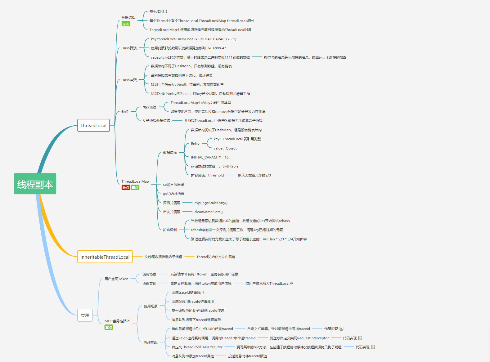
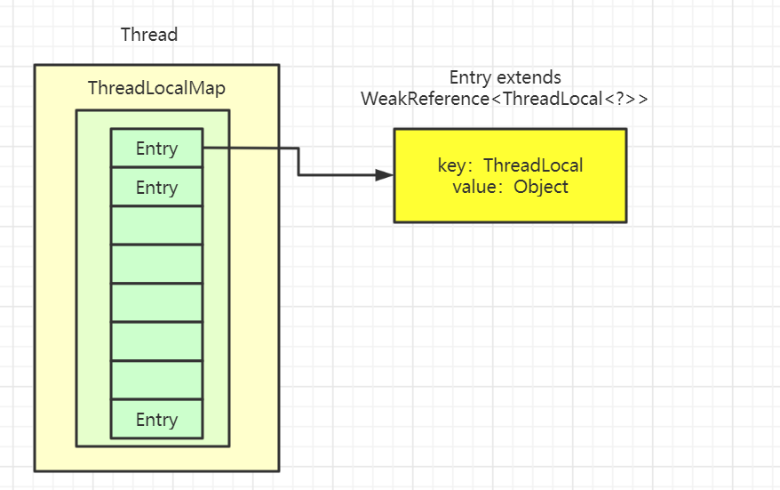

## 文章推荐

[threadLocal源码分析，这是一定要看的](https://juejin.im/post/5eb52dd2f265da7bb65fb909)

[源码分析2](https://mp.weixin.qq.com/s/NSNRw6j6Pqzq93WkX01PHA)




## java 四种引用类型

为了搞清楚这个问题，我们需要搞清楚`Java`的**四种引用类型**：

- **强引用**：我们常常new出来的对象就是强引用类型，只要强引用存在，垃圾回收器将永远不会回收被引用的对象，哪怕内存不足的时候
- **软引用**：使用SoftReference修饰的对象被称为软引用，软引用指向的对象在内存要溢出(内存不够)的时候被回收
  - 对象——软引用对象 SoftReference——实际堆里面的地址
  - 总结：空间不足回收、空间充足的时候不回收
  - 用处：缓存使用，如caffeine
- **弱引用**：使用WeakReference修饰的对象被称为弱引用，只要发生垃圾回收，若这个对象只被弱引用指向，那么就会被回收
  - 对象——若引用——实际堆里面的地址
- **虚引用**：虚引用是最弱的引用，在 Java 中使用 PhantomReference 进行定义。虚引用中唯一的作用就是用队列接收对象即将死亡的通知
  - 作用：管理直接内存，用不到
  - 其实就是在内存回收的时候，发现一个对象指向的是直接内存，这个时候就会清空直接内存

## ThreadLocal使用场景

 #### Spring关于事物的处理

####  mybatis关于分页的处理

#### random类的多线程版本ThreadLocalRandom

#### mybatis读写分离

通过ThreadLocal将数据源设置到每个线程上下文中


我们知道random类其实内部使用AtomicInteger来实现的，而AtomicInteger上通过CAS来实现的，所以多线程下效率不高，而ThreadLocalRandom是给每个线程一个AtomicInteger，所以不用通过ca s自旋了，效率很高

- 每个线程需要一个独享对象（通常是工具类，典型需要使用的类有SimpleDateFormat和Random）

每个Thread内有自己的实例副本，不共享

- 每个线程内需要保存全局变量（例如在拦截器中获取用户信息），可以让不同方法直接使用，避免参数传递的麻烦
- 一个方法A要支持事物，但是这个要调用BCD等方法，那么要保证传入BCD的connection连接是一样的，所以事物的底层是用ThreadLocal实现的

对于独享对象可以实现的示例是： 

### N个线程打印日期，要求每个线程打印的日期不一致

```java
import java.text.SimpleDateFormat;
import java.util.Date;
import java.util.concurrent.ExecutorService;
import java.util.concurrent.Executors;

public class ThreadLocalDateTest4 {

    public static ExecutorService threadPool = Executors.newFixedThreadPool(10);

    /**
     * 用threadLocal解决线程安全问题
     */
    public static void method3() {
        for (int i = 0; i < 1000; i++) {
            int finalI = i;
            //提交任务
            threadPool.submit(new Runnable() {
                @Override
                public void run() {
                    String date = new ThreadLocalDateTest4().printDate(finalI);
                    System.out.println(date);
                }
            });
        }
        threadPool.shutdown();
    }

    public String printDate(int seconds) {

        //参数的单位是毫秒，从1970.1.1 00:00:00 GMT 开始计时
        Date date = new Date(1000 * seconds);
        //获取 SimpleDateFormat 对象
        SimpleDateFormat dateFormat = ThreadSafeFormatter4.dateFormatThreadLocal.get();
        return dateFormat.format(date);
    }


    public static void main(String[] args) {
        ThreadLocalDateTest4.method3();
    }


}
class ThreadSafeFormatter4 {

    public static ThreadLocal<SimpleDateFormat> dateFormatThreadLocal = new
            ThreadLocal<SimpleDateFormat>() {

                //创建一份 SimpleDateFormat 对象
                @Override
                protected SimpleDateFormat initialValue() {
                    return new SimpleDateFormat("yyyy-MM-dd hh:mm:ss");
                }
            };
}
```

### 传递相同的信息

使用 ThreadLocal 可以避免加锁产生的性能问题，也可以避免层层传递参数来实现业务需求，就可以实现不同线程中存储不同信息的要求。

```java

/**
 * 演示 ThreadLocal 的用法2：避免参数传递的麻烦
 */
public class ThreadLocalNormalUsage06 {
    public static void main(String[] args) {
        new Service1().process();
    }
}

class Service1 {

    public void process() {
        User user = new User("鲁毅");
        //将User对象存储到 holder 中
        UserContextHolder.holder.set(user);
        new Service2().process();
    }
}

class Service2 {

    public void process() {
        User user = UserContextHolder.holder.get();
        System.out.println("Service2拿到用户名: " + user.name);
        new Service3().process();
    }
}

class Service3 {

    public void process() {
        User user = UserContextHolder.holder.get();
        System.out.println("Service3拿到用户名: " + user.name);
    }
}


class UserContextHolder {

    public static ThreadLocal<User> holder = new ThreadLocal<>();
}

class User {

    String name;

    public User(String name) {
        this.name = name;
    }
}
```

如果需要传入多个信息，可以生成多个ThreadLocal对象

```java
public class ThreadLocalNormalUsage06 {
    public static void main(String[] args) {
        new Thread(() -> {
            new Service1().process();
        }, "线程1").start();
        new Thread(() -> {
            new Service1().process();
        }, "线程2").start();
    }
}

class Service1 {

    public void process() {
        User user = new User("鲁毅" + Thread.currentThread().getName());
        User user2 = new User("xxx鲁毅" + Thread.currentThread().getName());
        //将User对象存储到 holder 中
        UserContextHolder.holder.set(user);
        UserContextHolder.holder2.set(user2);
        new Service2().process();
    }
}

class Service2 {

    public void process() {
        User user = UserContextHolder.holder.get();
        User user2 = UserContextHolder.holder2.get();
        System.out.println(Thread.currentThread().getName() + "Service2拿到用户名: " + user.name);
        System.out.println(Thread.currentThread().getName() + "Service2拿到用户名: " + user2.name);
        new Service3().process();
    }
}

class Service3 {

    public void process() {
        User user = UserContextHolder.holder.get();
        User user2 = UserContextHolder.holder2.get();
        System.out.println(Thread.currentThread().getName() + "Service3拿到用户名: " + user.name);
        System.out.println(Thread.currentThread().getName() + "Service3拿到用户名: " + user2.name);
        UserContextHolder.holder.remove();
        UserContextHolder.holder2.remove();
        System.out.println(Thread.currentThread().getName() + "移除掉之后再次查看是否还有");
        User remove = UserContextHolder.holder.get();
        if (remove == null) {
            System.out.println(Thread.currentThread().getName() + "移除掉之后...没有了");
        }
    }
}


class UserContextHolder {

    public static ThreadLocal<User> holder = new ThreadLocal<>();
    public static ThreadLocal<User> holder2 = new ThreadLocal<>();
}

class User {

    String name;

    public User(String name) {
        this.name = name;
    }
}

```


## threadLocal 总结

- 让某个需要用到的对象实现线程之间的隔离（每个线程都有自己独立的对象）
- 可以在任何方法中轻松的获取到该对象
- 根据共享对象生成的时机选择使用initialValue方法还是set方法
- 对象初始化的时机由我们控制的时候使用initialValue 方式
- 如果对象生成的时机不由我们控制的时候使用 set 方式

## 使用ThreadLocal的好处

- 达到线程安全的目的
- 不需要加锁，执行效率高
- 更加节省内存，节省开销
- 免去传参的繁琐，降低代码耦合度

ThreadLocal顾名思义它是local variable（线程局部变量）。它的功用非常简单，就是为每一个使用该变量的线程都提供一个变量值的副本，是每一个线程都可以独立地改变自己的副本，而不会和其它线程的副本冲突。从线程的角度看，就好像每一个线程都完全拥有该变量。

### 线程内共享数据


### 不同线程数据隔离如何实现的？

ThreadLocal 是如何做到多个线程对同一对象 set 操作，但是 get 获取的值还都是每个线程 set 的值呢 ？

- 简单理解

实际上ThreadLocal其实就是一个key，存放在Thread类里面的map里面的一个key,每一个线程都有一个map，这个map的key就是ThreadLocal，这个ThreadLocal作为key不会发生改变，但是value可以 由我们的线程自定义，所以不同的线程访问同一个ThreadLocal，相当于访问不同的map，只是map的key一样，但是值又不一样，所以能实现线程隔离。


# 原理

[一个很棒的讲解](https://mp.weixin.qq.com/s/XvTV3VuEn94i9ApJFPA2hA)

### 数据结构

在Thread类内部有有ThreadLocal.ThreadLocalMap threadLocals = null;这个变量，它用于存储ThreadLocal，因为在同一个线程当中可以有多个ThreadLocal，并且多次调用get()所以需要在内部维护一个ThreadLocalMap用来存储多个ThreadLocal


```java
//thread源码
public class Thread implements Runnable {
 	//注意这个ThreadLocalMap其实是ThreadLocal的静态对象
    ThreadLocal.ThreadLocalMap threadLocals;
    }
```

 

```java
// ThreadLocal源码
public class ThreadLocal<T> {
    static class ThreadLocalMap {
        private static final int INITIAL_CAPACITY = 16;
        private ThreadLocal.ThreadLocalMap.Entry[] table;
        private int size = 0;
        private int threshold;
        }
  }
```

 `Thread`类有一个类型为`ThreadLocal.ThreadLocalMap`的实例变量`threadLocals`，也就是说每个线程有一个自己的`ThreadLocalMap`。

`ThreadLocalMap`有自己的独立实现，可以简单地将它的`key`视作`ThreadLocal`，`value`为代码中放入的值（实际上`key`并不是`ThreadLocal`本身，而是它的一个**弱引用**）。

每个线程在往`ThreadLocal`里放值的时候，都会往自己的`ThreadLocalMap`里存，读也是以`ThreadLocal`作为引用，在自己的`map`里找对应的`key`，从而实现了**线程隔离**。

`ThreadLocalMap`有点类似`HashMap`的结构，只是`HashMap`是由**数组+链表**实现的，而`ThreadLocalMap`中并没有**链表**结构。

我们还要注意`Entry`， 它的`key`是`ThreadLocal<?> k` ，继承自`WeakReference`， 也就是我们常说的弱引用类型。




### set寻址过程

ThreadLocalMap在存储的时候会给每一个ThreadLocal对象一个threadLocalHashCode，在插入过程中，根据ThreadLocal对象的hash值，定位到table中的位置i，**int i = key.threadLocalHashCode & (len-1)**。

1. 如果计算出的位置上Entry是空的，则放进去
2. 如果计算出的位置上的key值刚好是要设置的key，则替换value
3. 如果不为空，而且key不相等，则向后找，直到找到一个null 的Entry位置为止
   - 所以在ge t的时候，先定位到hash值对应的位置，然后判断是否key相等，不一致则向后面找
   - 同时get的时候如果遇到过期桶，则清理，并把后面的数据向前移动
4. 在找到Entry为null的槽位之前，遇到了过期的Entry,占用过期桶

### set、get、remove

**void set(T t)**

一个线程都有一个ThreadLocalMap，可以理解为一个map，当我们存放数据的时候，其实就是把当前ThreadLocal作为key,value还是value，封装成一个entry对象存入，当然map肯定能存入很多，所以可以new很多ThreadLocal

为这个线程设置一个新值 `map.set(this, value);`而且this指代当前ThreadLocal对象

**T get()**

获取ThreadLocal作为ke y,去ThreadLocalMap里面去寻找

**void remove()**

删除对应这个ThreadLocal对应的值

## 各种坑

### 为啥ThreadLocal key不用强引用？

总结：key如果不设置成弱引用，就会发生key发生内存泄漏的情况。

因为如果线程一直运行，所以key会一直存在，所以value也会一直存在，所以key和value都会发生内存泄漏。但是如果我们把key设置成弱引用，发生垃圾回收的时候，key会变成null，key就不会发生内存泄漏，但是value还是会存在内存泄漏


- 如果是Entry强引用，那么会出现一个问题，当一个方法执行结束，栈帧销毁，ThreadLocal为空的时候，但是当前线程的ThreadLocalMap里面的entry中还存在其引用，所以ThreadLocal对象肯定不能进行回收，肯定会内存泄漏
- 而弱引用只要发生垃圾回收，就会回收，所以作为弱引用的Entry key的ThreadLocal可以被回收，但是作为value却再也没有对象能访问到了，依然存在内存泄漏。
  - 因为ThreadLocalMap依然存在，而这个entry只是key为空了，并没有消失，所以存在一个引用链，ThreadLocalMap到entry的value的引用
  - 如果这个线程是线程池里面的线程，那么这个map就会一直存在，所以会发生内存泄漏

 内存泄漏归根结底是由于ThreadLocalMap的生命周期跟Thread一样长


### 为啥value不像key一样使用软引用？

因为value是我们手动设置的，你确定要保证你的value每个都是若引用类型吗？

所以没有意义

### 线程池拿到旧线程为啥首先清理ThreadLocal?

- 旧线程的ThreadLocalMap没有被清理
- 下次新线程再次向ThreadLocalMap存入数据的时候，如果key一样，会发生替换，或者检查原来有，就不放了
- 所以线程池，拿到旧线程的时候首先清理ThreadLocalMap

###  内存泄漏原因

内存泄露；某个对象不会再被使用，但是该对象的内存却无法被收回

强引用：当内存不足时触发GC，宁愿抛出OOM也不会回收强引用的内存

弱引用：触发GC后便会回收弱引用的内存

**正常情况**

当Thread运行结束后，ThreadLocal中的value会被回收，因为没有任何强引用了

**非正常情况**

当Thread一直在运行始终不结束，强引用就不会被回收，存在以下调用链 `Thread-->ThreadLocalMap-->Entry(key为null)-->value`因为调用链中的 value 和 Thread 存在强引用，所以value无法被回收，就有可能出现OOM。

### JDK为ThreadLocal的优化


JDK的设计已经考虑到了这个问题，所以在set()、remove()、resize()方法中会扫描到key为null的Entry，并且把对应的value设置为null，这样value对象就可以被回收。

但是只有在调用set()、remove()、resize()这些方法时才会进行这些操作，如果没有调用这些方法并且线程不停止，那么调用链就会一直存在，所以可能会发生内存泄漏。

- 总结： 内存泄漏归根结底是由于ThreadLocalMap的生命周期跟Thread一样长

### 如何避免内存泄漏（阿里规约）

调用remove()方法，就会删除对应的Entry对象，可以避免内存泄漏，所以使用完ThreadLocal后，要调用remove()方法。

- 所以上述的service结束的时候要remove

```java
class Service3 {

    public void process() {
        User user = UserContextHolder.holder.get();
        System.out.println("Service3拿到用户名: " + user.name);
        //手动释放内存，从而避免内存泄漏
        UserContextHolder.holder.remove();
    }
}

```

### ThreadLocal的空指针异常问题

```java
/**
 * ThreadLocal的空指针异常问题
 */
public class ThreadLocalNPE {

    ThreadLocal<Long> longThreadLocal = new ThreadLocal<>();

    public void set() {
        longThreadLocal.set(Thread.currentThread().getId());
    }

    public Long get() {
        return longThreadLocal.get();
    }

    public static void main(String[] args) {

        ThreadLocalNPE threadLocalNPE = new ThreadLocalNPE();

        //如果get方法返回值为基本类型，则会报空指针异常，如果是包装类型就不会出错
        System.out.println(threadLocalNPE.get());

        Thread thread1 = new Thread(new Runnable() {
            @Override
            public void run() {
                threadLocalNPE.set();
                System.out.println(threadLocalNPE.get());
            }
        });
        thread1.start();
    }
}
```

### 空指针异常问题的解决

如果get方法返回值为基本类型，则会报空指针异常，如果是包装类型就不会出错。这是因为基本类型和包装类型存在装箱和拆箱的关系，造成空指针问题的原因在于使用者。

### 共享对象问题

如果在每个线程中ThreadLocal.set()进去的东西本来就是多个线程共享的同一对象，比如static对象，那么多个线程调用ThreadLocal.get()获取的内容还是同一个对象，还是会发生线程安全问题。

### 可以不使用ThreadLocal就不要强行使用

如果在任务数很少的时候，在局部方法中创建对象就可以解决问题，这样就不需要使用ThreadLocal。

### 优先使用框架的支持，而不是自己创造

例如在Spring框架中，如果可以使用RequestContextHolder，那么就不需要自己维护ThreadLocal，因为自己可能会忘记调用remove()方法等，造成内存泄漏。

### ThreadLocal传递不支持

InheritableThreadLocal可以支持

## ThreadLocal生产中的问题

### ThreadLocal不支持线程传递

```java
public class ThreadLocalTest {
    static ThreadLocal<String> threadLocal = new ThreadLocal<>();

    public static void main(String[] args) {
        new Thread(new Runnable() {
            @Override
            public void run() {
                ThreadLocalTest.threadLocal.set("猿天地");
                new Service().call();

            }
        }).start();

    }
}


class Service {
    public void call() {
        System.out.println("Service:" + Thread.currentThread().getName());
        System.out.println("Service:" + ThreadLocalTest.threadLocal.get());
        new Dao().call();
        new Service2().call();
    }
}

class Dao {
    public void call() {
        System.out.println("==========================");
        System.out.println("Dao:" + Thread.currentThread().getName());
        System.out.println("Dao:" + ThreadLocalTest.threadLocal.get());
    }
}

class Service2 {
    public void call() {
        System.out.println("==========================");
        System.out.println("Service2:" + Thread.currentThread().getName());
        System.out.println("Service2:" + ThreadLocalTest.threadLocal.get());
        new Thread(new Runnable() {
            @Override
            public void run() {
                System.out.println("Service2新线程:" + Thread.currentThread().getName());
                System.out.println("Service2新线程:" + ThreadLocalTest.threadLocal.get());
            }
        }).start();
    }
}
```

- 结果如下：

```java
Service:Thread-0
Service:猿天地
==========================
Dao:Thread-0
Dao:猿天地
==========================
Service2:Thread-0
Service2:猿天地
Service2新线程:Thread-1
Service2新线程:null
```

- 解决方案也很简单：直接替换为：InheritableThreadLocal

```java
static ThreadLocal<String> threadLocal = new InheritableThreadLocal<>();
```


### ThreadLocal在Feign开启Hystrix获取不到ThreadLocal的问题

其实还是同一个问题，即ThreadLocal不支持线程间传递的问题

为啥开启了Hystrix就不支持了，其实也不能这么说，如果开了Hystrix但是用的是信号量模式的话还是支持的，所以有2种解决方案

方案一、该用Hystrix的信号量模式，但是信号量模式优缺点，具体可以参考Hystrix那一篇文章

方案二：继续使用线程池模式，但是该用InheritableThreadLocal

#### 方法异步执行后获取不到ThreadLocal的值

比如一个方法用了@Async注解，就获取不到了，其实原理是：@Async用了线程池

我们可以用线程池做一个测试：

```java
 public static void main(String[] args) {
        ThreadLocal<String> threadLocal = new ThreadLocal<>();
        threadLocal.set("1");
        Runnable  runnable= ()->{
            System.out.println(Thread.currentThread().getName()+"...."+threadLocal.get());
        };

        ThreadPoolExecutor executor = new java.util.concurrent.ThreadPoolExecutor(
                1,
                3,
                20,
                TimeUnit.SECONDS,
                new ArrayBlockingQueue<>(10),
                new ThreadPoolExecutor.CallerRunsPolicy());

        executor.execute(runnable);
        threadLocal.set("2");
        executor.execute(runnable);
    }
//得到的结果都是null
```


## InheritableThreadLocal 原理

- InheritableThreadLocal 继承自ThreadLocal，重写了其中crateMap方法和getMap方法。
- 重写这两个方法的目的是使得所有线程通过InheritableThreadLocal设置的上下文信息，都保存在其对应的inheritableThreadLocals属性中

```java
public class InheritableThreadLocal<T> extends ThreadLocal<T> {
 
    protected T childValue(T parentValue) {
        return parentValue;
    }
    ThreadLocalMap getMap(Thread t) {
       return t.inheritableThreadLocals;
    }
    void createMap(Thread t, T firstValue) {
        t.inheritableThreadLocals = new ThreadLocalMap(this, firstValue);
    }
}
```

而原来ThreadLocal本来的方法是什么呢？可见其实就是用了两个不同的变量

```java
    ThreadLocalMap getMap(Thread t) {
        return t.threadLocals;
    }
     void createMap(Thread t, T firstValue) {
        t.threadLocals = new ThreadLocalMap(this, firstValue);
    }
```


我们再看下inheritableThreadLocals的属性，它在Thread类种定义

```java
public class Thread implements Runnable {
   ......(其他源码)
    /* 
     * 当前线程的ThreadLocalMap，主要存储该线程自身的ThreadLocal
     */
    ThreadLocal.ThreadLocalMap threadLocals = null;

    /*
     * InheritableThreadLocal，自父线程集成而来的ThreadLocalMap，
     * 主要用于父子线程间ThreadLocal变量的传递
     * 本文主要讨论的就是这个ThreadLocalMap
     */
    ThreadLocal.ThreadLocalMap inheritableThreadLocals = null;
    ......(其他源码)
}
```

#### inheritableThreadLocals是如何传递的呢？

1. 从用户创建一个线程开始

```java
Thread thread = new Thread();
```

```java
    public Thread() {
        init(null, null, "Thread-" + nextThreadNum(), 0);
    }

    private void init(ThreadGroup g, Runnable target, String name,
                      long stackSize) {
        init(g, target, name, stackSize, null, true);
    }
```

2. 我们具体看下init方法

```java
    /**
     * 初始化一个线程.
     * 此函数有两处调用，
     * 1、上面的 init()，不传AccessControlContext，inheritThreadLocals=true
     * 2、传递AccessControlContext，inheritThreadLocals=false
     */
    private void init(ThreadGroup g, Runnable target, String name,
                      long stackSize, AccessControlContext acc,
                      boolean inheritThreadLocals) {
        ......（其他代码）

        if (inheritThreadLocals && parent.inheritableThreadLocals != null)
            this.inheritableThreadLocals =
                ThreadLocal.createInheritedMap(parent.inheritableThreadLocals);

        ......（其他代码）
    }
```

可以看到，采用默认方式产生子线程时，inheritThreadLocals=true；若此时父线程inheritableThreadLocals不为空，则将父线程inheritableThreadLocals传递至子线程。

#### inheritableThreadLocals线程池下无效问题

```java
public static void main(String[] args) {
        ThreadLocal<String> threadLocal = new InheritableThreadLocal<>();
        threadLocal.set("1");
        Runnable  runnable= ()->{
            System.out.println(Thread.currentThread().getName()+"...."+threadLocal.get());
        };

        ThreadPoolExecutor executor = new java.util.concurrent.ThreadPoolExecutor(
                2,
                3,
                20,
                TimeUnit.SECONDS,
                new ArrayBlockingQueue<>(10),
                new ThreadPoolExecutor.CallerRunsPolicy());

        executor.execute(runnable);
        threadLocal.set("2");
        executor.execute(runnable);
        threadLocal.set("3");
        executor.execute(runnable);
    }
```

```java
pool-1-thread-1....1
pool-1-thread-2....2
pool-1-thread-2....2
  //第三个线程由于复用了前一个线程，导致还是原来的ThreadLocal的值
```


线程池中线程是复用的，池中线程的会一直保存着创建线程时继承来的值

1、InheritableThreadLocal在线程池下是无效的，原因是只有在创建Thread时才会去复制父线程存放在InheritableThreadLocal中的值，而线程池场景下，主业务线程仅仅是将提交任务到任务队列中。

 2、如果需要解决这个问题，可以自定义一个RunTask类，使用反射加代理的方式来实现业务主线程存放在InheritableThreadLocal中值的间接复制。可以参考：[代理反射](https://www.jianshu.com/p/29f4034f4250)