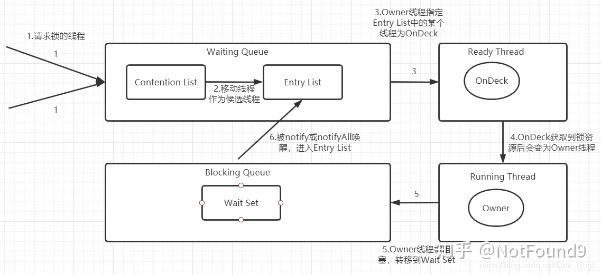

[小米技术团队关于Synchronized的讲解](https://xiaomi-info.github.io/2020/03/24/synchronized/)

## JVM8大原子操作

`lock（加锁） read（读） load（加载） use（使用）   `

`assign（赋值） store（存储） write（写入内存） unlock（释放锁）`

必须是顺序执行

 先加锁、再读、然后把内容读到工作内存中、使用

使用完了之后assign指派回去、然后strore存储，保存完了之后再写回去，最后释放锁

### sync原则性、有序性、可见性的原理

- 原子性
  - 通过sync修饰，经过monitorEnter和monitorExit两个指令保证被修饰的同步代码块内的操作是只有一个线程执行的，所以这个代码块的内容必须执行完才能被其它线程访问，不能执行到一半就退出，所以具备原子性
- 有序性
  - as if serial原则。由于只能被一个线程同时访问，而as if serial原则保证了单线程内执行结果是不会被改变的，虽然有可能进行指令重排序。所以针对结果而言是有序的
- 可见性
  - 更简单粗暴，在解锁之前，必须把当前变量同步会主内存，这样解锁之后，其它线程就可以访问到被修改的值
  - 而在sync加锁前，必须放弃工作内存的值，重新读主内存的值

##  使用synchronized的三种方式

我们先看下平常我们使用到synchronized的几种方式

```java
public class TestThread {

    public  Object o;
    //锁住当前方法 flags: ACC_SYNCHRONIZED
    synchronized void test() {

    }
	//锁住当前对象 monitorenter 、monitorexit 
    void test2() {
        synchronized (this) {

        }
    }
	//锁住类  flags: ACC_STATIC ACC_SYNCHRONIZED
	static synchronized void  test3(){

	 }	
	//锁住类  monitorenter 、monitorexit 
     void test4(){
        synchronized (TestThread.class){

        }
    }
	//锁住Object对象 monitorenter 、monitorexit 
    void test5(){
        synchronized (o){

        }
    }
}
```


### 1. 同步实例方法，锁住当前对象

- **锁住当前对象的第一种方式**

```java
   synchronized void  test(){

    }
```

下面是它的字节码：重要的是： `**flags: ACC_SYNCHRONIZED**`

```java
  synchronized void test();
    descriptor: ()V
    flags: ACC_SYNCHRONIZED
    Code:
      stack=0, locals=1, args_size=1
         0: return
      LineNumberTable:
        line 11: 0

```

### 2. 同步类方法，锁住当前类

```java
static synchronized void  test3(){

 }
```

下面的字节码如下： **`flags: ACC_STATIC与 ACC_SYNCHRONIZED`**

```java
  static synchronized void test3();
    descriptor: ()V
    flags: ACC_STATIC, ACC_SYNCHRONIZED
    Code:
      stack=0, locals=0, args_size=0
         0: return
      LineNumberTable:
        line 22: 0

```


### 3.同步代码块，锁住代码块里面的对象

- **锁住当前对：this关键字**

```java
    void test2() {
        synchronized (this) {

        }
    }
```

下面是它的字节码，重要的是：**`monitorenter 、monitorexit`**

```java
 void test2();
    descriptor: ()V
    flags:
    Code:
      stack=2, locals=3, args_size=1
         0: aload_0
         1: dup
         2: astore_1
         3: monitorenter
         4: aload_1
         5: monitorexit
         6: goto          14
         9: astore_2
        10: aload_1
        11: monitorexit
        12: aload_2
        13: athrow
        14: return

```

- **锁住括号里面的对象**


```java
public  Object o;
void test5(){
        synchronized (o){
            
        }
}
  void test5();
    descriptor: ()V
    flags:
    Code:
      stack=2, locals=3, args_size=1
         0: aload_0
         1: getfield      #3                  // Field o:Ljava/lang/Object;
         4: dup
         5: astore_1
         6: monitorenter
         7: aload_1
         8: monitorexit
         9: goto          17
        12: astore_2
        13: aload_1
        14: monitorexit
        15: aload_2
        16: athrow
        17: return

```

- **括号里面是静态对象**

~~~java
锁住当前类

```java
     void test4(){
        synchronized (TestThread.class){

        }
    }
```

#### 

```java
  void test4();
    descriptor: ()V
    flags:
    Code:
      stack=2, locals=3, args_size=1
         0: ldc           #2                  // class org/xiyou/leetcode/thread/TestThread
         2: dup
         3: astore_1
         4: monitorenter
         5: aload_1
         6: monitorexit
         7: goto          15
        10: astore_2
        11: aload_1
        12: monitorexit
        13: aload_2
        14: athrow
        15: return

```
~~~

### sync的组合操作

**1、两个线程同时访问一个对象的相同的synchronized方法**

同一实例拥有同一把锁，其他线程必然等待，顺序执行

**2、两个线程同时访问两个对象的相同的synchronized方法**

不同的实例拥有的锁是不同的，所以不影响，并行执行

**3、两个线程同时访问两个对象的相同的static的synchronized方法**

静态同步方法，是类锁，所有实例是同一把锁，其他线程必然等待，顺序执行

**4、两个线程同时访问同一对象的synchronized方法与非synchronized方法**

非synchronized方法不受影响，并行执行

**5、两个线程访问同一对象的不同的synchronized方法**

同一实例拥有同一把锁，所以顺序执行（说明：锁的是this对象==同一把锁）

**6、两个线程同时访问同一对象的static的synchronized方法与非static的synchronized方法**

static同步方法是类锁，非static是对象锁，原理上是不同的锁，所以不受影响，并行执行

**7、方法抛出异常后，会释放锁吗**

会自动释放锁，这里区别Lock，Lock需要显示的释放锁


## synchronized底层实现原理

### 1. 字节码层面

一个是access_synchronized实现的，一个是monitorenter和monitorexit实现的

### 2. 汇编最底层

CAS  基于汇编指令 `cmp hxg`

`cmpxchg = compare and exchange`

#### access_synchronized标识和monitor指令有什么区别?

**access_synchronized:**    

   方法级的同步是隐式的，即无需通过字节码指令来控制的，它实现在方法调用和返回操作之中。JVM 可以从方法常量池中的方法表结构中的ACC_SYNCHRONIZED访问标志区分一个方法是否同步方法。当方法调用时，调用指令将会 检查方法的ACC_SYNCHRONIZED访问标志是否被设置，如果设置了，执行线程将先持有monitor（虚拟机规范中用的是管程一词）， 然后再执行方法，最后在方法完成（无论是正常完成还是非正常完成）时释放monitor。在方法执行期间，执行线程持有了monitor，其他任何线程都无法再获得同一个monitor。如果一个同步方法执行期间抛出了异常，并且在方法内部无法处理此异常，那这个同步方法所持有的monitor将在异常抛到同步方法之外时自动释放

同步方法的时候，一旦执行到这个方法，就会先判断是否有标志位，然后，ACC_SYNCHRONIZED会去隐式调用刚才的两个指令：monitorenter和monitorexit。

**monitor指令：**

每个对象都会与一个monitor相关联，当某个monitor被拥有之后就会被锁住，当线程执行到monitorenter指令时，就会去尝试获得对应的monitor。步骤如下：

1. 每个monitor维护着一个记录着拥有次数的计数器。未被拥有的monitor的该计数器为0，当一个线程获得monitor（执行monitorenter）后，该计数器自增变为 1 。
   - 当同一个线程再次获得该monitor的时候，计数器再次自增；
   - 当不同线程想要获得该monitor的时候，就会被阻塞。
2. 当同一个线程释放 monitor（执行monitorexit指令）的时候，计数器再自减。当计数器为0的时候。monitor将被释放，其他线程便可以获得monitor。


下面证明下：access_synchronized是在常量池中的方法表结构中的

1. **首先我们先明白access_synchronized是什么？**

答案：是一个方法的属性和标志

```java
表4.6-A。方法访问和属性标志

标志名称	值	解释
ACC_PUBLIC	0x0001	宣布public; 可以从其程序包外部进行访问。
ACC_PRIVATE	0x0002	宣布private; 仅在定义类中可访问。
ACC_PROTECTED	0x0004	宣布protected; 可以在子类中访问。
ACC_STATIC	0x0008	宣布static。
ACC_FINAL	0x0010	宣布final; 不能被覆盖（第5.4.5节）。
ACC_SYNCHRONIZED	0x0020	宣布synchronized; 调用由监视器使用来包装。
ACC_BRIDGE	0x0040	编译器生成的桥接方法。
ACC_VARARGS	0x0080	用可变数量的参数声明。
ACC_NATIVE	0x0100	宣布native; 用Java以外的语言实现。
ACC_ABSTRACT	0x0400	宣布abstract; 没有提供实现。
ACC_STRICT	0x0800	宣布strictfp; 浮点模式受FP限制。
ACC_SYNTHETIC	0x1000	宣布为合成；在源代码中不存在。
```


2. **我们首先看access_flags指定存在哪个位置？**

   答案：method_info里面

```java
method_info {
    u2             access_flags;
    u2             name_index;
    u2             descriptor_index;
    u2             attributes_count;
    attribute_info attributes[attributes_count];
}
```

3. **我们再看method_Info存在哪个位置？**

```java
ClassFile {
    u4             magic;
    u2             minor_version;
    u2             major_version;
    u2             constant_pool_count;
    cp_info        constant_pool[constant_pool_count-1];
    u2             access_flags;
    u2             this_class;
    u2             super_class;
    u2             interfaces_count;
    u2             interfaces[interfaces_count];
    u2             fields_count;
    field_info     fields[fields_count];
    u2             methods_count;
    method_info    methods[methods_count];
    u2             attributes_count;
    attribute_info attributes[attributes_count];
}
```


 

 

## 一个对象的组成


普通对象的话，markword8 classPoint4 padding4

数组对象 markword 8 classPoint4  数组长度4 padding 0

### 对象头markword


## synchronized锁升级过程

synchronized 锁优化的过程和markword息息相关,下面具体介绍

**无锁-偏向锁-轻量级锁（自旋锁、自适应自旋锁）-重量级锁**

[一个比较详细的讲解](https://mp.weixin.qq.com/s/YjN9vs7DBKYBs4GCwDw5sw) 


### **无锁**：

对象头里面存储当前对象的hashcode，即原来的Markword组成是：001+hashcode

| bit fields | 是否偏向锁 | 锁标志位 |
| ---------- | ---------- | -------- |
| hash       | 0          | 01       |

### **偏向锁**：

以下是知乎的一个作者分析的

作者：NotFound9
链接：https://www.zhihu.com/question/57794716/answer/1281158778
来源：知乎
著作权归作者所有。商业转载请联系作者获得授权，非商业转载请注明出处。


### 偏向锁的加锁过程：

#### 场景一：当锁对象第一次被线程获得锁的时候

线程发现是匿名偏向状态（也就是锁对象的Mark Word没有存储线程ID），则会用CAS指令，将 mark word中的thread id由0改成当前线程Id。如果成功，则代表获得了偏向锁，继续执行同步块中的代码。否则，将偏向锁撤销，升级为轻量级锁。

#### 场景二：当获取偏向锁的线程再次进入同步块时

发现锁对象存储的线程ID就是当前线程的ID，会往当前线程的栈中添加一条 Displaced  MarkWord为空的 LockRecord中，然后继续执行同步块的代码，因为操纵的是线程私有的栈，因此不需要用到CAS指令；由此可见偏向锁模式下，当被偏向的线程再次尝试获得锁时，仅仅进行几个简单的操作就可以了，在这种情况下， synchronized关键字带来的性能开销基本可以忽略。

#### 场景三：当没有获得锁的线程进入同步块时

当没有获得锁的线程进入同步块时，发现当前是偏向锁状态，并且存储的是其他线程ID（也就是其他线程正在持有偏向锁），则会进入到**撤销偏向锁**的逻辑里，一般来说，会在 safepoint中去查看偏向的线程是否还存活

- 如果线程存活且还在同步块中执行， 则将锁升级为轻量级锁，原偏向的线程继续拥有锁，只不过持有的是轻量级锁，继续执行代码块，执行完之后按照轻量级锁的解锁方式进行解锁，而其他线程则进行自旋，尝试获得轻量级锁。
- 如果偏向的线程已经不存活或者不在同步块中， 则将对象头的 mark word改为无锁状态（unlocked）

由此可见，偏向**锁升级**的时机为：**当一个线程获得了偏向锁，在执行时，只要有另一个线程尝试获得偏向锁，并且当前持有偏向锁的线程还在同步块中执行，则该偏向锁就会升级成轻量级锁。**

### 偏向锁的解锁过程

因此偏向锁的解锁很简单，其仅仅将线程的栈中的最近一条 lockrecord的 obj字段设置为null。需要注意的是，偏向锁的解锁步骤中**并不会修改锁对象Mark Word中的thread id，简单的说就是锁对象处于偏向锁时，Mark Word中的thread id 可能是正在执行同步块的线程的id，也可能是上次执行完已经释放偏向锁的thread id**，主要是为了上次持有偏向锁的这个线程在下次执行同步块时，判断Mark Word中的thread id相同就可以直接执行，而不用通过CAS操作去将自己的thread id设置到锁对象Mark Word中。


| bit fields |       | 是否偏向锁 | 锁标志位 |
| ---------- | ----- | ---------- | -------- |
| threadId   | epoch | 1          | 01       |

### **轻量级锁**：


- 适用场景：线程不多的情况下的锁竞争

  比如两个人同时要上厕所或者说是一个正在上厕所，一个要上厕所。

- 因为CAS没有更新成功，所以是：一个线程在执行，一个线程在争抢

 **为啥是原线程进入锁升级？它怎么知道有抢占发生？**

我的理解是，一旦发生争抢，对象其实知道，而且告诉了线程A，线程A马上做出回应，等到线程A代码进入安全点就暂停当前线程的操作！

- **为啥不是马上暂停？**

就比如你上厕所，另一个人说自己不行了，你想让位置，也得让自己暂时安全才行啊！（想一下场景很好理解）

```java
线程A：原持有偏向锁的线程
线程B：要争抢偏向锁的线程
1.这个时候并不会马上进入轻量级锁争抢状态，而是等线程A到达安全点，然后暂停线程A，暂停之后
2.检测当前线程A的状态，如果A已经执行完了，则退出同步代码块，同时唤醒线程B，这个时候线程B就可以执行偏向锁逻辑，而不用进行锁升级
3. 如果当前线程A没有执行结束，则线程A升级成轻量级锁，升级轻量级锁的步骤如下：
A升级完成之后，A线程将继续从安全点继续执行代码，然后进行轻量级锁的解锁
```

升级轻量级锁的步骤如下：

```java
1. 原持有偏向锁的线程Q会在当前线程的栈帧中建立一个叫锁记录（Lock Record）
2. 拷贝当前对象头mark word到锁记录lock Record中
3. 把对象头指向当前LOCKRecord中的指针，然后修改锁标志
```


其实这个过程也很好理解，就比如你在上厕所，到达一个安全点之后发现不行，自己还在拉肚子，那你这个时候就不用把位置让给他，你申请一个更高的权限，申请之后继续上厕所，让自己上完厕所！

```java
1. 对于线程B而言：线程A已经升级了轻量级锁，所以自己肯定也不能再用偏向锁，
2.所以B也尝试升级轻量级锁
3. B升级轻量级锁的过程和A一样，只不过B在最后一步更新对象头到锁记录的指针的时候不一定成功
4. 如果成功，说明A已经执行完了，则B获得轻量级锁，执行同步代码块
5. 如果失败，说明A正在执行，B自旋，
6.假如自旋了5次之后，获取到了锁，说明A在它自旋5次的时间退出来了
7. B不能一直自旋，因为自旋要消耗CPU，所以自旋到一定次数，或者在A执行，B自旋的时候，来了一个线程C，这个时候会升级为重量级锁
```

 其实也很好理解，线程B在线程A执行的过程中，不断的去尝试获取锁，就比如不断的去拿钥匙开门，肯定累啊，所以在尝试N次之后，B累了，进入重量级锁

- 这个时候你可能回想，无论变成什么锁，对象头都会发生改变，那之前对象头里面存储的**hashcode会不会丢失**啊？

答案：不会，在发生锁的第一刻，他就会把原来的header存储在自己的线程栈中，所以不会丢失

#### 轻量级锁的释放流程

在释放锁时，当前线程会使用CAS操作将Displaced Mark Word的内容复制回锁的Mark Word里面。如果没有发生竞争，那么这个复制的操作会成功。如果有其他线程因为自旋多次导致轻量级锁升级成了重量级锁，那么CAS操作会失败，此时会释放锁并唤醒被阻塞的线程。 

#### 自旋锁

自旋锁会导致空耗CPU且很可能锁不公平

#### 自适应自旋锁

自适应是指根据上一次该线程是否成功或者多久获取过该锁设置旋转次数，若上次失败很可能直接进入重量级锁
### 重量级锁

**什么时候重量级锁？**

线程非常多，比如有的线程超过10次自旋，-XX:PreBlockSpin，或者自旋次数超过CPU核数的一半，就会升级成重量级锁，当然Java1.6之后加入了**自适应自旋锁**，JVM自己控制自旋次数

而且重量级锁是操作系统实现的

轻量级锁膨胀之后，就升级为重量级锁了。重量级锁是依赖对象内部的monitor锁来实现的，而monitor又依赖操作系统的MutexLock(互斥锁)来实现的，所以重量级锁也被成为**互斥锁**。

为什么说重量级锁开销大呢

主要是，当系统检查到锁是重量级锁之后，会把等待想要获得锁的线程进行**阻塞**，被阻塞的线程不会消耗cup。但是阻塞或者唤醒一个线程时，都需要操作系统来帮忙，这就需要从**用户态**转换到**内核态**，而转换状态是需要消耗很多时间的，有可能比用户执行代码的时间还要长。
这就是说为什么重量级线程开销很大的。

[monitor对象地址](http://hg.openjdk.java.net/jdk8u/jdk8u/hotspot/file/d2c2cd90513e/src/share/vm/runtime/objectMonitor.hpp)

[如何看monitor对象](https://blog.csdn.net/xiao_tao123456/article/details/105730252)



https://mp.weixin.qq.com/s/ts2Pjz3VpWm50kY-Ru7iTA

```c
  ObjectMonitor() {
    _header       = NULL;
    _count        = 0;
    _waiters      = 0,
    _recursions   = 0;//重入的次数
    _object       = NULL;
    _owner        = NULL;//获得锁的线程称为Owner 。 !Owner：释放锁的线程
    _WaitSet      = NULL;//那些调用wait方法被阻塞的线程被放置到Wait Set。
    _WaitSetLock  = 0 ;
    _Responsible  = NULL ;
    _succ         = NULL ;
    _cxq          = NULL ;
    FreeNext      = NULL ;
    _EntryList    = NULL ;//锁池，竞争者的队列
    _SpinFreq     = 0 ;
    _SpinClock    = 0 ;
    OwnerIsThread = 0 ;
    _previous_owner_tid = 0;
  }
```

### 为啥轻量级锁和重量级锁不公平？

偏向锁由于不涉及到多个线程竞争，所以谈不上公平不公平，轻量级锁获取锁的方式是多个线程进行自旋操作，然后使用**用CAS操作将锁的Mark Word替换为指向自己线程栈中拷贝的锁记录的指针**，所以谁能获得锁就看运气，不看先后顺序。重量级锁不公平主要在于刚进入到重量级的锁的线程不会直接进入Contention List队列，而是自旋去获取锁，所以后进来的线程也有一定的几率先获得到锁，所以是不公平的。

### 重量级锁为什么需要自旋操作？

因为那些处于ContetionList、EntryList、WaitSet中的线程均处于阻塞状态，阻塞操作由操作系统完成（在Linxu下通过pthread*mutex*lock函数）。线程被阻塞后便进入内核（Linux）调度状态，这个会导致系统在用户态与内核态之间来回切换，严重影响锁的性能。如果同步块中代码比较少，执行比较快的话，后进来的线程先自旋获取锁，先执行，而不进入阻塞状态，减少额外的开销，可以提高系统吞吐量。

### 锁降级

要求比较严格，而且只有偏向锁回到无锁的过程，其它的没有，而且是要很长时间线程确认死了的情况下才会有

### 锁粗化

```java
    /**
     * 锁粗化 lock coarsening
     *
     * @param str
     * @return
     */
    public String test(String str) {
        int i = 0;
        StringBuffer sb = new StringBuffer();
        while (i < 100) {
            sb.append(str);
            i++;
        }
        return sb.toString();
    }
```

因为stringbuffer的append()是synchronized的，但循环里面如果每次都加锁，就会加锁、释放锁一百次，所以JVM就会将加上锁的访问粗化到这一连串的操作，比如while循环，只要加一次锁即可

- 锁粗化的模型

```java
for(int i=0;i<size;i++){
    synchronized(lock){
    }
}
```

```java
synchronized(lock){
    for(int i=0;i<size;i++){
    }
}
```


###  锁消除

```java
/**
* 锁消除 lock eliminate
*
* @param str1
* @param str2
*/
public void add(String str1, String str2) {
StringBuffer sb = new StringBuffer();
sb.append(str1).append(str2);
}
```

因为stringBuffer里面都是synchronied，所以里面的append就会消除锁

- 锁消除模型

```
public void method(){
    Object o=new Object();
    sychronized (o){
        //sout
    }
}
```

因为object对象O是内部的变量，所以根本不会存在竞争，所以代码直接没有锁，其实就是局部变量锁无效，只有成员变量锁有效

## synchronized最底层实现

还是CASsynchronized最底层实现

还是CAS

### 可重入性的实现

#### 偏向锁

第一次进入会直接替换markword的线程ID

第二次进入，会往当前线程的栈中添加一条 DisplacedMarkWord为空的 LockRecord

因此偏向锁的解锁很简单，其仅仅将线程的栈中的最近一条 lockrecord的 obj字段设置为null。需要注意的是，偏向锁的解锁步骤中**并不会修改锁对象Mark Word中的thread id，简单的说就是锁对象处于偏向锁时，Mark Word中的thread id 可能是正在执行同步块的线程的id，也可能是上次执行完已经释放偏向锁的thread id**，主要是为了上次持有偏向锁的这个线程在下次执行同步块时，判断Mark Word中的thread id相同就可以直接执行，而不用通过CAS操作去将自己的thread id设置到锁对象Mark Word中。 

#### 轻量级锁

轻量级锁的可重入性的实现原理和偏向锁是一样的：向当前栈帧中添加多个LockRecord

#### 重量级锁

`synchronized`是基于`monitor`实现的，因此每次重入，`monitor`中的计数器仍会加 1。

### monitor什么时候才会被使用？

答案：只有重量级锁才会被使用

### Monitor与java对象以及线程是如何关联 


1.如果一个java对象被某个线程锁住，则该java对象的Mark Word字段中LockWord指向monitor的起始地址

2.Monitor的Owner字段会存放拥有相关联对象锁的线程id

对象是如何跟monitor有关联的呢？
一个Java对象在堆内存中包括对象头，对象头有Mark word，Mark word存储着锁状态，锁指针指向monitor地址

监视器锁monitor底层依赖操作系统的MutexLock(互斥锁)实现，他是一个重量级锁

涉及CPU内核状态的转换：用户态-内核态


