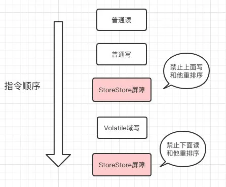

## 原子性、一致性、可见性

最常用的场景就是为了保证线程可见性而使用volatile

**[一个介绍volatile的地址](https://mp.weixin.qq.com/s/R1D5tfuMVL-v8qQlZvPhmA)**

**什么是共享变量的可见性？**

多线程并发编程中主要围绕着三个特性实现。可见性是其中一种！

- 可见性：可见性是指当多个线程访问同一个共享变量时，一个线程修改了这个变量的值，其他线程能够立即看到修改后的值。
- 原子性：原子性指的一个操作或一组操作要么全部执行，要么全部不执行。
- 有序性：有序性是指程序执行的顺序按照代码的先后顺序执行。


## valatile作用

### 2.1 指令可见性

 如果不是可见性，下面将死循环，但是如果是可见的，在程序最后的**falg = false;**就会被线程观测到

```java
public class VolatileTest {

    public static volatile Boolean falg = true;

    public static void main(String[] args) {
        new Thread(() -> {
            while (falg) {
//               doSomething
            }
            System.out.println("end");
        }, "server").start();
        try {
            Thread.sleep(1000);
        } catch (InterruptedException e) {
            e.printStackTrace();
        }
        falg = false;
    }
}
```


### 2.2 禁止指令重排序

指令可以重排序的地方：new Object()版初始化重排序

int a =7;int b =4;

int c=a+b ,取ab值的时候，可以先取b再取a

下面看一个实际中禁止指令重排序的例子：双重校验volatile单例模式                

```java
/**
 * @author xiyou
 * /*
 * 1. 最终版本的懒汉单例模式
 * 2. 双重校验的volatile懒汉单例模式
 * 3. 添加volatile 是为了防止类初始化的时候出现问题
 * 4. 类初始化顺序：monitor =new Monitor();
 * 3.1 在堆内存分配空间
 * 3.2 调用构造器，把Monitor初始化实例。
 * 3.3 把monitor对象指向在堆空间分配好的地址空间
 * 5. 在多线程条件下，3.2 和3.3的顺序可能互调，volatile就说为了解决这个问题的
 * 6. 故 它是线程安全的
 */
public class DoubleCheckVolatileLazySingleton {

    private static volatile DoubleCheckVolatileLazySingleton instance = null;

    private DoubleCheckVolatileLazySingleton() {
    }

    public static DoubleCheckVolatileLazySingleton getMonitor() {
        //外层判断用来判断是否要阻塞线程，提高效率，外层的可以去掉，但是会影响效率
        if (instance == null) {
            synchronized (DoubleCheckVolatileLazySingleton.class) {
                //内层判断是否要创建线程，保证线程安全，这个不能去掉，去掉线程不安全
                if (null == instance) {
                    instance = new DoubleCheckVolatileLazySingleton();
                }
            }
        }
        return instance;
    }

}
```

我们再来看这个双重校验单例模式的例子，我有三个问题：

- **为什么使用volatile 修饰了singleton 引用还用synchronized 锁？**

volatile 只保证了共享变量 singleton 的可见性，但是 `singleton = new Singleton();` 这个操作不是原子的，可以分为三步：

步骤1：在堆内存申请一块内存空间；

步骤2：初始化申请好的内存空间；

步骤3：将内存空间的地址赋值给 singleton；

```java
// 当两个线程A和B同时进入方法时，加入A抢夺到锁，则A继续执行，当A执行到new操作时，由于new操作不是原子操作，且synchronized也不能禁止重排序，
// 我们首先将new操作原子化：a-开辟内存空间；b-初始化对象；c-将引用赋值给变量
// 正常的执行顺序应该是a-b-c，不禁止重排序的情况下可能是：a-c-b
// 当线程A执行a-c，即将执行b的时候，由于cpu时间片结束，则有可能会让步给线程B，
// 线程B进行第一次判断，singleton由于已经有了内存指向，并不为空，此时，对象还没有执行初始化，但已经判断为true，并且返回了。
// 此时，就产生B获取的对象是半初始化的对象，因此需要 volatile 来禁止重排序。
```


- **第一次检查singleton 为空后为什么内部还需要进行第二次检查？**

外层判断用来判断是否要阻塞线程，提高效率，外层的可以去掉，但是会影响效率,但内层判断是否要创建线程，保证线程安全，这个不能去掉，去掉线程不安全

比如：A 线程进行判空检查之后开始执行synchronized代码块时发生线程切换(线程切换可能发生在任何时候)，B 线程也进行判空检查，B线程检查 singleton == null 结果为true，也开始执行synchronized代码块，虽然synchronized 会让二个线程串行执行，如果synchronized代码块内部不进行二次判空检查，singleton 可能会初始化二次。

- **volatile 除了内存可见性，还有别的作用吗？**

   volatile 修饰的变量除了可见性，还能防止指令重排序。
   
   ​                                                                                                                                                                                                                                                                                                                                                                                                                                                                                                                                                                                                                                                                                                                                                                       

### 2.3 但是不能保证原子性

所以不能进行++操作

## 2. volatile真正用途
### 禁止指令重排序的用途

DDL+volatile

### 可见性的用途

或者双重校验的单例模型下，保证对象不重排序


##  volatile的5层实现原理

volatile int i ——ACC_VOLATILE_JVM——JVM内存屏障——汇编语言调用——MESI原语支持总线锁

###  Java源码

添加volatile

### ByteCode源码

加volatile之后，只是带一个了ACC_VOLATILE标识值为：**0x0040[volatile]**

### 1.3 JVM层面

添加了内存屏障

内存屏障的两端无法重排序的操作

volatile写操作storeStoreBarrier    storeLoadBarrier 

volatile读操作 LoadStoreBarrier   loadLoadBarrier


### 1.4 HotSpot实现（JVM的一种，是Oracle提供的）

实际用了汇编语言的调用，比如Lock指令

### 1.5CPU级别 MESI Cache 缓存一致性协议

1. MESI Cache 缓存一致性协议

2. 原语支持
3. 总线帧

## 现代计算机模型

### MESI


1. MESI Cache 缓存一致性协议

当CPU写数据时，如果发现操作的变量是共享变量，即在其他CPU中也存在该变量的副本，会发出信号通知其他CPU将该变量的缓存行置为无效状态，因此当其他CPU需要读取这个变量时，发现自己缓存中缓存该变量的缓存行是无效的，那么它就会从内存重新读取。

 **怎么发现当前数据是无效的？**

每个处理器通过嗅探在总线上传播的数据来检查自己缓存的值是不是过期了，当处理器发现自己缓存行对应的内存地址被修改，就会将当前处理器的缓存行设置成无效状态，当处理器对这个数据进行修改操作的时候，会重新从系统内存中把数据读到处理器缓存里。


### MESI的缺点？

由于Volatile的MESI缓存一致性协议，需要不断的从主内存嗅探和cas不断循环，无效交互会导致总线带宽达到峰值。

所以不要大量使用Volatile，至于什么时候去使用Volatile什么时候使用锁，根据场景区分。


### 为啥引入缓存？

> 因为CPU 运算器的运算速度远比内存读写速度快，所以CPU 大部分时间都在等数据从内存读取，
>
> 运算完数据写回内存。

**那怎么解决？**

>  因为CPU 运行速度实在太快，主存（就是内存）的数据读取速度和CPU 运算速度差了有几个数量级，
>
> 因此现代计算机系统通过在CPU 和主存之前加了一层读写速度尽可能接近CPU 运行速度的高速缓存来做数据缓冲，
>
> 这样缓存提前从主存获取数据，CPU 不再从主存取数据，而是从缓存取数据。
>
> 这样就缓解由于主存速度太慢导致的CPU 饥饿的问题。同时CPU 内还有寄存器，
>
> 一些计算的中间结果临时放在寄存器内。

CPU 从缓存读取数据和从内存读取数据除了读取速度的差异？有什么本质的区别吗？不都是读数据写数据，而且加缓存会让整个体系结构变得更加复杂。

> 缓存和主存不仅仅是读取写入数据速度上的差异，还有另外更大的区别：研究人员发现了程序80%的时间在运行20% 的代码，所以缓存本质上只要把20%的常用数据和指令放进来就可以了（是不是和Redis 存放热点数据很像），另外CPU 访问主存数据时存在二个局部性现象：

1. 时间局部性现象

如果一个主存数据正在被访问，那么在近期它被再次访问的概率非常大。想想你程序大部分时间是不是在运行主流程。

1. 空间局部性现象

CPU使用到某块内存区域数据，这块内存区域后面临近的数据很大概率立即会被使用到。这个很好解释，我们程序经常用的数组、集合（本质也是数组）经常会顺序访问（内存地址连续或邻近）。

因为这二个局部性现象的存在使得缓存的存在可以很大程度上缓解CPU 饥饿的问题。

### 现代计算机内存模型


**画一下现在CPU、缓存、主存的关系图**


补充下缓存一致性协议和三级高速缓存：


现代操作系统一般会有多级缓存（Cache Line），一般有L1、L2，甚至有L3，看下自己，一共6核


### 主内存和工作内存的关系


**程序运行时，数据是怎么在主存、缓存、CPU寄存器之间流转的**

比如以 `i = i + 2;` 为例， 当线程执行到这条语句时，会先从主存中读取i 的值，然后复制一份到缓存中，CPU 读取缓存数据（取数指令），进行 i + 2 操作（中间数据放寄存器），然后把结果写入缓存，最后将缓存中i最新的值刷新到主存当中（写回时间不确定）。


 **这个数据操作逻辑在单线程环境和多线程环境下有什么区别？**

比如i 如果是共享变量（例如对象的成员变量），单线程运行没有任何问题，但是多线程中运行就有可能出问题。例如：有A、B二个线程，在不同的CPU 上运行，因为每个线程运行的CPU 都有自己的缓存，A 线程从内存读取i 的值存入缓存，B 线程此时也读取i 的值存入自己的缓存，A 线程对i 进行+1操作，i变成了1，B线程缓存中的变量 i 还是0，B线程也对i 进行+1操作，最后A、B线程先后将缓存数据写入内存，内存预期正确的结果应该是2，但是实际是1。这个就是非常著名的**缓存一致性问题**。

所以后来为了解决缓存问题，研发人员进行了2个优化

第一：总线锁

早期的一些CPU 设计中，是通过锁总线（总线访问加Lock# 锁）的方式解决的。因为CPU 都是通过总线来读取主存中的数据，因此对总线加Lock# 锁的话，其他CPU 访问主存就被阻塞了，这样防止了对共享变量的竞争。但是锁总线对CPU的性能损耗非常大，把多核CPU 并行的优势直接给干没了！

第二：后来搞出来了：缓存一致性协议。缓存一致性协议主要规范了CPU 读写主存、管理缓存数据的一系列规范。协议的类型很多（MSI、MESI、MOSI、Synapse、Firefly），最常见的就是Intel 的MESI 协议

MESI 协议的核心思想：

M：modifiled已修改  E：Exclusive独享  S：共享shared  I  Invalid无效的

- 定义了缓存中的数据状态只有四种，MESI 是四种状态的首字母。
- 当CPU写数据时，如果写的变量是共享变量，即在其他CPU中也存在该变量的副本，会发出信号通知其他CPU将该变量的缓存行置为无效状态；
- 当CPU读取共享变量时，发现自己缓存的该变量的缓存行是无效的，那么它就会从内存中重新读取。

## java内存模型8大原子操作

- **lock（锁定）**：作用于主内存的变量，把一个变量标识为一条线程独占状态。
- **unlock（解锁）**：作用于主内存变量，把一个处于锁定状态的变量解除锁定，解除锁定后的变量才可以被其他线程锁定。
- **read（读取）**：作用于主内存变量，把一个变量值从主内存传输到线程的工作内存中，以便随后的load动作使用
- **load（载入）**：作用于工作内存的变量，它把read操作从主内存中得到的变量值放入工作内存的变量副本中。
- **use（使用）**：作用于工作内存的变量，把工作内存中的一个变量值传递给执行引擎，每当虚拟机遇到一个需要使用变量的值的字节码指令时将会执行这个操作。
- **assign（赋值）**：作用于工作内存的变量，它把一个从执行引擎接收到的值赋值给工作内存的变量，每当虚拟机遇到一个给变量赋值的字节码指令时执行这个操作。
- **store（有的指令是save/存储）**：作用于工作内存的变量，把工作内存中的一个变量的值传送到主内存中，以便随后的write的操作。
- **write（写入）**：作用于主内存的变量，它把store操作从工作内存中一个变量的值传送到主内存的变量中。

## 指令重排序

什么是指令重排序？

为了提高性能，编译器和处理器常常会对既定的代码执行顺序进行指令重排序。

一般重排序可以分为如下三种：

- 编译器优化的重排序。编译器在不改变单线程程序语义的前提下，可以重新安排语句的执行顺序;
- 指令级并行的重排序。现代处理器采用了指令级并行技术来将多条指令重叠执行。如果不存在数据依赖性，处理器可以改变语句对应机器指令的执行顺序;
- 内存系统的重排序。由于处理器使用缓存和读/写缓冲区，这使得加载和存储操作看上去可能是在乱序执行的。

但是指令重排序也是有原则的，下面的原则1和原则2

### 不会对依赖关系进行重排序（原则1）

```java
int a=1;
int b=a+1;//这个不会重排序

int c=1;
int d=1;//可能重排序，因为没有依赖关系
```


### 单线程结果不会变as if serial（原则2）

不管怎么重排序，单线程下的执行结果不能被改变。

编译器、runtime和处理器都必须遵守as-if-serial语义。

```java
int a=1;
int b=1;
int c=a+b;//不管怎么重排序c的结果不能变
```


### volatile怎么保证不重排序的？

需要注意的是：volatile写是在前面和后面**分别插入内存屏障**，而volatile读操作是在**后面插入两个内存屏障**。




### loadload内存屏障的意义

https://blog.csdn.net/ly262173911/article/details/106063924/

http://www.voidcn.com/article/p-zgltkglv-buv.html

##  JVM Happens-before原则：

如果一个操作执行的结果需要对另一个操作可见，那么这两个操作之间必须存在happens-before关系。

**1.如果一个操作happens-before另一个操作，那么第一个操作的执行结果将对第二个操作可见，而且第一个操作的执行顺序排在第二个操作之前。**

**2. 两个操作之间存在happens-before关系，并不意味着一定要按照happens-before原则制定的顺序来执行。如果重排序之后的执行结果与按照happens-before关系来执行的结果一致，那么这种重排序并不非法。**

```
有序性是指，在JMM中，允许编译器和处理器对指令进行重排序，但是重排序过程不会影响到单线程程序的执行，却会影响到多线程并发执行的正确性。
 
另外，JMM具有先天的有序性，即不需要通过任何手段就可以得到保证的有序性。这称为happens-before原则。

如果两个操作的执行次序无法从happens-before原则推导出来，那么它们就不能保证它们的有序性。虚拟机可以随意地对它们进行重排序。

happens-before原则：

1.程序次序规则：在一个单独的线程中，按照程序代码书写的顺序执行。

2.锁定规则：一个unlock操作happen—before后面对同一个锁的lock操作。

3.volatile变量规则：对一个volatile变量的写操作happen—before后面对该变量的读操作。

4.线程启动规则：Thread对象的start()方法happen—before此线程的每一个动作。

5.线程终止规则：线程的所有操作都happen—before对此线程的终止检测，可以通过Thread.join()方法结束、Thread.isAlive()的返回值等手段检测到线程已经终止执行。

6.线程中断规则：对线程interrupt()方法的调用happen—before发生于被中断线程的代码检测到中断时事件的发生。

7.对象终结规则：一个对象的初始化完成（构造函数执行结束）happen—before它的finalize()方法的开始。

8.传递性：如果操作A happen—before操作B，操作B happen—before操作C，那么可以得出A happen—before操作C。

 

```