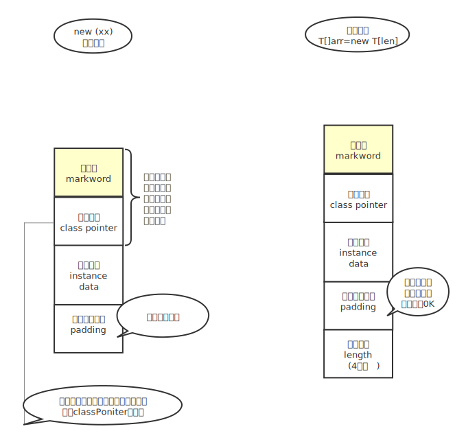

## JVM 、HotSpot、OpenJDK

JVM是一个规范

HotSpot 是一种实现，包括Taobao的虚拟机

OpenJdk是HotSpot的C++源码，编译过来就是EXE文件，相当于HotSpot,不过HotSpot并不是完全OpenJDK实现的，当然也有不是开源的，自己实现的

##  

## 1. 面试7连问

```java
 Object o =new Object();
```

1. 请解释对象的创建过程（半初始化）
2. 加问:DCL和volatile的问题（指令重排序）
3. 对象在内存中的存储和布局
4. 对象头包含什么？
5. 对象怎么定位
6. 对象怎么分配，栈上-线程本地-Eden-Old
7. Object o =new Object();在内存中占了多少字节

### 2. 对象初始化指令重排序的问题

```
Classs T{
    int m =8;
}
T t =new T();

汇编源码:
0 new #2<T>  申请内存，先把m设置为0
3 dup
4 invokespecial #3 <T.<init>> 调用这个才会把m设置为8，所以在这之前叫半初始化
7 astore_1   才会t 和M之间产生联系
8 return 
```

正常的对象初始化都是上面那样，但是有了重排序，两条指令的执行顺序就可以反过来

```
invokespecial #3 <T.<init>>  
astore_1    
变成：
astore_1 
invokespecial #3 <T.<init>>  
如果是DDL单例默认，不加volatile得到的对象就会不一致
```

#### 

答案：Instance size: 16 bytes

### 一个对象多少默认多少字节

一个对象是：16个字节

12个字节对象头，包括classPointer和markword——12*8=96bit

​				markword8个字节64Bit

​				classPointer4个字节4*8=32bit

4个字节对齐数据



####  2.2.2如何查看Java字节码：

1. 找到【**Plugins**】选项，可以首先确认一下是否安装ByteCode Viewer插件，如果没有安装，可以按照下图示意来进行搜索安装或者安装：**jclasslib byteCode viewer**

2. 点击菜单栏【**View**】,弹出下拉选项，在选项中找到【**Show Bytecode**】按钮，单击此按钮，来查看java类字节码。

```java
    public static void main(String[] args) {
        Object o=new Object();
        String str = ClassLayout.parseInstance(o).toPrintable();
        System.out.println(str);
    }
    //要运行上面的代码需要添加Maven
    
    <dependency>
    <groupId>org.openjdk.jol</groupId>
    <artifactId>jol-core</artifactId>
    <version>0.9</version>
    </dependency>

```

```java
java.lang.Object object internals:
 OFFSET  SIZE   TYPE DESCRIPTION                               VALUE
      0     4        (object header)                           05 00 00 00 (00000101 00000000 00000000 00000000) (5)
      4     4        (object header)                           00 00 00 00 (00000000 00000000 00000000 00000000) (0)
      8     4        (object header)                           00 02 00 20 (00000000 00000010 00000000 00100000) (536871424)
     12     4        (loss due to the next object alignment)
Instance size: 16 bytes
Space losses: 0 bytes internal + 4 bytes external = 4 bytes total
```

对于上面的解释是：前两个object header是对象头，后面的一个是classPointer,最后4个字节是下一个对象的对齐，因为必须要被8整除

```java
public class T {
    private boolean t;
    public static void main(String[] args) {
        T o=new T();
        String str = ClassLayout.parseInstance(o).toPrintable();
        System.out.println(str);
    }
}
```

- 因为boolean是一个字节，所以下面的对齐是3个字节

```
cn.net.health.tools.jvm.T object internals:
 OFFSET  SIZE      TYPE DESCRIPTION                               VALUE
      0     4           (object header)                           01 00 00 00 (00000001 00000000 00000000 00000000) (1)
      4     4           (object header)                           00 00 00 00 (00000000 00000000 00000000 00000000) (0)
      8     4           (object header)                           54 c3 00 f8 (01010100 11000011 00000000 11111000) (-134167724)
     12     1   boolean T.t                                       false
     13     3           (loss due to the next object alignment)
```

### 对象头组成

markword+classPointer

hash、年龄分代、

### 为啥需要对齐？

因为计算机读取能读的不是1位，为啥不多读几位，对的越齐，效率越高

目的是以空间换取时间，更快的访问内存。如果数据未对齐，那么处理器需要在加载内存后进行一些调整才能访问它。

我理解的是：假如一个对象分散存在了3块区域，肯定没有2块区域取出来的快

### 为啥要被8整除？

在64位虚拟机中，对象数据必须被8整除

`--TODO`


### 查看对象字节码


```java
javac XXX.java

Javap XXX.class
javap -verbose xxx
```