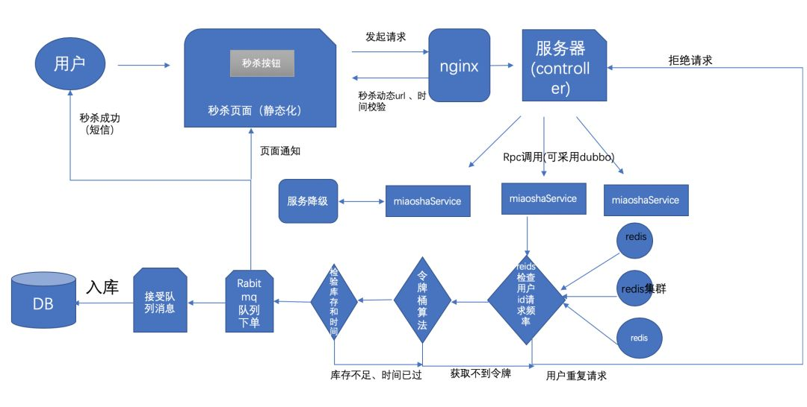

# A秒杀要考虑的问题

### 1. 超卖问题

#### 1.1 利用乐观锁或者悲观锁解绝超卖问题

### 2. 高并发流量

#### 2.1 服务器带宽（网速...等）

#### 2.2 限流

限流解决的是全部人都去操作的问题

- nginx限流（漏桶算法）

nginx能控制每秒访问多少个

- guava令牌桶限流
  - 方案一：自定义注解+RateLimiter实现通用接口限流

  - 方案二：方案一的升级版，对于不同的接口实现不同的限流策略

     [aop注解加令牌桶限流实现不同接口不同策略](https://mp.weixin.qq.com/s/yfZHnZZCKbpQjueJ9MUJYQ)

    ```java
    https://mp.weixin.qq.com/s/yfZHnZZCKbpQjueJ9MUJYQ
    ```

  - 方案三：利用方案二，可以针对乐观锁和悲观锁两种方式做秒杀下单处理

#### 2.3 缓存

缓存解决的是每次都会查询的问题


- 缓存击穿、缓存穿透、缓存失效


### 3. 接口防刷

#### 3.1 单个接口幂等性

- token机制，可以用自定义注解+redis+token实现
  - [token机制具体实现步骤](https://blog.csdn.net/qq_39455116/article/details/99314489)
- 用唯一标识如：id或者唯一索引解决
- 乐观锁解决：加version字段
- 悲观锁解决：更新的时候校验数据
- 分布式锁：如redis\redission zookeeper等

#### 3.2 单个接口防刷

- 接口防刷其实就是计数，用自定义注解+redis实现计数

  - [redis实现单个接口防刷](https://mp.weixin.qq.com/s/vyQZvJm5sjnEnrpi1siP2A)
  - 但是要注意一个问题：就是当某一个时刻，拿到这个key，它没有过期，我们自增了，但是它突然下一刻就过期了，
  - https://www.jianshu.com/p/31a42f8f834a


### 3. 秒杀URL

- 问题：

对于普通用户来讲，看到的只是一个比较简单的秒杀页面，在未达到规定时间，秒杀按钮是灰色的，一旦到达规定时间，灰色按钮变成可点击状态。这部分是针对小白用户的，如果是稍微有点电脑功底的用户，会通过F12看浏览器的network看到秒杀的url，通过特定软件去请求也可以实现秒杀。或者提前知道秒杀url的人，一请求就直接实现秒杀了。这个问题我们需要考虑解决

- 解决方案：

为了避免有程序访问经验的人通过下单页面url直接访问后台接口来秒杀货品，我们需要将秒杀的url实现动态化，即使是开发整个系统的人都无法在秒杀开始前知道秒杀的url。

具体的做法就是通过md5加密一串随机字符作为秒杀的url，然后前端访问后台获取具体的url，后台校验通过之后才可以继续秒杀。

###  4. 数据库设计

秒杀有把我们服务器击垮的风险，如果让它与我们的其他业务使用在同一个数据库中，耦合在一起，就很有可能牵连和影响其他的业务。如何防止这类问题发生，就算秒杀发生了宕机、服务器卡死问题，也应该让他尽量不影响线上正常进行的业务

## 5. 静态资源问题

将商品的描述、参数、成交记录、图像、评价等全部写入到一个静态页面，用户请求不需要通过访问后端服务器，不需要经过数据库，直接在前台客户端生成，这样可以最大可能的减少服务器的压力。

具体的方法可以使用freemarker模板技术，建立网页模板，填充数据，然后渲染网页


# B如何解决上述问题？

## 1. redis集群


## 2. nginx限流和静态资源缓存


## 3.精简SQL 使用乐观锁

```sql
update miaosha_goods set stock =stock-1 
where goos_id ={#goods_id} and version = #{version} and sock>0;
```

这样的话，就可以保证库存不会超卖并且一次更新库存,还有注意一点这里使用了版本号的乐观锁，相比较悲观锁，它的性能较好。

## 4. redis预留库存

很多请求进来，都需要后台查询库存,这是一个频繁读的场景。可以使用redis来预减库存，在秒杀开始前可以在redis设值，比如redis.set(goodsId,100),这里预放的库存为100可以设值为常量),每次下单成功之后,Integer stock = (Integer)redis.get(goosId); 然后判断sock的值，如果小于常量值就减去1;

不过注意当取消的时候,需要增加库存，增加库存的时候也得注意不能大于之间设定的总库存数(查询库存和扣减库存需要原子操作，此时可以借助lua脚本)下次下单再获取库存的时候,直接从redis里面查就可以了。

## 5. 接口限流

### 5.1 前端限流单个用户多次点击

首先第一步就是通过前端限流，用户在秒杀按钮点击以后发起请求，那么在接下来的5秒是无法点击(通过设置按钮为disable)。这一小举措开发起来成本很小，但是很有效。

### 5.2 单个用户一直刷新接口

具体多少秒需要根据实际业务和秒杀的人数而定，一般限定为10秒。具体的做法就是通过redis的键过期策略，首先对每个请求都从String value = redis.get(userId);如果获取到这个

value为空或者为null，表示它是有效的请求，然后放行这个请求。如果不为空表示它是重复性请求，直接丢掉这个请求。如果有效,采用redis.setexpire(userId,value,10).value可以是任意值，一般放业务属性比较好,这个是设置以userId为key，10秒的过期时间(10秒后,key对应的值自动为null)

### 5.3  NGINX做总体浏览控制

nginx能控制每秒访问多少个

### 5.4 令牌桶限流

就是上面说的 自定义注解+rateLimter实现接口限流

### 部署多服务负载均衡

- 轮询
- 加权轮询
- 最少连接数
- 最快响应
- Hash法


## 6:异步下单RabbitMQ

为了提升下单的效率，并且防止下单服务的失败。需要将下单这一操作进行异步处理。最常采用的办法是使用队列，队列最显著的三个优点：异步、削峰、解耦。这里可以采用rabbitmq，在后台经过了限流、库存校验之后，流入到这一步骤的就是有效请求。然后发送到队列里，队列接受消息，异步下单。下完单，入库没有问题可以用短信通知用户秒杀成功。假如失败的话,可以采用补偿机制，重试。


## 7. 服务降级

假如在秒杀过程中出现了某个服务器宕机，或者服务不可用，应该做好后备工作。之前的博客里有介绍通过Hystrix进行服务熔断和降级，可以开发一个备用服务，假如服务器真的宕机了，直接给用户一个友好的提示返回，而不是直接卡死，服务器错误等生硬的反馈。


# 



