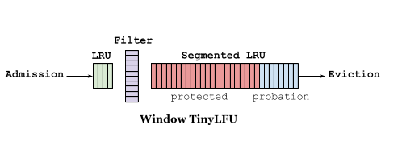

## 缓存相关

一般熟悉的是redis缓存

### 如何设置和验证缓存类型
#### 设置缓存类型
- 指定缓存类型,配置文件指定如下：
`spring.cache.type=simple`或者`spring.cache.type=caffeine`
#### 验证缓存类型
其实缓存设置的时候,可以指定缓存类型比如`@Cacheable(cacheNames = {"user"}, key = "#id")`这个就没有指定缓存类型，但是实际的注解如下，我们发现有个`cacheManager`属性,所以我们可以验证下项目启动的时候默认的缓存类型

```java
@Target({ElementType.TYPE, ElementType.METHOD})
@Retention(RetentionPolicy.RUNTIME)
@Inherited
@Documented
public @interface Cacheable {
    @AliasFor("cacheNames")
    String[] value() default {};

    @AliasFor("value")
    String[] cacheNames() default {};
    
    String key() default "";
    
    String keyGenerator() default "";
    
    String cacheManager() default "";
    
    String cacheResolver() default "";
    
    String condition() default "";
    
    String unless() default "";
    
    boolean sync() default false;
}
```

所有的缓存类型都在`org.springframework.boot.autoconfigure.cache;`这个包下面

启动的时候在这两个类上面打个断点就能判断了，进入哪个就是使用的哪个缓存

```java
SimpleCacheConfiguration 
CaffeineCacheConfiguration
```

或者在这两个类的pu t或者gē t方法里面打个断点,就知道自己系统到底用的是哪个缓存了

```java
ConcurrentMapCache

CaffeineCache
```


### 本项目缓存类型-Caffeine

### redis


### JVM-ecache

官网：http://www.ehcache.org/documentation/3.8/

[ecache介绍和配置](https://blog.csdn.net/tangyb828/article/details/106102677)

12.磁盘缓存大小默认是没有限制的，不过可通过maxElementsOnDisk来指定。当磁盘缓存达到maxElementsOnDisk指定的值时，Ehcache会清理磁盘中的缓存使用默认策略是LFU（使用频率最低）

### JVM-guava


### JVM-caffeine

官网：https://github.com/ben-manes/caffeine/wiki/Eviction#reference-based

[一篇介绍caffeine的博文](https://mp.weixin.qq.com/s/YgVFukFfyPZCx-naUwYEsQ)


[maven仓库](https://mvnrepository.com/artifact/com.github.ben-manes.caffeine/caffeine)

- 最新版本的

```java
<!-- https://mvnrepository.com/artifact/com.github.ben-manes.caffeine/caffeine -->
<dependency>
    <groupId>com.github.ben-manes.caffeine</groupId>
    <artifactId>caffeine</artifactId>
    <version>2.8.4</version>
</dependency>

```

### 失效策略

本地缓存的过期机制是非常重要的，因为本地缓存中的数据并不像业务数据那样需要保证不丢失。本地缓存的数据一般都会要求保证命中率的前提下，尽可能的占用更少的内存，并可在极端情况下，可以被GC掉。

Caffeine的过期机制都是在构造Cache的时候申明，主要有如下几种：

1. expireAfterWrite：表示自从最后一次写入后多久就会过期；
2. expireAfterAccess：表示自从最后一次访问（写入或者读取）后多久就会过期；
3. expireAfter：自定义过期策略；

### 剔除机制

在构造Cache时可以通过removalListener方法申明剔除监听器，从而可以跟踪本地缓存中被剔除的数据历史信息。根据RemovalCause.java枚举值可知，剔除策略有如下5种：

- **「EXPLICIT」**：调用方法（例如：cache.invalidate(key)、cache.invalidateAll）显示剔除数据；
- **「REPLACED」**：不是真正被剔除，而是用户调用一些方法（例如：put()，putAll()等）盖了之前的值；
- **「COLLECTED」**：表示缓存中的Key或者Value被垃圾回收掉了；
- **「EXPIRED」**: expireAfterWrite/expireAfterAccess约定时间内没有任何访问导致被剔除；
- **「SIZE」**：超过maximumSize限制的元素个数被剔除的原因；

#### GuavaCache和Caffeine差异
- LRU 挑选最新最不经常使用的key进行淘汰
- 缺点：会给最新访问的数据最高的优先级，使它不被淘汰
- LFU 挑选访问频次最低的key进行淘汰
  - 缺点：比如之前的数据访问频次都很大，但是新来了一批新数据最近一直访问，但是还是会被淘汰
- windowTinyLFU
  - 结合上面两种算法的优点



原理是：

1. 前端是一个小的LRU（window cache）Window LRU，它的容量只占据1%的总空间，它的目的就是用来存放短期突发访问记录。
2. window cache淘汰后，会送到DoorKeeper过滤；过滤通过后，元素存储到一个大的Segmented LRU缓存里
3. 存放主要元素的Segmented LRU(SLRU)是一种LRU的改进，主要把在一个时间窗口内命中至少2次的记录和命中1次的单独存放，这样就可以把短期内较频繁的缓存元素区分开来
4. 具体做法上，SLRU包含2个固定尺寸的LRU，一个叫Probation段A1，一个叫Protection段A2。新记录总是插入到A1中，当A1的记录被再次访问，就把它移到A2，当A2满了需要驱逐记录时，会把驱逐记录插入到A1中。W-TinyLFU中，SLRU有80%空间被分配给A2段。


总结：当新来的数据比要驱逐的数据高频时，这个数据才会被缓存接纳。这个许可窗口给予每个数据项积累热度的机会，而不是立即过滤掉。这避免了持续的未命中，特别是在突然流量暴涨的的场景中，一些短暂的重复流量就不会被长期保留。为了刷新历史数据，一个时间衰减进程被周期性或增量的执行，给所有计数器减半

对于长期保留的数据，W-TinyLFU使用了分段LRU（Segmented LRU，缩写SLRU）策略。起初，一个数据项存储被存储在试用段（probationary segment）中，在后续被访问到时，它会被提升到保护段（protected segment）中（保护段占总容量的80%）。保护段满后，有的数据会被淘汰回试用段，这也可能级联的触发试用段的淘汰。这套机制确保了访问间隔小的热数据被保存下来，而被重复访问少的冷数据则被回收。

 

1. 剔除算法方面，GuavaCache采用的是**「LRU」**算法，而Caffeine采用的是**「Window TinyLFU」**算法，这是两者之间最大，也是根本的区别。
2. 立即失效方面，Guava会把立即失效 (例如：expireAfterAccess(0) and expireAfterWrite(0)) 转成设置最大Size为0。这就会导致剔除提醒的原因是SIZE而不是EXPIRED。Caffiene能正确识别这种剔除原因。
3. 取代提醒方面，Guava只要数据被替换，不管什么原因，都会触发剔除监听器。而Caffiene在取代值和先前值的引用完全一样时不会触发监听器。
4. 异步化方方面，Caffiene的很多工作都是交给线程池去做的（默认：ForkJoinPool.commonPool()），例如：剔除监听器，刷新机制，维护工作等。