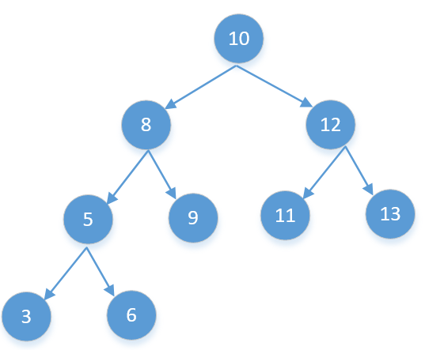

### 二维数组中的查找

#### 二分解决

- 这道题在于找到起点的位置，应该是以左下角开始，至于为啥在左下角，看下图
- 参考：[leetcode题解](https://leetcode-cn.com/problems/er-wei-shu-zu-zhong-de-cha-zhao-lcof/solution/mian-shi-ti-04-er-wei-shu-zu-zhong-de-cha-zhao-zuo/)


```java
class Solution {
    public boolean findNumberIn2DArray(int[][] matrix, int target) {
        if(matrix==null || matrix.length==0){
            return false;
        }
        int m=matrix.length;
        int n=matrix[0].length;
        if(m==0 && n==0){
            return false;
        }
        int midI=m-1;
        int midJ=0;
        while(midI<m && midJ<n && midJ>=0 && midI>=0){
            if(matrix[midI][midJ]==target){
                return true;
            }else if(matrix[midI][midJ]<target){
                midJ++;
            }else{
                midI--;
            }
        }  
        
        return false;
    }
}
```

### 利用前序和中序重建二叉树


### 用两个栈实现队列

- push的时候直接往第一个栈中push就行
- pop的时候先从第二个栈中pop，如果不存在，则把第一个栈中的往第二个栈中放，最后取第二个栈的值

```java
import java.util.Stack;
public class Solution {
    Stack<Integer> stack1 = new Stack<Integer>();
    Stack<Integer> stack2 = new Stack<Integer>();
    public void push(int node) {
        stack1.add(node);
    } 
    public int pop() {
        if(stack2.size()>0){
            return stack2.pop();
        }
        while(stack1.size()>0){
            stack2.add(stack1.pop());
        }
        return stack2.pop();
    }
}
```

### 旋转数组的最小值

#### 错误二分示例

```java
7123456
5671234
3456712
1234567
```

- 我们发现如果中间值小于左边的值，说明右边有序
  - 最小值可能在左边，也可能在右边
  - 参考：7123456、5671234
- 如果中间值大于左边的值，说明左边有序
  - 最小值可能在左边，也可能在右边
  - 参考：3456712、1234567
- 所以我们无法用和左边的值比较来确定最小值

```java
class Solution {
    public int minArray(int[] array) {
   int len=array.length;
        int left=0;
        int right=len-1;
        int min=Integer.MAX_VALUE;
        if(len==2){
            return Math.min(array[0],array[1]);
        }
        while(left<right){
            int mid=left+(right-left)/2;
            if(array[mid]>array[left]){
                //说明左边有序，最小值在右边
                left=mid+1;
            }else if(array[mid]<array[left]){
                //右边有序，最小值在左边
                right=mid;
            }else{
                left++;
            }
        }
        return array[left];
    }
}
```

#### 正确二分示例

```java
7123456
5671234
3456712
1234567
```

- 我们发现如果中间值小于右边的值，说明右边有序
  - 最小值在左边
  - 参考：7123456、5671234、1234567
- 如果中间值大于右边的值，说明左边有序
  - 最小值在右边
  - 参考：3456712
- 所以我们可以用和右边的值比较来确定最小值

```java
 public int minArray(int[] array) {
           int len=array.length;
        int left=0;
        int right=len-1;
        int min=Integer.MAX_VALUE;
        if(len==2){
            return Math.min(array[0],array[1]);
        }
        while(left<right){
            int mid=left+(right-left)/2;
            if(array[mid]>array[right]){
                //说明左边有序，最小值在右边
                left=mid+1;
            }else if(array[mid]<array[right]){
                //右边有序，最小值在左边
                right=mid;
            }else{
                // 相等,只能把 right 排除掉，下一轮搜索区间是 [left, right - 1]
                right--;
            }
        }
        return array[left];
    }
```


### 斐波那契数列

- 递归解决

```java
    public int Fibonacci(int n) {
        if(n<=1){
            return n;
        }
        return Fibonacci(n-1)+Fibonacci(n-2);
    }
```

- 动态规划

```java
  public int Fibonacci(int n) {
        int a=0;
        int b=1;
        int c=1;
        if(n<=1){
            return n;
        }
        while(n>1){
            c=a+b;
            a=b;
            b=c;
            n--;
        }
        return c;
    }
```

### 跳台阶

每次跳1或者2阶，求跳到第N阶有多少种不同的跳法

- 和斐波那契数列一样

当为 11 级台阶： 剩 n-1n−1 个台阶，此情况共有 f(n-1)f(n−1) 种跳法；
当为 22 级台阶： 剩 n-2n−2 个台阶，此情况共有 f(n-2)f(n−2) 种跳法。

```java
public class Solution {
    public int jumpFloor(int target) {
        int a=1;
        int b=2;
        if(target<=2){
            return target;
        }
        int c=3;
        while(target>2){
            c=a+b;
            a=b;
            b=c;
            target--;
        }
        return c;
    }
}
```

### 跳台阶扩展问题

- 每次跳1或者2阶3阶....N阶，求跳到第N阶有多少种不同的跳法

  之前的表达式是：f(n)=f(n-1)+f(n-2);

  现在的表达式是：f(n)=f(1)+f(2)+f(3)+.....+f(n-1)+1

  最后加1，是因为能一步跳到第N阶，代码如下：

```java
public class Solution {
    public int jumpFloorII(int target) {
        if(target<=2){
            return target;
        }
       int dp[]=new int[target+1];
        dp[1]=1;
        dp[2]=2;
        int n=3;
        while( n<=target){
            for(int i=0;i<n;i++){
                dp[n]=dp[i]+dp[n];
            }
            dp[n]=dp[n]+1;
             n++;
        }
        return dp[target];
    }
}
```

#### 快速幂

- 简化的思路

1——1

2——2

3——1+2+1=4

4——1+2+4+1=8

5——1+2+4+8+1=16

这不就是2的N次方吗，哈哈，这里我们用一个快速幂的方式解决

```java
public class Solution {
    public int jumpFloorII(int target) {
       int res=1;
        int one=2;
        int count=target-1;
        while(count>=1){
           if(count%2==1){
               res=res*one;
           }
            one=one*one;
            count=count/2;
        }
        return res;
        
    }
}
```

### 数字二进制中1的个数

#### 位运算

根据 与运算 定义，设二进制数字 nn ，则有：
若 n \& 1 =0 ，则 n 二进制 最右一位 为 0 ；
若 n \& 1 =1 ，则 n 二进制 最右一位 为 1 。
根据以上特点，考虑以下 循环判断 ：
判断 nn 最右一位是否为 11 ，根据结果计数。
将 nn 右移一位（本题要求把数字 nn 看作无符号数，因此使用 无符号右移 操作）。

- Java 中无符号右移为 ">>>" 

```java
public class Solution {
    public int NumberOf1(int n) {
        int res=0;
        while(n!=0){
            res+=n&1;
            n=n>>>1;
        }
        return res;
    }
}
```

### 数值的整数次方

#### 快速幂

- 任何数的0次方都是1

```java
public class Solution {
    public double Power(double base, int exponent) {
        double res=1.0;
        double one=base;
        boolean flag=true;
        if(exponent<0){
            flag=false;
            exponent=-exponent;
        }else if(exponent==0){
            return 1;
        }
        while(exponent>=1){
            if(exponent%2==1){
                res=res*one;
            }
            one=one*one;
            exponent=exponent/2;
        }
        if(!flag){
            return 1/res;
        }
        return res;
  }
}
```

### 调整数组顺序使奇数位于偶数前面

#### 快排思想

```java
 public int[] exchange(int[] array) {   
         int len=array.length;
        if(len<=1){
            return array;
        }
        int left=0;int right=len-1;
        while(left<right){
           
            while(left <right && array[right]%2==0){
                right--;
              
            }
             while(left <right &&  array[left]%2==1){
                left++;
                
            }
            if(left<right){
                int temp=array[left];
                array[left]=array[right];
                array[right]=temp;
            }
            
        }
        return array;
    }
```

### 奇偶排序相对位置不变

如果要保证奇偶的相对位置需要再new一个相同长度的数组

从两头开始遍历，遇到奇数放到左边，偶数放到右边

```java
 public int[] reOrderArray (int[] array) {
         
        int len=array.length;
        if(len<=1){
            return array;
        }
        int left=0;int right=len-1;
        int res[]=new int[len];
         for(int i=0;i<len;i++){
             if(array[i]%2==1){
                 res[left++]=array[i];
             }
         }
         for(int i=len-1;i>=0;i--){
             if(array[i]%2==0){
                 res[right--]=array[i];
             }
         }
        return res;
    }
```

### 链表倒数第K个节点

```java
public ListNode FindKthToTail (ListNode pHead, int k) {
      ListNode fast=pHead;
      ListNode slow=pHead;
        while(fast!=null && k>0){
            fast=fast.next;
            k--;
        }
        if(k>0){
            return null;
        }
        while(fast!=null){
            fast=fast.next;
            slow=slow.next;
        }
        return slow;
    }
```

### 链表反转

```java
    public ListNode ReverseList(ListNode head) {
        ListNode res=null;
        while(head!=null){
            ListNode temp=head;
            head=head.next;
            temp.next=res;
            res=temp;
        }
        return res;
    }
```

### 合并两个有序链表

```java
public ListNode Merge(ListNode list1,ListNode list2) {
        ListNode res=new ListNode(-1);
        ListNode temp=res;
        while(list2!=null && list1!=null){
            int v1=list1.val;
            int v2=list2.val;
            if(v1>v2){
                 temp.next=new ListNode(v2);
                 list2=list2.next;
                 temp=temp.next;
            }else{
                temp.next=new ListNode(v1);
                list1=list1.next;
                temp=temp.next;
            }
        }
        while(list2!=null){
             temp.next=new ListNode(list2.val);
             list2=list2.next;
             temp=temp.next;
        }
        while(list1!=null){
             temp.next=new ListNode(list1.val);
             list1=list1.next;
             temp=temp.next;
        }
        return res.next;
    }
```

### 输入两棵二叉树A，B，判断B是不是A的子结构

### 镜像二叉树

#### 递归

```java
    public TreeNode Mirror (TreeNode pRoot) {
        if(pRoot==null){
            return pRoot;
        }
        TreeNode left=Mirror(pRoot.left);
        TreeNode right=Mirror(pRoot.right);
        pRoot.right=left;
        pRoot.left=right;
        return pRoot;
    }
```

### 顺时针打印数组

```java
 public ArrayList<Integer> printMatrix(int [][] matrix) {
 
        int m=matrix.length;//列，高度
        int n=matrix[0].length;//每一行有多少数据，即宽度
        if(m==0){
            return null;
        }
        int up=0;
        int down=m-1;
        int left=0;
        int right=n-1;
        int x=0;
        int y=0;
        ArrayList<Integer>  list=new ArrayList<>();
        int posi = 0;
        while(posi<m*n){
          //向右
          while(y <= right && posi < m * n){
              list.add( matrix[x][y++]); 
              posi++;
          } 
          x = ++up;
          y = right; 
          // 向下
          while(x<=down && posi< m*n){
              list.add(matrix[x++][y]);
              posi++;
          }
          x=down;
          y=--right;
            
          // 向左
          while(y>=left && posi< m*n ){
              list.add(matrix[x][y--]);
              posi++;
          }
          x=--down;
          y=left;
          //向上
          while(x>=up && posi< m*n){
              list.add(matrix[x--][y]);
              posi++;
          } 
          x=up;
          y=++left;
            
        }
        return list;
    }
```

### 栈的压入、弹出序列

```java
    public boolean IsPopOrder(int [] pushA,int [] popA) {
      Stack<Integer> stack = new Stack<>();
         int i = 0;
        for(int num : pushA) {
            stack.push(num); // num 入栈
            while(!stack.isEmpty() && stack.peek() == popA[i]) { 
              // 循环判断与出栈
                stack.pop();
                i++;
            }
        }
        return stack.isEmpty();
    }
```

### 层序打印二叉树

```java
public ArrayList<Integer> PrintFromTopToBottom(TreeNode root) {
        ArrayList<Integer> list=new ArrayList<>();
        if(root==null){
            return list;
        }
        LinkedList<TreeNode> queue=new LinkedList<>();
        queue.addLast(root);
        while(queue.size()>0){
            TreeNode temp=queue.pollFirst();
           
            if(temp!=null ){
               list.add(temp.val);
               if(temp.left!=null){
                    queue.addLast(temp.left);
                }
                if(temp.right!=null){
                    queue.addLast(temp.right);
                }

            }
        }
       return list; 
    }
```

### 判断是否为二叉搜索树的后序遍历序列

- 前中后遍历
  - 前：根左右
  - 中：左根右
  - 后：左右根



如上图后序遍历是：**[3,6,5,9,8,11,13,12,10]**，下面的都不用这个进行推导

从前往后不好看，我们来从后往前看**[10,12,13,11,8,9,5,6,3]**

- **挨着的两个数如果arr[i]<arr[i+1]，那么arr[i+1]一定是arr[i]的右子节点**
  - 10和12，12和13
- **如果arr[i]>arr[i+1]，那么arr[i+1]一定是arr[0]……arr[i]中某个节点的左子节点，并且这个值是大于arr[i+1]中最小的**


### 字符串无重复全排列

#### 带有Used的回溯算法

```java
public ArrayList<String> Permutation(String str) {
       ArrayList<String> result=new ArrayList<>();
       int len=str.length();
        if(len==0){
          return  result;
        }
         TreeSet<String> set=new TreeSet<>();
        StringBuilder builder=new StringBuilder("");
        boolean used[]=new boolean[len];
        huisu(set,str,builder,0,used);
        result=new ArrayList<>(set);
        return result;
    }
    
    public void huisu(Set<String> set,String str, StringBuilder one,int deep,
                      boolean used[]){
        if(deep==str.length()){
            set.add(one.toString());
        }
        for(int i=0;i<str.length();i++){
            if(used[i]){
                continue;
            }
            one.append(str.charAt(i));
            used[i]=true;
            huisu(set,str,one,deep+1,used);
            one.deleteCharAt(deep);
            used[i]=false;
        }
        
    }
```

### 数组中出现次数超过一半的数字

```java
public int MoreThanHalfNum_Solution(int [] array) {
        int num=1;
        int len=array.length;
        if(len==0){
            return -1;
        }
        
        int res=array[0];
        if(len==1){
            return res;
        }
        for(int one:array){
            if(one==res){
                num++;
            }else{
                if(num>1){
                    num--;
                }else{
                    num=1;
                    res=one;
                }
            }
        }
        return res;
    }
```

### 最小的K个数

#### 大顶堆

```java
public ArrayList<Integer> GetLeastNumbers_Solution(int [] input, int k) {
         ArrayList<Integer> res=new ArrayList<>();
        if(k>input.length){
            return res;
        }
        PriorityQueue<Integer> pri=new PriorityQueue<>((o1,o2)-> o2-o1);
        for(int one:input){
            pri.add(one);
            if(pri.size()>k){
                pri.poll();
            }
        }
        Stack<Integer> stack=new Stack<>();
        while(pri.size()>0){
            stack.add(pri.poll());
        }
        while(stack.size()>0){
            res.add(stack.pop());
        }
        return res;
    }
```

### 连续子数组的最大值

动态规划的是首先对数组进行遍历，当前最大连续子序列和为 sum，结果为 max

- 如果 sum > 0，则说明 sum 对结果有增益效果，则 sum 保留并加上当前遍历数字
- 如果 sum <= 0，则说明 sum 对结果无增益效果，需要舍弃，则 sum 直接更新为当前遍历数字
- 每次比较 sum 和 ans的大小，将最大值置为ans，遍历结束返回结果
- 时间复杂度：O(n)

```java
    public int maxSubArray(int[] array) {
        int sum=0; 
        int max=Integer.MIN_VALUE;
        for(int i=0;i<array.length;i++){
            if(sum>0){
              	// 有增益作用
                sum+=array[i];
            }else{
              // 没有增益作用，直接换
                sum=array[i];
            }
              max=Math.max(sum,max);
        }
        return max;
    }
```

### 从1到n整数中1出现的次数

- 这个是一道数学题

### 把数组排成最小的数

```java
输入: [3,30,34,5,9]
输出: "3033459"
```

拍下序即可

```java
    public String minNumber(int[] nums) {
        String[] strs = new String[nums.length];
        for(int i = 0; i < nums.length; i++)
            strs[i] = String.valueOf(nums[i]);
        Arrays.sort(strs, (x, y) -> (x + y).compareTo(y + x));
        StringBuilder res = new StringBuilder();
        for(String s : strs)
            res.append(s);
        return res.toString();
    }
```

### 两个链表的第一个公共节点

A 跑到头，开始从B的头跑

B跑到头，开始从A的头跑

```java
    public ListNode FindFirstCommonNode(ListNode pHead1, ListNode pHead2) {
       if(pHead1 == null || pHead2 == null)return null;
        ListNode p1 = pHead1;
        ListNode p2 = pHead2;
        while(p1!=p2){
            p1 = p1.next;
            p2 = p2.next;
            if(p1 != p2){
                if(p1 == null)p1 = pHead2;
                if(p2 == null)p2 = pHead1;
            }
        }
        return p1;
 
    }
```

