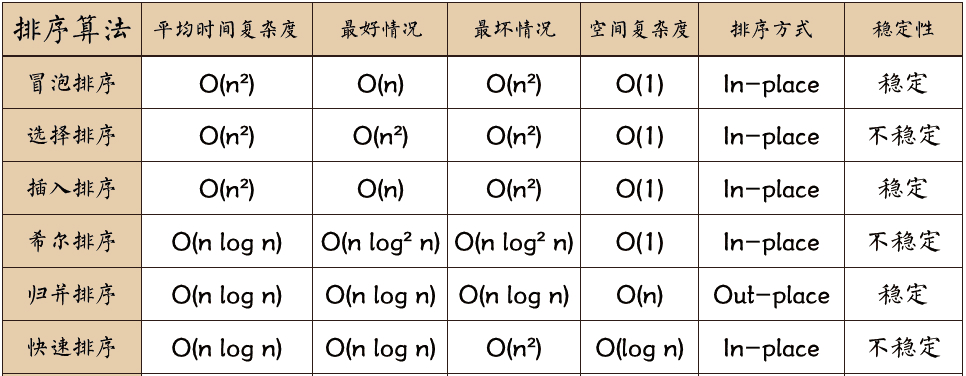

## 算法复杂度



比如数组是：`int arr[] = new int[]{3, 5, 2, 4, 1, 6};`

### 1.冒泡排序

```java
public static int[] maoPao(int[] arr) {
    int len = arr.length;
    for (int i = 0; i < len; i++) {
        for (int j = 0; j < len; j++) {
            if (arr[i] < arr[j]) {
                int temp = arr[j];
                arr[j] = arr[i];
                arr[i] = temp;
            }
        }
    }
    return arr;
}
//123456
```

### 2.选择排序

```java
 public static int[] xuanZhe(int[] arr) {
        int len = arr.length;
        for (int i = 0; i < len; i++) {
            int index=i;
            for (int j = i; j < len; j++) {
                if (arr[index] > arr[j]) {
                    index=j;
                }
            }
            int temp = arr[index];
            arr[index] = arr[i];
            arr[i] = temp;
        }
        return arr;
    }
//123456
```

### 3. 插入排序

```java
public static int[] chaRu(int arr[]) {
        //插入排序
        for (int i = 1; i < arr.length; i++) {
            //外层循环，从第二个开始比较
            for (int j = i; j > 0; j--) {
                //内存循环，与前面排好序的数据比较，如果后面的数据小于前面的则交换
                if (arr[j] < arr[j - 1]) {
                    int temp = arr[j - 1];
                    arr[j - 1] = arr[j];
                    arr[j] = temp;
                } else {
                    //如果不小于，说明插入完毕，退出内层循环
                    break;
                }
            }
        }
        return arr;
    }
```

### 4. 快排**

先选一个基准，比如key=num[0]，然后从右往左找小于等于key的值，找到了记录索引位置j

同步从左向右找大于等于基准的元素，找到了记录索引位置i

然后交换num[i]和num[j]

如此往复，知道i<j为止，说明，基准i的右边都是大于等于基准的元素，i的左边都是小于等于基准的元素

```java
3,5,2,4,1,6,
//第一次while结束的结构，交换了3-1，交换了5-2
3,1,2,4,5,6,
此时基准是位置0的元素，中间点是i的元素，所以下面就交换基准和i
2,1,3,4,5,6,
然后再递归两边
```

**[图文讲快排](https://blog.csdn.net/u014241071/article/details/81565148)**

```java
 private static void QuickSort(int[] num, int left, int right) {
        //如果left等于right，即数组只有一个元素，直接返回
        if (left >= right) {
            return;
        }
        //设置最左边的元素为基准值
        int key = num[left];
        //数组中比key小的放在左边，比key大的放在右边，key值下标为i
        int i = left;
        int j = right;
        while (i < j) {
            //j向左移，直到遇到比key小的值
            while (num[j] >= key && i < j) {
                j--;
            }
            //i向右移，直到遇到比key大的值
            while (num[i] <= key && i < j) {
                i++;
            }
            //i和j指向的元素交换
            if (i < j) {
                int temp = num[i];
                num[i] = num[j];
                num[j] = temp;
            }
        }
        num[left] = num[i];
        num[i] = key;
        QuickSort(num, left, i - 1);
        QuickSort(num, i + 1, right);
    }
```

### 5. 归并排序**

归并排序其实就是利用递归，先拆分，再合并的思路

核心思想：两个有序的数组一下就能排序

- 合并两个数组

```java
    public static int[] guiBingMerge(int[] left, int[] right){
        int l=0;
        int r=0;
        List<Integer>  list = new ArrayList<Integer>();
        while(l<left.length && r<right.length){
            if(left[l] < right[r]){
                list.add(left[l]);
                l += 1;
            }else{
                list.add(right[r]);
                r += 1;
            }
        }
        if(l>=left.length){
            for(int i=r; i<right.length; i++){
                list.add(right[i]);
            }
        }
        if(r>=right.length){
            for(int i=l; i<left.length; i++){
                list.add(left[i]);
            }
        }
        int[] result = new int[list.size()];
        for(int i=0; i<list.size(); i++){
            result[i] = list.get(i);
        }
        return result;
    }
```

- 核心递归思想

```java
 public static int[] guiBingsort(int[] ins){
        if(ins.length <=1){
            return ins;
        }
        int num = ins.length/2;
        int[] left = guiBingsort(Arrays.copyOfRange(ins, 0, num));
        int[] right = guiBingsort(Arrays.copyOfRange(ins, num, ins.length));
        return guiBingMerge(left,right);
    }

```

## 大数据排序

[推荐地址](https://doocs.gitee.io/advanced-java/#/./docs/big-data/find-rank-top-500-numbers)

#### 抢红包算法

漫画介绍：

https://blog.csdn.net/bjweimengshu/article/details/80045958

带代码的：

https://blog.csdn.net/weixin_44460333/article/details/108656108

 


