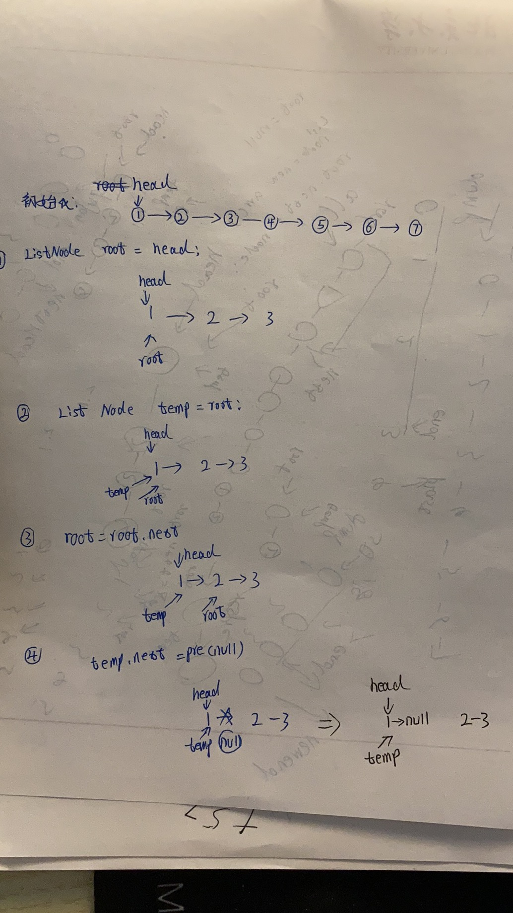

## 链表

```java
public class ListNode {
    public int val;
    public ListNode next;

    public ListNode(int x) {
        val = x;
    }
}
```

### 1. 打印链表

```java
    public static List<Integer> toNodeString(ListNode root) {
        List<Integer> list = new ArrayList<>(10);
        while (root != null) {
            list.add(root.val);
            root = root.next;
        }
        System.out.println(list);
        return list;
    }
```

### 2. 根据数据初始化链表

比如数组是：`int arr[] = new int[]{1, 2, 3, 4, 5,6,7};`

- 尾插法

生成的链表就是：1——2——3——4——5....

遍历的顺序是：正序

```java
    public static ListNode initListNodeAsc(int arr[]) {
        ListNode root = new ListNode(0);
        ListNode pre = root;
        for (int i = 0; i < arr.length; i++) {

            ListNode temp = new ListNode(arr[i]);
            pre.next = temp;
            pre = pre.next;
        }
        return root.next;
    }
```

```java
        int arr[] = new int[]{1, 2, 3, 4, 5,6,7};
        ListNode root1=ListNode.initNodeByArrAsc(arr);
        ListNode.toNodeString(root1);
        //[1, 2, 3, 4, 5, 6, 7]
```


- 头插法

  生成的链表就是：1——2——3——4——5....

  遍历的顺序是：倒序

```java
    /**
     * 按照数组的逆序生成数组，利用的是头插法
     *
     * @param arr
     * @return
     */
    public static ListNode initNodeByArrDesc(int arr[]) {
        ListNode root = null;
        for (int i = arr.length - 1; i >= 0; i--) {
            ListNode pre = new ListNode(arr[i]);
            pre.next = root;
            root = pre;
        }
        return root;
    }
```

```java
int arr[] = new int[]{1, 2, 3, 4, 5,6,7};       
ListNode root2=ListNode.initNodeByArrDesc(arr);
ListNode.toNodeString(root2);
        //[1, 2, 3, 4, 5, 6, 7]
```


### 3. 生成倒序的链表

头插法

生成的链表就是 ：5——4——3——2——1

遍历的顺序是：正序

```java
 /**
     * 利用头插法，生成一个数组逆序的链表
     *
     * @param arr
     * @return
     */
    public static ListNode initReverseNodeByArrAsc(int arr[]) {
        ListNode root = null;
        for (int i = 0; i < arr.length; i++) {
            ListNode temp = new ListNode(arr[i]);
            temp.next = root;
            root = temp;
        }
        return root;
    }
```

```java
int arr[] = new int[]{1, 2, 3, 4, 5,6,7};   
ListNode root3=ListNode.initReverseNodeByArrAsc(arr);
ListNode.toNodeString(root3);
//[7, 6, 5, 4, 3, 2, 1]
```

### 4. 链表反转

- 采用头插法

```java
    public   ListNode reverseList(ListNode head) {
        ListNode root = head;
        ListNode pre = null;
        while (root != null) {
            ListNode temp = root;
            root = root.next;
            temp.next = pre;
            pre = temp;
        }
        return pre;
    }
```

### 5.链表equals()方法

当然我们可以用递归直接写，或者用idea自动生成的，这里我们选用idea自动生成的

```java
    @Override
    public boolean equals(Object o) {
        if (this == o) return true;
        if (o == null || getClass() != o.getClass()) return false;
        ListNode listNode = (ListNode) o;
        return val == listNode.val &&
                Objects.equal(next, listNode.next);
    }

    @Override
    public int hashCode() {
        return Objects.hashCode(val, next);
    }
```


### 6. 给定头、尾节点反转链表

- 给定头节点和尾节点，只反转中间的部分
- 但是这里我们用的是equals方法，所以如果是我们自己本地测试的话，一定要重新equals方法

```java
    public static ListNode reverseList(ListNode head,ListNode tail) {
        ListNode root = head;
        ListNode pre = null;
        while (root != null && !root.equals(tail)) {
            ListNode temp = root;
            root = root.next;
            temp.next = pre;
            pre = temp;
        }
        return pre;
    }
```

- 测试

```java
int arr[] = new int[]{1, 2, 3, 4, 5, 6, 7};
int arr2[]=new int[]{5,6,7};
ListNode root4 = ListNode.initNodeByArrAsc(arr);
ListNode root42 = ListNode.initNodeByArrAsc(arr2);
ListNode  res=reverseList(root4,root42);
ListNode.toNodeString(res);
//结果是：4-3-2-1
//但是head的值变成了1，tail的值没变
```

### 7. 给定头、尾节点反转链表2

- 上面的方法虽然可以反转链表，但是会改变原本head的值

为啥呢?

我们来重述上面的步骤，如下图




我们怎么才能不改变原本head的值呢？那就生成一个新的节点呗

很简单就改变一行代码即可：  `ListNode temp = new ListNode(root.val);`

```java
 /**
     * 给定头节点和尾节点，反转链表
     * 比如头是1234567，尾是567
     * 结果就是4321
     * 但是head的值不会发生变成，还是原来的
     *
     * @param head
     * @param tail
     * @return
     */
    public static ListNode reverseListNoChange(ListNode head, ListNode tail) {
        ListNode root = head;
        ListNode pre = null;
        while (root != null && !root.equals(tail)) {
            ListNode temp = new ListNode(root.val);
            root = root.next;
            temp.next = pre;
            pre = temp;
        }
        return pre;
    }
```

### 8. 给定头、尾节点反转链表附带尾节点

```java
int arr[] = new int[]{1, 2, 3, 4, 5, 6, 7};
int arr2[] = new int[]{5, 6, 7};
//结果是：
[4, 3, 2, 1, 5, 6, 7]
```

在6中我们发现Head节点变了，而且变成了1，那么我们其实只需要把head节点的next节点指向tail节点即可

```java
   这里只比算法6多了一行代码
   head.next=tail;
```

- 完整代码

```java
    public static ListNode reverseListWithTail(ListNode head, ListNode tail) {
        ListNode root = head;
        ListNode pre = null;
        while (root != null && !root.equals(tail)) {
            ListNode temp = root;
            root = root.next;
            temp.next = pre;
            pre = temp;
        }
        head.next=tail;
        return pre;
    }
```

